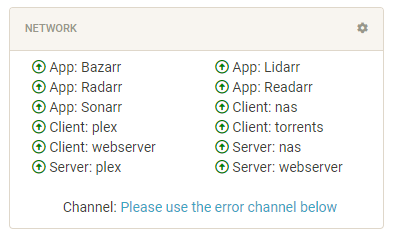
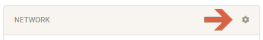
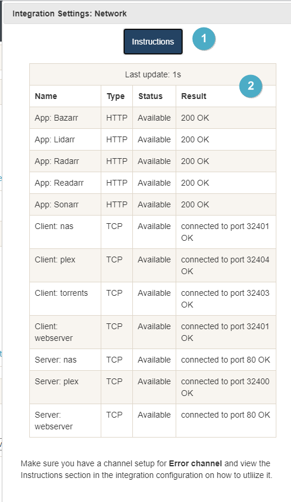
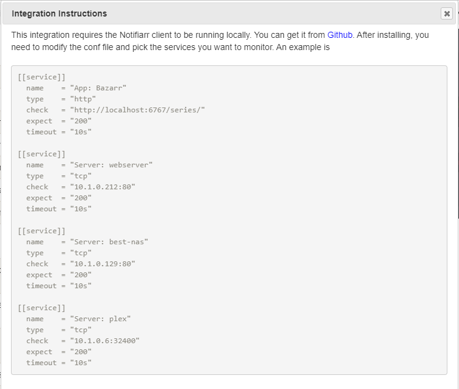

# Network Integration

> This integration allows for notifications from the local Notifiarr client app to monitor network machines or services

---

## Monitoring overview

This will list everything you are monitoring with the Notifiarr client and show a green arrow if it is available or red arrow if it isn't

---

## Configuration

Click the **cog icon** to open the configuration options for the Network integration.

1. Open integration specific instructions
1. List of everything being monitored and their status

### Instructions

An example of how to add services to be monitored in the Notifiarr client app
