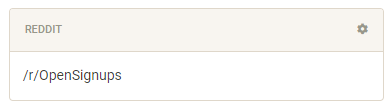
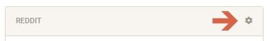
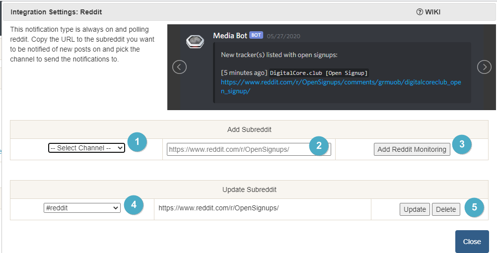

# Reddit Integration

> This integration allows for notifications from subreddits you can choose to watch

---

## Monitoring overview

This will list all subreddits you are monitoring

---

## Configuration

Click the **cog icon** to open the configuration options for Radarr.

1. Pick a channel for the subreddit notification to go to
1. Copy and paste the URL to the subreddit
1. Add the subreddit to your account to monitor
1. Edit the channel of an existing monitored subreddit
1. Save the changed channel or remove the subreddit from being monitored
