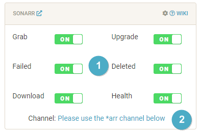
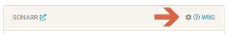
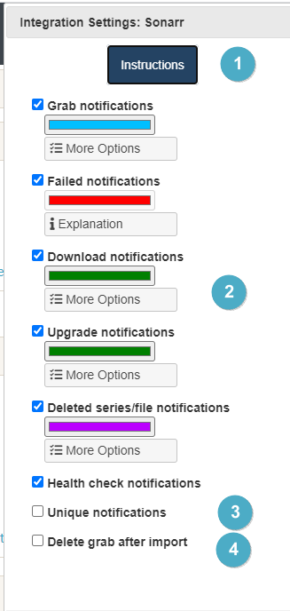
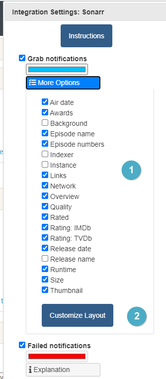
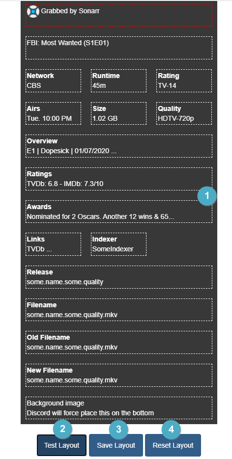
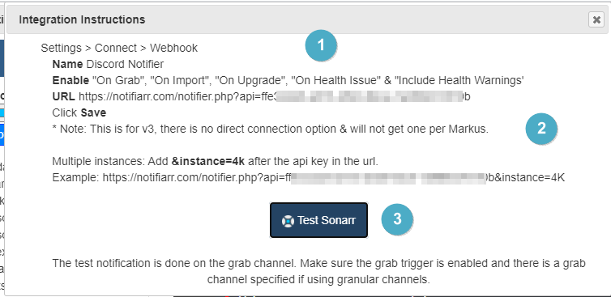

# Sonarr Integration

> This integration allows for notifications from Sonarr using its built in Connection for **Discord Notifier**

---

## Trigger options

1. Triggers
    - `Grab` - Receive a notification when media is initially grabbed (RSS or manual)
    - `Failed` - Custom notification type based on previous grabs. If the system detects a grab for the same media with the same quality or better before the previous one was imported then it will set the previous one as failed
    - `Download` - Receive a notification when media **new** is successfully imported
    - `Upgrade` - Receive a notification when **upgraded** media is successfully imported
    - `Deleted` - Receive a notification when media is deleted
    - `Health` - Receive a notification when Sonarr reports an issue
1. Channel
    - Sonarr shares the *arr channel unless Granular Setup is used, clicking the link on the site will move to the channel setup location.

---

## Configuration

Click the **cog icon** to open the configuration options for Sonarr.

1. Open integration specific instructions
1. Notification colors for each trigger type
1. Unique notifications: Generate a new notification each time (By default notifications edit the previous one so there is a Grab and then the Download ot Upgrade will edit the Grab notification to alleviate the notification spam)
1. Option to remove the grab once a successful import is done, only works with granular channels since messages in the same channel update

1. Notification content options that you can turn on/off to show in the notifications
1. Launch the integration layout editor (image below)

1. Drag and drop positioning of where you want to see each piece of information in the notification. Some fields are locked (red outline). Full width items can not be used in a multi-line layout. You can not have more than 3 items per line.
1. Test Layout - Will send a test notification with the current layout format
1. Save Layout - Will save the current layout format as the one you want to use
1. Reset Layout - Will set the layout back to default

### Instructions

1. How to enable notifications from within Sonarr
1. Setting up multiple instance option
1. Test the notification from Notifiarr to Discord
    - This will ensure your server, channel and permissions are set properly in Discord.
