# Quick Start

Here we're going to explain the basic setup for Notifiarr to get it working with Sonarr, Radarr, Bazarr and Plex.

If you want to make use of the other options I suggest to look at the advanced guide descriptions.

------

## Login

First we're going to visit the [Notifiarr](https://discordnotifier.com/index.php){:target="_blank" rel="noopener noreferrer"} site, if you don't have an account yet, click the link to signup.

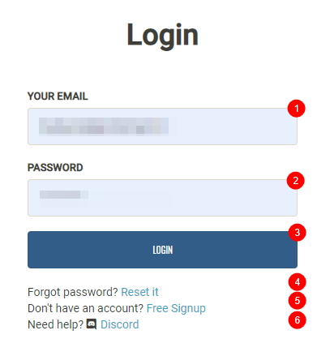

1. Your Email address you used during signup.
1. Your Password you created during signup.
1. Login to the site and setup.
1. Password reset if you forgot your password.
1. Signup if you don't have an account.
1. Link to Notifiarr Discord support channel.

------

## Profile

After you have logged in, you will be redirected to your profile screen.

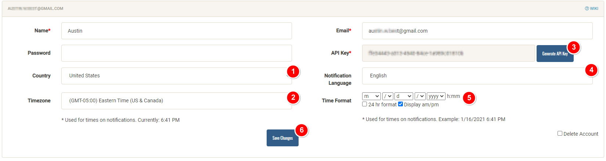

1. Select your `Country`.
1. Select your `Timezone`.
1. Click on `Generate API Key` (This needs to be done).
1. Select your `Notification Language`.
1. Change your `Time Format` to your liking.
1. Don't forget to `Save` your Changes.

------

## Integration Setup

- Enable the integrations you want to use
- Setup your discord server (required), invite the bot (required) and reactions (optional).

### Integration Settings

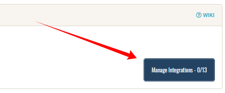

First, click on  `Manage Integrations` so you can enable what you want to receive notifications for.

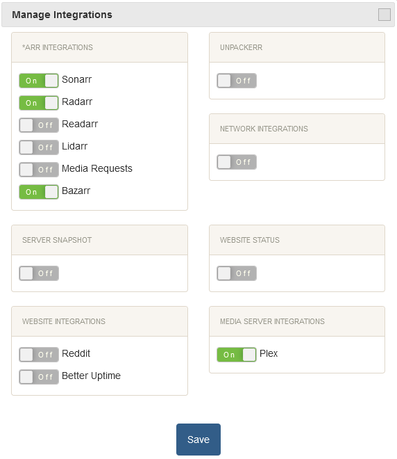

A screen will popup and here you're able to select from which application/service you receive a notification.

When you enabled the ones you want click on `Save`

Setup which notifications you want to to receive from each option.

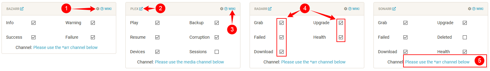

1. Cog wheel, this opens the integration settings
1. External link, this opens the website for the integration
1. WIKI link, this opens any extra wiki information available for the integration
1. Trigger, this enables/disables a specific trigger for the integration
1. Channels, this sets the channel in your server to post to for the integration

### Discord Settings

Here we will cover the following

- Setup the server & shared channels.
- Invite the bot into your server.
- Setup reactions.
- Setup Indexers reactions.

#### Create the channels

First thing to do is create a few channels (in your discord server) where you receive your notifications.

!!! note
    I won't be explaining how to setup a discord channel, that's up to you but google has plenty of references.

You can do it all from one channel or separate the notifications (granular) for each trigger if you want.

#### Simple channel setup

`#media` => All the `*arr` notifications you setup in [Integration Settings](#integration-settings).

`#errors` => Health checks, network errors, etc.

`#plex` => Play, resume, etc. for Plex.

After you create the needed channels, it's time to add them to the `Setup the channels`

First we need to get the server ID

Open your User Settings -> Appearance -> Enable Developer Mode.

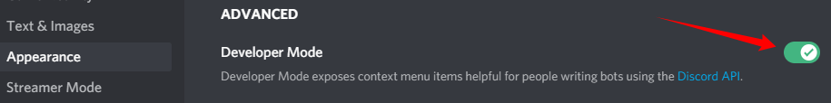

 Right click on your server name and select "Copy ID"

??? example "Example right click"
    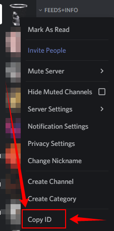

Paste the server ID in box `[1]`

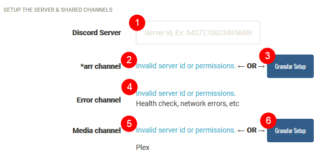

1. Add your server ID
1. Select the channel for the `#media` channel.
1. Use this option if you want to use separate channels for the notifications.
1. Select the channel for the `#errors` channel.
1. Select the channel for the `#plex` channel.
1. Use this option if you want to use separate channels for the notifications.

### Invite the bot

It's time to invite the bot in to your Server/Channels by clicking on the following link.

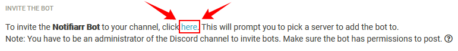

You will get a screen that looks like the following screenshot.

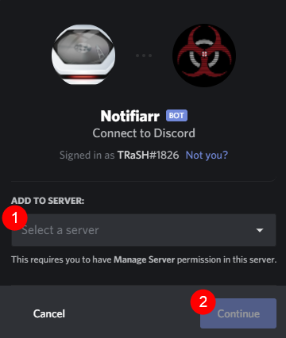

1. Select the server the bot should join.
1. Click on `Continue` to approve.

!!! note
    Check [Discord Permissions](/Notifiarr/Discord-Permissions/){:target="_blank" rel="noopener noreferrer"} for information which permissions the bot needs.

#### Reactions

Here we will setup the Notifiarr reactions(emoji's) that will be shown during a playback in plex, or during a download/import in Sonarr/Radarr.

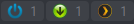

This section exist of 2 parts.

1. *arr state (grab/failed) and play state of plex.
1. The Trackers/Indexers.

First we're going to download the emoji's and you can do that in 2 ways.

1. 1 at a time - Right click -> Save As... - for these emoji images to some location on your computer.
1. Pack Download - Click [here](https://discordnotifier.com/setup.php?grab=reactions){:target="_blank" rel="noopener noreferrer"} to download a zip of all the current reaction images.

!!! attention

    To download the Emoji Pack from the link in this Guide you will need to be logged in  to [Notifiarr](https://discordnotifier.com/index.php){:target="_blank" rel="noopener noreferrer"} site !!!

    Else you can find it on the main Notifiarr site in the `Integration Setup` Category at the bottom right

    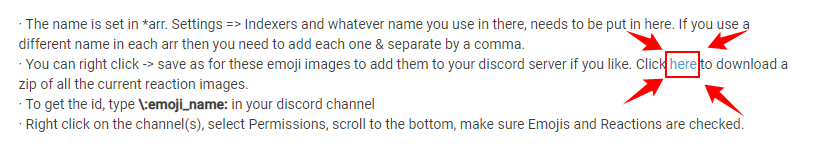

For this example, we will be using Pack Download.  You'll need download the file and then unpack it somewhere on your computer.  After which, you can then add the emoji's to your Discord Server easily.

How to add your own Emoji's => [LINK](https://support.discord.com/hc/en-us/articles/360036479811-Custom-Emojis){:target="_blank" rel="noopener noreferrer"}

After you've added them to your Discord Server it's time to get the ID's from your emoji's, to do this go in to one of your channels and type:

```bash
\:emoji_name:
```

??? example "Example"
    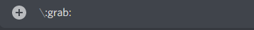

    What results in to.

    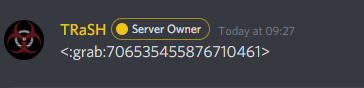

    So your ID would be `:grab:706535455876710461`.

Paste the ID results from your channel in to the corresponding boxes.


Do this for all the other boxes also including your Trackers/Indexers.

#### Trackers and Indexers

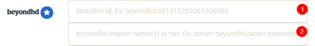

1. Paste here the the emoji ID.
1. The actual indexer name you're using in Sonarr/Radarr.

??? example "Example"

    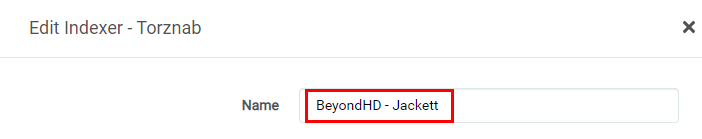

    What will result in to.

    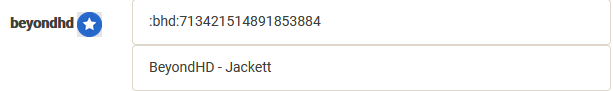

    If you use a different name in Sonarr and Radarr just add them with a comma `BeyondHD - Jackett,BHD`.

Don't forget to click on `Save Changes` !!!

!!! note
    After pasting the Emoji's ID in to the box you will notice that the leading colon will disappear nothing to worry about that's per design

------

## How to add notifiarr to your applications

Here we will explain how to we add notifiarr to your *arr and Plex.

When you click on the cogwheel of the enabled Integration you will see on the top `Instructions`


It will show you a short description where and how to add what.

??? example

    

### Radarr, Readarr and Lidarr

Radarr, Readarr and Lidarr supports Notifiarr natively so that's an easy one to add.

`Settings` => `Connect` => click on the 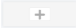 `plus` icon and select `Notifiarr` add your API key and you're done.

??? example "Radarr Example"
    In Radarr go to `Settings` => `Connect` => Click on the  `plus` icon and select `DiscordNotifier.com`.

    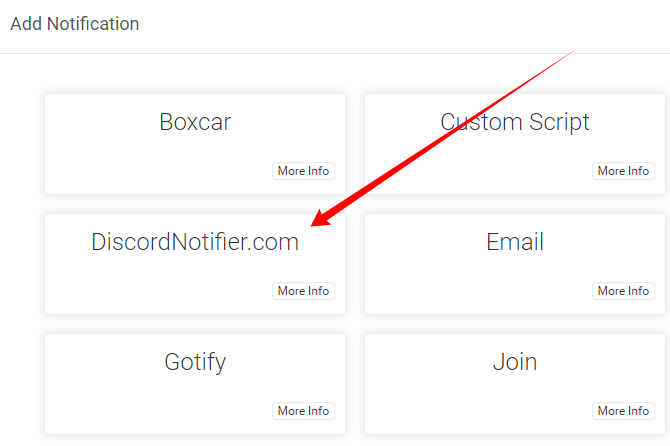

    Then add the following info.

    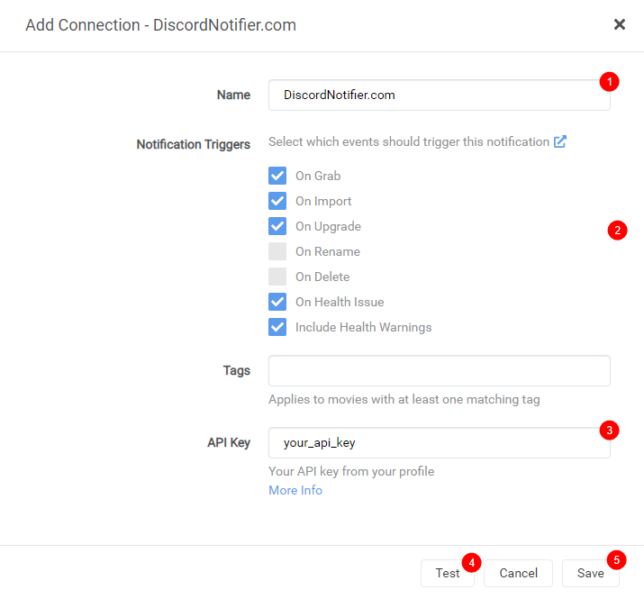

    1. The name you want to use for the notification.
    1. Enable `On Grab`, `On Import`, `On Upgrade`, `On Health Issue` & `Include Health Warnings`.
    1. Add here you API key from Notifiarr.
    1. Click on `Test` to see if it works.
    1. If everything is correct click on `Save`

### Sonarr

Sonarr doesn't have native support & will not get one per their devs.
That's why we're going to use the webhook method.

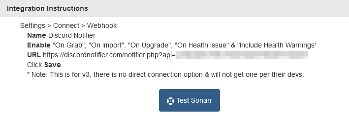

`Settings` => `Connect` > Click on the  `plus` icon and select `Webhook`.

Add the following info:

**Name**: Notifiarr

**Enable:** `On Grab`, `On Import`, `On Upgrade`, `On Health Issue` & `Include Health Warnings`.

**URL:** The URL that you can copy/paste from the integrations page.

Click **Save**

??? example "Sonarr Example"

    `Settings` => `Connect` > Click on the  `plus` icon and select `Webhook`.

    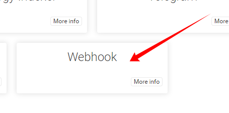

    Add the following info.

    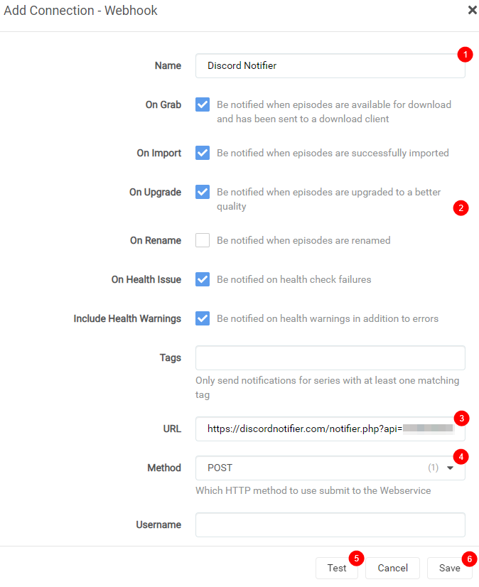

    1. The name you want to use for the notification.
    1. Enable `On Grab`, `On Import`, `On Upgrade`, `On Health Issue` & `Include Health Warnings`.
    1. Add the URL that you can copy/paste from the integrations page.
    1. Make sure this is on `POST`.
    1. Click on `Test` to see if it works.
    1. If everything is correct click on `Save`

### Bazarr

For Bazarr you need to make use of JSON method.

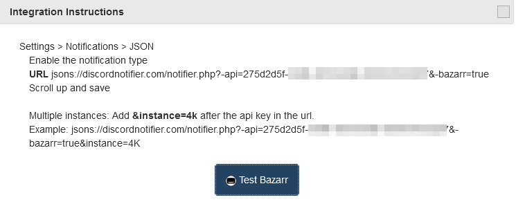

`Settings` => `Notifications` => and select`JSON`

On the top click on the  `Edit` icon and Enable the notification type.

Add the JSON URL that you copy/pasted from the integrations page.

Scroll up and save

??? example "Bazarr Example"

    `Settings` => `Notifications` => and select`JSON`

    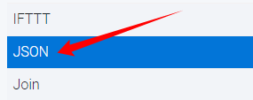

    On the top click on the  `Edit` icon and Enable the notification type.

    Add the following info.

    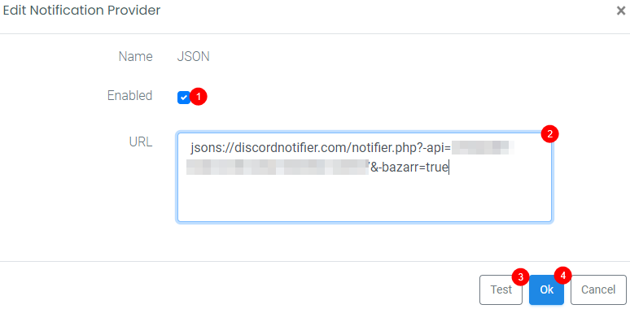

    1. Enable the JSON Notification.
    1. Add the JSON URL that you copy/pasted from the integrations page.
    1. Click on `Test` to see if it works.
    1. If everything is correct click on `Ok`

    Don't forget to click on Save on the top of the Bazarr screen.

    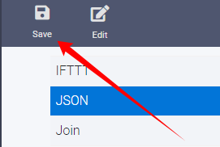

### Plex

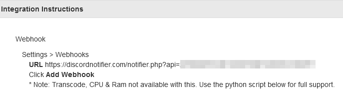

`Settings` => `Webhooks` => click on `ADD WEBHOOK` and add the URL that you can copy/paste from the integrations page and click on `SAVE CHANGES`

??? example "Plex Example"

    `Settings` => `Webhooks` => click on `ADD WEBHOOK`

    On the top right click on the  `Settings` icon, and on the left sidebar select `Webhooks`
    Click on the middle of the screen on  and add the following info.

    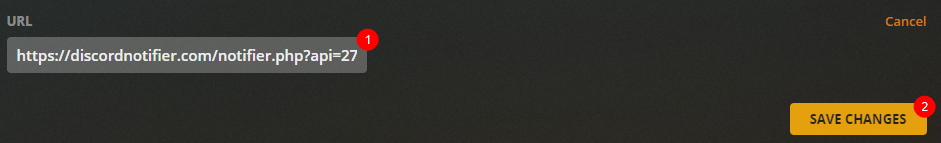

    1. Add the URL that you can copy/paste from the integrations page.
    2. Click on `SAVE CHANGES`

If you want to show more advanced info like Transcode, CPU & Ram take a look at [Plex Integration](/Notifiarr/Integrations-Setup/Plex/){:target="_blank" rel="noopener noreferrer"}

!!! note
    If there is still an issue, try asking in the Notifiarr [discord channel](https://discord.gg/AURf8Yz){:target="_blank" rel="noopener noreferrer"} for additional support.
