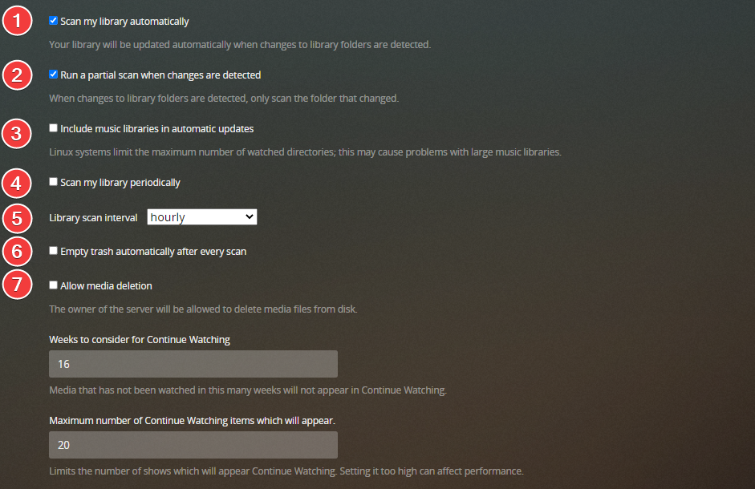
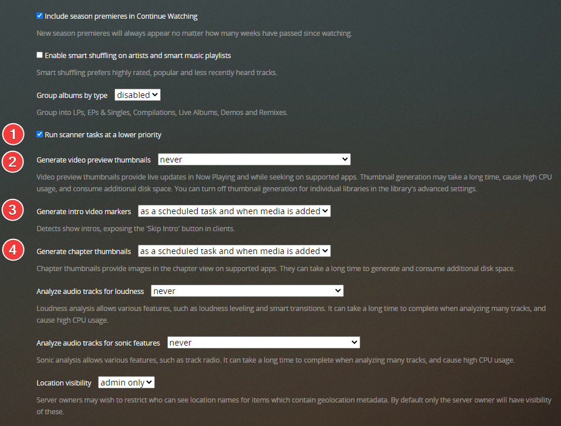
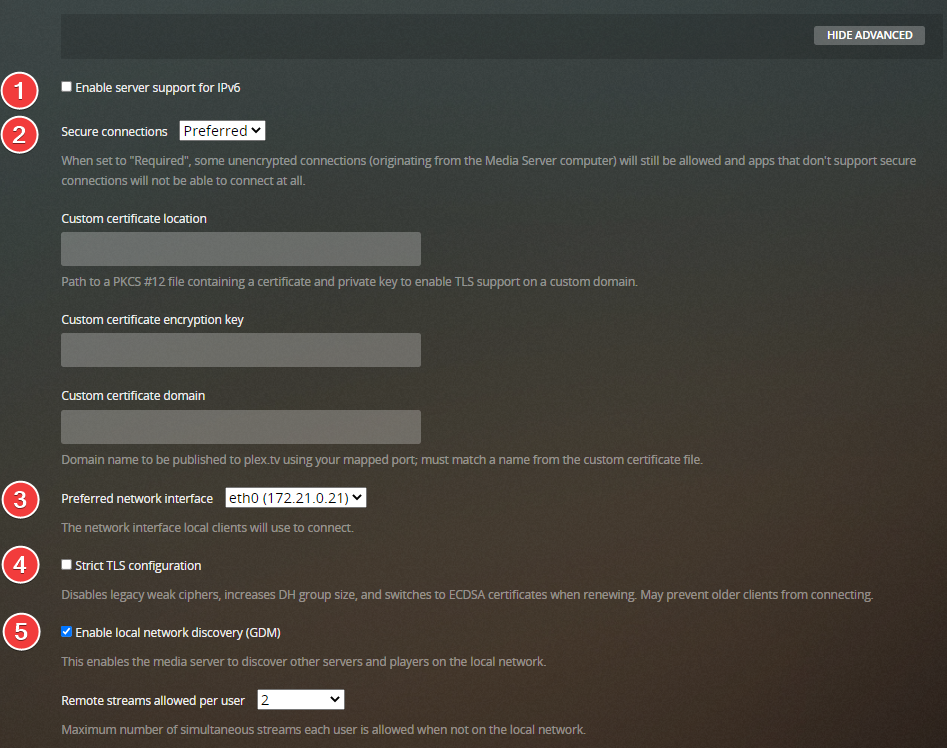
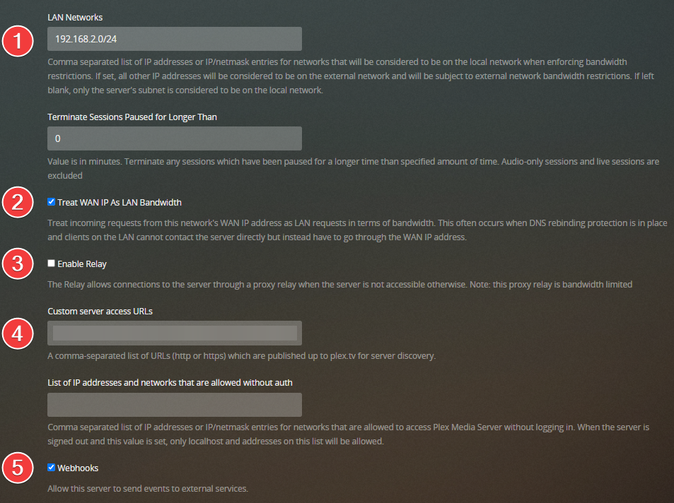
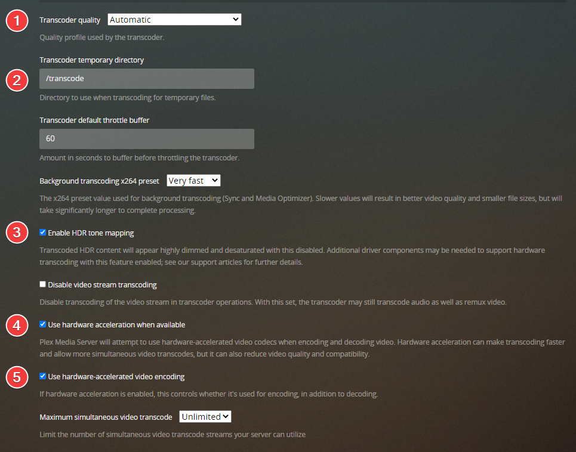

# Suggested Plex Media Server Settings

So, what are the best Plex Media Server settings ?

This is something that can't be really answered because it depends on the use case and your personal preference.

!!! danger ""
    Here I will provide some suggestions and try to explain why I recommend to use these settings, use it to your own liking and keep in mind it's only a pointer I'm no Plex Pro in anyway :bangbang:

!!! attention
    Some settings are only visible for Plex Pass holders.

All the changes you will need to do on your Plex Media Server.

!!! info "Why didn't you cover option .... ?"
     I will only cover settings that I think might be interesting or are personal preference, if you like me to cover some other settings, please contact me on {:target="_blank" rel="noopener noreferrer"}

## Settings

### Remote Access

1. Make sure you enable the advanced settings (This will be needed for all the settings)
1. Enable/Disable Remote access (if you disable it ignore the rest of these settings)
1. Lan/container IP
1. Public IP **If you need to provide a screenshot always mask this IP :bangbang:**
1. Manually specify public port if you run docker or want a fixed port.
1. Enter the plex port you want to use. (default: `32400`)
1. Click on `Apply` and when everything is setup correct you should be fully accessible outside of your network so you can connect to your plex from outside. You may also need to configure your router. Detailed instructions are available [HERE](https://support.plex.tv/articles/200931138-troubleshooting-remote-access/){:target="_blank" rel="noopener noreferrer"}.
1. Enter your internet upload speed here and Plex can ensure it operates within this boundary.
1. Set the maximum bitrate of a remote stream from this server.

------

### Agents

This can be ignored if you use the new Plex agents,

The new agent settings are now “per library” managed.

------

### Library

1. When a change is detected in the source location for a library’s content, the appropriate library will be scanned. This function relies on the computer’s operating system providing the “something changed” trigger. Some operating systems don’t provide this trigger and content mounted via a network will also typically not work. If your library doesn’t automatically scan, you may have to set a periodical scan or do it manually.

    !!! check ""
        **Suggested: `Enabled`**

1. When changes to library folders are detected, only scan the folder which changed rather than the entire content location. This works together with the normal Update my library automatically setting (and requires that setting to be enabled).

    !!! check ""
        **Suggested: `Enabled`**

1. I don't do music, so this choice is up to you, and I won't be covering it.
1. Turning this on will cause your Plex Media Server to run scans on your libraries using the designated interval.

    !!! check ""
        **Suggested: `Disabled`**

        *Do you need a extra scan for your library to recognize new media?*

1. Library scan interval if you enable option `4`
1. With this option enabled, when an item’s file is deleted from the drive, it will be removed from the Plex library on the next scan. Disabling this option keeps the item in the library with an overlay over the item’s poster when the item is removed.

    !!! check ""
        **Suggested: `Disabled`**

        *Why ? When a file get's a upgrade it won't be recognized as `Recently Added` . So, I decide to run this task manually*

1. Delete files from Plex.

    !!! check ""
        **Suggested: `Disabled`**

        *In my opinion Plex shouldn't touch your media files. Use Sonarr/Radarr to manage your media library. (For extra security I've setup Plex with Read Only access to the media library)*

1. On low-powered systems (e.g. ARM-based NAS devices), it can be beneficial to run scanner tasks at a lower priority than other tasks. This can help ensure they do not interfere with regular streaming.

    !!! check ""
        **Suggested: `Enabled`**

        *Makes sure it uses less resources and ensure they do not interfere with regular streaming.*

1. This option creates a series of preview thumbnails from a media item when it is analyzed. These images are used by some Plex apps when you move back and forward in an app with the timeline scrubber. They’ll also be displayed in Now Playing when someone is streaming from you so that you can see where they are in the video.

    !!! danger "ATTENTION"
        Creating these images can <u>take a considerable amount of time</u>, <u>CPU resources</u>, and <u>increase the storage space used</u>. The images are stored in your Plex database so <u>be careful you don’t fill the drive :bangbang:</u>

    !!! check ""
        **Suggested: `Never`**

        *Besides that, it uses allot of disk space and high I/O, No one in my family uses FastForward/Rewind but they use the skip forward/backward.*

1. You can choose to have TV episodes analyzed to try and detect when the “intro” occurs during playback. When detected, apps will then offer a `Skip Intro` button, allowing you to quickly jump over the intro.

    !!! check ""
        **Suggested: `as a scheduled task`** *or* **Suggested: `as a scheduled task and when media is added`**

1. Chapter thumbnails provide images in the chapter view on supported apps. They can take a little time to generate and consume very minor additional disk space.

    !!! check ""
        **Suggested: `as a scheduled task`** *or* **Suggested: `as a scheduled task and when media is added`**

------

### Network

1. Enable IPv6 support.

    !!! check ""
        **Suggested: `Disabled`**

        *If you're not sure your network 100% works with ip6 <u>don't Enable it</u>.*

1. Choose how your Plex Media Server handles secure connections.

    !!! check ""
        **Suggested: `Preferred`**

        *Accept and prefer secure connections when they’re available for a Plex app, but allow regular HTTP connections if the app doesn’t support secure connections or if one can’t be established*

1. For users with multiple network cards or systems such as NAS or Docker where there is always another network interface which Plex client applications may try to use to connect to the Plex Media Server, with this option you can ensure that your local Plex clients would only try that interface.

    !!! attention
        If you have enabled Remote Access enabled and are having Plex automatically map the port (as opposed to specifying a port manually), then Plex Media Server has no control over which network interface is used for an automatically-mapped port. Thus, it’s possible that Remote Access connections could come through an interface other than the one specified here.

    !!! check ""
        **Suggested: `Whatever suits your setup`**

1. If this setting is enabled, it prevents Plex Media Server from using or accepting the deprecated TLSv1.0 and v1.1 protocols, as well as legacy weak ciphers. May prevent older clients from connecting. The vast majority of users will have no reason to enable this option (and receive no benefit from doing so).

    !!! check ""
        **Suggested: `Disabled`**

1. Enable “G’Day Mate” discovery. This is used to allows Plex apps and servers to find each other automatically on a local network.

    !!! check ""
        **Suggested: `Enabled`**

1. It lets you specify which IP addresses or networks will be considered to be “local” to you.

    !!! check ""
        **Suggested: `Your local IP/netmasks`**

        *If your local devices are seen as remote devices, then this could solve your issue. (Do not include spaces or tabs.)*

1. Allows incoming requests from this network’s WAN IP address to be treated as LAN requests in terms of bandwidth. This often occurs when DNS rebinding protection is in place and clients on the LAN cannot contact the server directly but instead have to go through the WAN IP address.

    !!! check ""
        **Suggested: `Enabled`**

1. The Relay allows connections to the server through a proxy relay when the server is not accessible otherwise. Relay connections are bandwidth limited.

    !!! check ""
        **Suggested: `Disabled`**

        *I've seen several reports where people that had this Enabled had playback issues because it seems to be limited at 2 Mbps.*

1. A comma-separated list of URLs (either HTTP or HTTPS), which will be published to plex.tv for server discovery. This can be very useful in a few cases: if you’re using a reverse proxy in front of the media server, or if your networking configuration is otherwise unique. For instance, if you have your own custom domain with subdomain.

    !!! check ""
        **Suggested: `Depending on your setup`**

        *Example: `https://plex.mycustomdomain.com:32400`*

1. This feature can be enabled to allow your server to send events to external services. For example [Notifiarr](/Notifiarr/Quick-Start/){:target="_blank" rel="noopener noreferrer"}

------

### Transcoders

1. This will influence the quality used when transcoding media.

    !!! check ""
        **Suggested: `Automatic`**

        *Most users should leave it set to Automatic. Hardware-Accelerated Streaming is not affected by this setting.*

1. Directory to use when transcoding temporary files for streaming.

    !!! check ""
        **Suggested: `Depending on your setup, if possible, your RAM (disk)`**

        *Speeds up transcoding and less I/O, transcode data is temporary and doesn't need to be writing to a disk.*

        *If you run docker set this to `/transcode` and map it to `/tmp/plex`*

        *Default Linux only allocates a max of 50% of total system RAM to any ram directories (ie. /tmp, /dev/shm, etc.)*

    !!! danger "WARNING"
        :bangbang: **YOU SHOULD NOT SPECIFY A LOCATION THAT RESIDES ON A NETWORK SHARE/DISK.** :bangbang:

1. This feature allows Plex Media Server to maintain high visual fidelity of content, by applying tone mapping to convert it to SDR when transcoding HDR content.

    !!! check ""
        **Suggested: `Depending on your setup`**

        *Most HDR content will be in 4K resolution. If your platform has to use software transcoding to perform the tone mapping, then it may well struggle convert 4K content in real-time, unless you’re running on a very powerful system.*

    !!! note
        Plex’s tone mapping support should generally be able to produce good color mapping and help avoid the “washed out” colors that occur when converting HDR content without tone mapping.

1. To use Hardware-Accelerated Streaming in Plex Media Server.

    !!! check ""
        **Suggested: `Enabled`**

1. To use Hardware-Accelerated Encoding in Plex Media Server.

    !!! check ""
        **Suggested: `Enabled`**

------

## Manage

### Libraries

Here you will find your libraries you've added to your Plex Media Server.

??? example "Examples - [CLICK TO EXPAND]"

    - Movies `(/data/media/movies)`
    - Movies-4K/Movies-UHD `(/data/media/movies4k)`/`(/data/media/movies-uhd)`
    - Movies-Kids `(/data/media/movies-kids)`
    - Movies-Anime `(/data/media/movies-anime)`
    - TV `(/data/media/tv)`
    - TV-4k/TV-UHD `(/data/media/tv-4k)`/`(/data/media/tv-uhd)`
    - TV-Kids `(/data/media/tv-kids)`
    - TV-Anime `(/data/media/tv-anime)`
    - Anime `(/data/media/anime)`
    - etc

!!! info "I will only cover the libraries settings for Movies and TV shows"

#### Movies

1. The new version of the Plex Movie agent/scanner

    !!! check ""
        **Suggested: `Plex Movie`**

        *Besides being much faster at scanning and getting metadata, one of the benefits of the new agent is that all agent settings are set at the library level, so that different libraries using the same agent can have different agent settings.*

1. When scanning this library, use local posters and artwork if present. (Local subtitles files will be used whether this is enabled or not)

    !!! check ""
        **Suggested: `Enabled`**

        *I had this enabled because I thought it was needed for local subtitles (.srt), but after research it seems it isn't needed.
        If you want you could disable it, the choice is yours.*

1. When scanning this library, prefer embedded tags and local files if present.

    !!! check ""
        **Suggested: `Disabled`**

        *If enabled you could end up with weird movie naming you don't want, happens especially from releases from `RARBG`*

1. Automatically create collections when there are more than the selected number of items for an available collection.

    !!! check ""
        **Suggested: `2`**

        *Only show collections when you have more than one item in your library*

1. This option creates a series of preview thumbnails from a media item when it is analyzed. These images are used by some Plex apps when you move back and forward in an app with the timeline scrubber. They’ll also be displayed in Now Playing when someone is streaming from you so that you can see where they are in the video.

    !!! danger "ATTENTION"
        Creating these images can <u>take a considerable amount of time</u>, <u>CPU resources</u>, and <u>increase the storage space used</u>. The images are stored in your Plex database so <u>be careful you don’t fill the drive :bangbang:</u>

    !!! check ""
        **Suggested: `Disabled`**

        *Besides that, it uses allot of disk space and high I/O, No one in my family uses FastForward/Rewind but they use the skip forward/backward.*

1. This deletes the preview thumbnails it generated before you disabled this option
1. If you want to show your Collection in your library

    !!! check ""
        **Suggested: `Disabled`**

        *When Disabled your movies will show up normally when you use library view, This doesn't mean it will disable the collection view.*

#### TV

1. The new version of the Plex Movie agent/scanner

    !!! check ""
        **Suggested: `Plex TV Series`**

        *Besides being much faster at scanning and getting metadata, one of the benefits of the new agent is that all agent settings are set at the library level, so that different libraries using the same agent can have different agent settings.*

1. How episodes are named on disk. If your naming follows The MovieDB or TheTVDB choose that here.
1. Use season titles when available.
1. When scanning this library, use local posters and artwork if present. (Local subtitles files will be used whether this is enabled or not)

    !!! check ""
        **Suggested: `Enabled`**

        *I had this enabled because I thought it was needed for local subtitles (.srt), but after research it seems it isn't needed.
        If you want you could disable it, the choice is yours.*

1. When scanning this library, prefer embedded tags and local files if present.

    !!! check ""
        **Suggested: `Disabled`**

        *If enabled you could end up with weird movie naming you don't want, happens especially from releases from `RARBG`*

1. This option creates a series of preview thumbnails from a media item when it is analyzed. These images are used by some Plex apps when you move back and forward in an app with the timeline scrubber. They’ll also be displayed in Now Playing when someone is streaming from you so that you can see where they are in the video.

    !!! danger "ATTENTION"
        Creating these images can <u>take a considerable amount of time</u>, <u>CPU resources</u>, and <u>increase the storage space used</u>. The images are stored in your Plex database so <u>be careful you don’t fill the drive :bangbang:</u>

    !!! check ""
        **Suggested: `Disabled`**

        *Besides that, it uses allot of disk space and high I/O, No one in my family uses FastForward/Rewind but they use the skip forward/backward.*

1. This deletes the preview thumbnails it generated before you disabled this option
1. If you want to show your Collection in your library

    !!! check ""
        **Suggested: `Disabled`**

        *When Disabled your tv show will show up normally when you use library view, This doesn't mean it will disable the collection view.*

1. Generate intro detection for items in this library when enabled in server settings.

    !!! check ""
        **Suggested: `Enabled`**

        *Ever watch a TV show and it starts playing that same minute and a half credits intro that you've already watched multiple times? Well, you can have your Plex Media Server analyze the TV shows to try and detect those introductions and then let you skip through them with a single click!*

------

For the information of this guide, I made use of the following sources

- Information I gathered from Several Discord servers
- [Plex Support Articles](https://support.plex.tv/articles/){:target="_blank" rel="noopener noreferrer"}
- Extra Information gathered from a Plex employee
- Own experience
