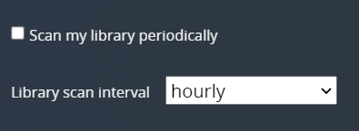
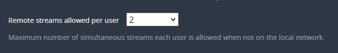
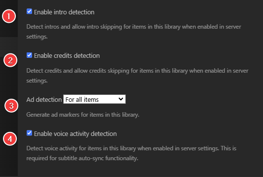

# Suggested Plex Media Server Settings

So, what are the best Plex Media Server settings?

This is something that can't be answered, as it depends on the use case and your personal preference.

!!! note "Here we will provide some suggestions and try to explain why we recommend these settings. Adjust it to your liking, and keep in mind that it is only a suggestion. :bangbang:"

!!! warning "Some settings are only visible for Plex Pass holders."

All changes need to be done on your Plex Media Server.

!!! question "Why didn't you cover option .... ?"

    We will only cover settings that we think might be interesting or are personal preference, if you would like to see other settings covered, please contact us on {:target="\_blank" rel="noopener noreferrer"}

## Settings

### Remote Access

1. Make sure you have enabled advanced settings (This will be needed for all the settings)
1. Enable/Disable Remote access (if you disable it ignore the rest of these settings)
1. LAN/container IP
1. Public IP **If you need to provide a screenshot always mask this IP :bangbang:**
1. Manually specify a public port if you run Docker or want a fixed port.
1. Enter the Plex port you want to use. (default: `32400`)
1. Click on `Apply` and when everything is set up correctly, your Plex Media Server should be fully accessible outside of your network, so you can connect to your Plex server from outside. You may also need to configure port forwarding on your router. Detailed instructions are available [HERE](https://support.plex.tv/articles/200931138-troubleshooting-remote-access/){:target="\_blank" rel="noopener noreferrer"}.
1. Enter your internet upload speed here and Plex can ensure it operates within this boundary.
1. Set the maximum bitrate of a remote stream from this server.

---

### Agents

This can be ignored if you use the new Plex agents,

The new agent settings are now managed “per library”.

---

### Library

#### Scan my library automatically

When a change is detected in the source location for a library’s content, the appropriate library will be scanned. This function relies on the computer’s operating system providing the “something changed” trigger. Some operating systems don’t provide this trigger and content mounted via a network will also typically not work. If your library doesn’t automatically scan, you may have to set a periodical scan or do it manually.

!!! success ""

    **Suggested: `Enabled`**

??? tip "TIP - Autoscan - [Click to show/hide]"

    In some cases, an operating system may not support this trigger - for example, if your storage is mounted on a network (SMB/NFS/Cloud Storage). In other cases, you may just find that your library doesn't automatically scan on its own. In these cases, you could consider using autoscan. IBRACORP (A Youtube channel we collaborate with) has a video explaining it in further detail.

    <iframe width="560" height="315" src="https://www.youtube.com/embed/JYBVAzJBw2w" title="YouTube video player" frameborder="0" allow="accelerometer; autoplay; clipboard-write; encrypted-media; gyroscope; picture-in-picture" allowfullscreen></iframe>

    Please don't forget to check out his other Unraid Videos [HERE](https://www.youtube.com/c/IBRACORP/videos){:target="_blank" rel="noopener noreferrer"}

#### Run a partial scan when changes are detected

When changes to library folders are detected, only scan the folder that has changed rather than scanning the entire content location. This works together with the normal Update my library automatically setting (and requires that setting to be enabled).

!!! success ""

    **Suggested: `Enabled`**

#### Include music libraries in automatic updates

I don't do music, so this choice is up to you, and I won't be covering it.

#### Scan my library periodically

Turning this on will cause your Plex Media Server to run scans on your libraries using the designated interval.

!!! success ""

    **Suggested: `Disabled`**

    *Do you need an extra scan for your library to recognize new media?*

#### Empty trash automatically after every scan

With this option enabled, when an item’s file is deleted from the drive, it will be removed from the Plex library on the next scan. Disabling this option keeps the item in the library with an overlay over the item’s poster when the item is removed.

!!! success ""

    **Suggested: `Enabled`**

#### Allow media deletion

The owner of the server will be allowed to delete media files from the disk.

!!! success ""

    **Suggested: `Disabled`**

    *In my opinion Plex shouldn't touch your media files. Use Sonarr/Radarr to manage your media library. (For extra security I've set up Plex with Read Only access to the media library)*

#### Run scanner tasks at a lower priority

On low-powered systems (e.g. ARM-based NAS devices), it can be beneficial to run scanner tasks at a lower priority than other tasks. This can help ensure they do not interfere with regular streaming.

!!! success ""

    **Suggested: `Enabled`**

    *This makes sure it uses fewer resources and ensures they do not interfere with regular streaming.*

#### Marker source

Credits markers can be generated locally and/or retrieved via an online database. Online markers may not always exist, if this preference is set to 'both' then any locally detected markers are submitted anonymously back to the online database for future use.

!!! success ""

    **Suggested: `both, try online first`**

    *If you notice that the markers don't match your releases try `local detection only`.*

#### Generate video preview thumbnails

This option creates a series of preview thumbnails from a media item when it is analyzed. These images are used by some Plex apps when you move back and forward in an app with the timeline scrubber. They’ll also be displayed in Now Playing when someone is streaming from you so that you can see where they are in the video.

!!! success ""

    **Suggested: `Never`**

    *Besides that, it uses a lot of disk space and high I/O, No one in my family uses FastForward/Rewind but they use the skip forward/backward.*

!!! danger "ATTENTION"

    Creating these images can

    - <u>Take a considerable amount of time</u>
    - <u>Use a lot of CPU resources</u>
    - <u>Increase the storage space used</u>

    The images are stored in your Plex database location (/config) so <u>be careful you don’t fill the drive :bangbang:</u>

#### Generate intro video markers

You can choose to have TV episodes analyzed to try and detect when the “intro” occurs during playback. When detected, apps will then offer a `Skip Intro` button, allowing you to quickly jump over the intro.

!!! success ""

    **Suggested: `as a scheduled task`**

    *or*

    **Suggested: `as a scheduled task and when media is added`**

#### Generate credits video markers

!!! success ""

    **Suggested: `as a scheduled task`**

    *or*

    **Suggested: `as a scheduled task and when media is added`**

#### Generate voice activity data

This allows the server to analyze the audio stream to detect voice activity for movies and episodes. The analysis must be run on the video before it’s possible to make use of auto-syncing for that video.

!!! success ""

    **Suggested: `as a scheduled task`**

    *or*

    **Suggested: `as a scheduled task and when media is added`**

    [more info](https://support.plex.tv/articles/auto-sync-subtitles/){:target="\_blank" rel="noopener noreferrer"}

#### Generate chapter thumbnails

Chapter thumbnails provide images in the chapter view on supported apps. They can take a little time to generate and consume very minor additional disk space.

!!! success ""

    **Suggested: `as a scheduled task`**

    *or*

    **Suggested: `as a scheduled task and when media is added`**

#### Database Cache Size (MB)

Set the size of the main database cache, in MB. The default value is 40 and should be sufficient for just about every user. Increasing much beyond the default value is likely to only benefit users with extremely large media collections (as in, hundreds of thousands of episodes or music tracks).

!!! success ""

    **Suggested: `1024`**

    *or*

    **Suggested: `2048`**

    *These results are provided by users from our community*

---

### Network

#### Enable IPv6 support

Enable IPv6 support.

!!! success ""

    **Suggested: `Disabled`**

    *If you're not sure your network 100% works with ip6 <u>don't Enable it</u>.*

#### Secure connections

Choose how your Plex Media Server handles secure connections.

!!! success ""

    **Suggested: `Preferred`**

    *Accept and prefer secure connections when they’re available for a Plex app, but allow regular HTTP connections if the app doesn’t support secure connections or if one can’t be established*

#### Preferred network interface

For users with multiple network cards or systems such as NAS or Docker where there is always another network interface that Plex client applications may try to use to connect to the Plex Media Server, with this option you can ensure that your local Plex clients would only try that interface.

!!! warning

    If you have Remote Access enabled and are having Plex automatically map the port (as opposed to specifying a port manually), then Plex Media Server has no control over which network interface is used for an automatically mapped port. Thus, it’s possible that Remote Access connections could come through an interface other than the one specified here.

!!! success ""

    **Suggested: `Whatever suits your setup`**

#### Strict TLS configuration

If this setting is enabled, it prevents Plex Media Server from using or accepting the deprecated TLSv1.0 and v1.1 protocols, as well as legacy weak ciphers. May prevent older clients from connecting. The vast majority of users will have no reason to enable this option (and receive no benefit from doing so).

!!! success ""

    **Suggested: `Disabled`**

#### Enable local network discovery (GDM)

.png>)

Enable “G’Day Mate” discovery. This is used to allow Plex apps and servers to find each other automatically on a local network.

!!! success ""

    **Suggested: `Enabled`**

#### Remote streams allowed per user

You can set the maximum number of simultaneous streams each remote user is allowed to have.

!!! success ""

    **Suggested: `Whatever suits your setup`**

#### LAN Networks

It lets you specify which IP addresses or networks will be considered to be “local” to you.

!!! success ""

    **Suggested: `Your local IP/netmasks`**

    *If your local devices are seen as remote devices, then this could solve your issue. (Do not include spaces or tabs.)*

#### Treat WAN IP As LAN Bandwidth

Allows incoming requests from this network’s WAN IP address to be treated as LAN requests in terms of bandwidth. This often occurs when DNS rebinding protection is in place and clients on the LAN cannot contact the server directly but instead have to go through the WAN IP address.

!!! success ""

    **Suggested: `Enabled`**

#### Enable Relay

The Relay allows connections to the server through a proxy relay when the server is not accessible otherwise. Relay connections are bandwidth-limited.

!!! success ""

    **Suggested: `Disabled`**

    *I've seen several reports where people that had this Enabled had playback issues because it seems to be limited at 2 Mbps.*

#### Custom server access URLs

A comma-separated list of URLs (either HTTP or HTTPS) that will be published to plex.tv for server discovery. This can be very useful in a few cases: if you’re using a reverse proxy in front of the media server, or if your networking configuration is otherwise unique. For instance, if you have your own custom domain with a subdomain.

!!! success ""

    **Suggested: `Depending on your setup`**

    *Example: `https://plex.mycustomdomain.com:32400`*

#### Webhooks

This feature can be enabled to allow your server to send events to external services. For example [Notifiarr](https://notifiarr.com/){:target="\_blank" rel="noopener noreferrer"}

---

### Transcoders

#### Transcoder quality

This will influence the quality used when transcoding media.

!!! success ""

    **Suggested: `Automatic`**

    *Most users should leave it set to Automatic. Hardware-Accelerated Streaming is not affected by this setting.*

#### Transcoder temporary directory

Directory to use when transcoding temporary files for streaming.

!!! success ""

    **Suggested: `Depending on your setup, if possible, your RAM (disk)`**

    *Speeds up transcoding and less I/O, transcode data is temporary and doesn't need to be written to a disk.*

    *If you run docker set this to `/transcode` and map it to `/tmp/plex`*

    *Default Linux only allocates a max of 50% of total system RAM to any ram directories (ie. /tmp, /dev/shm, etc.)*

    !!! danger "WARNING"

        :bangbang: **YOU SHOULD NOT SPECIFY A LOCATION THAT RESIDES ON A NETWORK SHARE/DISK.** :bangbang:

#### Enable HDR tone mapping

This feature allows Plex Media Server to maintain high visual fidelity of content, by applying tone mapping to convert it to SDR when transcoding HDR content.

!!! success ""

    **Suggested: `Depending on your setup`**

    *Most HDR content will be in 4K resolution. If your platform has to use software transcoding to perform the tone mapping, then it may well struggle to convert 4K content in real-time, unless you’re running on a very powerful system.*

!!! note

    Plex’s tone mapping support should generally be able to produce good color mapping and help avoid the “washed-out” colors that occur when converting HDR content without tone mapping.

#### Tonemapping Algorithm

Plex Media Server owners can choose which tone mapping algorithm is used when transcoding HDR content to SDR. Note: this feature is not yet available on Intel-based Windows systems.

!!! success ""

    **Suggested: `hable`**

    *This is a personal preference depending on what you prefer* 
    *- hable: Preserve both dark and bright details better than reinhard, at the cost of slightly darkening everything. Use it when detail preservation is more important than color and brightness accuracy.*

    [more info](https://support.plex.tv/articles/hdr-to-sdr-tone-mapping/#toc-3){:target="\_blank" rel="noopener noreferrer"}

#### Use hardware acceleration when available

To use Hardware-Accelerated Streaming in Plex Media Server.

!!! success ""

    **Suggested: `Enabled`**

#### Use hardware-accelerated video encoding

To use Hardware-Accelerated Encoding in Plex Media Server.

!!! success ""

    **Suggested: `Enabled`**

#### Hardware transcoding device

The GPU or other hardware device that will be used for transcoding. The default setting will have the Auto option selected. If you have multiple devices capable of hardware-accelerated transcoding (e.g. both an integrated and discrete GPU), you can select a particular device.

!!! success ""

    **Suggested: `Whichever device you wish to use for hardware transcoding`**

#### Maximum simultaneous video transcode

Set the maximum number of transcoding sessions that you will allow simultaneously. For instance, if you only want to allow two transcodes to happen at any one time (even if your computer is capable of more), you can set the value to 2.

!!! success ""

    **Suggested: `However many your setup is capable of`**

---

## Manage

### Libraries

Here you will find the libraries you've added to your Plex Media Server.

??? example "Examples - [Click to show/hide]"

    - Movies `(/data/media/movies)`
    - Movies-4K/Movies-UHD `(/data/media/movies4k)`/`(/data/media/movies-uhd)`
    - Movies-Kids `(/data/media/movies-kids)`
    - Movies-Anime `(/data/media/movies-anime)`
    - TV `(/data/media/tv)`
    - TV-4k/TV-UHD `(/data/media/tv-4k)`/`(/data/media/tv-uhd)`
    - TV-Kids `(/data/media/tv-kids)`
    - TV-Anime `(/data/media/tv-anime)`
    - Anime `(/data/media/anime)`
    - etc

!!! info "We will only cover the library settings for Movies and TV shows"

#### Movies

1. The new version of the Plex Movie agent/scanner

    !!! success ""

        **Suggested: `Plex Movie`**

        *Besides being much faster at scanning and getting metadata, one of the benefits of the new agent is that all agent settings are set at the library level so that different libraries using the same agent can have different agent settings.*

1. When scanning this library, use local posters and artwork if present. (Local subtitles files will be used whether this is enabled or not)

    !!! success ""

        **Suggested: `Enabled`**

        *I had this enabled because I thought it was needed for local subtitles (.srt), but after research, it seems it isn't needed.
        If you want you could disable it, the choice is yours.*

1. When scanning this library, prefer embedded tags and local files if present.

    !!! success ""

        **Suggested: `Disabled`**

        *If enabled, you could end up with weird movie naming you don't want, such as those from `RARBG`*

1. Automatically create collections when there are more than the selected number of items for an available collection.

    !!! success ""

        **Suggested: `2`**

        *Only show collections when you have more than one item in your library*

1. This option creates a series of preview thumbnails from a media item when it is analyzed. These images are used by some Plex apps when you move back and forward in an app with the timeline scrubber. They’ll also be displayed in Now Playing when someone is streaming from you so that you can see where they are in the video.

    !!! danger "ATTENTION"

        Creating these images can <u>take a considerable amount of time</u>, <u>CPU resources</u>, and <u>increase the storage space used</u>. The images are stored in your Plex database so <u>be careful you don’t fill the drive :bangbang:</u>

    !!! success ""

        **Suggested: `Disabled`**

        *Besides that, it uses a lot of disk space and high I/O, No one in my family uses FastForward/Rewind but they use the skip forward/backward.*

1. This deletes the preview thumbnails it generated before you disabled this option
1. If you want to show your Collection in your library

    !!! success ""

        **Suggested: `Disabled`**

        *When Disabled your movies will show up normally when you use library view, This doesn't mean it will disable the collection view.*

1. Enable credits detection

    In some cases, you may have more than one library and perhaps it doesn’t make sense to do this detection for all of your libraries. For any individual library, you can choose whether or not content in that library is included in detecting credits.

    !!! success ""

        **Suggested: `Enabled`**

        *If Enable credits detection is disabled, then content from that library will not be included for analysis. Disabling for the library will also prevent the skip credits button from appearing and any skip credits behavior such as minimizing even if the markers have already been detected*

1. Ad detection

    !!! success ""

        **Suggested: `For all items`**

1. Enable voice activity detection

    Depending if you want to make use of Auto-Sync Subtitles.

    !!! success ""

        **Suggested: `Enabled`**

        *If you want to make use of Auto-Sync Subtitles for this library*

        or

        **Suggest: `Disabled`**

        *If you don't want to make use of Auto-Sync Subtitles for this library*

#### TV

1. The new version of the Plex Movie agent/scanner

    !!! success ""

        **Suggested: `Plex TV Series`**

        *Besides being much faster at scanning and getting metadata, one of the benefits of the new agent is that all agent settings are set at the library level so that different libraries using the same agent can have different agent settings.*

1. Episode ordering

    This depends on how episodes are named on the disk.

    !!! success ""

        **Suggested: `TheTVDB`**

        *Sonarr fully relies on TheTVDB for the naming scheme.*

1. Use season titles when available.
1. When scanning this library, use local posters and artwork if present. (Local subtitles files will be used whether this is enabled or not)

    !!! success ""

        **Suggested: `Enabled`**

        *I had this enabled because I thought it was needed for local subtitles (.srt), but after research, it seems it isn't needed.
        If you want you could disable it, the choice is yours.*

1. When scanning this library, prefer embedded tags and local files if present.

    !!! success ""

        **Suggested: `Disabled`**

        *If enabled, you could end up with weird movie naming you don't want, such as those from `RARBG`*

1. This option creates a series of preview thumbnails from a media item when it is analyzed. These images are used by some Plex apps when you move back and forward in an app with the timeline scrubber. They’ll also be displayed in Now Playing when someone is streaming from you so that you can see where they are in the video.

    !!! danger "ATTENTION"

        Creating these images can <u>take a considerable amount of time</u>, <u>CPU resources</u>, and <u>increase the storage space used</u>. The images are stored in your Plex database so <u>be careful you don’t fill the drive :bangbang:</u>

    !!! success ""

        **Suggested: `Disabled`**

        *Besides that, it uses a lot of disk space and high I/O, No one in my family uses FastForward/Rewind but they use the skip forward/backward.*

1. This deletes the preview thumbnails it generated before you disabled this option

1. Generate intro detection for items in this library when enabled in server settings.

    !!! success ""

        **Suggested: `Enabled`**

        *Have you ever watched a TV show, and it starts playing that same minute and a half credits intro that you've already seen multiple times? Well, you can have your Plex Media Server analyze your TV shows to try and detect those introductions, and then let you skip through them with a single click!*

1. Enable credits detection

    In some cases, you may have more than one library and perhaps it doesn’t make sense to do this detection for all of your libraries. For any individual library, you can choose whether or not content in that library is included in detecting credits.

    !!! success ""

        **Suggested: `Enabled`**

        *If Enable credits detection is disabled, then content from that library will not be included for analysis. Disabling for the library will also prevent the skip credits button from appearing and any skip credits behavior such as minimizing even if the markers have already been detected*

1. Ad detection

    !!! success ""

        **Suggested: `For all items`**

1. Enable voice activity detection

    Depending if you want to make use of Auto-Sync Subtitles.

    !!! success ""

        **Suggested: `Enabled`**

        *If you want to make use of Auto-Sync Subtitles for this library*

        or

        **Suggest: `Disabled`**

        *If you don't want to make use of Auto-Sync Subtitles for this library*

---

For the information in this guide, we made use of the following sources.

- Information we gathered from Several Discord servers and our own community
- [Plex Support Articles](https://support.plex.tv/articles/){:target="\_blank" rel="noopener noreferrer"}
- Extra Information gathered from a Plex employee
- Own experience

--8<-- "includes/support.md"
