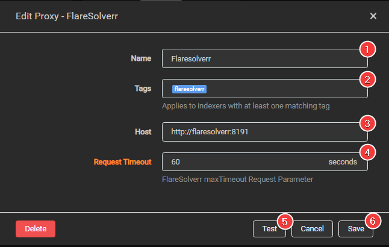

# How to set up FlareSolverr

[FlareSolverr](https://github.com/FlareSolverr/FlareSolverr){:target="\_blank" rel="noopener noreferrer"} is a proxy server to bypass Cloudflare and DDoS-GUARD protection.

!!! info

    - A FlareSolverr Proxy will only be used for requests if and only if Cloudflare is detected by Prowlarr
    - A FlareSolverr Proxy will only be used for requests if and only if the Proxy and the Indexer have matching tags
    - A FlareSolverr Proxy configured without any tags or has no indexers with matching tags will be disabled.

!!! bug "FlareSolverr is currently non-functional. It is also being monitored by the Cloudflare team, so it is unlikely to ever be fixed.  If you're using an indexer that needs FlaresSolverr and if they offer it, try another base URL till you find one that works. If none work, then you're out of luck.  There is no need to contact Servarr or Sonarr support. They are not the FlareSolverr support team and cannot help you with questions that don't relate specifically to adding FlareSolverr to Prowlarr.  FlareSolverr is a third-party program that solves Cloudflare captchas for some indexers. They use GitHub for support, and you should go there to ask them questions or catch up on the current status of the program.  The current open issue on their GitHub can be found [HERE](https://github.com/FlareSolverr/FlareSolverr/issues/1253){:target="\_blank" rel="noopener noreferrer"}"

## Install FlareSolverr

Please follow the installation instruction from [FlareSolverr](https://github.com/FlareSolverr/FlareSolverr#installation){:target="\_blank" rel="noopener noreferrer"}

## Add FlareSolverr to Prowlarr

`Settings` => `indexers`

Click on the + sign and select `FlareSolverr`

Add the following info.

1. Name of the Proxy in Prowlarr.
1. The tags for this proxy.
1. The full host path (including http and the port) to your FlareSolverr instance.
1. The [FlareSolver Request maxTimeout value](https://github.com/FlareSolverr/FlareSolverr#-requestget){:target="\_blank" rel="noopener noreferrer"} Prowlarr should use for FlareSolverr requests. Must be between `1` second and `180` seconds (Default: `60` seconds).
1. Test if your connection works.
1. If it works click on `Save`.

## Add FlareSolverr to your indexer

Select the indexer that you want to use with FlareSolverr.

Scroll down to the bottom and add the tag you set up earlier in step 2.

Click `Test` and `Save`.

Now the indexer should be using FlareSolverr.

--8<-- "includes/support.md"
