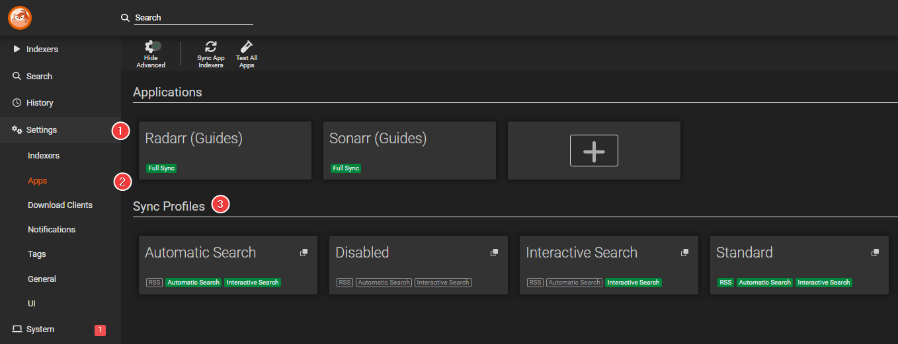
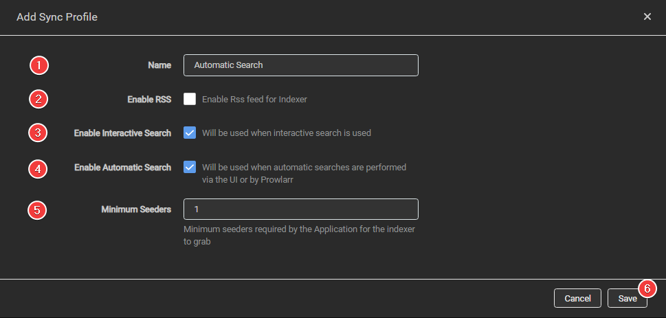
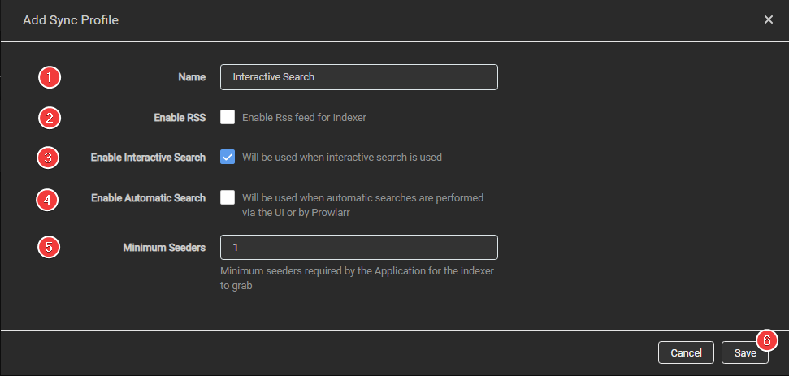

# How to setup indexers with limited API

So you have access to a few (unpaid) Usenet indexers with limited API calls and you still want to add them as backup for failed downloads, but you're always hitting the API limits in the first hour and can't make full use of them.

In this Guide, we will show you a trick on how you can make more use of them without hitting the API limit in the first hour.

!!! info "This is mainly a Usenet option but might be useful for a few trackers that have rate limits. We will use for this guide mainly Usenet indexers as examples."

## Sync Profiles

This is the same you see in the Starr apps under indexers when you open the specific indexer settings.

A short description of what they do, what they mean, and when they are used.

- RSS = The so-called search interval.
- Automatic search = When an item is added to the Starr apps and you do an `Add + Search`, if a "Usenet" download fails it will search for a replacement, When you click on the `Search All`, `Search Monitored` or on the `magnifying icon`.
- Interactive search = When you select the interactive search you get an unsorted/unfiltered list of everything your indexer(s) reports back where you can choose what you want to grab.

### Adding a Sync Profile

For this, we're going to create 2 new Sync Profiles

`Settings` => `Apps`

#### Automatic Search

!!! info "This one will only be used when an item is added to the Starr apps and you do an `Add + Search`. If a "Usenet" download fails it will search for a replacement. When you click on the `Search All`, `Search Monitored` or on the `magnifying icon`."

Click on the + sign and create a new sync profile with the following options.

1. Name it `Automatic Search`
1. **Disable** Enable RSS
1. Enable Interactive Search
1. Enable Automatic Search
1. If you're using Usenet ignore this, if you use public torrent trackers set this somewhere between 20-70, being they often lie about their seeders amount.
1. Click on Save

#### Interactive Search

!!! info "This will be only used when you do an interactive search."

Click on the + sign and create a new sync profile with the following options.

1. Name it `Interactive Search`
1. **Disable** Enable RSS
1. Enable Interactive Search
1. **Disable** Enable Automatic Search
1. If you're using Usenet ignore this, if you use public torrent trackers set this somewhere between 20-70, being they often lie about their seeders amount.
1. Click on Save

### Indexers Settings

Next up configure the new Sync Profile for the indexer with the limited API.

#### Select Sync Profile

In Prowlarr, edit the indexer of your choice and under `Sync Profile` you choose one of the two newly created Sync Profiles.

For this example, we're going to use `Automatic Search`.

#### Setup API Limits

In Prowlarr, edit the indexer of your choice, and under `Query Limit` (_API hits_) and `Grab Limit` (_Downloads_) you can set your indexer's API limits. These limits can be found in several places, depending on the indexer. The usual places include in your profile or when you go to a page where you select which package you want to buy.

!!! warning "We're adding this to prevent any abuse/hammering to the indexer Ignoring this can sometimes result in a (potentially lifetime) ban."

--8<-- "includes/support.md"
