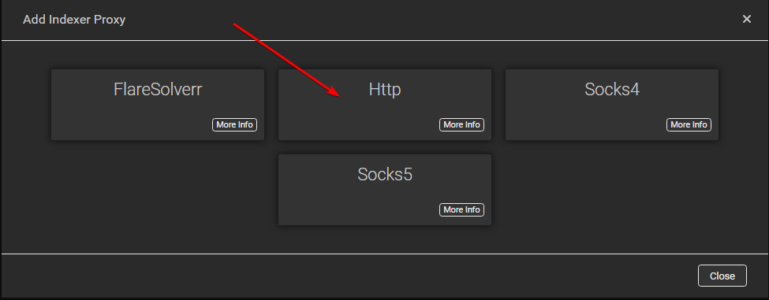
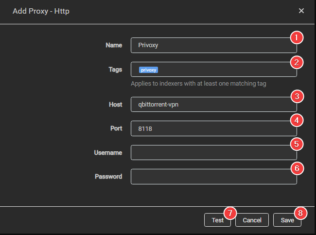
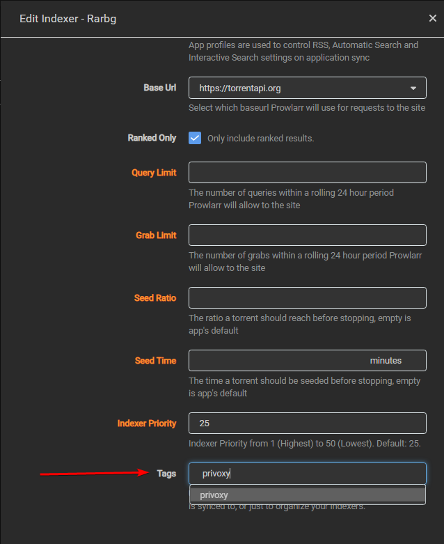

# Setup proxy for certain indexers

It's not recommended to run any of the Starr apps through a VPN. In some cases, it can cause connectivity issues such as the Starr apps not being able to update the posters and metadata, and sometimes the inability to add new movies/TV shows at all. It won't always happen immediately, but sooner or later it can and probably will happen.

!!! danger "To be clear it is not a matter if VPNs will cause issues with the Starr Apps, but when: image providers will block you and cloudflare is in front of most of Starr servers (updates, metadata, etc.) and liable to block you too"

Just run VPN on the apps that actually need it, like your torrent client, and perhaps in some cases certain indexers because of region/ISP restriction.

!!! warning

    Please check the indexers rules if you're allowed to use a VPN/Proxy to access their site, being that VPN services often use shared IP it could be recognized as account sharing.

    This isn't the same as the tracker, the API/Website scraping happens on the actual site and some indexers don't allow VPN usage on their site.

In this guide, we will try to explain how to set up Prowlarr to use your VPN from your torrent client.

## Enable privoxy

If you use docker, you need to enable privoxy in your torrent client so you can use it to pass through traffic.

Please check your docker image's documentation on how to enable privoxy.

## Add privoxy to Prowlarr

`Settings` => `indexers`

Click on the + sign and select `http`

Add the following info

1. Name of the Proxy in Prowlarr.
1. The tags for this proxy. Proxies apply to all matching (same tag) indexers. If blank this proxy applies to all indexers.
1. Host name to your torrent client.
1. Used port for privoxy (default for privoxy: 8118).
1. User name for your torrent client. (Not needed if using the default privoxy settings)
1. Password for your torrent client. (Not needed if using the default privoxy settings)
1. Test if your connection works.
1. If it works click on `Save`.

## Add privoxy to your indexer

Select the indexer that you want to use with Privoxy

Scroll down to the bottom and add the tag you set up earlier during step 2.

Click `Test` and `Save`.

Now the indexer should be using the VPN of your torrent client.

--8<-- "includes/support.md"
