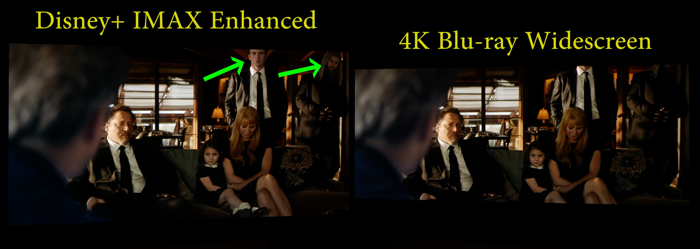
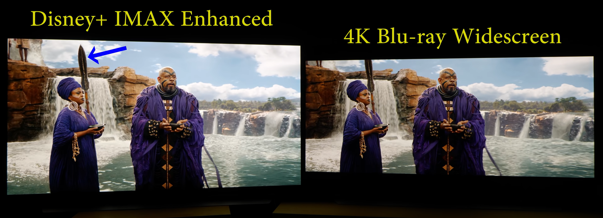

# Collection of Custom Formats

Below is a collection of what we've come to regard as the most needed and commonly used Custom Formats.
These CFs have been collected from discussions on Discord or created with help from others.

Special thanks to everyone who has helped in the creation and testing of these Custom Formats, my team at TRaSH guides, Team Radarr, and the community.

With Radarr V3, Custom Formats are much more advanced/powerful than with V2, although this also means a Custom Format can require more knowledge to set up or create.

After requesting with Team Radarr, we now have the option to import/export the Custom Formats in a JSON format. This provides everyone with an easy way to share and use Custom Formats.

We've made 3 guides related to this.

- [How to import Custom Formats](/Radarr/Radarr-import-custom-formats){:target="\_blank" rel="noopener noreferrer"} - Explains how to import the Custom Formats.
- [How to upgrade Custom Formats](/Radarr/Radarr-how-to-update-custom-formats){:target="\_blank" rel="noopener noreferrer"} - Explains how to upgrade your existing Custom Formats.
- [How to set up Quality Profiles](/Radarr/radarr-setup-quality-profiles){:target="\_blank" rel="noopener noreferrer"} - Explains how to make the most use of Custom Formats and shows some specifics of our recommended configuration. You can use these examples to get an idea of how to set up your preferences.

!!! tip

    It also is recommended to change the Propers and Repacks settings in Radarr's `Settings`.

    `Media Management` => `File Management` to `Do Not Prefer` and use the [Repack/Proper](#repackproper) Custom Format.

    

    This way you make sure the Custom Format scoring and preferences will be fully utilized.

--8<-- "includes/support.md"

---

## INDEX

---

| Audio Advanced #1                     | Audio Advanced #2         | Audio Channels               | HDR Formats                       |
| ------------------------------------- | ------------------------- | ---------------------------- | --------------------------------- |
| [TrueHD ATMOS](#truehd-atmos)         | [FLAC](#flac)             | [1.0 Mono](#10-mono)         | [DV HDR10+](#dv-hdr10plus)        |
| [DTS X](#dts-x)                       | [PCM](#pcm)               | [2.0 Stereo](#20-stereo)     | [DV HDR10](#dv-hdr10)             |
| [ATMOS (undefined)](#atmos-undefined) | [DTS-HD HRA](#dts-hd-hra) | [3.0 Sound](#30-sound)       | [DV](#dv)                         |
| [DD+ ATMOS](#ddplus-atmos)            | [AAC](#aac)               | [4.0 Sound](#40-sound)       | [DV HLG](#dv-hlg)                 |
| [TrueHD](#truehd)                     | [DD](#dd)                 | [5.1 Surround](#51-surround) | [DV SDR](#dv-sdr)                 |
| [DTS-HD MA](#dts-hd-ma)               | [MP3](#mp3)               | [6.1 Surround](#61-surround) | [HDR10+](#hdr10plus)              |
| [DD+](#ddplus)                        | [Opus](#opus)             | [7.1 Surround](#71-surround) | [HDR10](#hdr10)                   |
| [DTS-ES](#dts-es)                     |                           |                              | [HDR](#hdr)                       |
| [DTS](#dts)                           |                           |                              | [HDR (undefined)](#hdr-undefined) |
|                                       |                           |                              | [PQ](#pq)                         |
|                                       |                           |                              | [HLG](#hlg)                       |

---

| Movie Versions                                | Unwanted                                        | HQ Release Groups                         |
| --------------------------------------------- | ----------------------------------------------- | ----------------------------------------- |
| [4K Remaster](#4k-remaster)                   | [3D](#3d)                                       | [Remux Tier 01](#remux-tier-01)           |
| [Criterion Collection](#criterion-collection) | [AV1](#av1)                                     | [Remux Tier 02](#remux-tier-02)           |
| [Hybrid](#hybrid)                             | [BR-DISK](#br-disk)                             | [Remux Tier 03](#remux-tier-03)           |
| [IMAX Enhanced](#imax-enhanced)               | [Extras](#extras)                               | [UHD Bluray Tier 01](#uhd-bluray-tier-01) |
| [IMAX](#imax)                                 | [Generated Dynamic HDR](#generated-dynamic-hdr) | [UHD Bluray Tier 02](#uhd-bluray-tier-02) |
| [Masters of Cinema](#masters-of-cinema)       | [LQ](#lq)                                       | [UHD Bluray Tier 03](#uhd-bluray-tier-03) |
| [Open Matte](#open-matte)                     | [LQ (Release Title)](#lq-release-title)         | [HD Bluray Tier 01](#hd-bluray-tier-01)   |
| [Remaster](#remaster)                         | [Upscaled](#upscaled)                           | [HD Bluray Tier 02](#hd-bluray-tier-02)   |
| [Special Edition](#special-edition)           | [x265 (HD)](#x265-hd)                           | [HD Bluray Tier 03](#hd-bluray-tier-03)   |
| [Theatrical Cut](#theatrical-cut)             |                                                 | [WEB Tier 01](#web-tier-01)               |
| [Vinegar Syndrome](#vinegar-syndrome)         |                                                 | [WEB Tier 02](#web-tier-02)               |
|                                               |                                                 | [WEB Tier 03](#web-tier-03)               |

---

| General Streaming Services | Asian Streaming Services | Dutch Streaming Services |
| -------------------------- | ------------------------ | ------------------------ |
| [Amazon](#amzn)            | [FOD](#fod)              | [Pathe Thuis](#pathe)    |
| [Apple TV+](#atvp)         | [Disney+ Hotstar](#htsr) | [Videoland](#vdl)        |
| [Bravia Core](#bcore)      | [TVer](#tver)            |                          |
| [Criterion Channel](#crit) | [TVING](#tving)          |                          |
| [Disney+](#dsnp)           | [U-NEXT](#u-next)        |                          |
| [HBO](#hbo)                | [VIU](#viu)              |                          |
| [HBO Max](#hmax)           |                          |                          |
| [Hulu](#hulu)              |                          |                          |
| [iTunes](#it)              |                          |                          |
| [Max](#max)                |                          |                          |
| [Movies Anywhere](#ma)     |                          |                          |
| [Netflix](#nf)             |                          |                          |
| [Peacock TV](#pcok)        |                          |                          |
| [Paramount+](#pmtp)        |                          |                          |
| [Stan](#stan)              |                          |                          |

| UK Streaming Services | Misc Streaming Services | Anime Streaming Services |
| --------------------- | ----------------------- | ------------------------ |
| [BBC iPlayer](#ip)    | [AUBC](#aubc)           | [VRV](#vrv)              |
| [ITVX](#itvx)         | [CBC](#cbc)             |                          |
| [MY5](#my5)           | [Crave](#crav)          |                          |
| [NOW](#now)           | [OViD](#ovid)           |                          |
|                       | [Star+](#strp)          |                          |
|                       |                         |                          |

---

| Miscellaneous                          | Language profiles                                                  |
| -------------------------------------- | ------------------------------------------------------------------ |
| [Bad Dual Groups](#bad-dual-groups)    | [Language: German](#language-german)                               |
| [Dutch Groups](#dutch-groups)          | [Language: German DL](#language-german-dl)                         |
| [DV (Disk)](#dv-disk)                  | [Language: German DL (undefined)](#language-german-dl-undefined)   |
| [DV (WEBDL)](#dv-webdl)                | [Language: Not English (English Only)](#language-not-english)      |
| [DV HDR10+ Boost](#dv-hdr10plus-boost) | [Language: Not French (French Only)](#language-not-french)         |
| [EVO (no WEBDL)](#evo-no-webdl)        | [Language: Not Original (Original Only)](#language-not-original)   |
| [FreeLeech](#freeleech)                | [Language: Original + French](#language-original-plus-french)      |
| [HDR10+ Boost](#hdr10plus-boost)       | [Language: Not German or English](#language-not-german-or-english) |
| [HFR](#hfr)                            |                                                                    |
| [Internal](#internal)                  |                                                                    |
| [Line/Mic Dubbed](#linemic-dubbed)     |                                                                    |
| [MPEG2](#mpeg2)                        |                                                                    |
| [Multi](#multi)                        |                                                                    |
| [No-RlsGroup](#no-rlsgroup)            |                                                                    |
| [Obfuscated](#obfuscated)              |                                                                    |
| [Repack/Proper](#repackproper)         |                                                                    |
| [Repack2](#repack2)                    |                                                                    |
| [Repack3](#repack3)                    |                                                                    |
| [Retags](#retags)                      |                                                                    |
| [Scene](#scene)                        |                                                                    |
| [SDR (no WEBDL)](#sdr-no-webdl)        |                                                                    |
| [SDR](#sdr)                            |                                                                    |
| [VC-1](#vc-1)                          |                                                                    |
| [VP9](#vp9)                            |                                                                    |
| [x264](#x264)                          |                                                                    |
| [x265 (no HDR/DV)](#x265-no-hdrdv)     |                                                                    |
| [x265](#x265)                          |                                                                    |
| [x266](#x266)                          |                                                                    |

---

| Anime                                                                       | Anime                                                                 | Anime     | Anime Optional                        |
| --------------------------------------------------------------------------- | --------------------------------------------------------------------- | --------- | ------------------------------------- |
| [Anime BD Tier 01 (Top SeaDex Muxers)](#anime-bd-tier-01-top-seadex-muxers) | [Anime Web Tier 01 (Muxers)](#anime-web-tier-01-muxers)               | [v0](#v0) | [Uncensored](#uncensored)             |
| [Anime BD Tier 02 (SeaDex Muxers)](#anime-bd-tier-02-seadex-muxers)         | [Anime Web Tier 02 (Top FanSubs)](#anime-web-tier-02-top-fansubs)     | [v1](#v1) | [10bit](#10bit)                       |
| [Anime BD Tier 03 (SeaDex Muxers)](#anime-bd-tier-03-seadex-muxers)         | [Anime Web Tier 03 (Official Subs)](#anime-web-tier-03-official-subs) | [v2](#v2) | [Anime Dual Audio](#anime-dual-audio) |
| [Anime BD Tier 04 (SeaDex Muxers)](#anime-bd-tier-04-seadex-muxers)         | [Anime Web Tier 04 (Official Subs)](#anime-web-tier-04-official-subs) | [v3](#v3) | [Dubs Only](#dubs-only)               |
| [Anime BD Tier 05 (Remuxes)](#anime-bd-tier-05-remuxes)                     | [Anime Web Tier 05 (FanSubs)](#anime-web-tier-05-fansubs)             | [v4](#v4) |                                       |
| [Anime BD Tier 06 (FanSubs)](#anime-bd-tier-06-fansubs)                     | [Anime Web Tier 06 (FanSubs)](#anime-web-tier-06-fansubs)             |           |                                       |
| [Anime BD Tier 07 (P2P/Scene)](#anime-bd-tier-07-p2pscene)                  | [Anime Raws](#anime-raws)                                             |           |                                       |
| [Anime BD Tier 08 (Mini Encodes)](#anime-bd-tier-08-mini-encodes)           | [Anime LQ Groups](#anime-lq-groups)                                   |           |                                       |

---

| German Source Groups                            | German Miscellaneous                          | French Source Groups                            | French Audio Version |
| ----------------------------------------------- | --------------------------------------------- | ----------------------------------------------- | -------------------- |
| [German Remux Tier 01](#german-remux-tier-01)   | [German LQ](#german-lq)                       | [FR Remux Tier 01](#fr-remux-tier-01)           | [VFF](#vff)          |
| [German Remux Tier 02](#german-remux-tier-02)   | [German Microsized](#german-microsized)       | [FR Remux Tier 02](#fr-remux-tier-02)           | [VOF](#vof)          |
| [German Bluray Tier 01](#german-bluray-tier-01) | [German 1080p Booster](#german-1080p-booster) | [FR UHD Bluray Tier 01](#fr-uhd-bluray-tier-01) | [VFI](#vfi)          |
| [German Bluray Tier 02](#german-bluray-tier-02) | [German 2160p Booster](#german-2160p-booster) | [FR UHD Bluray Tier 02](#fr-uhd-bluray-tier-02) | [VF2](#vf2)          |
| [German Bluray Tier 03](#german-bluray-tier-03) |                                               | [FR HD Bluray Tier 01](#fr-hd-bluray-tier-01)   | [VFQ](#vfq)          |
| [German Web Tier 01](#german-web-tier-01)       |                                               | [FR HD Bluray Tier 02](#fr-hd-bluray-tier-02)   | [VOQ](#voq)          |
| [German Web Tier 02](#german-web-tier-02)       |                                               | [FR WEB Tier 01](#fr-web-tier-01)               | [VQ](#vq)            |
| [German Web Tier 03](#german-web-tier-03)       |                                               | [FR WEB Tier 02](#fr-web-tier-02)               | [VFB](#vfb)          |
| [German Scene](#german-scene)                   |                                               | [FR Scene Groups](#fr-scene-groups)             | [VOSTFR](#vostfr)    |
|                                                 |                                               | [FR LQ](#fr-lq)                                 | [FanSUB](#fansub)    |
|                                                 |                                               |                                                 | [FastSUB](#fastsub)  |

---

## Audio Advanced

---

### TrueHD ATMOS

??? question "TrueHD ATMOS - [Click to show/hide]"

    {! include-markdown "../../includes/cf-descriptions/truehd-atmos.md" !}

??? example "JSON - [Click to show/hide]"

    ```json
    [[% filter indent(width=4) %]][[% include 'json/radarr/cf/truehd-atmos.json' %]][[% endfilter %]]
    ```

<sub><sup>[TOP](#index)</sup></sub>

---

### DTS X

??? question "DTS:X - [Click to show/hide]"

    {! include-markdown "../../includes/cf-descriptions/dts-x.md" !}

??? example "JSON - [Click to show/hide]"

    ```json
    [[% filter indent(width=4) %]][[% include 'json/radarr/cf/dts-x.json' %]][[% endfilter %]]
    ```

<sub><sup>[TOP](#index)</sup></sub>

---

### ATMOS (undefined)

??? question "ATMOS (undefined) - [Click to show/hide]"

    {! include-markdown "../../includes/cf-descriptions/atmos-undefined.md" !}

??? example "JSON - [Click to show/hide]"

    ```json
    [[% filter indent(width=4) %]][[% include 'json/radarr/cf/atmos-undefined.json' %]][[% endfilter %]]
    ```

<sub><sup>[TOP](#index)</sup></sub>

---

### DDPlus ATMOS

??? question "DD+ ATMOS - [Click to show/hide]"

    {! include-markdown "../../includes/cf-descriptions/ddplus-atmos.md" !}

??? example "JSON - [Click to show/hide]"

    ```json
    [[% filter indent(width=4) %]][[% include 'json/radarr/cf/ddplus-atmos.json' %]][[% endfilter %]]
    ```

<sub><sup>[TOP](#index)</sup></sub>

---

### TrueHD

??? question "TrueHD - [Click to show/hide]"

    {! include-markdown "../../includes/cf-descriptions/truehd.md" !}

??? example "JSON - [Click to show/hide]"

    ```json
    [[% filter indent(width=4) %]][[% include 'json/radarr/cf/truehd.json' %]][[% endfilter %]]
    ```

<sub><sup>[TOP](#index)</sup></sub>

---

### DTS-HD MA

??? question "DTS-HD MA - [Click to show/hide]"

    {! include-markdown "../../includes/cf-descriptions/dts-hd-ma.md" !}

??? example "JSON - [Click to show/hide]"

    ```json
    [[% filter indent(width=4) %]][[% include 'json/radarr/cf/dts-hd-ma.json' %]][[% endfilter %]]
    ```

<sub><sup>[TOP](#index)</sup></sub>

---

### FLAC

??? question "FLAC - [Click to show/hide]"

    {! include-markdown "../../includes/cf-descriptions/flac.md" !}

??? example "JSON - [Click to show/hide]"

    ```json
    [[% filter indent(width=4) %]][[% include 'json/radarr/cf/flac.json' %]][[% endfilter %]]
    ```

<sub><sup>[TOP](#index)</sup></sub>

---

### PCM

??? question "PCM - [Click to show/hide]"

    {! include-markdown "../../includes/cf-descriptions/pcm.md" !}

??? example "JSON - [Click to show/hide]"

    ```json
    [[% filter indent(width=4) %]][[% include 'json/radarr/cf/pcm.json' %]][[% endfilter %]]
    ```

<sub><sup>[TOP](#index)</sup></sub>

---

### DTS-HD HRA

??? question "DTS-HD HRA - [Click to show/hide]"

    {! include-markdown "../../includes/cf-descriptions/dts-hd-hra.md" !}

??? example "JSON - [Click to show/hide]"

    ```json
    [[% filter indent(width=4) %]][[% include 'json/radarr/cf/dts-hd-hra.json' %]][[% endfilter %]]
    ```

<sub><sup>[TOP](#index)</sup></sub>

---

### DDPlus

<sub>Dolby Digital Plus = DD+ = DDPlus</sub>

??? question "DD+ - [Click to show/hide]"

    {! include-markdown "../../includes/cf-descriptions/ddplus.md" !}

??? example "JSON - [Click to show/hide]"

    ```json
    [[% filter indent(width=4) %]][[% include 'json/radarr/cf/ddplus.json' %]][[% endfilter %]]
    ```

<sub><sup>[TOP](#index)</sup></sub>

---

### DTS-ES

??? question "DTS-ES - [Click to show/hide]"

    {! include-markdown "../../includes/cf-descriptions/dts-es.md" !}

??? example "JSON - [Click to show/hide]"

    ```json
    [[% filter indent(width=4) %]][[% include 'json/radarr/cf/dts-es.json' %]][[% endfilter %]]
    ```

<sub><sup>[TOP](#index)</sup></sub>

---

### DTS

<sub>DTS = Basic DTS</sub>

??? question "DTS - [Click to show/hide]"

    {! include-markdown "../../includes/cf-descriptions/dts.md" !}

??? example "JSON - [Click to show/hide]"

    ```json
    [[% filter indent(width=4) %]][[% include 'json/radarr/cf/dts.json' %]][[% endfilter %]]
    ```

<sub><sup>[TOP](#index)</sup></sub>

---

### AAC

??? question "AAC - [Click to show/hide]"

    {! include-markdown "../../includes/cf-descriptions/aac.md" !}

??? example "JSON - [Click to show/hide]"

    ```json
    [[% filter indent(width=4) %]][[% include 'json/radarr/cf/aac.json' %]][[% endfilter %]]
    ```

<sub><sup>[TOP](#index)</sup></sub>

---

### DD

<sub>(Basic) Dolby Digital = DD</sub>

??? question "DD - [Click to show/hide]"

    {! include-markdown "../../includes/cf-descriptions/dd.md" !}

??? example "JSON - [Click to show/hide]"

    ```json
    [[% filter indent(width=4) %]][[% include 'json/radarr/cf/dd.json' %]][[% endfilter %]]
    ```

<sub><sup>[TOP](#index)</sup></sub>

---

### MP3

??? question "MP3 - [Click to show/hide]"

    {! include-markdown "../../includes/cf-descriptions/mp3.md" !}

??? example "JSON - [Click to show/hide]"

    ```json
    [[% filter indent(width=4) %]][[% include 'json/radarr/cf/mp3.json' %]][[% endfilter %]]
    ```

<sub><sup>[TOP](#index)</sup></sub>

---

### Opus

??? question "Opus - [Click to show/hide]"

    {! include-markdown "../../includes/cf-descriptions/opus.md" !}

??? example "JSON - [Click to show/hide]"

    ```json
    [[% filter indent(width=4) %]][[% include 'json/radarr/cf/opus.json' %]][[% endfilter %]]
    ```

<sub><sup>[TOP](#index)</sup></sub>

---

## Audio Channels

---

### 1.0 Mono

??? example "JSON - [Click to show/hide]"

    ```json
    [[% filter indent(width=4) %]][[% include 'json/radarr/cf/10-mono.json' %]][[% endfilter %]]
    ```

<sub><sup>[TOP](#index)</sup></sub>

---

### 2.0 Stereo

??? example "JSON - [Click to show/hide]"

    ```json
    [[% filter indent(width=4) %]][[% include 'json/radarr/cf/20-stereo.json' %]][[% endfilter %]]
    ```

<sub><sup>[TOP](#index)</sup></sub>

---

### 3.0 Sound

??? example "JSON - [Click to show/hide]"

    ```json
    [[% filter indent(width=4) %]][[% include 'json/radarr/cf/30-sound.json' %]][[% endfilter %]]
    ```

<sub><sup>[TOP](#index)</sup></sub>

---

### 4.0 Sound

??? example "JSON - [Click to show/hide]"

    ```json
    [[% filter indent(width=4) %]][[% include 'json/radarr/cf/40-sound.json' %]][[% endfilter %]]
    ```

<sub><sup>[TOP](#index)</sup></sub>

---

### 5.1 Surround

??? example "JSON - [Click to show/hide]"

    ```json
    [[% filter indent(width=4) %]][[% include 'json/radarr/cf/51-surround.json' %]][[% endfilter %]]
    ```

<sub><sup>[TOP](#index)</sup></sub>

---

### 6.1 Surround

??? example "JSON - [Click to show/hide]"

    ```json
    [[% filter indent(width=4) %]][[% include 'json/radarr/cf/61-surround.json' %]][[% endfilter %]]
    ```

<sub><sup>[TOP](#index)</sup></sub>

---

### 7.1 Surround

??? example "JSON - [Click to show/hide]"

    ```json
    [[% filter indent(width=4) %]][[% include 'json/radarr/cf/71-surround.json' %]][[% endfilter %]]
    ```

<sub><sup>[TOP](#index)</sup></sub>

---

## HDR Formats

---

### DV HDR10Plus

<sub>DV = DoVi = Dolby Vision</sub><br>
<sub>HDR10+ = HDR10P = HDR10Plus</sub>

??? question "DV HDR10+ - [Click to show/hide]"

    {! include-markdown "../../includes/cf-descriptions/dv-hdr10plus.md" !}

??? example "JSON - [Click to show/hide]"

    ```json
    [[% filter indent(width=4) %]][[% include 'json/radarr/cf/dv-hdr10plus.json' %]][[% endfilter %]]
    ```

<sub><sup>[TOP](#index)</sup></sub>

---

### DV HDR10

<sub>DV = DoVi = Dolby Vision</sub>

??? question "DV HDR10 - [Click to show/hide]"

    {! include-markdown "../../includes/cf-descriptions/dv-hdr10.md" !}

??? example "JSON - [Click to show/hide]"

    ```json
    [[% filter indent(width=4) %]][[% include 'json/radarr/cf/dv-hdr10.json' %]][[% endfilter %]]
    ```

<sub><sup>[TOP](#index)</sup></sub>

---

### DV

<sub>DV = DoVi = Dolby Vision</sub>

??? question "DV - [Click to show/hide]"

    --8<-- "includes/cf-descriptions/dv.md"

<!-- the reason why we didn't use here `include-markdown` is because all the headers when using `include-markdown` will be looking in `/includes` and not the current markdown file, in this case, the pointer to `#dv-webdl` in `includes/dv.md` -->

??? example "JSON - [Click to show/hide]"

    ```json
    [[% filter indent(width=4) %]][[% include 'json/radarr/cf/dv.json' %]][[% endfilter %]]
    ```

<sub><sup>[TOP](#index)</sup></sub>

---

### DV HLG

<sub>DV = DoVi = Dolby Vision</sub>

??? question "DV HLG - [Click to show/hide]"

    {! include-markdown "../../includes/cf-descriptions/dv-hlg.md" !}

??? example "JSON - [Click to show/hide]"

    ```json
    [[% filter indent(width=4) %]][[% include 'json/radarr/cf/dv-hlg.json' %]][[% endfilter %]]
    ```

<sub><sup>[TOP](#index)</sup></sub>

---

### DV SDR

<sub>DV = DoVi = Dolby Vision</sub>

??? question "DV SDR - [Click to show/hide]"

    {! include-markdown "../../includes/cf-descriptions/dv-sdr.md" !}

??? example "JSON - [Click to show/hide]"

    ```json
    [[% filter indent(width=4) %]][[% include 'json/radarr/cf/dv-sdr.json' %]][[% endfilter %]]
    ```

<sub><sup>[TOP](#index)</sup></sub>

---

### HDR10Plus

<sub>HDR10+ = HDR10P = HDR10Plus</sub>

??? question "HDR10+ - [Click to show/hide]"

    {! include-markdown "../../includes/cf-descriptions/hdr10plus.md" !}

??? example "JSON - [Click to show/hide]"

    ```json
    [[% filter indent(width=4) %]][[% include 'json/radarr/cf/hdr10plus.json' %]][[% endfilter %]]
    ```

<sub><sup>[TOP](#index)</sup></sub>

---

### HDR10

<sub>HDR10</sub>

??? question "HDR10 - [Click to show/hide]"

    {! include-markdown "../../includes/cf-descriptions/hdr10.md" !}

??? example "JSON - [Click to show/hide]"

    ```json
    [[% filter indent(width=4) %]][[% include 'json/radarr/cf/hdr10.json' %]][[% endfilter %]]
    ```

<sub><sup>[TOP](#index)</sup></sub>

---

### HDR

<sub>HDR</sub>

??? question "HDR - [Click to show/hide]"

    {! include-markdown "../../includes/cf-descriptions/hdr.md" !}

??? example "JSON - [Click to show/hide]"

    ```json
    [[% filter indent(width=4) %]][[% include 'json/radarr/cf/hdr.json' %]][[% endfilter %]]
    ```

<sub><sup>[TOP](#index)</sup></sub>

---

### HDR (undefined)

??? question "HDR (undefined) - [Click to show/hide]"

    {! include-markdown "../../includes/cf-descriptions/hdr-undefined.md" !}

??? example "JSON - [Click to show/hide]"

    ```json
    [[% filter indent(width=4) %]][[% include 'json/radarr/cf/hdr-undefined.json' %]][[% endfilter %]]
    ```

<sub><sup>[TOP](#index)</sup></sub>

---

### PQ

<sub>PQ = PQ10</sub>

??? question "PQ - [Click to show/hide]"

    {! include-markdown "../../includes/cf-descriptions/pq.md" !}

??? example "JSON - [Click to show/hide]"

    ```json
    [[% filter indent(width=4) %]][[% include 'json/radarr/cf/pq.json' %]][[% endfilter %]]
    ```

<sub><sup>[TOP](#index)</sup></sub>

---

### HLG

<sub>HLG = HLG10</sub>

??? question "HLG - [Click to show/hide]"

    {! include-markdown "../../includes/cf-descriptions/hlg.md" !}

??? example "JSON - [Click to show/hide]"

    ```json
    [[% filter indent(width=4) %]][[% include 'json/radarr/cf/hlg.json' %]][[% endfilter %]]
    ```

<sub><sup>[TOP](#index)</sup></sub>

---

## Movie Versions

---

### Hybrid

??? question "Hybrid - [Click to show/hide]"

    A hybrid release means any combination of sources (video + audio) and not a direct encoding of a single source. Generally, you can be sure that any hybrid that has been put together is the best quality release of a particular title.

??? example "JSON - [Click to show/hide]"

    ```json
    [[% filter indent(width=4) %]][[% include 'json/radarr/cf/hybrid.json' %]][[% endfilter %]]
    ```

<sub><sup>[TOP](#index)</sup></sub>

---

### Remaster

??? question "Remaster - [Click to show/hide]"

    [From Wikipedia, the free encyclopedia](https://en.wikipedia.org/wiki/Remaster){:target="_blank" rel="noopener noreferrer"}

    For the software term, see Software remastering.
    Remaster (also digital remastering and digitally remastered) refers to changing the quality of the sound or of the image, or both, of previously created recordings, either audiophonic, cinematic, or videographic.

??? example "JSON - [Click to show/hide]"

    ```json
    [[% filter indent(width=4) %]][[% include 'json/radarr/cf/remaster.json' %]][[% endfilter %]]
    ```

<sub><sup>[TOP](#index)</sup></sub>

---

### 4K Remaster

??? question "4K Remaster - [Click to show/hide]"

    A remastered or mastered in 4K should give you usually the best picture and audio currently for the movie. Both are just names to describe the best possible current release of the movie.

    To be clear, the final digital films on the Mastered in 4K Blu-rays still only have the same 1920 x 1080 pixels of actual resolution as normal Blu-rays. But the argument goes that because these full HD files were derived from higher-resolution masters, their images will be more precise, with better colors, less noise, and enhanced sharpness and detail. Not least because the higher-resolution mastering process will provide more detail from the original print for the Blu-ray masters to draw on when going through their (hopefully…) frame-by-frame compression process.

    Another important element of the Mastered in 4K discs is that they’re all mastered with ‘x.v.YCC’ color specification. This delivers an expanded color range closer to that contained in source material.

??? example "JSON - [Click to show/hide]"

    ```json
    [[% filter indent(width=4) %]][[% include 'json/radarr/cf/4k-remaster.json' %]][[% endfilter %]]
    ```

<sub><sup>[TOP](#index)</sup></sub>

---

### Criterion Collection

??? question "Criterion Collection - [Click to show/hide]"

    The Criterion Collection, Inc. (or simply Criterion) is an American home video distribution company that focuses on licensing "important classic and contemporary films" and selling them to film aficionados. Criterion has helped to standardize characteristics of home video such as film restoration, using the letterbox format for widescreen films, and adding bonus features and commentary tracks.

??? example "JSON - [Click to show/hide]"

    ```json
    [[% filter indent(width=4) %]][[% include 'json/radarr/cf/criterion-collection.json' %]][[% endfilter %]]
    ```

<sub><sup>[TOP](#index)</sup></sub>

---

### Masters of Cinema

??? question "Masters of Cinema - [Click to show/hide]"

    Masters of Cinema is a line of DVD and Blu-ray releases published through Eureka Entertainment. Because of the uniformly branded and spine-numbered packaging and the standard inclusion of booklets and analysis by recurring film historians, the line is often perceived as the UK equivalent of The Criterion Collection.

??? example "JSON - [Click to show/hide}"

    ```json
    [[% filter indent(width=4) %]][[% include 'json/radarr/cf/masters-of-cinema.json' %]][[% endfilter %]]
    ```

<sub><sup>[TOP](#index)</sup></sub>

---

### Vinegar Syndrome

??? question "Vinegar Syndrome - [Click to show/hide]"

    Vinegar Syndrome is a US-based company founded in 2012 to preserve and distribute old X-rated films. Over time, they expanded their catalog to include other types of cult and exploitation films, specializing in horror and action genres.

??? example "JSON - [Click to show/hide}"

    ```json
    [[% filter indent(width=4) %]][[% include 'json/radarr/cf/vinegar-syndrome.json' %]][[% endfilter %]]
    ```

<sub><sup>[TOP](#index)</sup></sub>

---

### Theatrical Cut

??? question "Theatrical Cut - [Click to show/hide]"

    The Theatrical Cut is the version of the film that was shown at cinemas.

??? example "JSON - [Click to show/hide]"

    ```json
    [[% filter indent(width=4) %]][[% include 'json/radarr/cf/theatrical-cut.json' %]][[% endfilter %]]
    ```

<sub><sup>[TOP](#index)</sup></sub>

---

### Special Edition

??? question "Special Edition - [Click to show/hide]"

    Custom format for several Special Editions

    - The Director's Cut is the version edited by the Director, usually for additional home media releases.
    - An Extended Cut is usually any version of the film that is longer than the theatrical cut (though in very rare cases, its shorter).

??? example "JSON - [Click to show/hide]"

    ```json
    [[% filter indent(width=4) %]][[% include 'json/radarr/cf/special-edition.json' %]][[% endfilter %]]
    ```

<sub><sup>[TOP](#index)</sup></sub>

---

### IMAX

??? question "IMAX - [Click to show/hide]"

    [From In Depth Cine](https://www.indepthcine.com/videos/imax){:target="_blank" rel="noopener noreferrer"}

    IMAX films are shot in tall aspect ratios, typically 1.9:1 or sometimes 1.43:1. Most IMAX film releases also have scenes shot at wider aspect ratios and, as a result, the aspect ratio will change throughout. Because they are shot on large format cameras, there is often less film grain present. This results in a clearer picture.

??? example "JSON - [Click to show/hide]"

    ```json
    [[% filter indent(width=4) %]][[% include 'json/radarr/cf/imax.json' %]][[% endfilter %]]
    ```

<sub><sup>[TOP](#index)</sup></sub>

---

### IMAX Enhanced

??? question "IMAX Enhanced - [Click to show/hide]"

    **Get more picture and less black bars (letterboxing).**

    [From Wired](https://www.wired.com/story/what-is-imax-enhanced/){:target="_blank" rel="noopener noreferrer"}

    IMAX Enhanced is a standard for digital releases. It features scenes shot on IMAX cameras and produced in HDR10 DV. IMAX Enhanced releases are often higher bitrate than other WEB options and are encoded into various formats, including SDR conversions.

    As a result of the higher bitrate and implied picture quality improvement, it is recommended to enable the IMAX Enhanced custom format on WEB profiles, especially for those seeking 'The IMAX Experience' - including fewer "black bars" or letterboxing.

    

    

    

    

    

??? example "JSON - [Click to show/hide]"

    ```json
    [[% filter indent(width=4) %]][[% include 'json/radarr/cf/imax-enhanced.json' %]][[% endfilter %]]
    ```

<sub><sup>[TOP](#index)</sup></sub>

---

### Open Matte

??? question "Open Matte - [Click to show/hide]"

    Open matte is a filming technique that involves matting out the top and bottom of the film frame in the movie projector (known as a soft matte) for the widescreen theatrical release and then scanning the film without a matte (at an Academy ratio) for a full-screen home video release.

??? example "JSON - [Click to show/hide}"

    ```json
    [[% filter indent(width=4) %]][[% include 'json/radarr/cf/open-matte.json' %]][[% endfilter %]]
    ```

<sub><sup>[TOP](#index)</sup></sub>

---

## Unwanted

---

### AV1

??? question "AV1 - [Click to show/hide]"

    {! include-markdown "../../includes/cf-descriptions/av1.md" !}

??? example "JSON - [Click to show/hide]"

    ```json
    [[% filter indent(width=4) %]][[% include 'json/radarr/cf/av1.json' %]][[% endfilter %]]
    ```

<sub><sup>[TOP](#index)</sup></sub>

---

### BR-DISK

??? question "BR-DISK - [Click to show/hide]"

    This is a custom format to help Radarr recognize & ignore BR-DISK (ISO's and Blu-ray folder structure) in addition to the standard BR-DISK quality.

    You will need to add the following to your new Custom Format when created in your Quality Profile (`Setting` => `Profiles`) and then set the score to `-10000`.

    !!! note

        Depending on your renaming scheme it could happen that Radarr will match renamed files after they are downloaded and imported as `BR-DISK`,
        This is a cosmetic annoyance until we come up with another way to solve this,
        being that this Custom Format is used to not download BR-DISK it does its purpose as intended.
        Several reasons why this is happening:

        - Blame the often wrongly used naming of x265 encodes.
        - Radarr v3/v4 uses dynamic custom formats.

??? example "JSON - [Click to show/hide]"

    ```json
    [[% filter indent(width=4) %]][[% include 'json/radarr/cf/br-disk.json' %]][[% endfilter %]]
    ```

<sub><sup>[TOP](#index)</sup></sub>

---

### Generated Dynamic HDR

??? question "Generated Dynamic HDR - [Click to show/hide]"

    - A collection of groups who are known to generate their own dynamic HDR metadata - Dolby Vision and/or HDR10+.
    - This generated dynamic HDR metadata is not from a retail source, so is usually not desirable.

??? example "JSON - [Click to show/hide]"

    ```json
    [[% filter indent(width=4) %]][[% include 'json/radarr/cf/generated-dynamic-hdr.json' %]][[% endfilter %]]
    ```

<sub><sup>[TOP](#index)</sup></sub>

---

### LQ

<sub>Low-Quality Releases = LQ</sub>

??? question "LQ - [Click to show/hide]"

    - A collection of known low-quality groups (often banned from the top trackers due to their lack of quality), banned or dishonest release groups, or rips/encodes from the scene and quick-to-release P2P groups that, while adequate, are usually not considered high quality.
    - Release Groups that break the Starr apps automation because their bad naming could potentially cause download loops, even if their overall quality is perfect.

??? example "JSON - [Click to show/hide]"

    ```json
    [[% filter indent(width=4) %]][[% include 'json/radarr/cf/lq.json' %]][[% endfilter %]]
    ```

<sub><sup>[TOP](#index)</sup></sub>

---

### LQ (Release Title)

<sub>Low-Quality Releases = LQ</sub>

??? question "LQ (Release Title)- [Click to show/hide]"

    A collection of terms seen in the titles of Low-Quality releases that are not captured by using a release group name.

??? example "JSON - [Click to show/hide]"

    ```json
    [[% filter indent(width=4) %]][[% include 'json/radarr/cf/lq-release-title.json' %]][[% endfilter %]]
    ```

<sub><sup>[TOP](#index)</sup></sub>

---

### 3D

??? question "3D - [Click to show/hide]"

    If you prefer or not prefer 3D.

    You can use Custom Format or use Restrictions (`Settings` => `Indexers` => `Restrictions`) what ever you prefer.

??? example "JSON - [Click to show/hide]"

    ```json
    [[% filter indent(width=4) %]][[% include 'json/radarr/cf/3d.json' %]][[% endfilter %]]
    ```

<sub><sup>[TOP](#index)</sup></sub>

---

### x265 (HD)

<sub>720/1080p no x265 = x265 (720/1080p) = x265 (HD)</sub>

??? question "x265 (HD) - [Click to show/hide]"

    {! include-markdown "../../includes/cf-descriptions/x265-hd-radarr.md" !}

??? example "JSON - [Click to show/hide]"

    ```json
    [[% filter indent(width=4) %]][[% include 'json/radarr/cf/x265-hd.json' %]][[% endfilter %]]
    ```

<sub><sup>[TOP](#index)</sup></sub>

---

### Upscaled

??? question "Upscaled - [Click to show/hide]"

    This custom format is used to prevent Radarr from grabbing upscaled releases.

??? example "JSON - [Click to show/hide]"

    ```json
    [[% filter indent(width=4) %]][[% include 'json/radarr/cf/upscaled.json' %]][[% endfilter %]]
    ```

<sub><sup>[TOP](#index)</sup></sub>

---

### Extras

??? question "Extras - [Click to show/hide]"

    This custom format is used to prevent Radarr from grabbing releases containing only extras/bonus material.

??? example "JSON - [Click to show/hide]"

    ```json
    [[% filter indent(width=4) %]][[% include 'json/radarr/cf/extras.json' %]][[% endfilter %]]
    ```

<sub><sup>[TOP](#index)</sup></sub>

---

## Miscellaneous

---

### Bad Dual Groups

??? question "Bad dual groups - [Click to show/hide]"

    These groups take the original release and add their language (ex. Portuguese) as the main audio track (AAC 2.0), What results after renaming and FFprobe is that the media file will be recognized as Portuguese AAC audio. It's a common rule that you add the best audio as the first track.
    Also they often even translate/rename the release name to Portuguese.

??? example "JSON - [Click to show/hide]"

    ```json
    [[% filter indent(width=4) %]][[% include 'json/radarr/cf/bad-dual-groups.json' %]][[% endfilter %]]
    ```

<sub><sup>[TOP](#index)</sup></sub>

---

### DV (WEBDL)

<sub>DV = DoVi = Dolby Vision</sub>

??? question "DV (WEBDL) - [Click to show/hide]"

    This is a special Custom Format that blocks WEBDLs **with** Dolby Vision but **without** HDR10 fallback.

    You will need to add the following as a new Custom Format, and when created adjust the scoring in your Quality Profile (`Setting` => `Profiles`) to `-10000`.

    This Custom Format works together with the normal [DV](#dv) Custom Format that you would use to prefer Dolby Vision.

    Most WEBDL from Streaming Services don't have the fallback to HDR10. What can result during playback is issues with weird colors (typically a green hue) when you attempt to play it on a non-Dolby Vision-compatible setup.

    Remuxes and Bluray have a fallback to HDR10.

??? example "JSON - [Click to show/hide]"

    ```json
    [[% filter indent(width=4) %]][[% include 'json/radarr/cf/dv-webdl.json' %]][[% endfilter %]]
    ```

<sub><sup>[TOP](#index)</sup></sub>

---

### EVO (no WEBDL)

??? question "EVO (no WEBDL) - [Click to show/hide]"

    This group is often banned for low-quality Blu-ray releases, but their WEB-DLs are okay.

    You will need to add the following as a new Custom Format, and when created adjust the scoring in your Quality Profile (`Setting` => `Profiles`) to `-10000`.

??? example "JSON - [Click to show/hide]"

    ```json
    [[% filter indent(width=4) %]][[% include 'json/radarr/cf/evo-no-webdl.json' %]][[% endfilter %]]
    ```

<sub><sup>[TOP](#index)</sup></sub>

---

### HDR10Plus Boost

??? question "HDR10+ Boost - [Click to show/hide]"

    Optional. Use this one only if you have a (Samsung) TV that supports HDR10+ and you don't have a Setup that supports DV or you prefer HDR10+.

??? example "JSON - [Click to show/hide]"

    ```json
    [[% filter indent(width=4) %]][[% include 'json/radarr/cf/hdr10plus-boost.json' %]][[% endfilter %]]
    ```

<sub><sup>[TOP](#index)</sup></sub>

---

### DV HDR10Plus Boost

??? question "DV HDR10+ Boost - [Click to show/hide]"

    Optional: use this one if you want to upgrade from DV HDR10 to DV HDR10+ to support the best of both worlds.

??? example "JSON - [Click to show/hide]"

    ```json
    [[% filter indent(width=4) %]][[% include 'json/radarr/cf/dv-hdr10plus-boost.json' %]][[% endfilter %]]
    ```

<sub><sup>[TOP](#index)</sup></sub>

---

### No-RlsGroup

??? question "No-RlsGroup - [Click to show/hide]"

    Some indexers strip out the release group which could result in LQ groups getting a higher score.
    For example, a lot of EVO releases end up stripped of the group name so they appear as "upgrades" and they end up getting a decent score if other things match

    !!! warning

        If you don't use decent filenames (like not adding release groups) don't add this Custom Format, except if you want to upgrade them.

??? example "JSON - [Click to show/hide]"

    ```json
    [[% filter indent(width=4) %]][[% include 'json/radarr/cf/no-rlsgroup.json' %]][[% endfilter %]]
    ```

<sub><sup>[TOP](#index)</sup></sub>

---

### Obfuscated

??? question "Obfuscated - [Click to show/hide]"

    {! include-markdown "../../includes/cf-descriptions/obfuscated.md" !}

??? example "JSON - [Click to show/hide]"

    ```json
    [[% filter indent(width=4) %]][[% include 'json/radarr/cf/obfuscated.json' %]][[% endfilter %]]
    ```

<sub><sup>[TOP](#index)</sup></sub>

---

### Retags

??? question "Retags - [Click to show/hide]"

    {! include-markdown "../../includes/cf-descriptions/retags.md" !}

??? example "JSON - [Click to show/hide]"

    ```json
    [[% filter indent(width=4) %]][[% include 'json/radarr/cf/retags.json' %]][[% endfilter %]]
    ```

<sub><sup>[TOP](#index)</sup></sub>

---

### Scene

??? question "Scene - [Click to show/hide]"

    This Custom Format will try to recognize so-called "scene releases". Depending on your preferences, you can give it a negative score `-10000`, a positive score, or just skip adding it altogether.

??? example "JSON - [Click to show/hide]"

    ```json
    [[% filter indent(width=4) %]][[% include 'json/radarr/cf/scene.json' %]][[% endfilter %]]
    ```

<sub><sup>[TOP](#index)</sup></sub>

---

### x265 (no HDR/DV)

??? question "x265 (no HDR/DV) - [Click to show/hide]"

    {! include-markdown "../../includes/cf-descriptions/x265-no-hdrdv-radarr.md" !}

??? example "JSON - [Click to show/hide]"

    ```json
    [[% filter indent(width=4) %]][[% include 'json/radarr/cf/x265-no-hdrdv.json' %]][[% endfilter %]]
    ```

<sub><sup>[TOP](#index)</sup></sub>

---

### VC-1

??? question "VC-1 - [Click to show/hide]"

    {! include-markdown "../../includes/cf-descriptions/vc-1.md" !}

??? example "JSON - [Click to show/hide]"

    ```json
    [[% filter indent(width=4) %]][[% include 'json/radarr/cf/vc-1.json' %]][[% endfilter %]]
    ```

<sub><sup>[TOP](#index)</sup></sub>

---

### VP9

??? question "VP9 - [Click to show/hide]"

    - This is a new codec and you need modern devices that support it.
    - We also had reports of playback/transcoding issues.
    - No main group is using it (yet).
    - It's better to ignore this new codec to prevent compatibility issues.

??? example "JSON - [Click to show/hide]"

    ```json
    [[% filter indent(width=4) %]][[% include 'json/radarr/cf/vp9.json' %]][[% endfilter %]]
    ```

<sub><sup>[TOP](#index)</sup></sub>

---

### Internal

??? question "Internal - [Click to show/hide]"

    - For those who prefer scene releases may want to boost internals as they generally have higher settings that may not conform to the ruleset.
    - In some rare cases P2P use is also INTERNAL.

??? example "JSON - [Click to show/hide]"

    ```json
    [[% filter indent(width=4) %]][[% include 'json/radarr/cf/internal.json' %]][[% endfilter %]]
    ```

<sub><sup>[TOP](#index)</sup></sub>

---

### SDR

??? question "SDR - [Click to show/hide]"

    {! include-markdown "../../includes/cf-descriptions/sdr.md" !}

??? example "JSON - [Click to show/hide]"

    ```json
    [[% filter indent(width=4) %]][[% include 'json/radarr/cf/sdr.json' %]][[% endfilter %]]
    ```

<sub><sup>[TOP](#index)</sup></sub>

---

### SDR (no WEBDL)

??? question "SDR (no WEBDL) - [Click to show/hide]"

    {! include-markdown "../../includes/cf-descriptions/sdr-no-webdl-radarr.md" !}

??? example "JSON - [Click to show/hide]"

    ```json
    [[% filter indent(width=4) %]][[% include 'json/radarr/cf/sdr-no-webdl.json' %]][[% endfilter %]]
    ```

<sub><sup>[TOP](#index)</sup></sub>

---

### DV (Disk)

??? question "DV (Disk) - [Click to show/hide]"

    - This will boost the score for Dolby Vision Releases using the original full-quality Dolby Vision layer from the disc release to replace the old WEBDL HYBRID release.

??? example "JSON - [Click to show/hide]"

    ```json
    [[% filter indent(width=4) %]][[% include 'json/radarr/cf/dv-disk.json' %]][[% endfilter %]]
    ```

<sub><sup>[TOP](#index)</sup></sub>

---

### Line/Mic Dubbed

??? question "Line/Mic Dubbed - [Click to show/hide]"

    - This seems to be often used with German releases, and this will block the low-quality audio.
    - Line Dubbed = Sound extracted in the cinema by cable.
    - Mic Dubbed = Sound extracted in the cinema by a microphone.

??? example "JSON - [Click to show/hide]"

    ```json
    [[% filter indent(width=4) %]][[% include 'json/radarr/cf/line-mic-dubbed.json' %]][[% endfilter %]]
    ```

<sub><sup>[TOP](#index)</sup></sub>

---

### HFR

??? question "HFR - [Click to show/hide]"

    - This will boost the score for HFR releases. HFR stands for High Frame Rate and refers to a video format that uses a higher number of frames per second than traditional video, resulting in smoother and more detailed motion.

??? example "JSON - [Click to show/hide]"

    ```json
    [[% filter indent(width=4) %]][[% include 'json/radarr/cf/hfr.json' %]][[% endfilter %]]
    ```

<sub><sup>[TOP](#index)</sup></sub>

---

### Repack/Proper

??? example "JSON - [Click to show/hide]"

    ```json
    [[% filter indent(width=4) %]][[% include 'json/radarr/cf/repack-proper.json' %]][[% endfilter %]]
    ```

<sub><sup>[TOP](#index)</sup></sub>

---

### Repack2

??? example "JSON - [Click to show/hide]"

    ```json
    [[% filter indent(width=4) %]][[% include 'json/radarr/cf/repack2.json' %]][[% endfilter %]]
    ```

<sub><sup>[TOP](#index)</sup></sub>

---

### Repack3

??? example "JSON - [Click to show/hide]"

    ```json
    [[% filter indent(width=4) %]][[% include 'json/radarr/cf/repack3.json' %]][[% endfilter %]]
    ```

<sub><sup>[TOP](#index)</sup></sub>

---

### x264

??? question "x264 - [Click to show/hide]"

    x264 is a *free software library* and *application* for encoding video streams into the [H.264/MPEG-4 AVC](https://en.wikipedia.org/wiki/H.264){:target="_blank" rel="noopener noreferrer"} compression format, and is released under the terms of the [GNU GPL](https://www.gnu.org/licenses/old-licenses/gpl-2.0.html){:target="_blank" rel="noopener noreferrer"}.

    If you want maximum compatibility and have much better direct play support then use x264 for 720p/1080p.

??? example "JSON - [Click to show/hide]"

    ```json
    [[% filter indent(width=4) %]][[% include 'json/radarr/cf/x264.json' %]][[% endfilter %]]
    ```

<sub><sup>[TOP](#index)</sup></sub>

---

### x265

??? question "x265 - [Click to show/hide]"

    x265 is a *free software library* and *application* for encoding video streams into the [H.265/MPEG-H HEVC](http://en.wikipedia.org/wiki/H.265){:target="_blank" rel="noopener noreferrer"} compression format, and is released under the terms of the [GNU GPL](http://www.gnu.org/licenses/old-licenses/gpl-2.0.html){:target="_blank" rel="noopener noreferrer"}.

    This applies to all x265/HEVC releases that are not Remux.

    !!! failure ""

        Please don't forget to read the following [Microsized & Wrong Source](#microsized-wrong-source)

??? example "JSON - [Click to show/hide]"

    ```json
    [[% filter indent(width=4) %]][[% include 'json/radarr/cf/x265.json' %]][[% endfilter %]]
    ```

<sub><sup>[TOP](#index)</sup></sub>

---

### x266

??? question "x266 - [Click to show/hide]"

    Versatile Video Coding (VVC), also known as H.266, ISO/IEC 23090-3, and MPEG-I Part 3, is a video compression standard finalized on 6 July 2020. [Wikipedia](https://en.wikipedia.org/wiki/Versatile_Video_Coding){:target="_blank" rel="noopener noreferrer"}.

    This applies to all x266/VVC releases that are not Remux.

??? example "JSON - [Click to show/hide]"

    ```json
    [[% filter indent(width=4) %]][[% include 'json/radarr/cf/x266.json' %]][[% endfilter %]]
    ```

<sub><sup>[TOP](#index)</sup></sub>

---

### FreeLeech

??? question "FreeLeech - [Click to show/hide]"

    Sometimes, torrent sites set a torrent to be freeleech. This means, that the download of this torrent will not count towards your download quota or ratio. This is useful if you do not have the best ratio yet.

    !!! warning

        Keep in mind not all trackers support this option.

??? example "JSON - [Click to show/hide]"

    ```json
    [[% filter indent(width=4) %]][[% include 'json/radarr/cf/freeleech.json' %]][[% endfilter %]]
    ```

<sub><sup>[TOP](#index)</sup></sub>

---

### Dutch Groups

??? question "Dutch Groups - [Click to show/hide]"

    If you prefer movies with also a Dutch audio track.

??? example "JSON - [Click to show/hide]"

    ```json
    [[% filter indent(width=4) %]][[% include 'json/radarr/cf/dutch-groups.json' %]][[% endfilter %]]
    ```

<sub><sup>[TOP](#index)</sup></sub>

---

### MPEG2

??? example "JSON - [Click to show/hide]"

    ```json
    [[% filter indent(width=4) %]][[% include 'json/radarr/cf/mpeg2.json' %]][[% endfilter %]]
    ```

<sub><sup>[TOP](#index)</sup></sub>

---

### Multi

??? example "JSON - [Click to show/hide]"

    ```json
    [[% filter indent(width=4) %]][[% include 'json/radarr/cf/multi.json' %]][[% endfilter %]]
    ```

<sub><sup>[TOP](#index)</sup></sub>

---

## HQ Release Groups

---

### Remux Tier 01

??? question "Remux Tier 01 - [Click to show/hide]"

    Groups that:

    - Have established themselves as consistently delivering high-quality releases.
    - Produce remuxes from multiple sources (discs) and combine them to produce the best end result.
    - Follow the [Contributing General Guidelines](https://github.com/TRaSH-Guides/Guides/blob/master/CONTRIBUTING.md#general-guidelines){:target="_blank" rel="noopener noreferrer"}.

??? example "JSON - [Click to show/hide]"

    ```json
    [[% filter indent(width=4) %]][[% include 'json/radarr/cf/remux-tier-01.json' %]][[% endfilter %]]
    ```

<sub><sup>[TOP](#index)</sup></sub>

---

### Remux Tier 02

??? question "Remux Tier 02 - [Click to show/hide]"

    Groups that:

    - Haven't released much. (yet)
    - Produce remuxes from multiple sources (discs) and combine them to produce the best end result.
    - Follow the [Contributing General Guidelines](https://github.com/TRaSH-Guides/Guides/blob/master/CONTRIBUTING.md#general-guidelines){:target="_blank" rel="noopener noreferrer"}.

??? example "JSON - [Click to show/hide]"

    ```json
    [[% filter indent(width=4) %]][[% include 'json/radarr/cf/remux-tier-02.json' %]][[% endfilter %]]
    ```

<sub><sup>[TOP](#index)</sup></sub>

---

### Remux Tier 03

??? question "Remux Tier 03 - [Click to show/hide]"

    Groups that:

    - Only use one source (poetically dubbed "one disc wonders").
    - Use a fully automated method without double-checking.
    - Don't check/review their releases prior to uploading.
    - Haven't released much. (yet)
    - Have retired and don't have the best quality by today's standards
    - Follow the [Contributing General Guidelines](https://github.com/TRaSH-Guides/Guides/blob/master/CONTRIBUTING.md#general-guidelines){:target="_blank" rel="noopener noreferrer"}.

??? example "JSON - [Click to show/hide]"

    ```json
    [[% filter indent(width=4) %]][[% include 'json/radarr/cf/remux-tier-03.json' %]][[% endfilter %]]
    ```

<sub><sup>[TOP](#index)</sup></sub>

---

### UHD Bluray Tier 01

??? question "UHD Bluray Tier 01 - [Click to show/hide]"

    Groups that:

    - Have established themselves as consistently delivering high-quality releases.
    - Use remuxes as their source without micro-sizing them.
    - HDR/DoVi (Depending on what's offered and often both).
    - Use Lossless Audio (TrueHD, DTS-X, DTS-HD, etc).
    - Follow the [Contributing General Guidelines](https://github.com/TRaSH-Guides/Guides/blob/master/CONTRIBUTING.md#general-guidelines){:target="_blank" rel="noopener noreferrer"}.

??? example "JSON - [Click to show/hide]"

    ```json
    [[% filter indent(width=4) %]][[% include 'json/radarr/cf/uhd-bluray-tier-01.json' %]][[% endfilter %]]
    ```

<sub><sup>[TOP](#index)</sup></sub>

---

### UHD Bluray Tier 02

??? question "UHD Bluray Tier 02 - [Click to show/hide]"

    Groups that:

    - Use remuxes as their source without micro-sizing them.
    - HDR/DoVi (Depending on what's offered and often both).
    - Use Lossless Audio (TrueHD, DTS-X, DTS-HD, etc).
    - Follow the [Contributing General Guidelines](https://github.com/TRaSH-Guides/Guides/blob/master/CONTRIBUTING.md#general-guidelines){:target="_blank" rel="noopener noreferrer"}.

??? example "JSON - [Click to show/hide]"

    ```json
    [[% filter indent(width=4) %]][[% include 'json/radarr/cf/uhd-bluray-tier-02.json' %]][[% endfilter %]]
    ```

<sub><sup>[TOP](#index)</sup></sub>

---

### UHD Bluray Tier 03

??? question "UHD Bluray Tier 03 - [Click to show/hide]"

    Groups that:

    - Use remuxes as their source without micro-sizing them.
    - HDR/DoVi (Depending on what's offered and often both).
    - Use Lossless Audio (TrueHD, DTS-X, DTS-HD, etc) or Lossy audio formats (DD, DD+, etc).
    - That are added for a specific reason for other guides quality profiles.
    - Follow the [Contributing General Guidelines](https://github.com/TRaSH-Guides/Guides/blob/master/CONTRIBUTING.md#general-guidelines){:target="_blank" rel="noopener noreferrer"}.

??? example "JSON - [Click to show/hide]"

    ```json
    [[% filter indent(width=4) %]][[% include 'json/radarr/cf/uhd-bluray-tier-03.json' %]][[% endfilter %]]
    ```

<sub><sup>[TOP](#index)</sup></sub>

---

### HD Bluray Tier 01

??? question "HD Bluray Tier 01 - [Click to show/hide]"

    Groups that:

    - Have established themselves as consistently delivering high-quality releases.
    - Use remuxes as their source without micro-sizing them.
    - Have a minimum of GP releases. (best encode in it's class  1080p and lower)
    - Follow the [Contributing General Guidelines](https://github.com/TRaSH-Guides/Guides/blob/master/CONTRIBUTING.md#general-guidelines){:target="_blank" rel="noopener noreferrer"}.

??? example "JSON - [Click to show/hide]"

    ```json
    [[% filter indent(width=4) %]][[% include 'json/radarr/cf/hd-bluray-tier-01.json' %]][[% endfilter %]]
    ```

<sub><sup>[TOP](#index)</sup></sub>

---

### HD Bluray Tier 02

??? question "HD Bluray Tier 02 - [Click to show/hide]"

    Groups that:

    - Use remuxes as their source without micro-sizing them.
    - Follow the [Contributing General Guidelines](https://github.com/TRaSH-Guides/Guides/blob/master/CONTRIBUTING.md#general-guidelines){:target="_blank" rel="noopener noreferrer"}.

??? example "JSON - [Click to show/hide]"

    ```json
    [[% filter indent(width=4) %]][[% include 'json/radarr/cf/hd-bluray-tier-02.json' %]][[% endfilter %]]
    ```

<sub><sup>[TOP](#index)</sup></sub>

---

### HD Bluray Tier 03

??? question "HD Bluray Tier 03 - [Click to show/hide]"

    Groups that:

    - Use remuxes as their source without micro-sizing them.
    - That are added for a specific reason for other guides quality profiles.
    - Follow the [Contributing General Guidelines](https://github.com/TRaSH-Guides/Guides/blob/master/CONTRIBUTING.md#general-guidelines){:target="_blank" rel="noopener noreferrer"}.

??? example "JSON - [Click to show/hide]"

    ```json
    [[% filter indent(width=4) %]][[% include 'json/radarr/cf/hd-bluray-tier-03.json' %]][[% endfilter %]]
    ```

<sub><sup>[TOP](#index)</sup></sub>

---

### WEB Tier 01

??? question "WEB Tier 01 - [Click to show/hide]"

    Groups that:

    - Have established themselves as consistently delivering high-quality releases.
    - Create hybrids.
    - Follow the [Contributing General Guidelines](https://github.com/TRaSH-Guides/Guides/blob/master/CONTRIBUTING.md#general-guidelines){:target="_blank" rel="noopener noreferrer"}.

??? example "JSON - [Click to show/hide]"

    ```json
    [[% filter indent(width=4) %]][[% include 'json/radarr/cf/web-tier-01.json' %]][[% endfilter %]]
    ```

<sub><sup>[TOP](#index)</sup></sub>

---

### WEB Tier 02

??? question "WEB Tier 02 - [Click to show/hide]"

    Groups that:

    - Only have done a few releases
    - Follow the [Contributing General Guidelines](https://github.com/TRaSH-Guides/Guides/blob/master/CONTRIBUTING.md#general-guidelines){:target="_blank" rel="noopener noreferrer"}.

??? example "JSON - [Click to show/hide]"

    ```json
    [[% filter indent(width=4) %]][[% include 'json/radarr/cf/web-tier-02.json' %]][[% endfilter %]]
    ```

<sub><sup>[TOP](#index)</sup></sub>

---

### WEB Tier 03

??? question "WEB Tier 03 - [Click to show/hide]"

    Groups that:

    - That are added for a specific reason for other guides quality profiles.
    - Follow the [Contributing General Guidelines](https://github.com/TRaSH-Guides/Guides/blob/master/CONTRIBUTING.md#general-guidelines){:target="_blank" rel="noopener noreferrer"}.

??? example "JSON - [Click to show/hide]"

    ```json
    [[% filter indent(width=4) %]][[% include 'json/radarr/cf/web-tier-03.json' %]][[% endfilter %]]
    ```

<sub><sup>[TOP](#index)</sup></sub>

---

## Streaming Services

---

### General Streaming Services

#### AMZN

<sub>Amazon Prime Video</sub>

??? question "Amazon Prime Video - [Click to show/hide]"

    {! include-markdown "../../includes/cf-descriptions/amzn.md" !}

??? example "JSON - [Click to show/hide]"

    ```json
    [[% filter indent(width=4) %]][[% include 'json/radarr/cf/amzn.json' %]][[% endfilter %]]
    ```

<sub><sup>[TOP](#index)</sup></sub>

---

#### ATVP

<sub>Apple TV+</sub>

??? question "Apple TV+ - [Click to show/hide]"

    {! include-markdown "../../includes/cf-descriptions/atvp.md" !}

??? example "JSON - [Click to show/hide]"

    ```json
    [[% filter indent(width=4) %]][[% include 'json/radarr/cf/atvp.json' %]][[% endfilter %]]
    ```

<sub><sup>[TOP](#index)</sup></sub>

---

#### BCORE

<sub>Bravia Core</sub>

??? question "Bravia Core - [Click to show/hide]"

    {! include-markdown "../../includes/cf-descriptions/bcore.md" !}

??? example "JSON - [Click to show/hide]"

    ```json
    [[% filter indent(width=4) %]][[% include 'json/radarr/cf/bcore.json' %]][[% endfilter %]]
    ```

<sub><sup>[TOP](#index)</sup></sub>

---

#### CRiT

<sub>Criterion Channel</sub>

??? question "Criterion Channel - [Click to show/hide]"

    {! include-markdown "../../includes/cf-descriptions/crit.md" !}

??? example "JSON - [Click to show/hide]"

    ```json
    [[% filter indent(width=4) %]][[% include 'json/radarr/cf/crit.json' %]][[% endfilter %]]
    ```

<sub><sup>[TOP](#index)</sup></sub>

---

#### DSNP

<sub>Disney+</sub>

??? question "Disney+ - [Click to show/hide]"

    {! include-markdown "../../includes/cf-descriptions/dsnp.md" !}

??? example "JSON - [Click to show/hide]"

    ```json
    [[% filter indent(width=4) %]][[% include 'json/radarr/cf/dsnp.json' %]][[% endfilter %]]
    ```

<sub><sup>[TOP](#index)</sup></sub>

---

#### HBO

<sub>HBO</sub>

??? question "HBO - [Click to show/hide]"

    {! include-markdown "../../includes/cf-descriptions/hbo.md" !}

??? example "JSON - [Click to show/hide]"

    ```json
    [[% filter indent(width=4) %]][[% include 'json/radarr/cf/hbo.json' %]][[% endfilter %]]
    ```

<sub><sup>[TOP](#index)</sup></sub>

---

#### HMAX

<sub>HBO Max</sub>

??? question "Max (streaming service) aka HBO Max - [Click to show/hide]"

    {! include-markdown "../../includes/cf-descriptions/hmax.md" !}

??? example "JSON - [Click to show/hide]"

    ```json
    [[% filter indent(width=4) %]][[% include 'json/radarr/cf/hmax.json' %]][[% endfilter %]]
    ```

<sub><sup>[TOP](#index)</sup></sub>

---

#### Hulu

<sub>Hulu</sub>

??? question "Hulu - [Click to show/hide]"

    {! include-markdown "../../includes/cf-descriptions/hulu.md" !}

??? example "JSON - [Click to show/hide]"

    ```json
    [[% filter indent(width=4) %]][[% include 'json/radarr/cf/hulu.json' %]][[% endfilter %]]
    ```

<sub><sup>[TOP](#index)</sup></sub>

---

#### IT

<sub>iT = iTunes</sub>

??? question "iTunes - [Click to show/hide]"

    {! include-markdown "../../includes/cf-descriptions/it.md" !}

??? example "JSON - [Click to show/hide]"

    ```json
    [[% filter indent(width=4) %]][[% include 'json/radarr/cf/it.json' %]][[% endfilter %]]
    ```

<sub><sup>[TOP](#index)</sup></sub>

---

#### Max

<sub>Max (streaming service)</sub>

??? question "Max (streaming service) - [Click to show/hide]"

    {! include-markdown "../../includes/cf-descriptions/hmax.md" !}

??? example "JSON - [Click to show/hide]"

    ```json
    [[% filter indent(width=4) %]][[% include 'json/radarr/cf/max.json' %]][[% endfilter %]]
    ```

<sub><sup>[TOP](#index)</sup></sub>

---

#### MA

<sub>Movies Anywhere</sub>

??? question "Movies Anywhere - [Click to show/hide]"

    {! include-markdown "../../includes/cf-descriptions/ma.md" !}

??? example "JSON - [Click to show/hide]"

    ```json
    [[% filter indent(width=4) %]][[% include 'json/radarr/cf/ma.json' %]][[% endfilter %]]
    ```

<sub><sup>[TOP](#index)</sup></sub>

---

#### NF

<sub>Netflix</sub>

??? question "Netflix - [Click to show/hide]"

    {! include-markdown "../../includes/cf-descriptions/nf.md" !}

??? example "JSON - [Click to show/hide]"

    ```json
    [[% filter indent(width=4) %]][[% include 'json/radarr/cf/nf.json' %]][[% endfilter %]]
    ```

<sub><sup>[TOP](#index)</sup></sub>

---

#### PCOK

<sub>Peacock TV</sub>

??? question "Peacock TV - [Click to show/hide]"

    {! include-markdown "../../includes/cf-descriptions/pcok.md" !}

??? example "JSON - [Click to show/hide]"

    ```json
    [[% filter indent(width=4) %]][[% include 'json/radarr/cf/pcok.json' %]][[% endfilter %]]
    ```

<sub><sup>[TOP](#index)</sup></sub>

---

#### PMTP

<sub>Paramount+</sub>

??? question "Paramount+ - [Click to show/hide]"

    {! include-markdown "../../includes/cf-descriptions/pmtp.md" !}

??? example "JSON - [Click to show/hide]"

    ```json
    [[% filter indent(width=4) %]][[% include 'json/radarr/cf/pmtp.json' %]][[% endfilter %]]
    ```

<sub><sup>[TOP](#index)</sup></sub>

---

#### STAN

<sub>Stan</sub>

??? question "STAN - [Click to show/hide]"

    {! include-markdown "../../includes/cf-descriptions/stan.md" !}

??? example "JSON - [Click to show/hide]"

    ```json
    [[% filter indent(width=4) %]][[% include 'json/radarr/cf/stan.json' %]][[% endfilter %]]
    ```

<sub><sup>[TOP](#index)</sup></sub>

---

### Asian Streaming Services

---

#### FOD

<sub>FOD = Fuji Television On Demand</sub>

??? question "Fuji Television On Demand - [Click to show/hide]"

    {! include-markdown "../../includes/cf-descriptions/fod.md" !}

??? example "JSON - [Click to show/hide]"

    ```json
    [[% filter indent(width=4) %]][[% include 'json/radarr/cf/fod.json' %]][[% endfilter %]]
    ```

<sub><sup>[TOP](#index)</sup></sub>

---

#### HTSR

<sub>Disney+ Hotstar</sub>

??? question "Disney+ Hotstar - [Click to show/hide]"

    {! include-markdown "../../includes/cf-descriptions/htsr.md" !}

??? example "JSON - [Click to show/hide]"

    ```json
    [[% filter indent(width=4) %]][[% include 'json/radarr/cf/htsr.json' %]][[% endfilter %]]
    ```

<sub><sup>[TOP](#index)</sup></sub>

---

#### TVer

<sub>TVer</sub>

??? question "TVer - [Click to show/hide]"

    {! include-markdown "../../includes/cf-descriptions/tver.md" !}

??? example "JSON - [Click to show/hide]"

    ```json
    [[% filter indent(width=4) %]][[% include 'json/radarr/cf/tver.json' %]][[% endfilter %]]
    ```

<sub><sup>[TOP](#index)</sup></sub>

---

#### TVING

<sub>TVING</sub>

??? question "TVING - [Click to show/hide]"

    {! include-markdown "../../includes/cf-descriptions/tving.md" !}

??? example "JSON - [Click to show/hide]"

    ```json
    [[% filter indent(width=4) %]][[% include 'json/radarr/cf/tving.json' %]][[% endfilter %]]
    ```

<sub><sup>[TOP](#index)</sup></sub>

---

#### U-NEXT

<sub>U-NEXT</sub>

??? question "U-NEXT - [Click to show/hide]"

    {! include-markdown "../../includes/cf-descriptions/u-next.md" !}

??? example "JSON - [Click to show/hide]"

    ```json
    [[% filter indent(width=4) %]][[% include 'json/radarr/cf/u-next.json' %]][[% endfilter %]]
    ```

<sub><sup>[TOP](#index)</sup></sub>

---

#### VIU

<sub>VIU</sub>

??? question "VIU - [Click to show/hide]"

    {! include-markdown "../../includes/cf-descriptions/viu.md" !}

??? example "JSON - [Click to show/hide]"

    ```json
    [[% filter indent(width=4) %]][[% include 'json/radarr/cf/viu.json' %]][[% endfilter %]]
    ```

<sub><sup>[TOP](#index)</sup></sub>

---

### Dutch Streaming Services

---

#### Pathe

<sub>Pathé Thuis</sub>

??? question "Pathé Thuis - [Click to show/hide]"

    {! include-markdown "../../includes/cf-descriptions/pathe.md" !}

??? example "JSON - [Click to show/hide]"

    ```json
    [[% filter indent(width=4) %]][[% include 'json/radarr/cf/pathe.json' %]][[% endfilter %]]
    ```

<sub><sup>[TOP](#index)</sup></sub>

---

#### VDL

<sub>Videoland</sub>

??? question "Videoland - [Click to show/hide]"

    {! include-markdown "../../includes/cf-descriptions/vdl.md" !}

??? example "JSON - [Click to show/hide]"

    ```json
    [[% filter indent(width=4) %]][[% include 'json/radarr/cf/vdl.json' %]][[% endfilter %]]
    ```

<sub><sup>[TOP](#index)</sup></sub>

---

### UK Streaming Services

---

#### iP

<sub>BBC iPlayer aka iP</sub>

??? question "BBC iPlayer aka iP - [Click to show/hide]"

    {! include-markdown "../../includes/cf-descriptions/ip.md" !}

??? example "JSON - [Click to show/hide]"

    ```json
    [[% filter indent(width=4) %]][[% include 'json/radarr/cf/ip.json' %]][[% endfilter %]]
    ```

<sub><sup>[TOP](#index)</sup></sub>

---

#### ITVX

<sub>ITVX aka ITV</sub>

??? question "ITVX aka ITV - [Click to show/hide]"

    {! include-markdown "../../includes/cf-descriptions/itvx.md" !}

??? example "JSON - [Click to show/hide]"

    ```json
    [[% filter indent(width=4) %]][[% include 'json/radarr/cf/itvx.json' %]][[% endfilter %]]
    ```

<sub><sup>[TOP](#index)</sup></sub>

---

#### MY5

<sub>MY5 aka Channel 5</sub>

??? question "MY5 aka Channel 5 - [Click to show/hide]"

    {! include-markdown "../../includes/cf-descriptions/my5.md" !}

??? example "JSON - [Click to show/hide]"

    ```json
    [[% filter indent(width=4) %]][[% include 'json/radarr/cf/my5.json' %]][[% endfilter %]]
    ```

<sub><sup>[TOP](#index)</sup></sub>

---

#### NOW

<sub>NOW</sub>

??? question "NOW - [Click to show/hide]"

    {! include-markdown "../../includes/cf-descriptions/now.md" !}

??? example "JSON - [Click to show/hide]"

    ```json
    [[% filter indent(width=4) %]][[% include 'json/radarr/cf/now.json' %]][[% endfilter %]]
    ```

<sub><sup>[TOP](#index)</sup></sub>

---

### Misc Streaming Services

---

#### AUBC

<sub>Australian Broadcasting Corporation</sub>

??? question "AUBC - [Click to show/hide]"

    {! include-markdown "../../includes/cf-descriptions/aubc.md" !}

??? example "JSON - [Click to show/hide]"

    ```json
    [[% filter indent(width=4) %]][[% include 'json/radarr/cf/aubc.json' %]][[% endfilter %]]
    ```

<sub><sup>[TOP](#index)</sup></sub>

---

#### CBC

<sub>CBC</sub>

??? question "CBC - [Click to show/hide]"

    {! include-markdown "../../includes/cf-descriptions/cbc.md" !}

??? example "JSON - [Click to show/hide]"

    ```json
    [[% filter indent(width=4) %]][[% include 'json/radarr/cf/cbc.json' %]][[% endfilter %]]
    ```

<sub><sup>[TOP](#index)</sup></sub>

---

#### Crav

<sub>Crave</sub>

??? question "CRAVE - [Click to show/hide]"

    {! include-markdown "../../includes/cf-descriptions/crav.md" !}

??? example "JSON - [Click to show/hide]"

    ```json
    [[% filter indent(width=4) %]][[% include 'json/radarr/cf/crav.json' %]][[% endfilter %]]
    ```

<sub><sup>[TOP](#index)</sup></sub>

---

#### OViD

<sub>OViD</sub>

??? question "OViD - [Click to show/hide]"

    {! include-markdown "../../includes/cf-descriptions/ovid.md" !}

??? example "JSON - [Click to show/hide]"

    ```json
    [[% filter indent(width=4) %]][[% include 'json/radarr/cf/ovid.json' %]][[% endfilter %]]
    ```

<sub><sup>[TOP](#index)</sup></sub>

---

#### STRP

<sub>Star+</sub>

??? question "Star+ - [Click to show/hide]"

    {! include-markdown "../../includes/cf-descriptions/strp.md" !}

??? example "JSON - [Click to show/hide]"

    ```json
    [[% filter indent(width=4) %]][[% include 'json/radarr/cf/strp.json' %]][[% endfilter %]]
    ```

<sub><sup>[TOP](#index)</sup></sub>

---

### Anime Streaming Services

---

#### VRV

??? question "VRV - [Click to show/hide]"

    {! include-markdown "../../includes/cf-descriptions/vrv.md" !}

??? example "JSON - [Click to show/hide]"

    ```json
    [[% filter indent(width=4) %]][[% include 'json/radarr/cf/vrv.json' %]][[% endfilter %]]
    ```

<sub><sup>[TOP](#index)</sup></sub>

---

## Anime

---

### Anime BD Tier 01 (Top SeaDex Muxers)

??? question "Anime BD Tier 01 (Top SeaDex Muxers) - [Click to show/hide]"

    Groups that do the best releases as per SeaDex. They are more consistent and trump others

??? example "JSON - [Click to show/hide]"

    ```json
    [[% filter indent(width=4) %]][[% include 'json/radarr/cf/anime-bd-tier-01-top-seadex-muxers.json' %]][[% endfilter %]]
    ```

<sub><sup>[TOP](#index)</sup></sub>

---

### Anime BD Tier 02 (SeaDex Muxers)

??? question "Anime BD Tier 02 (SeaDex Muxers) - [Click to show/hide]"

    Groups that do the best releases as per SeaDex. They are more consistent and trump others

??? example "JSON - [Click to show/hide]"

    ```json
    [[% filter indent(width=4) %]][[% include 'json/radarr/cf/anime-bd-tier-02-seadex-muxers.json' %]][[% endfilter %]]
    ```

<sub><sup>[TOP](#index)</sup></sub>

---

### Anime BD Tier 03 (SeaDex Muxers)

??? question "Anime BD Tier 03 (SeaDex Muxers) - [Click to show/hide]"

    Groups that do the best releases as per SeaDex. They are more consistent and trump others

??? example "JSON - [Click to show/hide]"

    ```json
    [[% filter indent(width=4) %]][[% include 'json/radarr/cf/anime-bd-tier-03-seadex-muxers.json' %]][[% endfilter %]]
    ```

<sub><sup>[TOP](#index)</sup></sub>

---

### Anime BD Tier 04 (SeaDex Muxers)

??? question "Anime BD Tier 04 (SeaDex Muxers) - [Click to show/hide]"

    Groups that do the best releases as per SeaDex. They are more consistent and trump others

??? example "JSON - [Click to show/hide]"

    ```json
    [[% filter indent(width=4) %]][[% include 'json/radarr/cf/anime-bd-tier-04-seadex-muxers.json' %]][[% endfilter %]]
    ```

<sub><sup>[TOP](#index)</sup></sub>

---

### Anime BD Tier 05 (Remuxes)

??? question "Anime BD Tier 05 (Remuxes) - [Click to show/hide]"

    Groups that are consistent and do Remuxes

??? example "JSON - [Click to show/hide]"

    ```json
    [[% filter indent(width=4) %]][[% include 'json/radarr/cf/anime-bd-tier-05-remuxes.json' %]][[% endfilter %]]
    ```

<sub><sup>[TOP](#index)</sup></sub>

---

### Anime BD Tier 06 (FanSubs)

??? question "Anime BD Tier 06 (FanSubs) - [Click to show/hide]"

    FanSub groups that are consistent

??? example "JSON - [Click to show/hide]"

    ```json
    [[% filter indent(width=4) %]][[% include 'json/radarr/cf/anime-bd-tier-06-fansubs.json' %]][[% endfilter %]]
    ```

<sub><sup>[TOP](#index)</sup></sub>

---

### Anime BD Tier 07 (P2P/Scene)

??? question "Anime BD Tier 07 (P2P/Scene) - [Click to show/hide]"

    Known P2P and Scene Anime groups

??? example "JSON - [Click to show/hide]"

    ```json
    [[% filter indent(width=4) %]][[% include 'json/radarr/cf/anime-bd-tier-07-p2pscene.json' %]][[% endfilter %]]
    ```

<sub><sup>[TOP](#index)</sup></sub>

---

### Anime BD Tier 08 (Mini Encodes)

??? question "Anime BD Tier 08 (Mini Encodes) - [Click to show/hide]"

    Know groups that do mini encodes

??? example "JSON - [Click to show/hide]"

    ```json
    [[% filter indent(width=4) %]][[% include 'json/radarr/cf/anime-bd-tier-08-mini-encodes.json' %]][[% endfilter %]]
    ```

<sub><sup>[TOP](#index)</sup></sub>

---

### Anime Web Tier 01 (Muxers)

??? question "Anime Web Tier 01 (Muxers) - [Click to show/hide]"

    Groups that do the best releases as per SeaDex. They are more consistent and trump others

??? example "JSON - [Click to show/hide]"

    ```json
    [[% filter indent(width=4) %]][[% include 'json/radarr/cf/anime-web-tier-01-muxers.json' %]][[% endfilter %]]
    ```

<sub><sup>[TOP](#index)</sup></sub>

---

### Anime Web Tier 02 (Top FanSubs)

??? question "Anime Web Tier 02 (Top FanSubs) - [Click to show/hide]"

    Groups that do the best releases as per SeaDex. They are more consistent and trump others

??? example "JSON - [Click to show/hide]"

    ```json
    [[% filter indent(width=4) %]][[% include 'json/radarr/cf/anime-web-tier-02-top-fansubs.json' %]][[% endfilter %]]
    ```

<sub><sup>[TOP](#index)</sup></sub>

---

### Anime Web Tier 03 (Official Subs)

??? question "Anime Web Tier 03 Official Subs) - [Click to show/hide]"

    Official sub groups that tend to be more consistent and release fast

??? example "JSON - [Click to show/hide]"

    ```json
    [[% filter indent(width=4) %]][[% include 'json/radarr/cf/anime-web-tier-03-official-subs.json' %]][[% endfilter %]]
    ```

<sub><sup>[TOP](#index)</sup></sub>

---

### Anime Web Tier 04 (Official Subs)

??? question "Anime Web Tier 04 (Official Subs) - [Click to show/hide]"

    Official sub groups

??? example "JSON - [Click to show/hide]"

    ```json
    [[% filter indent(width=4) %]][[% include 'json/radarr/cf/anime-web-tier-04-official-subs.json' %]][[% endfilter %]]
    ```

<sub><sup>[TOP](#index)</sup></sub>

---

### Anime Web Tier 05 (FanSubs)

??? question "Anime Web Tier 05 (FanSubs) - [Click to show/hide]"

    FanSub groups that are consistent

??? example "JSON - [Click to show/hide]"

    ```json
    [[% filter indent(width=4) %]][[% include 'json/radarr/cf/anime-web-tier-05-fansubs.json' %]][[% endfilter %]]
    ```

<sub><sup>[TOP](#index)</sup></sub>

---

### Anime Web Tier 06 (FanSubs)

??? question "Anime Web Tier 06 (FanSubs) - [Click to show/hide]"

    FanSub groups that are consistent

??? example "JSON - [Click to show/hide]"

    ```json
    [[% filter indent(width=4) %]][[% include 'json/radarr/cf/anime-web-tier-06-fansubs.json' %]][[% endfilter %]]
    ```

<sub><sup>[TOP](#index)</sup></sub>

---

### Anime Raws

??? question "Anime Raws - [Click to show/hide]"

    A collection of known groups that release raws

??? example "JSON - [Click to show/hide]"

    ```json
    [[% filter indent(width=4) %]][[% include 'json/radarr/cf/anime-raws.json' %]][[% endfilter %]]
    ```

<sub><sup>[TOP](#index)</sup></sub>

---

### Anime LQ Groups

??? question "Anime LQ Groups - [Click to show/hide]"

    A collection of known low-quality groups.

??? example "JSON - [Click to show/hide]"

    ```json
    [[% filter indent(width=4) %]][[% include 'json/radarr/cf/anime-lq-groups.json' %]][[% endfilter %]]
    ```

<sub><sup>[TOP](#index)</sup></sub>

---

### Uncensored

??? question "Uncensored - [Click to show/hide]"

    This CF covers releases that are uncensored

??? example "JSON - [Click to show/hide]"

    ```json
    [[% filter indent(width=4) %]][[% include 'json/radarr/cf/uncensored.json' %]][[% endfilter %]]
    ```

<sub><sup>[TOP](#index)</sup></sub>

---

### v0

??? question "v0 - [Click to show/hide]"

    CF to cover releases named with v0 which we don't want

??? example "JSON - [Click to show/hide]"

    ```json
    [[% filter indent(width=4) %]][[% include 'json/radarr/cf/v0.json' %]][[% endfilter %]]
    ```

<sub><sup>[TOP](#index)</sup></sub>

---

### v1

??? question "v1 - [Click to show/hide]"

    CF to cover v1 releases

??? example "JSON - [Click to show/hide]"

    ```json
    [[% filter indent(width=4) %]][[% include 'json/radarr/cf/v1.json' %]][[% endfilter %]]
    ```

<sub><sup>[TOP](#index)</sup></sub>

---

### v2

??? question "v2 - [Click to show/hide]"

    CF to cover v2 releases

??? example "JSON - [Click to show/hide]"

    ```json
    [[% filter indent(width=4) %]][[% include 'json/radarr/cf/v2.json' %]][[% endfilter %]]
    ```

<sub><sup>[TOP](#index)</sup></sub>

---

### v3

??? question "v3 - [Click to show/hide]"

    CF to cover v3 releases

??? example "JSON - [Click to show/hide]"

    ```json
    [[% filter indent(width=4) %]][[% include 'json/radarr/cf/v3.json' %]][[% endfilter %]]
    ```

<sub><sup>[TOP](#index)</sup></sub>

---

### v4

??? question "v4 - [Click to show/hide]"

    CF to cover v4 releases

??? example "JSON - [Click to show/hide]"

    ```json
    [[% filter indent(width=4) %]][[% include 'json/radarr/cf/v4.json' %]][[% endfilter %]]
    ```

<sub><sup>[TOP](#index)</sup></sub>

---

### 10bit

??? question "10bit - [Click to show/hide]"

    This CF covers releases that are 10bit

??? example "JSON - [Click to show/hide]"

    ```json
    [[% filter indent(width=4) %]][[% include 'json/radarr/cf/10bit.json' %]][[% endfilter %]]
    ```

<sub><sup>[TOP](#index)</sup></sub>

---

### Anime Dual Audio

??? question "Anime Dual Audio - [Click to show/hide]"

    This CF covers releases that have Dual Audio

??? example "JSON - [Click to show/hide]"

    ```json
    [[% filter indent(width=4) %]][[% include 'json/radarr/cf/anime-dual-audio.json' %]][[% endfilter %]]
    ```

<sub><sup>[TOP](#index)</sup></sub>

---

### Dubs Only

??? question "Dubs Only - [Click to show/hide]"

    This CF covers releases that only have Dubs

??? example "JSON - [Click to show/hide]"

    ```json
    [[% filter indent(width=4) %]][[% include 'json/radarr/cf/dubs-only.json' %]][[% endfilter %]]
    ```

<sub><sup>[TOP](#index)</sup></sub>

---

## French Audio Version

---

### VFF

??? question "VFF - [Click to show/hide]"

    Full French version (dubbing done in France) and French version (normally equivalent to VFQ).

??? example "JSON - [Click to show/hide]"

    ```json
    [[% filter indent(width=4) %]][[% include 'json/radarr/cf/french-vff.json' %]][[% endfilter %]]
    ```

<sub><sup>[TOP](#index)</sup></sub>

---

### VOF

??? question "VOF - [Click to show/hide]"

    Original French Version.

??? example "JSON - [Click to show/hide]"

    ```json
    [[% filter indent(width=4) %]][[% include 'json/radarr/cf/french-vof.json' %]][[% endfilter %]]
    ```

<sub><sup>[TOP](#index)</sup></sub>

---

### VFI

??? question "VFI - [Click to show/hide]"

    International French Version.

??? example "JSON - [Click to show/hide]"

    ```json
    [[% filter indent(width=4) %]][[% include 'json/radarr/cf/french-vfi.json' %]][[% endfilter %]]
    ```

<sub><sup>[TOP](#index)</sup></sub>

---

### VF2

??? question "VF2 - [Click to show/hide]"

    VF[1-9] or FR[1-9] indicates the number of dubs present (normally VF2 being VFF and VFQ).

??? example "JSON - [Click to show/hide]"

    ```json
    [[% filter indent(width=4) %]][[% include 'json/radarr/cf/french-vf2.json' %]][[% endfilter %]]
    ```

<sub><sup>[TOP](#index)</sup></sub>

---

### VFQ

??? question "VFQ - [Click to show/hide]"

    Canadian French Version.

??? example "JSON - [Click to show/hide]"

    ```json
    [[% filter indent(width=4) %]][[% include 'json/radarr/cf/french-vfq.json' %]][[% endfilter %]]
    ```

<sub><sup>[TOP](#index)</sup></sub>

---

### VOQ

??? question "VOQ - [Click to show/hide]"

    Quebec Original Version.

??? example "JSON - [Click to show/hide]"

    ```json
    [[% filter indent(width=4) %]][[% include 'json/radarr/cf/french-voq.json' %]][[% endfilter %]]
    ```

<sub><sup>[TOP](#index)</sup></sub>

---

### VQ

??? question "VQ - [Click to show/hide]"

    Quebec Version (strong Quebec accent, ex: The Simpsons movie).

??? example "JSON - [Click to show/hide]"

    ```json
    [[% filter indent(width=4) %]][[% include 'json/radarr/cf/french-vq.json' %]][[% endfilter %]]
    ```

<sub><sup>[TOP](#index)</sup></sub>

---

### VFB

??? question "VFB - [Click to show/hide]"

    Belgian French Version.

??? example "JSON - [Click to show/hide]"

    ```json
    [[% filter indent(width=4) %]][[% include 'json/radarr/cf/french-vfb.json' %]][[% endfilter %]]
    ```

<sub><sup>[TOP](#index)</sup></sub>

---

### VOSTFR

??? question "VOSTFR - [Click to show/hide]"

    Indicates soundtrack in the original language, with French subtitles. It should be noted that SUBFRENCH is included inside this Custom Format. However, SUB often means that the subtitle was embedded inside the picture (hardcoded). French releases tend to mix both, leading to some VOSTFR being labeled as SUBFRENCH and SUBFRENCH as VOSTFR.

??? example "JSON - [Click to show/hide]"

    ```json
    [[% filter indent(width=4) %]][[% include 'json/radarr/cf/french-vostfr.json' %]][[% endfilter %]]
    ```

<sub><sup>[TOP](#index)</sup></sub>

---

### FanSUB

??? question "FanSUB - [Click to show/hide]"

    Action of subtitling a video for personal and non-professional purposes. The quality of FanSUBs can vary enormously (accuracy of translation, mistakes, etc.) and could lead to so-called FastSUBs.

??? example "JSON - [Click to show/hide]"

    ```json
    [[% filter indent(width=4) %]][[% include 'json/radarr/cf/fansub.json' %]][[% endfilter %]]
    ```

<sub><sup>[TOP](#index)</sup></sub>

---

### FastSUB

??? question "FastSUB - [Click to show/hide]"

    FanSUB, but made as quickly as possible, at the expense of quality.

??? example "JSON - [Click to show/hide]"

    ```json
    [[% filter indent(width=4) %]][[% include 'json/radarr/cf/fastsub.json' %]][[% endfilter %]]
    ```

<sub><sup>[TOP](#index)</sup></sub>

---

## French HQ Source Groups

---

### FR Remux Tier 01

??? question "Remux Tier 01 - [Click to show/hide]"

    - WiP
    - Groups that produce remuxes from multiple sources (discs) and combine them to produce the best end result.
    - Groups producing remuxes with a group from Remux Tier 01 or 02 adding the best available French Audio.

??? example "JSON - [Click to show/hide]"

    ```json
    [[% filter indent(width=4) %]][[% include 'json/radarr/cf/french-remux-tier-01.json' %]][[% endfilter %]]
    ```

<sub><sup>[TOP](#index)</sup></sub>

---

### FR Remux Tier 02

??? question "Remux Tier 02 - [Click to show/hide]"

    - WiP
    - Groups that use an automated way.
    - Groups actively doing remuxes from a single source (disc).
    - Groups that had the best French audio track to an English release.
    - Groups that haven't released much or are not well recognized. (yet)
    - Groups that retired and don't have the best quality by today's standards.

??? example "JSON - [Click to show/hide]"

    ```json
    [[% filter indent(width=4) %]][[% include 'json/radarr/cf/french-remux-tier-02.json' %]][[% endfilter %]]
    ```

<sub><sup>[TOP](#index)</sup></sub>

---

### FR UHD Bluray Tier 01

??? question "FR UHD Bluray Tier 01 - [Click to show/hide]"

    - WiP
    - Groups that created encodes from the remuxes without micro-sizing them.
    - Groups that add the best French audio track to an English release from Tier 01 or 02.
    - HDR/DoVi (Depending on what's offered and often both).
    - HD Audio (Atmos, TrueHD etc...).

??? example "JSON - [Click to show/hide]"

    ```json
    [[% filter indent(width=4) %]][[% include 'json/radarr/cf/french-uhd-bluray-tier-01.json' %]][[% endfilter %]]
    ```

<sub><sup>[TOP](#index)</sup></sub>

---

### FR UHD Bluray Tier 02

??? question "FR UHD Bluray Tier 02 - [Click to show/hide]"

    - WiP
    - Groups that create encodes from a remux without micro-sizing them.
    - Groups that had the best French audio track to an English release.
    - HDR/DoVi (Depending on what's offered and often both).
    - HD Audio (Atmos, TrueHD etc...).
    - Groups that haven't released much or are not well recognized. (yet)
    - Groups that retired and don't have the best quality by today's standards.

??? example "JSON - [Click to show/hide]"

    ```json
    [[% filter indent(width=4) %]][[% include 'json/radarr/cf/french-uhd-bluray-tier-02.json' %]][[% endfilter %]]
    ```

<sub><sup>[TOP](#index)</sup></sub>

---

### FR HD Bluray Tier 01

??? question "FR HD Bluray Tier 01 - [Click to show/hide]"

    - WiP
    - Groups that create encodes from a remux without micro-sizing them.
    - Groups that have a minimum count of great releases (best encode in its class 1080p and lower).
    - Groups that add the best French audio track to an English release from Tier 01 or 02.

??? example "JSON - [Click to show/hide]"

    ```json
    [[% filter indent(width=4) %]][[% include 'json/radarr/cf/french-hd-bluray-tier-01.json' %]][[% endfilter %]]
    ```

<sub><sup>[TOP](#index)</sup></sub>

---

### FR HD Bluray Tier 02

??? question "FR HD Bluray Tier 02 - [Click to show/hide]"

    - WiP
    - Groups that create encodes from a remux without micro-sizing them.
    - Groups that have the best French audio track to an English release.
    - Groups that haven't released much or are not well recognized. (yet)
    - Groups that retired and don't have the best quality by today's standards.

??? example "JSON - [Click to show/hide]"

    ```json
    [[% filter indent(width=4) %]][[% include 'json/radarr/cf/french-hd-bluray-tier-02.json' %]][[% endfilter %]]
    ```

<sub><sup>[TOP](#index)</sup></sub>

---

### FR WEB Tier 01

??? question "FR WEB Tier 01 - [Click to show/hide]"

    - WiP
    - Groups that get their releases directly from the source.
    - Groups that source and add the French audio track from the source to an English release from Tier 01 or 02.

??? example "JSON - [Click to show/hide]"

    ```json
    [[% filter indent(width=4) %]][[% include 'json/radarr/cf/french-web-tier-01.json' %]][[% endfilter %]]
    ```

<sub><sup>[TOP](#index)</sup></sub>

---

### FR WEB Tier 02

??? question "FR WEB Tier 02 - [Click to show/hide]"

    - WiP
    - Groups that source and add the French audio track from the source to an English release.
    - Groups that haven't released much or are not well recognized. (yet)
    - Groups that retired and don't have the best quality by today's standards.

??? example "JSON - [Click to show/hide]"

    ```json
    [[% filter indent(width=4) %]][[% include 'json/radarr/cf/french-web-tier-02.json' %]][[% endfilter %]]
    ```

<sub><sup>[TOP](#index)</sup></sub>

---

### FR Scene Groups

??? question "FR Scene Groups - [Click to show/hide]"

    Known French Scene groups.

??? example "JSON - [Click to show/hide]"

    ```json
    [[% filter indent(width=4) %]][[% include 'json/radarr/cf/french-scene.json' %]][[% endfilter %]]
    ```

<sub><sup>[TOP](#index)</sup></sub>

---

### FR LQ

<sub>French Low-Quality Releases = FR LQ</sub>

??? question "FR LQ - [Click to show/hide]"

    A collection of known French Low-Quality groups that are often banned from the top trackers due to their lack of quality.

    !!! note

        - Ads/Watermarks = Groups that are known to put ads or watermarks in their releases.
        - Bad/False releases = Groups that are known for lying about their quality, type, or the name of their releases.
        - DeTAG/ReTAG = Detagging or stealing groups.
        - Other reasons = Banned Release Groups.

??? example "JSON - [Click to show/hide]"

    ```json
    [[% filter indent(width=4) %]][[% include 'json/radarr/cf/french-lq.json' %]][[% endfilter %]]
    ```

<sub><sup>[TOP](#index)</sup></sub>

---

## German Source Groups

---

### German Remux Tier 01

??? question "German Bluray Tier 01 - [Click to show/hide]"

    - WiP
    - Groups that get their releases directly from the source.
    - Groups that create encodes from a remux without micro-sizing them.
    - Groups that source and add the German audio track from the source to an English release from Tier 01 or 02.
    - HDR/DoVi (Depending on what's offered and often both).

??? example "JSON - [Click to show/hide]"

    ```json
    [[% filter indent(width=4) %]][[% include 'json/radarr/cf/german-remux-tier-01.json' %]][[% endfilter %]]
    ```

<sub><sup>[TOP](#index)</sup></sub>

---

### German Remux Tier 02

??? question "German Bluray Tier 02 - [Click to show/hide]"

    - WiP
    - Groups that get their releases directly from the source.
    - Groups that create encodes from a remux without micro-sizing them.
    - Groups that have the best German audio track to an English release.
    - Groups that haven't released much or are not well recognized. (yet)
    - Groups that retired and don't have the best quality by today's standards.

??? example "JSON - [Click to show/hide]"

    ```json
    [[% filter indent(width=4) %]][[% include 'json/radarr/cf/german-remux-tier-02.json' %]][[% endfilter %]]
    ```

<sub><sup>[TOP](#index)</sup></sub>

---

### German Bluray Tier 01

??? question "German Bluray Tier 01 - [Click to show/hide]"

    - WiP
    - Groups that get their releases directly from the source.
    - Groups that create encodes from a remux without micro-sizing them.
    - Groups that source and add the German audio track from the source to an English release from Tier 01 or 02.
    - HDR/DoVi (Depending on what's offered and often both).

??? example "JSON - [Click to show/hide]"

    ```json
    [[% filter indent(width=4) %]][[% include 'json/radarr/cf/german-bluray-tier-01.json' %]][[% endfilter %]]
    ```

<sub><sup>[TOP](#index)</sup></sub>

---

### German Bluray Tier 02

??? question "German Bluray Tier 02 - [Click to show/hide]"

    - WiP
    - Groups that get their releases directly from the source.
    - Groups that create encodes from a remux without micro-sizing them.
    - Groups that have the best German audio track to an English release.
    - Groups that haven't released much or are not well recognized. (yet)
    - Groups that retired and don't have the best quality by today's standards.

??? example "JSON - [Click to show/hide]"

    ```json
    [[% filter indent(width=4) %]][[% include 'json/radarr/cf/german-bluray-tier-02.json' %]][[% endfilter %]]
    ```

<sub><sup>[TOP](#index)</sup></sub>

---

### German Bluray Tier 03

??? question "German Bluray Tier 03 - [Click to show/hide]"

    - WiP
    - Groups that haven't released much or are not well recognized. (yet)
    - Groups that retired and don't have the best quality by today's standards.

??? example "JSON - [Click to show/hide]"

    ```json
    [[% filter indent(width=4) %]][[% include 'json/radarr/cf/german-bluray-tier-03.json' %]][[% endfilter %]]
    ```

<sub><sup>[TOP](#index)</sup></sub>

---

### German Web Tier 01

??? question "German Tier 01 - [Click to show/hide]"

    - WiP
    - Groups that get their releases directly from the source.
    - Groups that create encodes from a remux without micro-sizing them.
    - Groups that source and add the German audio track from the source to an English release from Tier 01 or 02.
    - HDR/DoVi (Depending on what's offered and often both).

??? example "JSON - [Click to show/hide]"

    ```json
    [[% filter indent(width=4) %]][[% include 'json/radarr/cf/german-web-tier-01.json' %]][[% endfilter %]]
    ```

<sub><sup>[TOP](#index)</sup></sub>

---

### German Web Tier 02

??? question "German Tier 02 - [Click to show/hide]"

    - WiP
    - Groups that get their releases directly from the source.
    - Groups that create encodes from a remux without micro-sizing them.
    - Groups that have the best German audio track to an English release.
    - Groups that haven't released much or are not well recognized. (yet)
    - Groups that retired and don't have the best quality by today's standards.

??? example "JSON - [Click to show/hide]"

    ```json
    [[% filter indent(width=4) %]][[% include 'json/radarr/cf/german-web-tier-02.json' %]][[% endfilter %]]
    ```

<sub><sup>[TOP](#index)</sup></sub>

---

### German Web Tier 03

??? question "German Tier 03 - [Click to show/hide]"

    - WiP
    - Groups that haven't released much or are not well recognized. (yet)
    - Groups that retired and don't have the best quality by today's standards.

??? example "JSON - [Click to show/hide]"

    ```json
    [[% filter indent(width=4) %]][[% include 'json/radarr/cf/german-web-tier-03.json' %]][[% endfilter %]]
    ```

<sub><sup>[TOP](#index)</sup></sub>

---

### German Scene

??? question "German Scene - [Click to show/hide]"

    - Known German Scene groups (which are not defined as LQ).

??? example "JSON - [Click to show/hide]"

    ```json
    [[% filter indent(width=4) %]][[% include 'json/radarr/cf/german-scene.json' %]][[% endfilter %]]
    ```

<sub><sup>[TOP](#index)</sup></sub>

---

## German Miscellaneous

---

### German LQ

<sub>German Low-Quality Releases = German LQ</sub>

??? question "German LQ - [Click to show/hide]"

    A collection of known German Low-Quality groups that are often banned from the top trackers due to their lack of quality.

    !!! note

        - Ads/Watermarks = Groups that are known to put ads or watermarks in their releases.
        - Bad/False releases = Groups that are known for lying about their quality, type, or the name of their releases.
        - DeTAG/ReTAG = Detagging or stealing groups.
        - Other reasons = Group is banned on top tier trackers or is generally known for poor quality/errors.

??? example "JSON - [Click to show/hide]"

    ```json
    [[% filter indent(width=4) %]][[% include 'json/radarr/cf/german-lq.json' %]][[% endfilter %]]
    ```

<sub><sup>[TOP](#index)</sup></sub>

---

### German Microsized

<sub>German Microsized Releases = German Microsized</sub>

??? question "German Microsized - [Click to show/hide]"

    A collection of known German groups producing low quality micro-sized releases.

??? example "JSON - [Click to show/hide]"

    ```json
    [[% filter indent(width=4) %]][[% include 'json/radarr/cf/german-microsized.json' %]][[% endfilter %]]
    ```

<sub><sup>[TOP](#index)</sup></sub>

---

### German 1080p Booster

??? question "German 1080p Booster - [Click to show/hide]"

    As the scores for German groups are higher, we need to introduce resolution boosters to ensure upgradability between resolutions, allowing for upgrades from English to German.

??? example "JSON - [Click to show/hide]"

    ```json
    [[% filter indent(width=4) %]][[% include 'json/radarr/cf/german-1080p-booster.json' %]][[% endfilter %]]
    ```

<sub><sup>[TOP](#index)</sup></sub>

---

### German 2160p Booster

??? question "German 2160p Booster - [Click to show/hide]"

    As the scores for German groups are higher, we need to introduce resolution boosters to ensure upgradability between resolutions, allowing for upgrades from English to German.

??? example "JSON - [Click to show/hide]"

    ```json
    [[% filter indent(width=4) %]][[% include 'json/radarr/cf/german-2160p-booster.json' %]][[% endfilter %]]
    ```

<sub><sup>[TOP](#index)</sup></sub>

---

## Language Profiles

---

### Language: Not French

<sub>Language: French Only</sub>

??? question "Language: Not French - [Click to show/hide]"

    {! include-markdown "../../includes/cf-descriptions/language-not-french.md" !}

??? example "JSON - [Click to show/hide]"

    ```json
    [[% filter indent(width=4) %]][[% include 'json/radarr/cf/language-not-french.json' %]][[% endfilter %]]
    ```

<sub><sup>[TOP](#index)</sup></sub>

---

### Language: Not Original

<sub>Language: Original Only</sub>

??? question "Language: Not Original - [Click to show/hide]"

    {! include-markdown "../../includes/cf-descriptions/language-not-original.md" !}

??? example "JSON - [Click to show/hide]"

    ```json
    [[% filter indent(width=4) %]][[% include 'json/radarr/cf/language-not-original.json' %]][[% endfilter %]]
    ```

<sub><sup>[TOP](#index)</sup></sub>

---

### Language: Original Plus French

<sub>Language: Original + French</sub>

??? question "Language: Original + French - [Click to show/hide]"

    Language Specification Original + French

??? example "JSON - [Click to show/hide]"

    ```json
    [[% filter indent(width=4) %]][[% include 'json/radarr/cf/language-original-plus-french.json' %]][[% endfilter %]]
    ```

<sub><sup>[TOP](#index)</sup></sub>

---

### Language: Not English

<sub>Language: English Only</sub>

??? question "Language: Not English - [Click to show/hide]"

    {! include-markdown "../../includes/cf-descriptions/language-not-english.md" !}

??? example "JSON - [Click to show/hide]"

    ```json
    [[% filter indent(width=4) %]][[% include 'json/radarr/cf/language-not-english.json' %]][[% endfilter %]]
    ```

<sub><sup>[TOP](#index)</sup></sub>

---

### Language: German DL

<sub>Language: German + Original</sub>

??? question "Language: German DL - [Click to show/hide]"

    {! include-markdown "../../includes/cf-descriptions/language-german-dl.md" !}

??? example "JSON - [Click to show/hide]"

    ```json
    [[% filter indent(width=4) %]][[% include 'json/radarr/cf/language-german-dl.json' %]][[% endfilter %]]
    ```

<sub><sup>[TOP](#index)</sup></sub>

---

### Language: German DL (undefined)

??? question "German DL (undefined) - [Click to show/hide]"

    {! include-markdown "../../includes/cf-descriptions/language-german-dl-undefined.md" !}

??? example "JSON - [Click to show/hide]"

    ```json
    [[% filter indent(width=4) %]][[% include 'json/radarr/cf/language-german-dl-undefined.json' %]][[% endfilter %]]
    ```

<sub><sup>[TOP](#index)</sup></sub>

---

### Language: German

??? question "German - [Click to show/hide]"

    {! include-markdown "../../includes/cf-descriptions/language-german.md" !}

??? example "JSON - [Click to show/hide]"

    ```json
    [[% filter indent(width=4) %]][[% include 'json/radarr/cf/language-german.json' %]][[% endfilter %]]
    ```

<sub><sup>[TOP](#index)</sup></sub>

---

### Language: Not German or English

??? question "German - [Click to show/hide]"

    {! include-markdown "../../includes/cf-descriptions/language-not-german-english.md" !}

??? example "JSON - [Click to show/hide]"

    ```json
    [[% filter indent(width=4) %]][[% include 'json/radarr/cf/language-not-german-english.json' %]][[% endfilter %]]
    ```

<sub><sup>[TOP](#index)</sup></sub>
