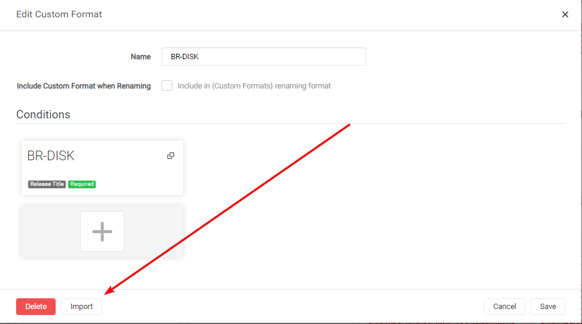

# How to update Custom Formats

Here I will show you various ways on how to update your Custom Formats with any changes from the guide or changes provided to you from other sources, without losing the scoring in your Quality Profile.

## Manual

!!! note ""
    Starting from v4.0.0.5653 Radarr now supports Import to update existing Custom Formats.

The manual way is almost the same as the Import Custom Format way.

In Radarr

`Settings` => `Custom Formats`

Open the Custom Format you want to update.

In the empty `Custom Format JSON` box (1) you just paste the `JSON` that you got from the [Custom Format Collection](/Radarr/Radarr-collection-of-custom-formats/){:target="_blank" rel="noopener noreferrer"} or provided to you from other sources followed by the `Import` button (2).

After selecting the `Import` button you will get a screen that has all the Custom Format variables filled in correctly, all you need to do now is click on the `Save` button and you're done.

!!! attention
    The Import to update existing Custom Formats replaces the existing Custom Format, so all manual changes you did to it will be lost :bangbang:

------

## Automatically

Use one of the 3rd Party Sync options that you can find [HERE](/Misc/trash-sync){:target="_blank" rel="noopener noreferrer"}.

{! include-markdown "../../includes/support.md" !}
<!-- --8<-- "includes/support.md" -->
