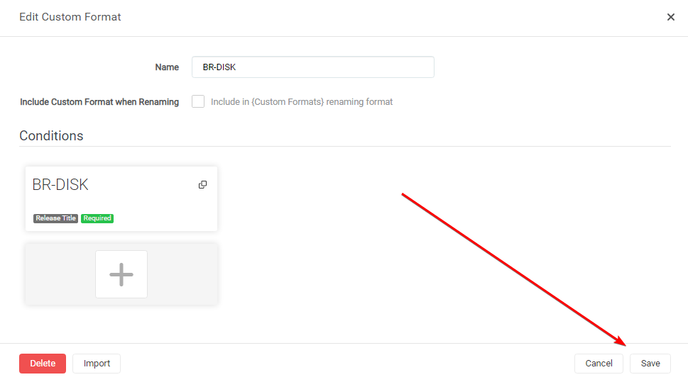

# How to update Custom Formats

Here I will show various ways how you can update your Custom Formats with any changes from the Guide or provided to you from other sources, without loosing the scoring in your Quality Profile.

## Manual

!!! note ""
    Starting from v4.0.0.5653 Radarr now supports Import to update existing Custom Formats.

The manual way is almost the same as the import Custom Format way.

In Radarr

`Settings` => `Custom Formats`

Open the custom Format you want to update.

In the empty `Custom Format JSON` box (1) you just paste the `JSON` what you got from the [Custom Format Collection](/Radarr/Radarr-collection-of-custom-formats/){:target="_blank" rel="noopener noreferrer"} or provided to you from other sources followed by the `Import` button (2).

What you see in the red box is a example txt that you don't and can't remove!

After selecting the `Import` button you will get a screen that has all the Custom Formats variables filled in correctly,
all you need to do now is click on the `Save` button and you're done.

!!! attention
    The Import to update existing Custom Formats replaces the existing Custom Format, so all manual changes you did to it will be lost :bangbang:

------

## Automatically

### Notifiarr

It's possible with [Notifiarr](https://notifiarr.com/profile.php) (Patron feature)

After setup it's fully automated and will check every X minutes for updates to the Custom Formats or Sonarr Release Profile and will update it to your Radarr or Sonarr (Multiple Client Support).

[Instructions](https://notifiarr.wiki/en/Website/Integrations/Trash)

------

### TRaSH Updater

It's possible with [trash-updater](https://github.com/rcdailey/trash-updater)

Automatically mirror TRaSH guides to your Sonarr/Radarr instance based on your setup scheduler.

[Instructions](https://github.com/rcdailey/trash-updater#getting-started)

--8<-- "includes/support.md"
