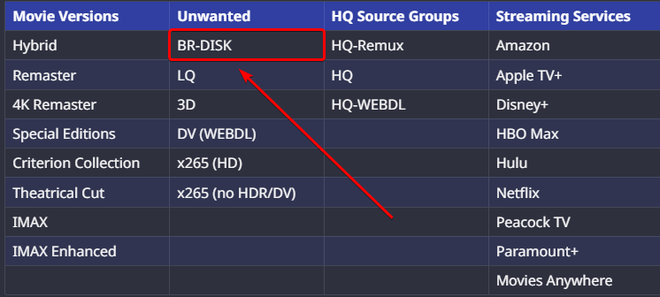
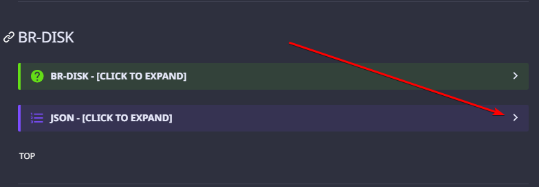
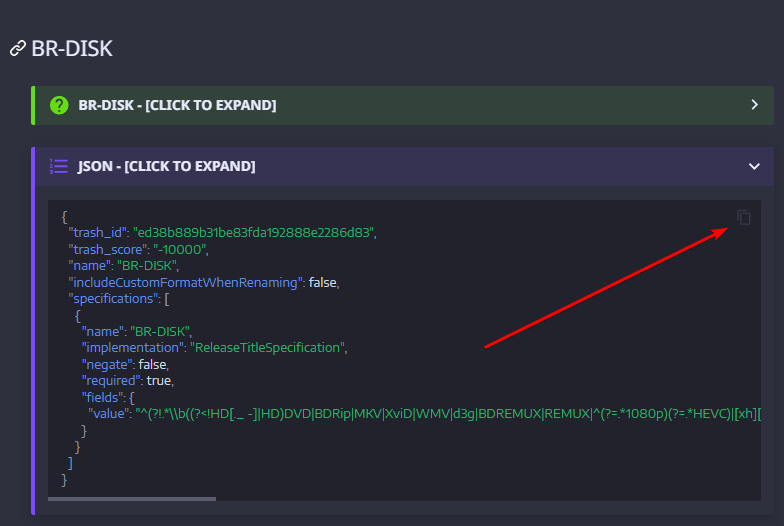
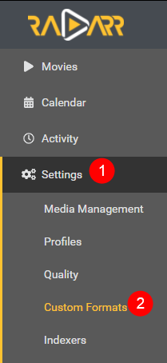
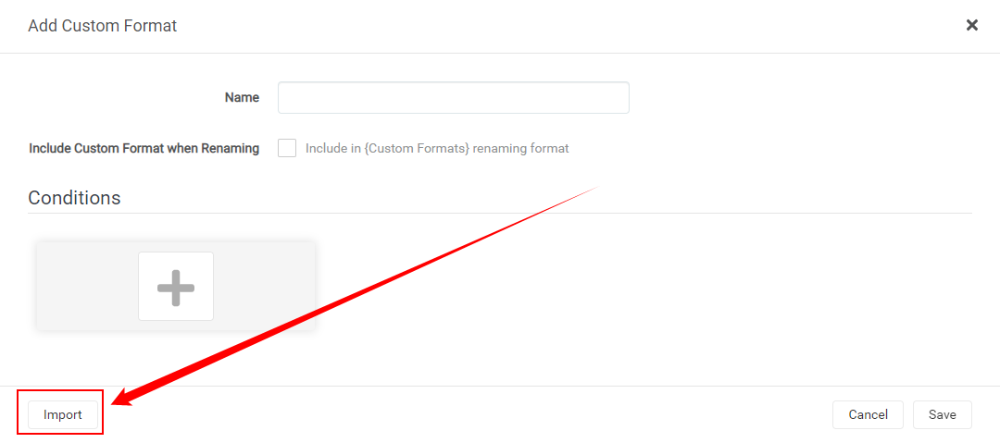
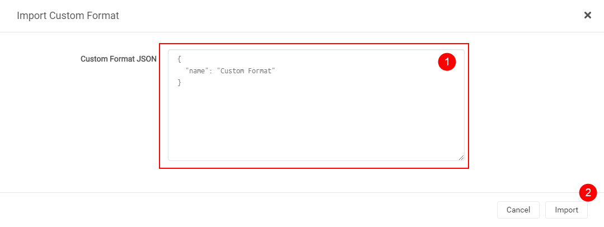
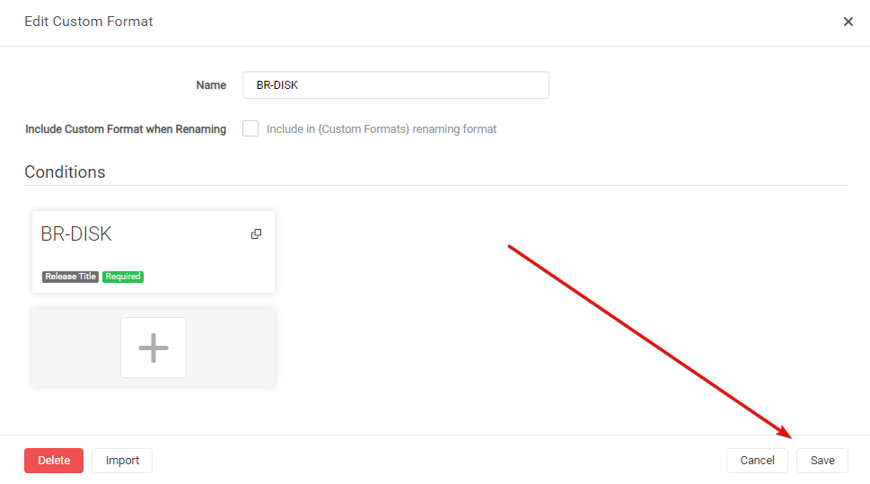

# How to import Custom Formats

Here I will try to explain how you can import Custom Formats for Radarr v3.

!!! attention
    Keep in mind Custom Formats are made to fine tune your Quality Profile

    **Quality Profile trumps Custom Formats**

    More info [HERE](/Radarr/Radarr-setup-custom-formats/){:target="_blank" rel="noopener noreferrer"}

## How to Copy/Paste the JSON from the site

In this example I will use the [BR-DISK](/Radarr/Radarr-collection-of-custom-formats/#br-disk){:target="_blank" rel="noopener noreferrer"} Custom Format, the one most people don't want to download anyway. And if you do, then you probably don't use Radarr or Plex, being both don't support it.

Visit the [Collection of Custom Formats](/Radarr/Radarr-collection-of-custom-formats/){:target="_blank" rel="noopener noreferrer"} and select [BR-DISK](/Radarr/Radarr-collection-of-custom-formats/#br-disk){:target="_blank" rel="noopener noreferrer"} from the table.

??? success "example - [CLICK TO EXPAND]"

    

Expand the JSON for BR-DISK

??? success "example - [CLICK TO EXPAND]"

    

Then click the copy icon in the top right corner

??? success "example - [CLICK TO EXPAND]"

    

## How to import a JSON Custom Format

In Radarr

`Settings` => `Custom Formats`

Then click on the  to add a new Custom Format.

Followed by the `Import` in the lower left.

Paste the `JSON` in the empty `Custom Format JSON` box (1) that you got from the [Custom Format Collection](/Radarr/Radarr-collection-of-custom-formats/){:target="_blank" rel="noopener noreferrer"} followed by the `Import` button (2).

After selecting the `Import` button you will get a screen that has all the Custom Formats variables filled in correctly,
all you need to do now is click on the `Save` button and you're done.

------

## Start adding other Custom Formats wisely

!!! tip

    Start adding more Custom Formats wisely, **Don't add all the available Custom Formats!!!**

    Personally, I would only add the Custom Formats that do what you actually prefer, especially in the beginning, including the [Releases you should avoid](/Radarr/Radarr-setup-custom-formats/#releases-you-should-avoid)

Check out the [How to setup Custom Formats](/Radarr/Radarr-setup-custom-formats/) where I will explain how to make the most use of custom formats and show some personal examples that I'm using. You can use these examples to get an idea on how to setup yours.

--8<-- "includes/support.md"
