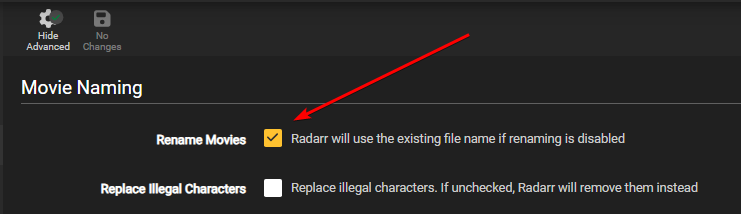
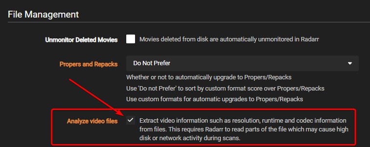

# Recommended Naming Scheme

--8<-- "includes/starr/renaming-description-faq.md"

---

## Getting Started

First, you need to set up Radarr to show all the naming options:

1. Go to **Settings** → **Media Management**
2. Enable **Show Advanced** at the top of the page

    

    After you click this button, you'll see all the advanced options like this:

    

3. Enable **Rename Movies** to see the movie renaming options.

    

4. Also make sure **Analyze video files** is enabled under **File Management**

    

## Standard Movie Format

--8<-- "includes/radarr/imdb-vs-tmdb.md"

=== "Standard"

    ```none
    {{ radarr['naming']['radarr-naming']['file']['standard'] }}
    ```

    <sub><sup>**Movie**: `The Movie Title (2010) {edition-Ultimate Extended Edition} [IMAX HYBRID][Bluray-1080p Proper][3D][DV HDR10][DTS 5.1][x264]-RlsGrp`</sup></sub>

=== "Plex"

    This naming scheme is designed to work with the [New Plex Agent](https://forums.plex.tv/t/new-plex-media-server-movie-scanner-and-agent-preview/593269/517){:target="\_blank" rel="noopener noreferrer"}.

    !!! danger "If you use the `{edition-{Edition Tags}}` part of the recommended file name, Plex will recognize the movie edition and add it to the Plex interface - for example, Director's Cut.<br><br>However, this means that if you have two copies of a movie with different editions in a single merged library - for example, a 1080p Director's Cut and a 2160p Theatrical Edition - these will appear as two separate items in Plex.<br><br>If you want a movie to appear only once per library when you keep more than one copy of a movie, replace: `{edition-{Edition Tags}}` with `{Edition Tags}`."

    === "Plex (IMDb)"

        --8<-- "includes/radarr/tmdb-imdb-info.md"

        ```bash
        {{ radarr['naming']['radarr-naming']['file']['plex-imdb'] }}
        ```

        <sub><sup>**Movie**: `The Movie Title (2010) {imdb-tt0066921} {edition-Ultimate Extended Edition} [IMAX HYBRID][Bluray-1080p Proper][3D][DV HDR10][DTS 5.1][x264]-RlsGrp`</sup></sub>

    === "Plex (TMDb)"

        ```none
        {{ radarr['naming']['radarr-naming']['file']['plex-tmdb'] }}
        ```

        <sub><sup>**Movie**: `The Movie Title (2010) {tmdb-345691} {edition-Ultimate Extended Edition} [IMAX HYBRID][Bluray-1080p Proper][3D][DV HDR10][DTS 5.1][x264]-RlsGrp`</sup></sub>

    === "Plex Anime (IMDb)"

        --8<-- "includes/radarr/tmdb-imdb-info.md"

        ```bash
        {{ radarr['naming']['radarr-naming']['file']['plex-anime-imdb'] }}
        ```

        <sub><sup>**Movie**: `The Movie Title (2010) {imdb-tt0066921} {edition-Ultimate Extended Edition} [Surround Sound x264][Bluray-1080p Proper][3D][DTS 5.1][DE][10bit][AVC]-RlsGrp`</sup></sub>

    === "Plex Anime (TMDb)"

        ```bash
        {{ radarr['naming']['radarr-naming']['file']['plex-anime-tmdb'] }}
        ```

        <sub><sup>**Movie**: `The Movie Title (2010) {tmdb-345691} {edition-Ultimate Extended Edition} [Surround Sound x264][Bluray-1080p Proper][3D][DTS 5.1][DE][10bit][AVC]-RlsGrp`</sup></sub>

=== "Emby"

    Source: [Emby Wiki/Docs](https://emby.media/support/articles/Movie-Naming.html#id-tags-in-folder--file-names){:target="\_blank" rel="noopener noreferrer"}

    === "Emby (IMDb)"

        --8<-- "includes/radarr/tmdb-imdb-info.md"

        ```bash
        {{ radarr['naming']['radarr-naming']['file']['emby-imdb'] }}
        ```

        <sub><sup>**Movie**: `The Movie Title (2010) [imdbid-tt0066921] - {edition-Ultimate Extended Edition} [IMAX HYBRID][Bluray-1080p Proper][3D][DV HDR10][DTS 5.1][x264]-RlsGrp`</sup></sub>

    === "Emby (TMDb)"

        ```bash
        {{ radarr['naming']['radarr-naming']['file']['emby-tmdb'] }}
        ```

        <sub><sup>**Movie**: `The Movie Title (2010) [tmdbid-tt0066921] - {edition-Ultimate Extended Edition} [IMAX HYBRID][Bluray-1080p Proper][3D][DV HDR10][DTS 5.1][x264]-RlsGrp`</sup></sub>

    === "Emby Anime (IMDb)"

        --8<-- "includes/radarr/tmdb-imdb-info.md"

        ```bash
        {{ radarr['naming']['radarr-naming']['file']['emby-anime-imdb'] }}
        ```

        <sub><sup>**Movie**: `The Movie Title (2010) [imdbid-tt0066921] - {edition-Ultimate Extended Edition} [Surround Sound x264][Bluray-1080p Proper][3D][DTS 5.1][DE][10bit][AVC]-RlsGrp`</sup></sub>

    === "Emby Anime (TMDb)"

        ```bash
        {{ radarr['naming']['radarr-naming']['file']['emby-anime-tmdb'] }}
        ```

        <sub><sup>**Movie**: `The Movie Title (2010) [tmdbid-tt0066921] - {edition-Ultimate Extended Edition} [Surround Sound x264][Bluray-1080p Proper][3D][DTS 5.1][DE][10bit][AVC]-RlsGrp`</sup></sub>

=== "Jellyfin"

    Source: [Jellyfin Wiki/Docs](https://jellyfin.org/docs/general/server/media/movies){:target="\_blank" rel="noopener noreferrer"}

    === "Jellyfin (IMDb)"

        ```bash
        {{ radarr['naming']['radarr-naming']['file']['jellyfin-imdb'] }}
        ```

        <sub><sup>**Movie**: `The Movie Title (2010) [imdbid-tt0106145] - {edition-Ultimate Extended Edition} [IMAX HYBRID][Bluray-1080p Proper][3D][DV HDR10][DTS 5.1][x264]-RlsGrp`</sup></sub>

    === "Jellyfin (TMDb)"

        ```bash
        {{ radarr['naming']['radarr-naming']['file']['jellyfin-tmdb'] }}
        ```

        <sub><sup>**Movie**: `The Movie Title (2010) [tmdbid-65567] - {edition-Ultimate Extended Edition} [IMAX HYBRID][Bluray-1080p Proper][3D][DV HDR10][DTS 5.1][x264]-RlsGrp`</sup></sub>

    === "Jellyfin Anime (IMDb)"

        ```bash
        {{ radarr['naming']['radarr-naming']['file']['jellyfin-anime-imdb'] }}
        ```

        <sub><sup>**Movie**: `The Movie Title (2010) [imdbid-tt0106145] - {edition-Ultimate Extended Edition} [Surround Sound x264][Bluray-1080p Proper][3D][DTS 5.1][DE][10bit][AVC]-RlsGrp`</sup></sub>

    === "Jellyfin Anime (TMDb)"

        ```bash
        {{ radarr['naming']['radarr-naming']['file']['jellyfin-anime-tmdb'] }}
        ```

        <sub><sup>**Movie**: `The Movie Title (2010) [tmdbid-65567] - {edition-Ultimate Extended Edition} [Surround Sound x264][Bluray-1080p Proper][3D][DTS 5.1][DE][10bit][AVC]-RlsGrp`</sup></sub>

---

## Alternative Movie Naming Options

These are other standard movie format naming schemes that work well. Use these if you don't like the brackets used in the main recommendations.

### Original Title

Another option is to use `{Original Title}` instead of the recommended naming scheme above. `{Original Title}` uses the title of the release, which includes all the information from the release itself. The benefit of this naming scheme is that it prevents download loops that can happen during import when there's a mismatch between the release title and the file contents (for example, if the release title says DTS-ES but the contents are actually DTS). The downside is that you have less control over how the files are named.

If you use this alternate naming scheme, we suggest using `{Original Title}` instead of `{Original Filename}`.

Why?

The filename can be obscured or unclear, whereas the release naming is clear, especially when you use Usenet.

`{Original Title}` => `The.Movie.Title.2010.REMASTERED.1080p.BluRay.x264-RlsGrp`

`{Original Filename}` => `rlsgrp-karatekid-1080p` or `lchd-tkk1080p` or `t1i0p3s7i8yuti`

---

### P2P/Scene Naming

Use P2P/Scene naming if you don't like spaces and brackets in the filename. It's the closest to the P2P/scene naming scheme, except it uses the exact audio and HDR formats from the media file, where the original release or filename might be unclear.

```bash
{{ radarr['naming']['radarr-naming']['file']['p2p-scene'] }}
```

<sub><sup>**Movie**: `The.Movie.Title.2010.Ultimate.Extended.Edition.3D.Hybrid.Remux-2160p.TrueHD.Atmos.7.1.DV.HDR10Plus.HEVC-RlsGrp`</sup></sub>

<sub><sup>**Movie**: `The.Movie.Title.2010.MA.WEBDL-2160p.TrueHD.Atmos.7.1.DV.HDR10Plus.h265-RlsGrp`</sup></sub>

---

## Movie Folder Format

--8<-- "includes/radarr/imdb-vs-tmdb.md"

!!! warning "Please note that folder names are created in the database when the movie is added to Radarr, and the ID may be missing or wrong at that time. This could result in your folder having a blank ID. :bangbang:<br><br>If you add the ID to the filename instead, the IMDb/TMDb ID will be pulled fresh for any download or upgrade."

=== "Standard Folder"

    The minimum needed and recommended format

    ```bash
    {{ radarr['naming']['radarr-naming']['folder']['default'] }}
    ```

    <sub><sup>**Example**: `The Movie Title (2010)`</sup></sub>

=== "Optional Plex"

    --8<-- "includes/radarr/radarr-folder-name-after-year-info.md"

    === "Plex Folder IMDb"

        --8<-- "includes/radarr/tmdb-imdb-info.md"

        ```bash
        {{ radarr['naming']['radarr-naming']['folder']['plex-imdb'] }}
        ```

        <sub><sup>**Example**: `The Movie Title (2010) {imdb-tt1520211}`</sup></sub>

    === "Plex Folder TMDb"

        ```bash
        {{ radarr['naming']['radarr-naming']['folder']['plex-tmdb'] }}
        ```

        <sub><sup>**Example**: `The Movie Title (2010) {tmdb-1520211}`</sup></sub>

=== "Optional Emby"

    --8<-- "includes/radarr/radarr-folder-name-after-year-info.md"

    === "Emby Folder IMDb"

        --8<-- "includes/radarr/tmdb-imdb-info.md"

        ```bash
        {{ radarr['naming']['radarr-naming']['folder']['emby-imdb'] }}
        ```

        <sub><sup>**Example**: `The Movie Title (2010) [imdb-tt1520211]`</sup></sub>

    === "Emby Folder TMDb"

        ```bash
        {{ radarr['naming']['radarr-naming']['folder']['emby-tmdb'] }}
        ```

        <sub><sup>**Example**: `The Movie Title (2010) [tmdb-1520211]`</sup></sub>

=== "Optional Jellyfin"

    --8<-- "includes/radarr/radarr-folder-name-after-year-info.md"

    === "Jellyfin Folder IMDb"

        --8<-- "includes/radarr/tmdb-imdb-info.md"

        ```bash
        {{ radarr['naming']['radarr-naming']['folder']['jellyfin-imdb'] }}
        ```

        <sub><sup>**Example**: `The Movie Title (2010) [imdbid-tt1520211]`</sup></sub>

    === "Jellyfin Folder TMDb"

        ```bash
        {{ radarr['naming']['radarr-naming']['folder']['jellyfin-tmdb'] }}
        ```

        <sub><sup>**Example**: `The Movie Title (2010) [tmdbid-1520211]`</sup></sub>

--8<-- "includes/support.md"
