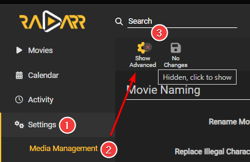
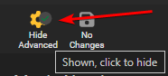

# Recommended naming scheme

On the [Radarr Discord](https://radarr.video/discord){:target="_blank" rel="noopener noreferrer"} people often ask, "What's the recommended/best way to
name your files?" First off, it's personal preference, but it's often recommended to add non-recoverable info.

Why?

If, for what ever reason, you ever need to do a re-install or re-import in
the Starr Apps or Plex/Emby/Jellyfin it's nice to have all that info in the filename so
it gets imported correctly and isn't incorrectly matched as HDTV or WEB-DL etc.

The Tokens not available in the release won't be used/shown.

------

## Preparation

Go to `Settings` => `Media Management` and make sure that `Show Advanced` at the top is enabled.



Once you clicked on the button it should look like this and you should see all the advanced options.



## Standard Movie Format

This naming scheme is made to be compatible with the [New Plex Agent](https://forums.plex.tv/t/new-plex-media-server-movie-scanner-and-agent-preview/593269/517){:target="_blank" rel="noopener noreferrer"} that now supports IMDb and TMDb IDs in filenames, if you don't need it or want it just remove `{imdb-{ImdbId}}`

!!! warning "Starting from v4.2.2.6489, Radarr now supports Plex Multiple Edition tags in naming."

    If you're using a lower version or don't need it replace:

    `{edition-{Edition Tags}}` with `{Edition Tags}`

    !!! danger "Only use `{edition-{Edition Tags}}` if you are prepared to have movies separated by edition<br>when using a merged Plex library - e.g., you keep both 1080p and 2160p versions of one movie.<br><br>For example if you have the `Directors Cut` and the `Extended Cut` for one movie, those will show up as two separate movies in your library.<br><br>Note that not using `{edition-{Edition Tags}}` will prevent Plex from recognizing the edition."

### Plex

```bash
{{ radarr['naming']['radarr-naming']['file']['default'] }}
```

??? abstract "RESULTS: - [Click to show/hide]"

    `The Movie Title (2010) {imdb-tt0066921} {edition-Ultimate Extended Edition} [IMAX HYBRID][Bluray-1080p Proper][3D][DV HDR10][DTS 5.1][x264]-EVOLVE`

#### Plex Anime

```bash
{{ radarr['naming']['radarr-naming']['file']['anime'] }}
```

??? abstract "RESULTS: - [Click to show/hide]"

    `The Movie Title (2010) {imdb-tt0066921} {edition-Ultimate Extended Edition} [Surround Sound x264][Bluray-1080p Proper][3D][DTS 5.1][DE][10bit][AVC]-EVOLVE`

### Emby

```bash
{{ radarr['naming']['radarr-naming']['file']['emby'] }}
```

??? abstract "RESULTS: - [Click to show/hide]"

    `The Movie Title (2010) [imdbid-tt0066921] - {edition-Ultimate Extended Edition} [IMAX HYBRID][Bluray-1080p Proper][3D][DV HDR10][DTS 5.1][x264]-EVOLVE`

#### Emby Anime

```bash
{{ radarr['naming']['radarr-naming']['file']['anime-emby'] }}
```

??? abstract "RESULTS: - [Click to show/hide]"

    `The Movie Title (2010) [imdbid-tt0066921] - {edition-Ultimate Extended Edition} [Surround Sound x264][Bluray-1080p Proper][3D][DTS 5.1][DE][10bit][AVC]-EVOLVE`

### Jellyfin

```bash
{{ radarr['naming']['radarr-naming']['file']['jellyfin'] }}
```

??? abstract "RESULTS: - [Click to show/hide]"

    `The Movie Title (2010) [imdbid-tt0066921] - {edition-Ultimate Extended Edition} [IMAX HYBRID][Bluray-1080p Proper][3D][DV HDR10][DTS 5.1][x264]-EVOLVE`

#### Jellyfin Anime

```bash
{{ radarr['naming']['radarr-naming']['file']['anime-jellyfin'] }}
```

??? abstract "RESULTS: - [Click to show/hide]"

    `The Movie Title (2010) [imdbid-tt0066921] - {edition-Ultimate Extended Edition} [Surround Sound x264][Bluray-1080p Proper][3D][DTS 5.1][DE][10bit][AVC]-EVOLVE`

------

## Original Title vs  Original Filename

### Original Title

Another option is to use `{Original Title}` rather than the recommended naming scheme outlined above. `{Original Title}` will use the title of the release which will contain all of the information included in the release itself. The benefit of this naming scheme is to prevent download loops which can occur on import when there is a discrepancy in the release title compared to the contents of the file itself (for example, if the release title says DTS-ES but the contents are actually DTS). The downside is less flexibility with how the files are named.

If using this alternate naming scheme I suggest using `{Original Title}` over `{Original Filename}`

Why?

The filename can be Obscured where the Release naming isn't, especially when you use Usenet.

`{Original Title}` => `The.Movie.Title.2010.REMASTERED.1080p.BluRay.x264-GROUP`

`{Original Filename}` => `group-karatekid-1080p` or `lchd-tkk1080p` or `t1i0p3s7i8yuti`

------

## Movie Folder Format

!!! danger ""

    **Please note that folder names are created (in the database) whenever the movie is added to Radarr, and it may be missing or incorrect at that time and your folder would have a blank ID!!!**

    If you instead add it in the filename, the IMDb ID will be freshly pulled for any download or upgrade.

    Another potential negative of using it in the folder is that folder renames are complex, lengthy, and potentially destructive in Radarr compared to file renames.

### Minimal needed and recommended

```bash
{{ radarr['naming']['radarr-naming']['folder']['default'] }}
```

<small>RESULT:</small> `The Movie Title (2010)`

------

!!! note
    Keep in mind adding anything more after the release year could give issues during a fresh import in to Radarr, but it helps for movies that have the same release name and year.

    **Radarr supports IMDb ID and TMDb ID in the folder name.**

    !!! quote "Quote from a developer"

        TMDb is usually better as it guarantees a match, IMDb only gets matched if the TMDb entry has the correct IMDb ID association. We don't actually talk to IMDb.

#### Optional Movies Folder Format

This naming scheme is made to be compatible with the new [Plex TV Series Scanner](https://forums.plex.tv/t/beta-new-plex-tv-series-scanner/696242){:target="_blank" rel="noopener noreferrer"} that now support IMDB and TVDB IDs in file names.

##### Optional Plex

```bash
{{ radarr['naming']['radarr-naming']['folder']['plex'] }}
```

<small>RESULT:</small> `The Movie Title (2010) {imdb-tt1520211}`

##### Optional Emby

```bash
{{ radarr['naming']['radarr-naming']['folder']['emby'] }}
```

<small>RESULT:</small> `The Movie Title (2010)`

##### Optional Jellyfin

```bash
{{ radarr['naming']['radarr-naming']['folder']['jellyfin'] }}
```

<small>RESULT:</small> `The Movie Title (2010) [imdbid-tt1520211]`

!!! tip
    IMDb IDs are going to be very accurate and rarely change, TVDB/TMDB IDs, on the other hand, do change or are removed more frequently.

------

Thanks:

A big Thanks to [fryfrog](https://github.com/fryfrog) and [rg9400](https://github.com/rg9400) for the suggestions.

--8<-- "includes/support.md"
