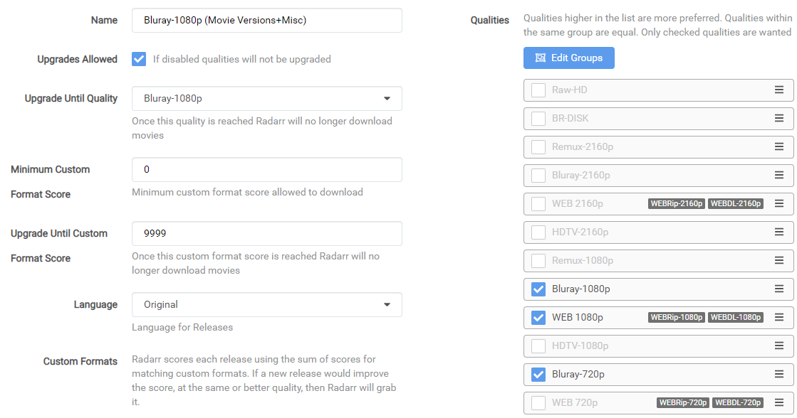
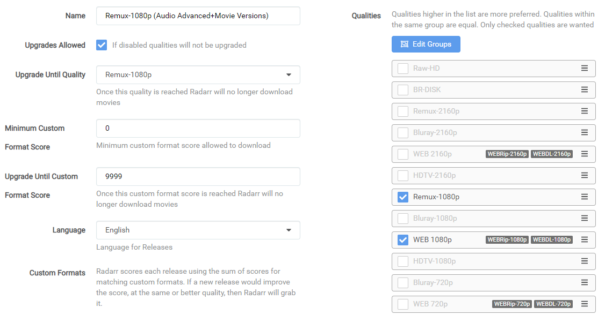
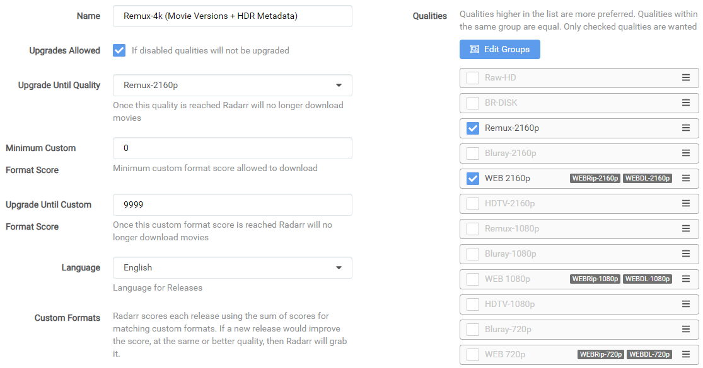

# How to setup Quality Profiles

*aka How to setup Custom Formats*  
So what's the best way to setup the Custom Formats and which ones to use with which scores to setup your quality profiles?

There isn't a best setup, it depends on your setup (hardware devices) and your own personal preferences.

Some prefer high quality audio (HD Audio), others high quality video. Many prefer both.

Here I will try to explain how to make the most use of Custom Formats to help you to setup your quality profiles for your personal needs.

I created a [flowchart](#which-quality-profile-should-you-choose) to make your decision/choices easier.

------

## Basics

After you've added the Custom Formats, as explained in [How to import Custom Formats](/Radarr/Radarr-import-custom-formats/){:target="_blank" rel="noopener noreferrer"}.
You will need to set it up in the quality Profile you want to use/prefer to make use of the Custom Formats.

`Settings` => `Profiles`

!!! info "Radarr Custom Formats can be set per profile and isn't global"
Select the profile that you want to use/prefer.

1. Profile name.
1. Allow upgrades. Radarr will stop upgrading quality once (3) is met.
1. Upgrade until the selected quality.
1. The `Minimum Custom Format Score` allowed to download. [More Info](#minimum-custom-format-score)
1. Keep upgrading Custom Format until this score is reached. (setting this to `0` means no upgrades will happen based on Custom Formats)
1. Your preferred language profile for your releases. (Original is recommended)

At the bottom in your chosen profile you will see the added Custom Formats where you can start setting up the scores.

??? check "Screenshot example - [CLICK TO EXPAND]"
    

    !!! attention
        These screenshots are just examples to show you how it should look and where you need to place the data that you need to add, they aren't always a 100% reflection of the actual data and not always 100% up to date with the actual data you need to add.

        - Always follow the data described in the guide.
        - If you got any questions or aren't sure just click the chat badge to join the Discord Channel where you can ask your questions directly.

!!! info "Keep in mind Custom Formats are made to fine tune your Quality Profile. Generally, quality trumps all"

    Custom formats are controlled by Quality Profiles.

    - The Upgrade Until score prevents upgrading once a release with this desired score has been downloaded.
    - A score of 0 results in the custom format being informational only.
    - The Minimum score requires releases to reach this threshold otherwise they will be rejected.
    - Custom formats that match with undesirable attributes should be given a negative score to lower their appeal.
    - Outright rejections should be given a negative score low enough that even if all of the other formats with positive scores were added, the score would still fall below the minimum.

------

{! include-markdown "../../includes/merge-quality/radarr-current-logic.md" !}

------

## Which Quality Profile should you choose

??? summary "Which Quality Profile should you choose - [CLICK TO EXPAND]"

    

    If you're unsure or have questions do not hesitate to ask for help on Discord

    [{ .off-glb }](https://trash-guides.info/discord){:target="_blank" rel="noopener noreferrer"}

------

### HD Bluray Tier + WEB Tier

If you prefer HQ HD Encodes (Bluray-720p/1080p)

{! include-markdown "../../includes/cf/radarr-suggest-attention.md" !}

{! include-markdown "../../includes/cf/radarr-movie-versions.md" !}

{! include-markdown "../../includes/cf/radarr-cf-hd-bluray-web-scoring.md" !}

{! include-markdown "../../includes/cf/radarr-misc.md" !}

{! include-markdown "../../includes/cf/radarr-unwanted.md" !}

{! include-markdown "../../includes/cf/radarr-streaming-services.md" !}

I decided not to add `Audio Advanced` Custom Formats to the encodes profile, You will hardly find HD audio with HD Bluray Encodes. With HD Bluray Encodes I personally suggest to go for quality. If you also want HD audio formats I would suggest to go for the Remuxes or UHD Encodes.

Use the following main settings in your profile.

!!! attention "Make sure you don't check the BR-DISK."

The reason why I didn't select the WEB-DL 720p is because you will hardly find any releases that aren't done as 1080p WEB-DL.

??? example "The following workflow logic will be applied:"

    - It will download WEB-DL 1080p for the streaming movies you see more often lately.
    - It will upgrade till Bluray-1080p when available.
    - The downloaded media will be upgraded to any of the added Custom Formats until a score of 10000.

    So why such a ridiculously high `Upgrade Until Custom` and not a score of `100`?

    Because I'm too lazy to calculate the maximum for every Quality Profile I use, and I want it to upgrade to the highest possible score anyway.

------

### UHD Bluray Tier + WEB Tier

If you prefer HQ UHD Encodes (Bluray-2160p)

{! include-markdown "../../includes/cf/radarr-suggest-attention.md" !}

{! include-markdown "../../includes/cf/radarr-audio.md" !}

{! include-markdown "../../includes/cf/radarr-hdr-formats.md" !}

{! include-markdown "../../includes/cf/radarr-movie-versions.md" !}

{! include-markdown "../../includes/cf/radarr-cf-uhd-bluray-web-scoring.md" !}

{! include-markdown "../../includes/cf/radarr-misc.md" !}

{! include-markdown "../../includes/sqp/uhd-radarr-unwanted.md" !}

{! include-markdown "../../includes/cf/radarr-streaming-services.md" !}

Use the following main settings in your profile.

!!! attention "Make sure you don't check the BR-DISK."

??? summary "Workflow Logic - [CLICK TO EXPAND]"

    **Depending what's released first and available the following Workflow Logic will be used:**

    - When a HD WEBDL is released it will download the HD WEB-DL. (streaming services)
    - When the HQ Encode is released it will upgrade to the HQ Encode.
    - The downloaded media will be upgraded to any of the added Custom Formats until a score of 10000.

    So why such a ridiculously high `Upgrade Until Custom` and not a score of `100`?

    Because I'm too lazy to calculate the maximum for every Quality Profile I use, and I want it to upgrade to the highest possible score anyway.

------

### Remux Tier + WEB Tier 1080p

If you prefer 1080p Remuxes (Remux-1080p)

{! include-markdown "../../includes/cf/radarr-suggest-attention.md" !}

{! include-markdown "../../includes/cf/radarr-audio.md" !}

{! include-markdown "../../includes/cf/radarr-movie-versions.md" !}

{! include-markdown "../../includes/cf/radarr-cf-remux-web-scoring.md" !}

{! include-markdown "../../includes/cf/radarr-misc.md" !}

{! include-markdown "../../includes/cf/radarr-unwanted.md" !}

{! include-markdown "../../includes/cf/radarr-streaming-services.md" !}

Use the following main settings in your profile.

!!! attention "Make sure you don't check the BR-DISK."

The reason why I didn't select the WEB-DL 720p is because you will hardly find any releases that aren't done as 1080p WEB-DL.

??? example "The following workflow logic will be applied:"

    - It will download WEB-DL 1080p for the streaming movies you see more often lately.
    - It will upgrade till Remux-1080p when available.
    - The downloaded media will be upgraded to any of the added Custom Formats until a score of 9999.

    So why such a ridiculously high `Upgrade Until Custom` and not a score of `500`?

    Because I'm too lazy to calculate the maximum for every Quality Profile I use, and I want it to upgrade to the highest possible score anyway.

------

### Remux Tier + WEB Tier 2160p

If you prefer 2160p Remuxes (Remux-2160p)

{! include-markdown "../../includes/cf/radarr-suggest-attention.md" !}

{! include-markdown "../../includes/cf/radarr-audio.md" !}

{! include-markdown "../../includes/cf/radarr-hdr-formats.md" !}

{! include-markdown "../../includes/cf/radarr-movie-versions.md" !}

{! include-markdown "../../includes/cf/radarr-cf-remux-web-scoring.md" !}

{! include-markdown "../../includes/cf/radarr-misc.md" !}

{! include-markdown "../../includes/sqp/uhd-radarr-unwanted.md" !}

{! include-markdown "../../includes/cf/radarr-streaming-services.md" !}

Use the following main settings in your profile.

!!! attention "Make sure you don't check the BR-DISK."

??? example "The following workflow logic will be applied:"

    - It will download WEB-DL 2160p for the streaming movies you see more often lately.
    - It will upgrade to Remux-2160p when available.
    - The downloaded media will be upgraded to any of the added Custom Formats until a score of 9999.

    So why such a ridiculously high `Upgrade Until Custom` and not a score of `500`?

    Because I'm too lazy to calculate the maximum for every Quality Profile I use, and I want it to upgrade to the highest possible score anyway.

------

### All Advanced Audio

- You have a audio setup that supports all HD Audio (TrueHD, DTS-X, DTS-HD, etc).
- You have a media player (Device) that can passthrough HD audio.
- You don't have a AppleTV (Being it can't passthrough untouched HD audio).

In this example I have lossy Atmos over lossless DTS because the object metadata (Atmos) matters more to me over lossy vs lossless.

{! include-markdown "../../includes/cf/radarr-suggest-attention.md" !}

{! include-markdown "../../includes/cf/radarr-audio.md" !}

------

### All HDR Formats

- You have a setup that supports Dolby Vision.
- You share your media library with other family members that also have have Dolby Vision compatible devices.

{! include-markdown "../../includes/cf/radarr-suggest-attention.md" !}

{! include-markdown "../../includes/cf/radarr-all-hdr-formats.md" !}

------

### All HDR Formats + DV (WEBDL)

- Not all devices in your chain support Dolby Vision.
- You share your media library with other family members that don't have Dolby Vision compatible devices.

{! include-markdown "../../includes/cf/radarr-suggest-attention.md" !}

{! include-markdown "../../includes/cf/radarr-all-hdr-formats-dv-web.md" !}

------

### All HDR Formats + DV (WEBDL) + HDR10+ Boost

- Not all devices in your chain support Dolby Vision.
- You share your media library with other family members that don't have Dolby Vision compatible devices.
- You have a (Samsung) TV that supports HDR10+.

{! include-markdown "../../includes/cf/radarr-suggest-attention.md" !}

{! include-markdown "../../includes/cf/radarr-all-hdr-formats-dv-web-hdr10plus-boost.md" !}

------

## FAQ & INFO

### Proper and Repacks

??? tip "Proper and Repacks - [CLICK TO EXPAND]"

    I also suggest to change the Propers and Repacks settings in Radarr

    `Media Management` => `File Management` to `Do Not Prefer` and use the [Repack/Proper](/Radarr/Radarr-collection-of-custom-formats/#repackproper) Custom Format.

    

    This way you make sure the Custom Format preferences will be used instead.

### Custom Formats to avoid certain releases

??? FAQ "How to use a Custom Format to avoid certain releases? - [CLICK TO EXPAND]"

    For Custom Formats you really want to avoid, set it to something really low like `-10000` and not something like `-10`.
    Being when you add a Custom Format what you prefer and you set it to something like `+10` it could happen that for example the `BR-DISK` will be downloaded (-10)+(+10)=0 and if your `Minimum Custom Format Score` is set at `0`.

### Releases you should avoid

This is a must have for every Quality Profile you use in my opinion. All these Custom Formats make sure you don't get Low Quality Releases.

{! include-markdown "../../includes/cf/radarr-unwanted.md" !}

### Custom Formats with a score of 0

??? FAQ "What do Custom Formats with a score of 0 do? - [CLICK TO EXPAND]"

    All Custom Formats with a score of 0 are pure informational and don't do anything.

### Minimum Custom Format Score

??? info "Minimum Custom Format Score - [CLICK TO EXPAND]"

    Some people suggest not to use negative scores for your Custom Formats and set this option to a higher score then 0.

    The reason why I don't prefer/use this is because you could limit yourself when some new groups or whatever will be released.

    Also it makes it much more clear what you prefer and what you want to avoid.

### Audio Channels

??? info "Audio Channels - [CLICK TO EXPAND]"

    Personally I wouldn't add the audio channels Custom Formats being you could limit yourself in the amount of releases you're able to get. Only use this if you got specific reasons that you need them.

    Using it with any kind of Remuxes Quality Profile is useless in my opinion being that 99% of all remuxes are multi audio anyway. You can get better scores using the `Audio Advanced` Custom Formats.

### Avoid using the x264/x265 Custom Format

??? tip "Avoid using the x264/x265 Custom Format - [CLICK TO EXPAND]"

    Avoid using the x264/x265 Custom Format with a score if possible, it's smarter to use the [{{ radarr['cf']['x265-hd']['name'] }}](/Radarr/Radarr-collection-of-custom-formats/#x265-hd){:target="_blank" rel="noopener noreferrer"} Custom Format.

    Something like 95% of video files are x264 and have much better direct play support. If you have more than a of couple users, you will notice much more transcoding.

    Use x265 only for 4k releases and the [{{ radarr['cf']['x265-hd']['name'] }}](/Radarr/Radarr-collection-of-custom-formats/#x265-hd){:target="_blank" rel="noopener noreferrer"} makes sure you still get the x265 releases.

## Thanks

A big Thanks to [rg9400](https://github.com/rg9400) for providing me with info needed to create the Tips section.

--8<-- "includes/support.md"
