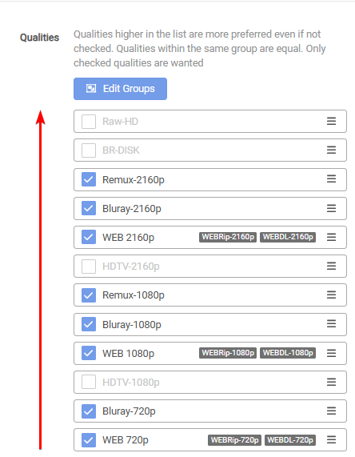

# How does the current rank logic work

Breakdown how the current rank logic works aka How are possible downloads compared.

Here we will try to explain  as easy as possible how Radarr/Sonarr decides what to choose to download or even upgrade from your file on disk.

## Radarr

Here, you will see the current logic to understand how the possible downloads are compared.

{! include-markdown "../../../includes/merge-quality/radarr-current-logic.md" !}

### 1. Quality (Radarr)

!!! info "Generally Quality Trumps All.  If you wish to have Quality not be the main priority but Custom Formats - Then you can merge your qualities together. See [How to Merge Quality](/Radarr/Tips/Merge-quality/){:target="\_blank" rel="noopener noreferrer"}."

Under Quality we mean everything you see on the right side of your quality profiles

`Settings` => `Profiles` => `Quality Profiles` => `Choose one of your Quality Profiles`

And you will see on the right side your selected Qualities

Example:

- Remux-2160p
- Bluray-2160p
- WEB-2160p
- Remux-1080p
- Bluray-1080p
- WEB-1080p
- Bluray-720p
- WEB-720p
- etc.

In the following screenshot, you will see a default order of random selected Quality Sources where in this example the highest Quality would be a `Remux-2160p` and the lowest quality a `WEB-720p`. As always, the upgrade order would be from bottom to top. (*direction of the arrow*)

!!! example

    `Movie.2024.2160p.WEB-DL.DDP5.1.Atmos.DV.HDR.H.265-RlsGrp`

### 2. Custom Formats (Radarr)

!!! warning "If no Custom Formats are added then this step will be skipped, and there will be no upgrades in the same quality. Custom Formats exist to fine tune the results of the same Quality. example: If you prefer certain HDR Formats, Audio Formats, codecs, etc"

Let’s say you have three custom formats, A, B and C. Scored as:

- A: 10
- B: 20
- C: 30

Then, let’s say during a search you get three releases that have the identical quality, X, Y and Z. They happen to match your custom formats as follows:

- X matches A
- Y matches B and C
- Z matches A and C

Total custom format scores would therefore be:

- X: 10 (matches A)
- Y: 50 (matches B and C)
- Z: 40 (matches A and C)

In the example above, Y would be chosen as it has the highest cumulative custom format score.

### 3. Protocol (Radarr)

(*as configured in the relevant Delay Profile*)

`Settings` => `Profiles` => `Delay Profile` => `Preferred Protocol`

The following Preferred Protocols are available

- Prefer Usenet (Prefer Usenet over Torrents)
- Prefer Torrent (Prefer Torrents over Usenet)
- Only Usenet
- Only Torrent

### 4. Indexer Priority (Radarr)

Priority of this indexer to prefer one indexer over another in release tiebreaker scenarios. 1 is highest priority and 50 is lowest priority.

### 5. Indexer Flags (Radarr)

### 6. Seeds/Peers (Radarr)

 (If Torrent)

### 7. Age (Radarr)

(If Usenet)

### 8. Size (Radarr)

## Sonarr

Here, you will see the current logic to understand how the possible downloads are compared.

{! include-markdown "../../../includes/merge-quality/sonarr-current-logic.md" !}

### 1. Quality (Sonarr)

Quality Trumps All :bangbang:

Under Quality we mean

- Remux-2160p
- Bluray-2160p
- WEB-2160p
- Remux-1080p
- Bluray-1080p
- WEB-1080p
- Bluray-720p
- WEB-720p

In the following screenshot, you will see a default order of your Quality Sources where the highest Quality would be a `Remux-2160p` and the lowest quality a `WEB-720p`. As always, the upgrade order would be from bottom to top. (*direction of the arrow*)

### 2. Custom Formats (Sonarr)

Let’s say you have three custom formats, A, B and C. Scored as:

- A: 10
- B: 20
- C: 30

Then, let’s say during a search you get three releases that have the identical quality, X, Y and Z. They happen to match your custom formats as follows:

- X matches A
- Y matches B and C
- Z matches A and C

Total custom format scores would therefore be:

- X: 10 (matches A)
- Y: 50 (matches B and C)
- Z: 40 (matches A and C)

In the example above, Y would be chosen as it has the highest cumulative custom format score.

### 3. Protocol (Sonarr)

(as configured in the relevant Delay Profile)

### 4. Episode Count

### 5. Episode Number

### 6. Indexer Priority (Sonarr)

Priority of this indexer to prefer one indexer over another in release tiebreaker scenarios. 1 is highest priority and 50 is lowest priority.

### 7. Seeds/Peers (Sonarr)

(If Torrent)

### 8. Age (Sonarr)

(If Usenet)

### 9. Size (Sonarr)
