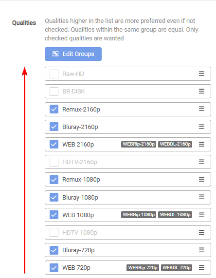
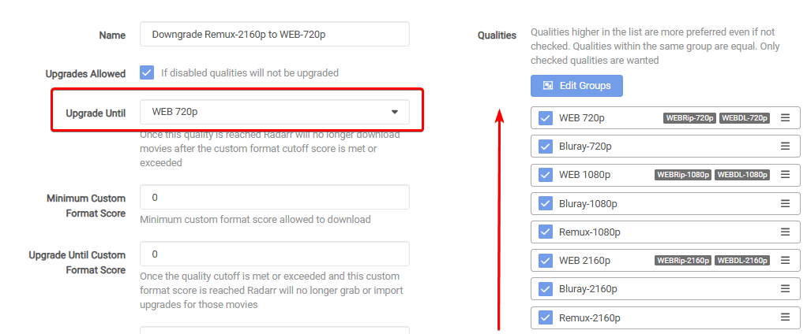
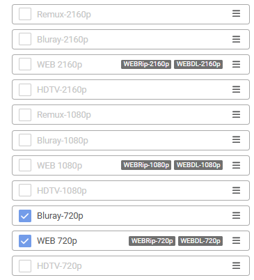
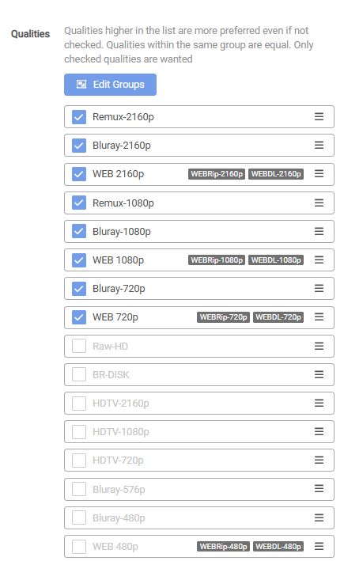

# How to Order Quality Sources

The current logic for comparing downloads is **Quality Trumps All**, where the qualities are set from lowest (*bottom*) to highest (*top*) by default.

In some cases, it might be preferred to have the option to create a Quality Profile to downgrade your existing library/releases.

Examples:

- Downgrade a `Remux-2160p` to a `Bluray-2160p`, `WEB-2160p`, `Remux-1080p`, `Bluray-1080p`, `WEB-1080p` or even to a 720p variant etc.
- Downgrade a `Bluray-1080p` to a `WEB-1080p` or even to a 720p variant etc.
- etc.

To accomplish this, you must change the order of the Quality Sources in your Quality Profile.

!!! warning "Qualities higher in the list are more preferred even if not checked. Qualities within the same group are equal. Only checked qualities are wanted."

## Current Logic

Here, you will see the current logic to understand how the possible downloads are compared.

{! include-markdown "../../../includes/merge-quality/radarr-current-logic.md" !}

{! include-markdown "../../../includes/merge-quality/sonarr-current-logic.md" !}

## Change the Order of the Quality Sources

We will use Radarr for these examples, but it works the same way as Sonarr.

To change the order of the Quality Sources, go to `Settings` => `Profiles`.

### Default Order

In the following screenshot, you will see a default order of your Quality Sources where the highest Quality would be a `Remux-2160p` and the lowest quality a `WEB-720p`. As always, the upgrade order would be from bottom to top. (*direction of the arrow*)

- Remux-2160p
- Bluray-2160p
- WEB-2160p
- Remux-1080p
- Bluray-1080p
- WEB-1080p
- Bluray-720p
- WEB-720p

### Downgrade Order

Now, we will show a Quality Profile using the so-called reverse order of the Quality Sources, which we can use to downgrade from high Quality to lower Quality.

All we need to do is to change the order of the Quality Sources in your Quality Profile.

In the following screenshot, you will see a downgrade order of your Quality Sources where the highest Quality would be a `WEB-720p` and the lowest quality a `Remux-2160p`. As always, the upgrade order would be from bottom to top. (*direction of the arrow*)

- WEB-720p
- Bluray-720p
- WEB-1080p
- Bluray-1080p
- Remux-1080p
- WEB-2160p
- Bluray-2160p
- Remux-2160p

Don't forget to change the `Upgrade Until` to your preferred download Quality Source.

## Tips and Common Issues

### Order matters even if not checked

!!! warning "Qualities higher in the list are more preferred even if not checked. Qualities within the same group are equal. Only checked qualities are wanted."

The order listed in the profile matters even if the Quality is not checked. For example, if you have a 2160p version but want the 720p version, Radarr will reject all 720p results because 1080p and 2160p are listed as higher than 720p even though 1080p was not checked.

### Move your preferred Quality to the top

Qualities at the top of the list will appear first in manual searches, so it's recommended that the selected Quality be moved to the top of the list.

---

[Source: Wiki Servarr - Radarr](https://wiki.servarr.com/radarr/settings#quality-profiles){:target="\_blank" rel="noopener noreferrer"}.
[Source: Wiki Servarr - Sonarr](https://wiki.servarr.com/sonarr/settings#quality-profiles){:target="\_blank" rel="noopener noreferrer"}.

--8<-- "includes/support.md"
