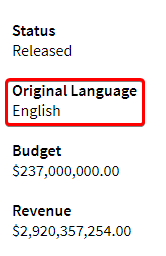
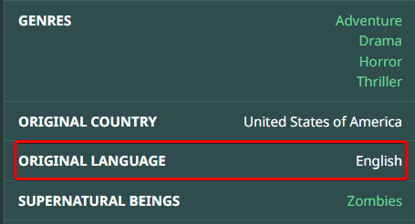

# How to setup Language Custom Formats

Here we will explain how to setup your own preferred language Custom Format, with a few examples.

!!! warning "Using language Custom Formats is not compatible with setting a preferred language in a quality profile in Radarr. You must use one or the other.<br>If you want to make use of the Custom Formats set the preferred language to `Any`.<br><br>Sonarr doesn't have a preferred language in the quality profile, so this can be ignored if you're setting this up with Sonarr"

## Language Examples

Import the JSON in to your Custom Formats.

How ?

Follow the [How to import Custom Formats](/Radarr/Radarr-import-custom-formats/){:target="_blank" rel="noopener noreferrer"}.

---

### Language: Original Only

<sub><sub>Language: Not Original</sub>

This is one of the most common one used besides the English only one.

With this Custom Format you will get only the Movie/TV Show with the original language.

For this we're going to make use of so called reverse scoring.

Add the following json to your Radarr/Sonarr with a score of `-10000`.

??? example "JSON - [Click to show/hide]"

    ```json
    [[% filter indent(width=4) %]][[% include 'json/guide-only/language-not-original.json' %]][[% endfilter %]]
    ```

---

### Language: English Only

<sub><sub>Language: Not English</sub>

With this Custom Format you will only get the Movie/TV Show in the English language.

!!! info "For languages other than English, replace the English condition with language of your choice."

For this we're going to make use of so called reverse scoring.

Add the following json to your Radarr/Sonarr with a score of `-10000`.

??? example "JSON - [Click to show/hide]"

    ```json
    [[% filter indent(width=4) %]][[% include 'json/guide-only/language-not-english.json' %]][[% endfilter %]]
    ```

---

### Language: Multiple Only

<sub><sub>Language: Not Dutch</sub>

In some case you need multiple languages in your Custom Format for different reasons,

in this example I will use Dutch and Flemish being a lot of Movies/TV Shows are collaborate made between the 2 countries/studio's.

With this Custom Format you will only get the Movie/TV Show with Dutch and/or Flemish Audio.

!!! info "For languages other than Dutch/Flemish, replace the Dutch/Flemish condition with language of your choice."

For this we're going to make use of so called reverse scoring.

Add the following json to your Radarr/Sonarr with a score of `-10000`.

??? example "JSON - [Click to show/hide]"

    ```json
    [[% filter indent(width=4) %]][[% include 'json/guide-only/language-not-dutch.json' %]][[% endfilter %]]
    ```

---

### Language: Prefer X but i'll take Y

<sub><sub>Language: Not Original or German</sub>
<sub><sub>Language: Prefer German</sub>

Let's say you want German, but if German is not available then fall back to Original language but don't accept any other translated languages.

!!! info "For languages other than German, replace the German condition with language of your choice."

Add the following json to your Radarr/Sonarr with a score of `-10000`.

??? example "JSON - [Click to show/hide]"

    ```json
    [[% filter indent(width=4) %]][[% include 'json/guide-only/language-not-original-or-german.json' %]][[% endfilter %]]
    ```

Add the following json to your Radarr/Sonarr with a score of `10`.

??? example "JSON - [Click to show/hide]"

    ```json
    [[% filter indent(width=4) %]][[% include 'json/guide-only/language-prefer-german.json' %]][[% endfilter %]]
    ```

---

### Language: Prefer Language X

<sub><sub>Language: Prefer German</sub>

Let's say you just want to prefer German and don't care if you get another random language(s).

!!! info "For languages other than German, replace the German condition with language of your choice."

Add the following json to your Radarr/Sonarr with a score of `10`.

??? example "JSON - [Click to show/hide]"

    ```json
    [[% filter indent(width=4) %]][[% include 'json/guide-only/language-prefer-german.json' %]][[% endfilter %]]
    ```

---

### Language: Prefer Multi Language

<sub><sub>Language: Prefer Dutch</sub>

In some case you may want prefer multiple languages in your Custom Format.

With this Custom Format you will only get the Movie/TV Show with either Preferred Language.

In this example I will use Dutch and Flemish since a lot of Movies/TV Shows since there is a lot of collaboration between the two countries/studio's.

!!! info "For languages other than Dutch/Flemish, replace the Dutch/Flemish condition with language of your choice."

Add the following json to your Radarr/Sonarr with a score of `10`.

??? example "JSON - [Click to show/hide]"

    ```json
    [[% filter indent(width=4) %]][[% include 'json/guide-only/language-prefer-dutch.json' %]][[% endfilter %]]
    ```

---

## FAQ & INFO

### What's reverse scoring

??? question "What's reverse scoring? - [Click to show/hide]"

    With reverse scoring you add a Custom Format with a score of `-10000` and your preferred condition you negate.

    So in the case of the following Custom Format `Language: Original Only`, it will actually match all Not Original releases and give it a score of `-10000`.

### Prefer language X over language Y

??? question "Prefer language X over language Y - [Click to show/hide]"

    If you want to prefer Prefer language X over language Y,

    you add for example: `Language: Prefer Language X` with a score of `10`, and add `Language: Prefer Language Y` with score of `9`.

    Which scores you should use depends on how important the language is compared to other Custom Formats you're using.

### What's Original Language

??? question "What's Original Language? - [Click to show/hide]"

    Original Language is the language in which a Movie/TV Show was originally made.

### Where does Radarr get the Original Language from

??? question "Where does Radarr get the Original Language from? - [Click to show/hide]"

    Radarr makes use of [The Movie Database (TMDB)](https://www.themoviedb.org/){:target="_blank" rel="noopener noreferrer"}. As of February 12, 2023, Radarr has updated its metadata cache to use a movie's spoken language from TMDb as the original language, but only when there is a single spoken language listed for that movie on TMDb. In cases where multiple spoken languages are listed, Radarr will use the movie's designated original language from TMDb.

    

### Where does Sonarr get the Original Language from

??? question "Where does Sonarr get the Original Language from? - [Click to show/hide]"

    Sonarr makes use of [TheTVDB](https://thetvdb.com/){:target="_blank" rel="noopener noreferrer"}.

    

--8<-- "includes/support.md"
