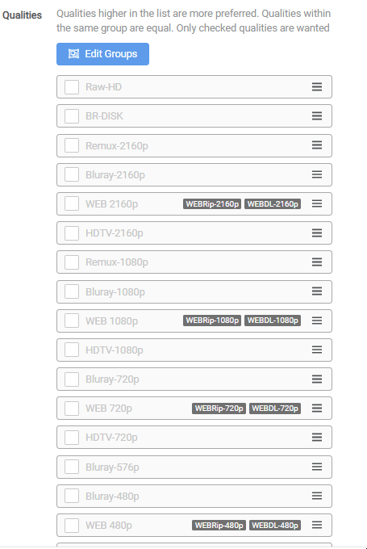

# How to Merge Quality

The current logic on how downloads are compared is **Quality Trumps All** :bangbang:

In some cases it might be preferred to not have Quality Trump All, and let it be handled via Preferred Words / Custom Formats.

To accomplish this you will need to merge the qualities with each other.

## Current Logic

Here you will see the current logic so you understand how the possible downloads are compared.

{! include-markdown "../../../includes/merge-quality/radarr-current-logic.md" !}
<!-- --8<-- "includes/merge-quality/radarr-current-logic.md" -->

{! include-markdown "../../../includes/merge-quality/sonarr-current-logic.md" !}
<!-- --8<-- "includes/merge-quality/sonarr-current-logic.md" -->

## Merge the Qualities

Go to your preferred Quality Profile or create a new one.

`Settings` => `Profiles`

In this example we will merge the following qualities together:

- Bluray-720p
- Bluray-1080p
- WEBDL/WEBRip-1080p

To merge them you need to click on Edit Groups.

When done Sonarr/Radarr upgrades will be handled via Preferred Words / Custom Formats.

{! include-markdown "../../../includes/support.md" !}
<!-- --8<-- "includes/support.md" -->
