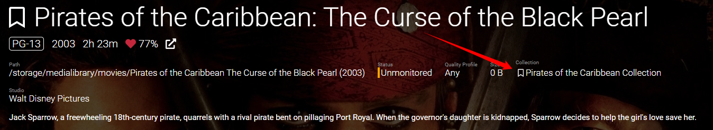
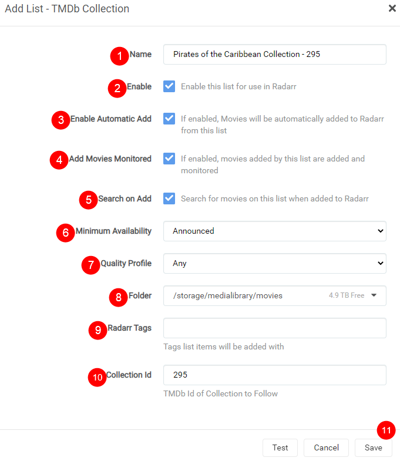
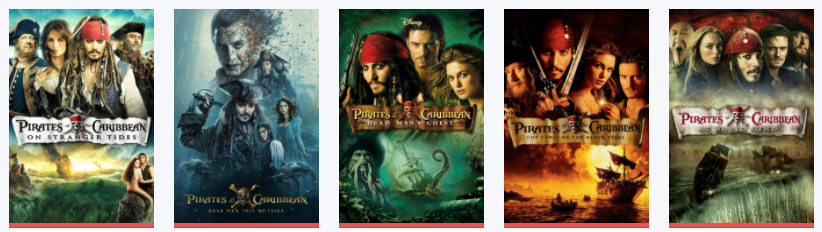
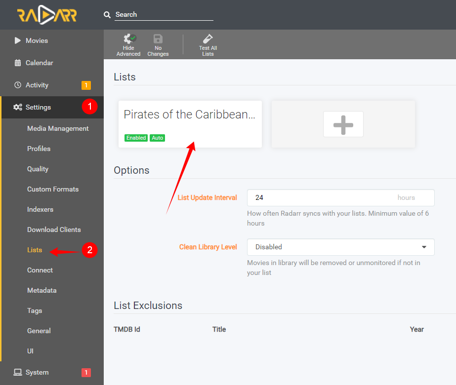

# How to add a Movie Collection

The option to add movie collections based on a movie you already have is one of the coolest new features in Radarr v3 in my opinion.

Lets say you add a movie like `Pirates of the Caribbean: The Curse of the Black Pearl` and you actually want to have the other movies from the same collection.

Now you can let Radarr add them for you with just a few simple clicks

---

## How to add the collection lists

First go to the movie where you want to add the collection from, and click on the `collection` flag

---

## Add List Settings

After you clicked on it, a new window/popup will appear with the following options:

1. Give your collection a name, or use the pre filled one.
1. Enable this list for use in Radarr.
1. Enable this so the movies will be automatically added to Radarr from this list.
1. Enable this so movies will be set monitored when added to Radarr from this list.
1. Enable this so Radarr will start searching movies from this list when added.
1. Set your minimum availability.
1. Your preferred quality profile.
1. Your root path where you want the movies added.
1. Add any tags you want for your own preference.
1. TMDb collection Id.
1. Click on Save so it will be added+searched for in Radarr.

!!! warning
    Don't change the Collection Id else you will end up with the wrong collection!!!

---

After clicking on `Save`, the movies from the lists will be added to Radarr and searched for.

## Result

The added movies will show up in your movie overview:

---

### Edit your Lists

If for any reason you need or want to edit your added list, go to:

`Settings` => `Lists`

Then search for you list you want to edit/remove

--8<-- "includes/support.md"
