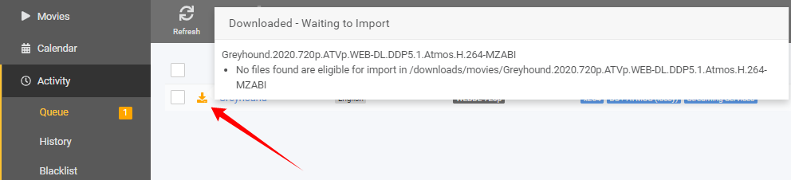
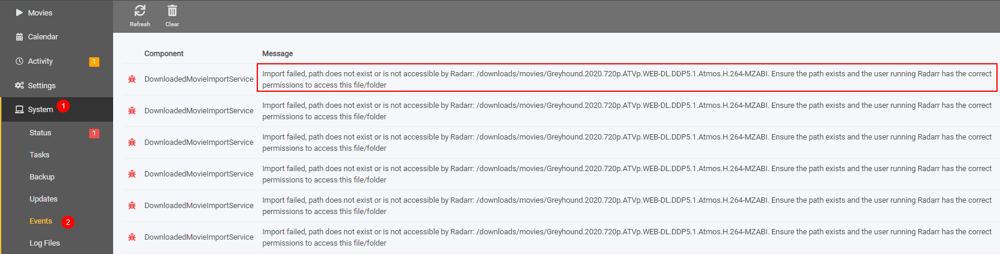
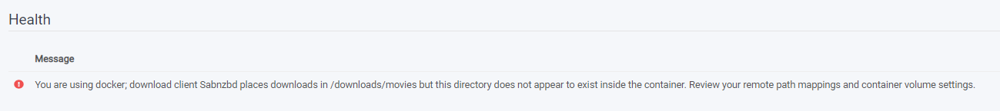
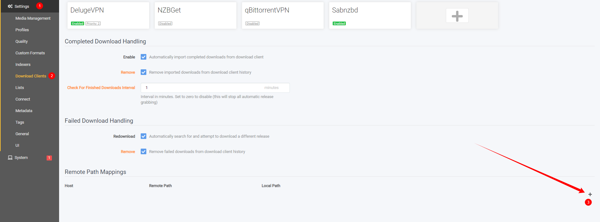
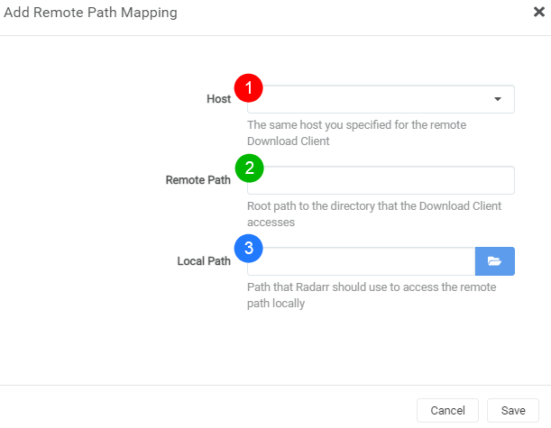
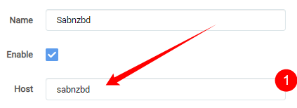
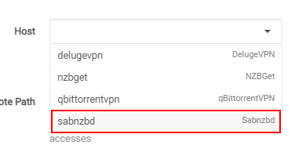
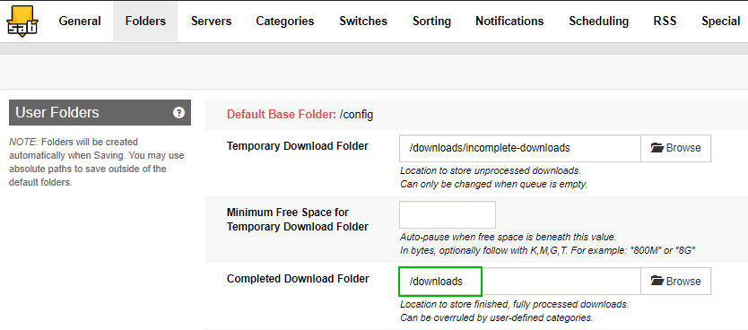
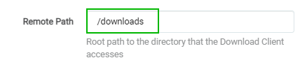
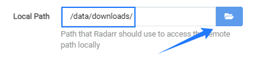

# Remote Path Mappings

It seems that a lot of people don't understand how remote path mapping works for Radarr. I will try to explain it with some screenshots and a short description.

Remote Path Mapping acts as a dumb find `Remote Path` and replace it with the `Local Path`

## When do I need remote path mappings

- If Radarr and your download client are not on the same server/system.
- If you use either merged local/remote setups using mergerfs or similar.
- You run dockers and **DON'T** have consistent and well-planned paths.

!!! note

    If you run dockers it would be smarter to fix the problem at the source of what's causing the actual issue.

    - [Radarr Wiki Servarr - Docker Guide](https://wiki.servarr.com/docker-guide#consistent-and-well-planned-paths){:target="_blank" rel="noopener noreferrer"}

    - [TRaSH Guides](/File-and-Folder-Structure/Hardlinks-and-Instant-Moves/){:target="_blank" rel="noopener noreferrer"}

---

## How do I recognize that I need remote path mappings

Your download stays in your download client and Radarr doesn't want to import it.

Go to `Activity` => `Queue`

You will see a orange download icon, hover over it with your mouse and you will get an error that looks a bit like this:

Go to `System` => `Events`

You will see an error that looks a bit like this:

The following error could also mean that you need remote path mappings:

So looking at these screenshots, it seems you need to make use of remote path mappings.

---

## How do I setup remote path mappings

Go to `Settings` => `Download Clients`

Scroll down to the bottom where you will see `Remote path mappings` - and click on the plus sign in the bottom right corner.

A screen will pop up with the following options:

1. `Host` => This is the hostname or IP you set in your download client settings.
1. `Remote Path` => The download path that you've set in your download client.
1. `Local Path` => The path Radarr needs to access the same path.

### Host

To find what you need to put in your host

Go to `Settings` => `Download Clients`

Open up the download client. For this example, we will be using SABnzbd.

This is what you put in your Host in Remote Path Mapping.
This could be a `hostname`, `container name` or an `IP Address`

??? example "example what to add in Add Remote Path Mapping - [Click to show/hide]"

    

### Remote Path

To find out what you need to put in your remote path you need to open up your download client and look at what you've used there as download location.

In SABnzbd go to `settings` => `Folders`

??? example "example what to add in Add Remote Path Mapping - [Click to show/hide]"

    

### Local Path

To find out what you need to put in in your local path you need to know how Radarr can access the files that your download client downloaded. This can be done in different ways. Mounting/Network shares, whatever, but Radarr needs to have local access to it, so you need to figure out the best way for Radarr to access the download client's downloaded files yourself.

Click on the browse button and browse to the location where the files are accessible for Radarr.

??? example "example what to add in Add Remote Path Mapping - [Click to show/hide]"

    

The final result will look something like this:

![!rpm-final-results]

After these changes, the file should be able to be imported by Radarr.

--8<-- "includes/support.md"
