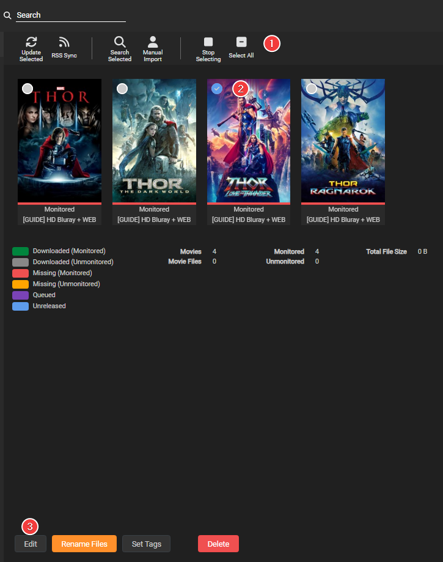
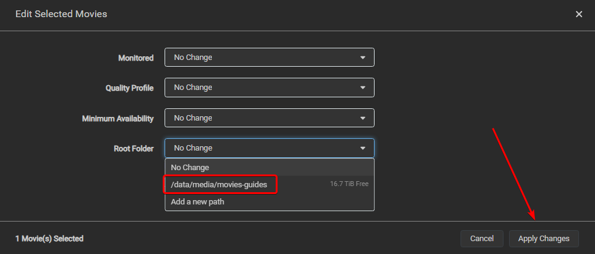

# How to rename your folders

If you need to rename your current folder names (for example, to a new naming scheme), you can do so with a little "magic trick".

Simply go to the movie overview section.

`Movies`

Click on `Edit Movies` (at the top)

Once you are in "edit" mode, you can select the movie(s) whose folders you want to be renamed.

1. If you want all your movie's folders to be renamed with the new naming scheme you set [HERE](/Radarr/Radarr-recommended-naming-scheme){:target="_blank" rel="noopener noreferrer"}.
1. Select the movie(s) that you want to have the folder(s) renamed.
1. At the bottom select `Edit`

A new popup will be shown:

Choose the same (current) root folder for your selected movies, and choose `Apply Changes`.

You will get a warning popup where you will need to choose `Yes, Move the files`

!!! warning
    If you have a large library, use remote or cloud storage, or your path structure isn't well planned (or doesn't support instant moves) this could take a while.

    **Make sure you don't interrupt this process.** If it stops before it has been completed, it could result in quite a mess.

Then, Magic!

As you can see, the folder has now been renamed to the new/updated naming scheme.

--8<-- "includes/support.md"
