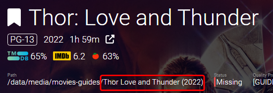
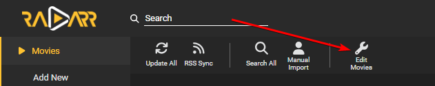
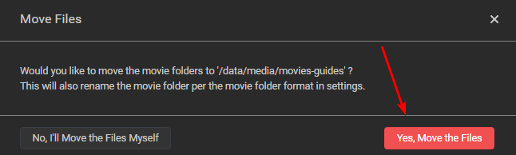
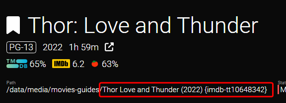

# How to rename your folders

If you want to rename your current folder names (for example, to your new naming scheme), you can do that with this little magic trick.

Please go to the movie overview section.

`Movies`

On the top click on `Edit Movies`

After activating it, you can select the movie(s) from which you want the folder(s) to be renamed.

1. If you want all your movie folders renamed to your new folder naming scheme you set earlier [HERE](/Radarr/Radarr-recommended-naming-scheme){:target="_blank" rel="noopener noreferrer"}.
1. Select the movie(s) from where you want to have the folder(s) to be renamed.
1. At the bottom select `Edit`

A new popup will be shown:

Choose the same root folder and choose `Apply Changes`

You will get a new warning popup where you select `Yes, Move the files`

!!! warning
    If you have a large library, remote storage, cloud storage, or your path structure isn't well planned or doesn't support instant moves, then this process could take a while. Make sure you don't interrupt this process. If it stops before it's complete, it could result in quite the mess.

Then Magic

As you can see, the folder has been renamed to the correct year following your naming scheme.

--8<-- "includes/support.md"
