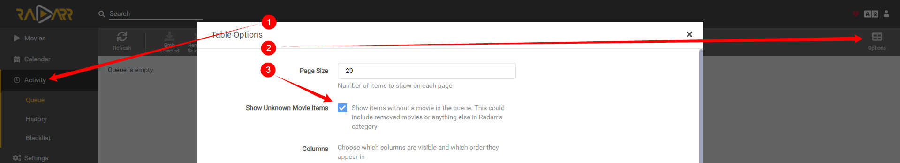

# Show Unknown Movie Items

You downloaded a movie and it doesn't show up in your Activity in Radarr?

By enabling the following option it will show items without a matched movie in the queue. This could include removed movies or anything else in Radarr's category.

Go to your Activity

`Activity`

Then on the top right click on `Options` and a new window will popup and enable `Show Unknown Movie Items`

{! include-markdown "../../../includes/support.md" !}
<!-- --8<-- "includes/support.md" -->
