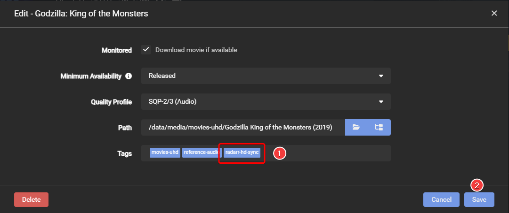
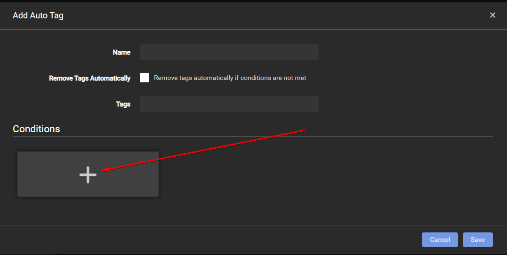
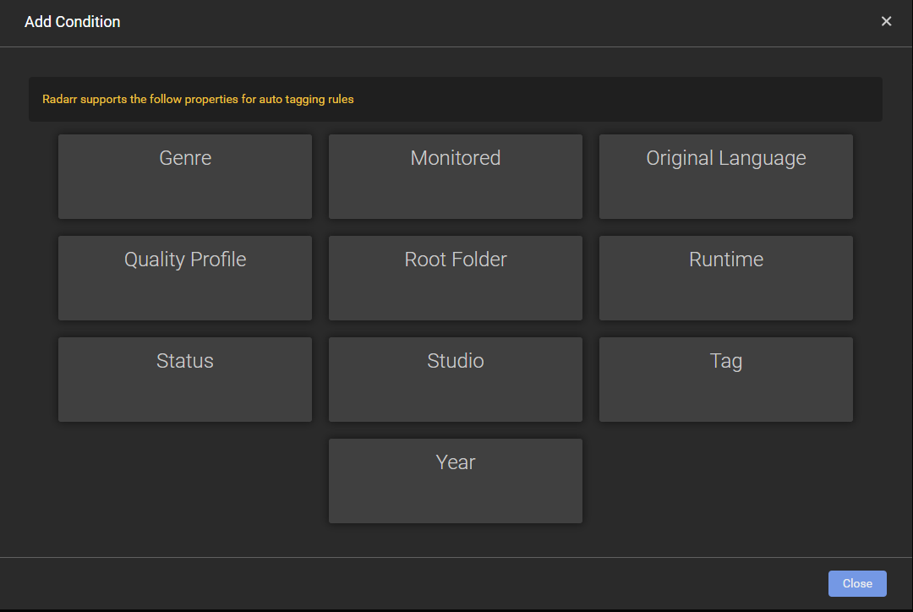
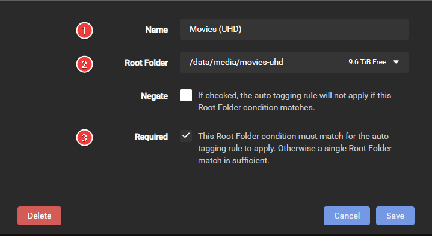
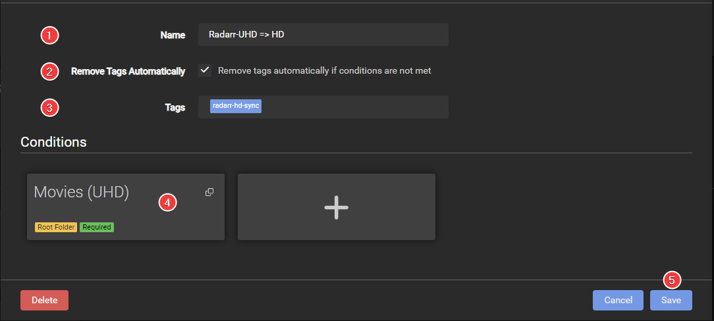
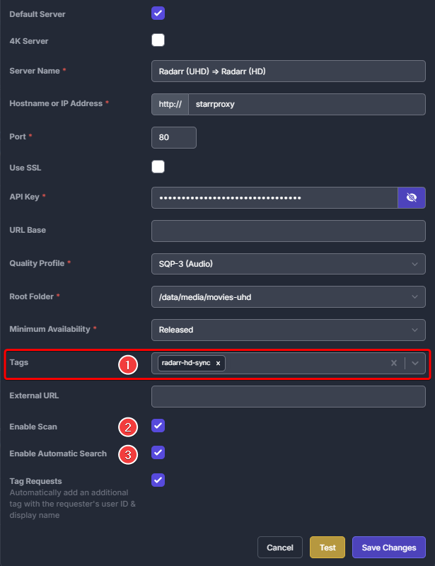
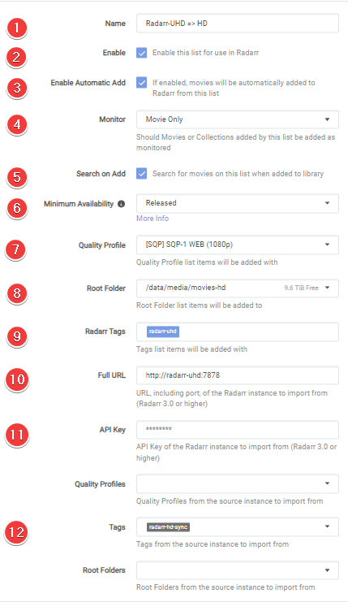

# How to Sync 2 Radarr or Sonarr with each other

This guide will explain how to sync two (or more) Radarr/Sonarr instances.

## Why would you want to run two instances of Sonarr or Radarr?

- You want 1080p and 2160p versions of the same movie or episode.
- You want different versions of the same movie (Special Edition, Theatrical Cut, etc.)
- Etc.

## Which options will we cover

- Option 1 (full sync): This option will show you how to create a 1:1 copy of your Radarr/Sonarr instances, as it will synchronize everything.
- Option 2 (profiles): This option will show you how to cherry-pick which movies/TV shows you want in 4K/2160p (UHD).
- Option 3 (tags): This option can be used for a full sync or to cherry-pick.

## Preparation

!!! note ""

    We won't explain how to set up two Radarr/Sonarr instances for your system, as it depends on how it is installed and running.

    - [Radarr Multiple Instance Information](https://wiki.servarr.com/radarr/installation#multiple-instances).
    - [Sonarr Multiple Instance Information](https://wiki.servarr.com/sonarr/installation#multiple-instances).

For this, you need to have prepared the following:

- Two Radarr/Sonarr instances that are fully set up (Indexers, Custom Formats, Downloaders, etc.).
- One download client (_two if you prefer Usenet and Torrents_).
- Your download client must have two separate categories (movies-hd, movies-uhd, tv-hd, tv-uhd, etc.).

!!! warning

    :bangbang:You can not use the same root (media library) folder for both Radarr/Sonarr instances.:bangbang:

    Make sure to use two separate root folders in Radarr and Sonarr (movies-hd, movies-uhd, tv-hd, tv-uhd, etc.).

---

## Option 1 (full sync)

!!! info ""

    In this example, we will use two Radarr instances (the basics are the same for Sonarr).

    - ^^==Radarr 1==^^ = The main 4K/2160p (UHD) Radarr.
    - {++Radarr 2++} = The 1080p (HD) Radarr that we have set up for a streaming-optimized quality profile.

    This option will show you how to create a 1:1 copy of your Radarr/Sonarr instances, as it will synchronize everything.

### Adding the Radarr Sync list (using full sync)

In Radarr 2, go to `Settings` => `Import Lists`.

Click on the + to add a list and select `Radarr`

You will get a screen with the following options:

1. The name you want to call your Sync list.
1. Enable the list.
1. Enable so the movies will be automatically added.
1. Enable it so the movies will be added and monitored (if disabled, no search will be done for the movies).
1. Enable so Radarr will perform a search when a movie is added.
1. When Radarr shall consider a movie as available. (1)
1. The Quality Profile you want to use for {++Radarr 2++}.
1. Your {++Radarr 2++} root location for your media library.
1. Tags that will be added on import from this list (if you use multiple lists, it makes it easier to determine from which list the movie was added)
1. The Full URL to ^^==Radarr 1==^^ (Use container name with `.internal` domain like `http://radarr.internal:7878` or local URL if they run on the same system).
1. Your API Key of ^^==Radarr 1==^^. :circle-question:{ title="After adding your API key, click the test button at the bottom to see if you have a successful connection." }
1. Which Profile of ^^==Radarr 1==^^ you want to Sync with {++Radarr 2++}. :circle-question:{ title="The dropdown box is filled after you made a successful connection with Radarr 1" }
1. [_Optional_] Use tags from ^^==Radarr 1==^^ to add Movies to {++Radarr 2++}. :circle-question:{ title="The dropdown box is filled after you made a successful connection with Radarr 1" }
1. [_Optional_] Add all movies from the chosen root folder from ^^==Radarr 1==^^. :circle-question:{ title="The dropdown box is filled after you made a successful connection with Radarr 1" }

### Radarr Download client setup (using full sync)

You do not need a separate download client for your two Radarr instances, and this can all be done with one download client (_two if you prefer Usenet and Torrents_).

`Settings` => `Download Clients`

Select your preferred download client.

The only thing you need to change/create is a separate `Category` that you are going to use for {++Radarr 2++}

!!! warning "This must not be the same category you use for ^^==Radarr 1==^^ - use a new `Category`."

### How does this Radarr Sync work (using full sync)

You now only need to make use of ^^==Radarr 1==^^. All movies you add to ^^==Radarr 1==^^ will be synced to {++Radarr 2++} at a scheduled time.

---

## Option 2 (profiles)

!!! info ""

    In this example, we will use two Sonarr instances (The basics are the same for Radarr).

    - ^^==Sonarr 1==^^ = The main 1080p WEB-DL Sonarr.
    - {++Sonarr 2++} = 4K/2160p (UHD) WEB-DL Sonarr.

    This option will show how to selectively add which movies/TV shows you want as 4K/2160p (UHD).

### Extra preparation (using profiles)

In ^^==Sonarr 1==^^ go to `Settings` => `Profiles`

Clone your used profile and rename your profile from `Profilename - Copy` to `Profilename!`

### Adding the Sonarr Sync list (using profiles)

In {++Sonarr 2++} go to `Settings` => `Import Lists`

Click on the + to add a list and select `Sonarr`

You will get a screen with the following options:

1. The name you want to call your Sync list.
1. Enable so that the TV Shows will be automatically added.
1. Enable so Sonarr will perform a search when a TV Show is added.
1. Choose how you want the series monitored initially. (2)
1. Which new seasons should be monitored automatically? (3)
1. Your {++Sonarr 2++} root location for your media library.
1. The Quality Profile you want to use for {++Sonarr 2++}.
1. Series Type. (4)
1. If you want to use Season Folders (**RECOMMENDED**).
1. Tags that will be added on import from this list (if you use multiple lists, it makes it easier to determine from which list the TV Shows were added)
1. The Full URL to ^^==Sonarr 1==^^ (Use container name with `.internal` domain like `http://sonarr.internal:8989` or local URL if they run on the same system).
1. Your API Key of ^^==Sonarr 1==^^. :circle-question:{ title="After adding your API key, click the test button at the bottom to see if you have a successful connection." }
1. Sync season monitoring (**SUGGESTION: DISABLED**)
1. The Cloned Profile of ^^==Sonarr 1==^^ that we are going to use to sync with {++Sonarr 2++}.
1. [_Optional_] Use tags from ^^==Sonarr 1==^^ to add TV Shows to {++Sonarr 2++}. :circle-question:{ title="The dropdown box is filled after you made a successful connection with Sonarr 1" }
1. [_Optional_] Add all TV Shows from the chosen root folder from ^^==Sonarr 1==^^. :circle-question:{ title="The dropdown box is filled after you made a successful connection with Sonarr 1" }
1. This is a Deprecated option.

### Sonarr Download client setup (using profiles)

You do not need a separate download client for your two Sonarr/Radarr instances, and this can all be done with one download client (_two if you prefer Usenet and Torrents_).

`Settings` => `Download Clients`

Select your preferred download client.

The only thing you need to change/create is a separate `Category` that you are going to use for {++Sonarr 2++}

!!! warning "This must not be the same category you use for ^^==Sonarr 1==^^, - use a new `Category`."

### How does this Sonarr Sync work (using profiles)

You now only need to make use of ^^==Sonarr 1==^^. When you have a TV show (or a movie if you use this option with Radarr) that you also want as 4K/2160p (UHD), you make sure you use the Cloned Quality Profile. And it will sync at a scheduled time.

---

## Option 3 (tags)

!!! info ""

    In this example, we will use two Radarr instances (The basics are the same for Sonarr).

    - ^^==Radarr 1==^^ = The main 4K/2160p (UHD) Radarr.
    - {++Radarr 2++} = The 1080p (HD) Radarr we've set up for a streaming-optimized quality profile.

    This option will show you how to create a 1:1 copy of your Radarr/Sonarr instances, as it will synchronize everything.

### Add tags

There are different ways to add tags to your movies or shows in Radarr/Sonarr

- [Manually](#manually) add tags.
- [Automated way](#automated) in Radarr/Sonarr using `Auto Tagging`.
- [3rd party apps](#3rd-party) like Jellyseerr, Kometa, and others.

=== "Manually"

    **Manually add tags**

    In ^^==Radarr 1==^^ select a movie you want to sync to {++Radarr 2++}, and in the tags box type the tag name you wish to use to trigger the sync in {++Radarr 2++}.

    

    1. In this example, we will use the tag: `radarr-hd-sync`.
    1. Click on Save.

=== "Automated"

    **Automated way**

    There are different ways to use the built-in Automated way, depending on which conditions you want to use. In this example, we are going to use the root folder

    In ^^==Radarr 1==^^ goto `Settings` => `Tags` => `Auto Tagging`, Click on the  sign and in the `Add Auto Tag` window, click again on the  sign under conditions.

    

    You will be presented with a new window to choose several conditions.

    

    For this example, we are going to use the condition: `Root Folder`

    

    1. The name used for the condition, in this example, we used `Movies (UHD)`.
    1. The root folder that we want to keep track of, in this example, we used `/data/media/movies-uhd`.
    1. If you use multiple conditions, you can choose which condition is required, in this example, we enabled it.

    After you add all the needed info and click on save, you will see the new condition you created.

    

    1. The name used for the `Auto Tagging`, in this example, we used `Radarr-UHD => HD`.
    1. If you want to remove the tags automatically if the condition no longer matches.
    1. The tags we will use in {++Radarr 2++}. In this example, we will use the tag: `radarr-hd-sync`.
    1. The condition you created before.
    1. Do not forget to click on `Save`.

=== "3rd party"

    **3rd party apps**

    You can use several third-party apps for this option. In this example, we will use Jellyseerr (_The same concept also works with Overseerr_).

    In Jellyseerr, go to `Settings` => `Services`, where you will add Radarr/Sonarr (_If you already added Radarr/Sonarr, click on edit_).

    !!! info "If you have multiple Radarr added, make sure you edit it in ^^==Radarr 1==^^"

    

    1. The tags we will use in {++Radarr 2++}. In this example, we will use the tag: `radarr-hd-sync`.
    1. This is more of a Jellyseerr setting for your ^^==Radarr 1==^^. Enable this setting if you would like to scan your Radarr/Sonarr server for existing media/request status. You should enable this setting so that users cannot submit requests for media that have already been requested or are already available.
    1. This is more of a Jellyseerr setting for your ^^==Radarr 1==^^. Enable this setting to have Radarr/Sonarr automatically search for media upon approval of a request.

### Adding the Radarr Sync list (using tags)

In {++Radarr 2++} go to `Settings` => `Import Lists`

Click on the + to add a list and select `Radarr`

You will get a screen with the following options:

1. The name you want to call your Sync list.
1. Enable the list.
1. Enable so the movies will be automatically added.
1. Enable it so the movies will be added and monitored (if disabled, no search will be done for the movies).
1. Enable so Radarr will perform a search when a movie is added.
1. When Radarr shall consider a movie as available. (5)
1. The Quality Profile you want to use for {++Radarr 2++}.
1. Your {++Radarr 2++} root location for your media library.
1. Tags that will be added on import from this list (if you use multiple lists, it makes it easier to determine from which list the movie was added)
1. The Full URL to ^^==Radarr 1==^^ (Use container name with `.internal` domain like `http://radarr.internal:7878` or local URL if they run on the same system).
1. Your API Key of ^^==Radarr 1==^^. :circle-question:{ title="After adding your API key, click the test button at the bottom to see if you have a successful connection." }
1. The used tags from ^^==Radarr 1==^^ to add Movies to {++Radarr 2++}. :circle-question:{ title="The dropdown box is filled after you made a successful connection with Radarr 1" }

### Radarr Download client setup (using tags)

You do not need a separate download client for your two Radarr instances, and this can all be done with one download client (_two if you prefer Usenet and Torrents_).

`Settings` => `Download Clients`

Select your preferred download client.

The only thing you need to change/create is a separate `Category` that you are going to use for {++Radarr 2++}

!!! warning "This can not and should not be the same category you use for ^^==Radarr 1==^^, but a separate `Category`."

### How does this Radarr Sync work (using tags)

Depending on your chosen option, it will sync movies from ^^==Radarr 1==^^ to ^^ {++Radarr 2++} at a scheduled time.

---

--8<-- "includes/annotations/sync-2-radarr-sonar.md"

--8<-- "includes/support.md"
