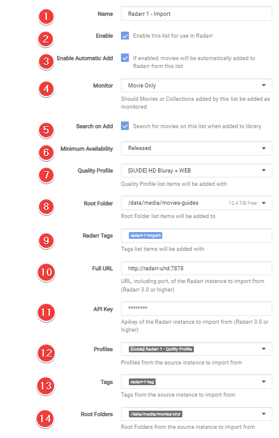

# How to Sync 2 Radarr or Sonarr with each other

In this Guide I will try to explain how you can sync 2 Radarr/Sonarr with each other.

I'm going to show 2 different options how you can setup your sync with 2 Radarr/Sonarr.

- Option 1: This option is best used if you want a 1:1 copy of your Radarr/Sonarr instances
- Option 2: This option is best used if you only want to have a few Movies/TV shows as 4K/2160p (UHD)

!!! error ""
    I'm not going to explain how to set up 2 Radarr/Sonarr for your system, being it depends how you have it installed/running.

## Preparation

For this you need to have prepared the following:

- 2 Radarr/Sonarr fully setup (Indexers, Custom Formats, Downloaders, etc).
- 1 download client or 2 if you prefer Usenet and Torrents.
- Your download client has 2 separate categories (movies-hd, movies-uhd, tv-hd, tv-uhd, etc)

!!! attention

    :bangbang:You can't use the same root (media library) folder for both Radarr's/Sonarr's:bangbang:

    Make sure you use 2 separate root folders in Radarr/Sonarr (movies-hd, movies-uhd, tv-hd, tv-uhd, etc)

------

### Option 1

!!! info ""
    In this example I'm going to use 2 Radarr (The basics is the same for Sonarr).

    - `Radarr 1` = My main 4K/2160p (UHD) Radarr.
    - `Radarr 2` = My 1080p Radarr that I've setup for streaming optimized quality profile [link](#1080p-streaming-optimized).

    This option is best used if you want a 1:1 copy of your Radarr/Sonarr instances

#### Adding the Radarr Sync list

In `Radarr 2` go to `Settings` => `Lists`

Click on the + to add a lists and select `Radarr`

Then you get a screen with the following options.

1. The name you want to call your Sync list.
1. Enable to Enable the list.
1. Enable so the movies will be automatically added.
1. Enable so the movies will be added and monitored (if disabled then there will be no search done for the movies).
1. Enable so when added Radarr will perform a search.
1. When Radarr shall consider a movie is available.
1. The Quality Profile you want to use on `Radarr 2`.
1. Your Root location for your media library.
1. If you want items added to have a tag.
1. The Full URL to `Radarr 1` (Use local URL if they run on the same system).
1. Your API Key of `Radarr 1`.
1. Which Profile of `Radarr 1` you want to Sync with `Radarr 2`.
1. Tags from source instance to import from.
1. Test the connection to `Radarr 1`.
1. Save your settings.

??? faq "When Radarr shall consider a movie is available - [CLICK TO EXPAND]"
    - Announced: Radarr shall consider movies available as soon as they are added to Radarr. This setting is recommended if you have good private trackers that do not have fakes.
    - In Cinemas: Radarr shall consider movies available as soon as movies they hit cinemas. This option is not recommended.
    - Released: Radarr shall consider movies available as soon as the Blu-ray is released. This option is recommended if your indexers contain fakes often.

#### Radarr Download client setup

 You don't need a separate download client for your 2 Radarr instances, this all can be done with 1 download client or 2 if you prefer Usenet and Torrents.

`Settings` => `Download Clients`

Select your preferred download client.

Only thing you need to change/create is a separate `Category` that you're going to use for `Radarr 2`

!!! attention

    This can't and shouldn't be the same category you use for `Radarr 1` but a separate `Category`.

### How does this Radarr Sync work

You now only need to make use of `Radarr 1` all movies your add to `Radarr 1` will be synced to `Radarr 2` at a scheduled time.

##### 1080p streaming optimized

??? faq "1080p streaming optimized quality profile"

    If you're interested in the 1080p streaming optimized quality profile you can contact me on [discord](https://trash-guides.info/discord)

    This is a special quality profile i created for people who are really interested in it

    This release profile is fine tuned when you want to run a 2nd Radarr for 1080p, and want minimum to none transcoding and smaller sizes for the second copy's

    - Streaming optimized (Optimized for PLEX, emby, Jellyfin, and other streaming platforms)
    - Small sizes
    - Good quality
    - No DoVi
    - Only AC3 Audio (Downmixed Lossless audio track to Dolby Digital 5.1 for optimal compatibility)

    !!! note "Why choose this quality profile?"

        - You want maximum compatibility between all devices and still a HQ releases.
        - You run 2 instances of Radarr and want both version or just for the 1080p ones.
        - You want to have minimum till none transcoding for low powered devices or remote streaming.

------

### Option 2

!!! info ""
    In this example I'm going to use 2 Sonarr (The basics is the same for Radarr).

    - `Sonarr 1` = My main 1080p WEB-DL Sonarr.
    - `Sonarr 2` = 4K/2160p (UHD) WEB-DL Sonarr.

    This option is best used if you only want to have a few Movies/TV shows as 4K/2160p (UHD)

#### Extra preparation

In `Sonarr 1` go to `Settings` => `Profiles`

And Clone your used profile and rename your profile from `Profilename - Copy` to `Profilename!`

#### Adding the Sonarr Sync list

In `Sonarr 2` go to `Settings` => `Lists`

Click on the + to add a lists and select `Radarr`

!Sonarr add List](images/image-20211219204256765.png)

Then you get a screen with the following options.

1. The name you want to call your Sync list.
1. Enable to Enable the list.
1. Enable so the movies will be automatically added.
1. Enable so the movies will be added and monitored (if disabled then there will be no search done for the movies).
1. Enable so when added Radarr will perform a search.
1. The Minimum Availability you prefer.
1. The Quality Profile you want to use on `Sonarr 2`.
1. Your Root location for your media library.
1. If you want items added to have a tag.
1. The Full URL to `Sonarr 1` (Use local URL if they run on the same system).
1. Your API Key of `Sonarr 1`.
1. Which Profile of `Sonarr 1` you want to Sync with `Sonarr 2`.
1. Tags from source instance to import from.
1. Test the connection to `Sonarr 1`.
1. Save your settings.

#### Sonarr Download client setup

 You don't need a separate download client for your 2 Radarr instances, this all can be done with 1 download client or 2 if you prefer Usenet and Torrents.

`Settings` => `Download Clients`

Select your preferred download client.

Only thing you need to change/create is a separate `Category` that you're going to use for `Sonarr 2`

!!! important

    This can't and shouldn't be the same category you use for `Sonarr 1` but a separate `Category`.
