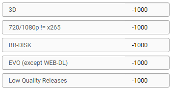
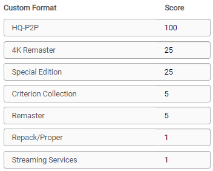
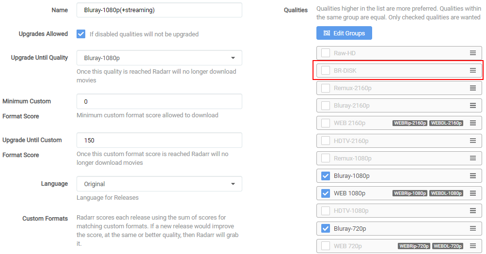

# How to import/export Custom Formats and make use of it

Here I will try to explain how you can import Custom Formats for Radarr v3 and make the most use of it.

!!! attention
    Keep in mind Custom Formats are made to fine tune your Quality Profile

    **Quality Profile trumps Custom Formats**

- [How to import/export Custom Formats and make use of it](#how-to-importexport-custom-formats-and-make-use-of-it)
  - [How to import a JSON Custom Format](#how-to-import-a-json-custom-format)
  - [How to make use of the Custom Formats in your profiles](#how-to-make-use-of-the-custom-formats-in-your-profiles)
  - [Tips how to setup the scores + examples](#tips-how-to-setup-the-scores)

## How to import a JSON Custom Format

In this example i will use the [BR-DISK](Collection-of-Custom-Formats-for-RadarrV3.md#br-disk){:target="_blank" rel="noopener noreferrer"} Custom Format the one most people don't want to download anyway and if you do then you probably don't use Radarr, Plex being both don't support it.

`Settings` => `Custom Formats`

Then click on the  to add a new Custom Format.

Followed by the `Import` in the lower left.

In the empty `Custom Format JSON` box (1) you just paste the `JSON` what you got from the [Custom Format Collection](Collection-of-Custom-Formats-for-RadarrV3.md){:target="_blank" rel="noopener noreferrer"} followed by the `Import` button (2).

What you see in the red box is a example txt that you don't and can't remove!

After selecting the `Import` button you will get a screen that has all the Custom Formats variables filled in correctly,
all you need to do now is click on the `Save` button and you're done.

------

## How to make use of the Custom Formats in your profiles

Now we need to make use of the Custom Formats we've added.

`Settings` => `Profiles`

Then select the profile that you use/prefer.

The Custom Formats in the profiles needs editing on 2 spots.

First we're going to set the scores for the Custom Formats and for this we scroll all the way down.

And then we're going to set a score of `-1000` to the `BR-DISK` to make sure it will be ignored for ever and never going to go over the `Minimum Custom Format Score`.

After this we scroll all the way back up

1. Profile name
1. If you want that Radarr will upgrade till the quality set in (3.)
1. Upgrade till the selected Quality
1. The `Minimum Custom Format Score` allowed to download
1. Keep upgrading Custom Format till this score is reached
1. Your preferred language profile for your Releases

Being we set `BR-DISK` to `-1000` the chance that it will reach the `Minimum Custom Format Score` set in (4.) is really small.

!!! info
    For Custom Formats you really don't want, set it to something really low like `-1000` and not something like `-10` being when you add a Custom Format what you prefer and you set it to something like `+10` it could happen that the `BR-DISK` will be downloaded (-10)+(+10)=0 and your `Minimum Custom Format Score` is set at `0`.

!!! info "regarding option 4"

    I do know some people suggest not to use minus score for your Custom Formats and set option 4 to a higher score then 0.

    The reason why i don't prefer/use this is because you could limit your self when some new groups or what ever will be released.

    Also it makes it much more clear what you want and what you don't want

!!! tip

    I also suggest to change the Propers and Repacks settings in Radarr

    `Media Management` => `File Management` to `Do Not Prefer` and use the [Repack/Proper](#repack-proper) Custom Format.

    

    This way you make sure the Custom Formats preferences will be used and not ignored.

------

## Tips how to setup the scores

Personally I would only add the Custom Formats you really are interested in especially in the beginning.

So now the question what's the best score setup ?

There isn't a best scores setup being that everyone has its own personal preference what they prefer Audio or Video or perhaps both.

My suggestion is to create tiers of scores based on what things matter to you.

### examples

#### Prefer Audio

Lets say you prefer HD audio (with object metadata)

`Basic Dolby Digital < AAC < Basic DTS < DTS-ES < Dolby Digital Plus < DTS-HD HRA < PCM = FLAC < DTS-HD MA < TrueHD (not ATMOS) < DD+ ATMOS (lossy) = ATMOS (indeterminate) < DTS X < TrueHD ATMOS`

In this example above I have lossy Atmos over lossless DTS because the object metadata matters more to me over lossy vs lossless

- Separate all your audio codecs by 100
- Separate special editions/hybrid/4k remaster, etc by 10
- Separate channel count by 5

keep in mind some scores could add up so keep that in mind (depending which Custom Formats you've added and use).

So it's important to keep this in mind when setting up your scores.

#### Prefer HQ Encodes

If you prefer HQ Encodes (Bluray-720/1080/2160p)

I suggest to first follow the [Quality Settings (File Size)](Radarr-Quality-Settings-File-Size.md){:target="_blank" rel="noopener noreferrer"}
If you think the sizes are to big to your preference then stop reading :bangbang:

First I suggest to add the stuff you don't want with a minus score.

!!! tip
    I personally suggest to use these minus scores for all your profiles.

For this example we're going to add the following Custom Formats with a -1000 score.

(Why ? read the description with the Custom Formats)

Then the Custom Formats we're going to add  to get the HQ releases.

And you use the following main settings in your profile.

!!! info

    Make sure you don't check the BR-DISK, The reason why I didn't select the WEB-DL 720p is because you will find hardly any releases that aren't done as 1080p WEB-DL

The following workflow will be applied:

- It will download WEB-DL 1080p for the streaming movies you see more often.
- It will upgrade till Bluray-1080p.
- The downloaded media will be upgraded to any of the added Custom Formats till a score of 150.

!!! info

    If you prefer 2160/4K encodes you might consider to enable HDR and set the `Upgrade Until Quality` to Bluray-2160p

## THNX

A big thnx to [rg9400](https://github.com/rg9400) for providing me with info needed to create the Tips section.
