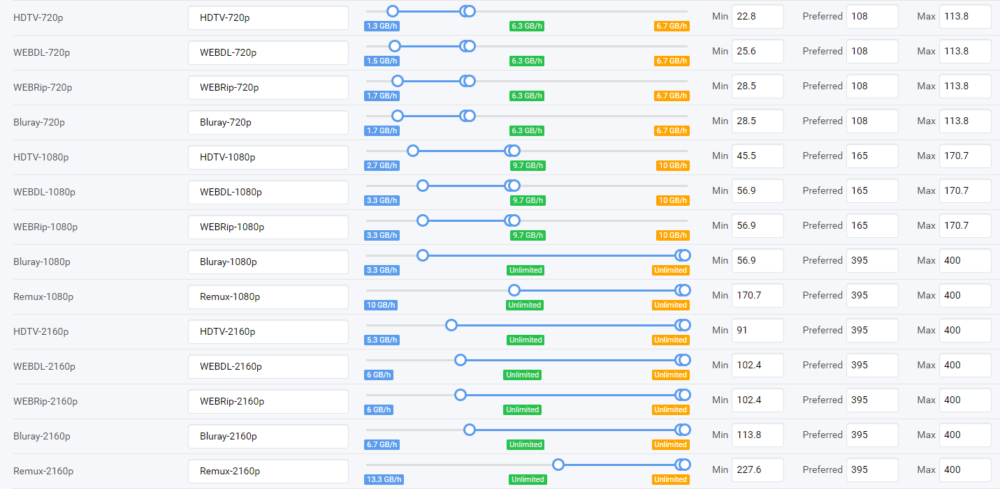

# Quality Settings (File Size)

I often get the question what's the best Quality Settings  to use,
Well it's actually person preference so I will show you a recommended Quality Settings.
But before you continue to read, as with all my guides:

!!! question ""
    **If you don't care about quality then stop reading and see if the other tutorials are helpful for you.**

This Quality Settings has been created and tested with info I got from others and release comparisons from different sources.

## Q&A

Q: Why do you only show starting from HDTV720p?

A: With the big screens these days anything lower doesn't look watchable

Q: Why do you have some sized set to max?

A: You probably didn't read the bold text above

Q: When I set Bluray to MAX size I get often ISO's/ Bluray folder structure.

A: You probable have configured your Quality Profiles wrong and enabled BR-DISK and didn't add the recommended Custom Profile to help Radarr to block/ignore it. [BR-DISK](Collection-of-Custom-Formats-for-RadarrV3.md#br-disk)

------
!!! note
    Image is clickable, it will open in a new window or tab for a bigger/better quality.

{:target="_blank"}
