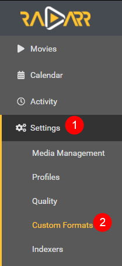

# How to import Custom Formats

Here I will try to explain how you can import Custom Formats for Radarr v3.

!!! attention
    Keep in mind Custom Formats are made to fine tune your Quality Profile

    **Quality Profile trumps Custom Formats**

## How to import a JSON Custom Format

In this example i will use the [BR-DISK](/Radarr/V3/Radarr-collection-of-custom-formats/#br-disk){:target="_blank" rel="noopener noreferrer"} Custom Format the one most people don't want to download anyway and if you do then you probably don't use Radarr, Plex being both don't support it.

`Settings` => `Custom Formats`

Then click on the  to add a new Custom Format.

Followed by the `Import` in the lower left.

In the empty `Custom Format JSON` box (1) you just paste the `JSON` what you got from the [Custom Format Collection](/Radarr/V3/Radarr-collection-of-custom-formats){:target="_blank" rel="noopener noreferrer"} followed by the `Import` button (2).

What you see in the red box is a example txt that you don't and can't remove!

After selecting the `Import` button you will get a screen that has all the Custom Formats variables filled in correctly,
all you need to do now is click on the `Save` button and you're done.

------

## Start adding other Custom Formats wisely

!!! tip

    Now Start adding other Custom Formats wisely, **Don't add all the available Custom Formats !!!**

    Personally I would only add the Custom Formats that do what you actually prefer especially in the beginning, including the [Releases you should avoid](/Radarr/V3/Radarr-setup-custom-formats/#releases-you-should-avoid)

    If you got any questions or aren't sure what to add just Click the chat badge to join the Discord Channel where you can ask your questions directly

    {:target="_blank" rel="noopener noreferrer"}

Check out the [How to setup Custom Formats](/Radarr/V3/Radarr-setup-custom-formats) where I will try to explain how to make the most use of custom formats and show some personal examples that I'm using. That you can use to get a idea how to setup yours.
