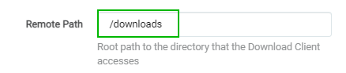
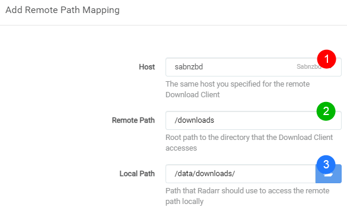

# Remote Path Mappings

Seems that allot of people don't understand how the remote path mapping works for Radarr. I will try to explain it with some screenshots and a short description.

## Do I need Remote Path Mappings?

- If your download client runs on another system/location then Radarr.
- You run dockers and **DON'T** have Consistent and well planned paths.

!!! note
    If you run dockers it would be smarter to fix the problem from the source of the actual issue.

    - [Radarr Wiki Servarr - Docker Guide](https://wiki.servarr.com/Docker_Guide#Consistent_and_well_planned_paths)

    - [TRaSH Guides](/Misc/how-to-set-up-hardlinks-and-atomic-moves/)

You probably need to make use of Remote Path Mappings.

## How do I recognize that I need remote path mappings?

Your download stays in your download client and Radarr doesn't want to import it.

Go to `Activity` => `Queue`

You will see a orange download icon, hover with your mouse over it and you will get a error that looks a bit like this.

Go to `System` => `Events`

You will see somewhere a error that looks a bit like this.

The following error could also mean that you need remote path mapping

So looking at these screenshot it seems you need to make use of Remote Path Mappings.

## How do I setup remote path mappings?

Go to `Settings` => `Download Clients`

scroll all the way down where you `Remote Path Mappings` and click on the right on the plus sign.

A screen will popup with the following options.

1. `Host` => This is the hostname or IP you set in your download client settings.
2. `Remote Path` => The download path that you've set in your download client.
3. `Local Path` => The path Radarr needs to access the same path.

### Host

To find what you need to put in your host

Go to `Settings` => `Download Clients`

There you open up the download client for this example I will be using SABnzbd

​    

This is what you put in your Host in Remote Path Mapping.
This could be a `hostname`, `container name` or a `IP Address`

??? examples "Example what to add in Add Remote Path Mapping"

    

### Remote Path

To find what you need to put in your remote path you need to open up your download client and look what you've used there as download location.

In SABnzbd go to `settings` => `Folders`

??? examples "Example what to add in Add Remote Path Mapping"

    

### Local Path

To find what you need to put in in your local path you need to know how Radarr is able to access the files your download client downloaded. And this can be done in different ways. Mounting/Network share what ever but Radarr needs to have local access to it so you need to figure this one out your self what's the best way for Radarr to access the download clients downloaded files.

Click on the browse button and browse to the location where the files are accessible for Radarr.

??? examples "Example what to add in Add Remote Path Mapping"

    

The final result will look something like this.

After these changes the file should be able to be imported by Radarr.
