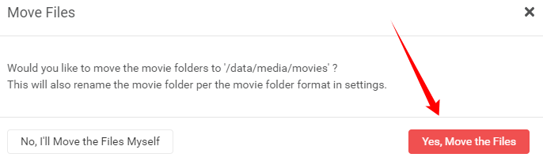

# How to rename your folders

You will notice after the fix we did during the import that the folder name still has the wrong year in it.
To fix this we're going to do a little magic trick.

Go to you movie overview

`Movies`

On the top click on `Movie Editor`

After activating it you select the movie(s) from where you want to have the folder(s) to be renamed.

1. If you want all your movie folders renamed to your folder naming scheme you set earlier [HERE](#movie-naming).
2. Select the movie(s) from where you want to have the folder(s) to be renamed.
3. Choose the same `Root Folder`

A new popup will be shown

Select `Yes, Move the files`

Then Magic

As you can see the folder has been renamed to the correct year following your naming scheme.