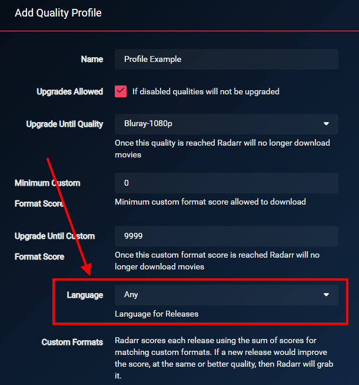
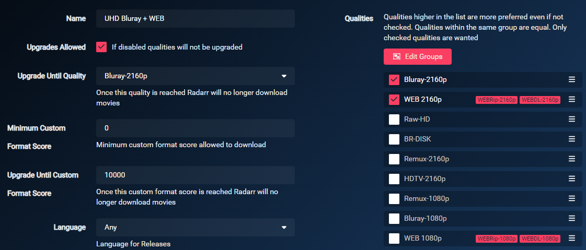
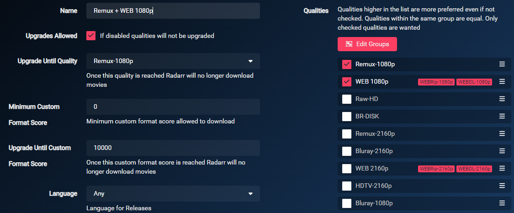
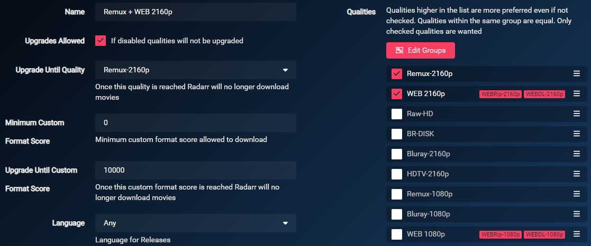

# Comment configurer ses Profiles

!!! note
    Ce guide a été créé et est maintenu par [Someone said "Nice"?](https://github.com/NiceTSY)

Quelle est la meilleure façon de configurer les Formats Personnalisés (ou Custom Formats) et lesquels utiliser avec quel score pour obtenir une release avec un audio français et un anglais ?

Gardez à l'esprit que la plupart des releases sont MULTi (comprenez double audio, original et français) et qu'il sera difficile d'avoir uniquement l'audio français, à moins que vous ne soyez prêt à obtenir du 720p, ou que vous ne recherchiez que des films français.

Pour ce qui est de la qualité, il n'y a pas de recette miracle, cela dépend de votre installation (périphériques) et de vos préférences personnelles.

Certains préfèrent une qualité audio élevée (HD Audio), d'autres une meilleure qualité vidéo. Nombreux sont ceux qui préfèrent les deux.

TRaSH a créé un [schéma](/Radarr/Radarr-setup-custom-formats/#which-quality-profile-should-you-choose){:target="_blank" rel="noopener noreferrer"} pour faciliter votre décision/choix. Notez que ce graphique n'inclut aucun des Formats Personnalisés de ce guide et que vous devrez quand même le lire pour obtenir des releases en MULTi.

------

## Notions de base

Il est très important que vous respectiez et compreniez ce qui est proposé par le guide de TRaSH (*en anglais uniquement*) :

- L'ajout de Formats Personnalisés, comme expliqué dans [How to import Custom Formats](/Radarr/Radarr-import-custom-formats/){:target="_blank" rel="noopener noreferrer"}.
- La configuration d'un profil de qualité pour utiliser les formats personnalisés, comme expliqué dans la section [How to setup Quality Profiles | Basics section](/Radarr/Radarr-setup-custom-formats/#basics){:target="_blank" rel="noopener noreferrer"}.

------

!!! warning "Impératif"

    La seule modification nécessaire et **indispensable** pour que les formats personnalisés français fonctionnent, est de définir le profil de langue sur `Any`.

    ??? check "Exemple - [CLIQUEZ POUR AFFICHER]"
        

    !!! info
        `Any` est choisit sinon un film anglais identifié avec un audio français dans Radarr ne sera pas récupéré et vice-versa.

------

## Je ne suis intéressé que par des films sous-titrés en français (VOSTFR)

Deux options s'offre à vous :

### En utilisant le guide de TRaSH et Bazarr

!!! tip "Il s'agit de la méthode à privilégier."

- Configurer Radarr en utilisant : [How to setup Quality Profiles | Which Quality Profile should you choose](/Radarr/radarr-setup-quality-profiles/#which-quality-profile-should-you-choose) (*en anglais*).
- Configurez [Bazarr](../Bazarr/Setup-Guide.md) (*en anglais*). Il permet d'obtenir des sous-titres pour tous les films.
- Profitez de vos films avec les sous-titres.
- (Facultatif) Ajoutez le Format Personnalisé [{{ radarr['cf']['french-vostfr']['name'] }}](/Radarr/Radarr-collection-of-custom-formats/#vostfr) avec un score de `1000`.

### En utilisant les exemples suivants et le Format Personnalisé VOSTFR

- Continuez sur cette page.
- Ignorez toute mention des **Formats Personnalisés MULTi**.
- Ajoutez le Format Personnalisé [{{ radarr['cf']['french-vostfr']['name'] }}](/Radarr/Radarr-collection-of-custom-formats/#vostfr) avec un score de `1000`.

------

## Usages

Il y a deux façons d'aborder les exemples ci-dessous. En utilisant ou non les Formats Personnalisés de Groupes P2P du Guide original (qui peuvent être trouvés ici : [Collection of Custom Formats](/Radarr/Radarr-collection-of-custom-formats/){:target="_blank" rel="noopener noreferrer"}).
Afin d'illustrer ce principe, vous verrez une section **"Mix original (optionnel)"** dans chacun des exemples ci-dessous. Vous devez comprendre que si vous ajoutez les Formats Personnalisés de cette section optionnelle, si Radarr ne trouve pas de MULTi, vous aurez toujours un bon score pour l'audio anglais.

!!! warning "Attention"
    Si vous utilisez le **"Mix original (optionnel)"**. Vous devez comprendre que même si l'objectif principal de ces Formats Personnalisés est de travailler en parallèle avec les formats du guide original. Vous pouvez vous retrouver avec un seul audio alors qu'il existe une version MULTi. La raison est que la release n'a pas été notée assez haut pour l'emporter sur les autres scores.

------

## Exemples de Profil

--8<-- "includes/cf/score-attention.md"

------

### Type de versions françaises

Ces Formats sont optionnels et ne sont là que pour renommer votre fichier ou pour éviter un certain type de version française. Exemples :

- Vous ne voulez pas de VFQ ou VQ, dans ce cas, vous leur attribuerez un score de `-10000` au lieu de `0`.
- Vous souhaitez seulement du VOSTFR, dans ce ce cas, ignorez toute mention des **Formats Personnalisés MULTi** et donnerez un score de `1000` au Format Personnalisé [{{ radarr['cf']['french-vostfr']['name'] }}](/Radarr/Radarr-collection-of-custom-formats/#vostfr).

{! include-markdown "../../includes/french-guide/radarr-french-audio-version-fr.md" !}

------

### Les releases à éviter

Ces Formats sont reconnus comme étant indispensables pour tous les Profils de Qualité que vous utilisez. Ils vous assurent de ne pas avoir de releases de faible qualité.

{! include-markdown "../../includes/french-guide/radarr-french-unwanted-fr.md" !}

------

### TRaSH recommandations (*en anglais*)

{! include-markdown "../../includes/cf/radarr-suggest-attention.md" !}

------

#### HD Bluray + WEB

Si vous préférez les encodages HD de haute qualité (Bluray-720/1080p)

- *Poids : 6 à 15 Go pour un Bluray-1080p selon la durée du média.*

{! include-markdown "../../includes/french-guide/radarr-french-multi-audio-fr.md" !}

{! include-markdown "../../includes/cf/radarr-movie-versions.md" !}

{! include-markdown "../../includes/french-guide/radarr-cf-french-hd-bluray-web-scoring-fr.md" !}

{! include-markdown "../../includes/cf/radarr-misc.md" !}

{! include-markdown "../../includes/cf/radarr-streaming-services.md" !}

Les Formats Personnalisés `Audio Advanced` ne sont pas inclus dans le profil d'encodage, car vous trouverez difficilement de l'audio HD avec ce type d'encodages. Et il est conseillé de privilégier la qualité visuelle. Si vous voulez aussi de l'audio HD, vous devriez opter pour les Remuxes ou les Encodes UHD.

Utilisez les paramètres suivants dans votre profil.

!!! attention "Assurez-vous de ne pas cocher le BR-DISK."

La raison pour laquelle le WEB-DL 720p n'est pas sélectionné est que vous ne trouverez pratiquement aucune release qui ne soit pas faite en 1080p WEB-DL.

{! include-markdown "../../includes/starr/move-quality-to-top.md" !}

??? summary "Logique et fonctionnement - [CLIQUEZ POUR AFFICHER]"

    **En fonction de ce qui est disponible en premier, la logique sera la suivante :**

    - Lorsque le WEB-1080p deviendra disponible, le média sera télécharger en WEB-1080p. (services de streaming)
    - Lorsque le Bluray-1080p sortira, il sera mis à niveau vers le Bluray-1080p.
    - Le média sera mis à niveau en fonction des formats personnalisés ajoutés jusqu'à l'obtention d'un score de `10000`.

------

#### UHD Bluray + WEB

Si vous préférez les encodages UHD de haute qualité (Bluray-2160p)

- *Poids : 20 à 60 Go pour un Bluray-2160p selon la durée du média.*

{! include-markdown "../../includes/french-guide/radarr-french-advanced-audio-information-fr.md" !}

{! include-markdown "../../includes/cf/radarr-audio.md" !}

{! include-markdown "../../includes/cf/radarr-hdr-formats.md" !}

{! include-markdown "../../includes/french-guide/radarr-french-multi-audio-fr.md" !}

{! include-markdown "../../includes/cf/radarr-movie-versions.md" !}

{! include-markdown "../../includes/french-guide/radarr-cf-french-uhd-bluray-web-scoring-fr.md" !}

{! include-markdown "../../includes/cf/radarr-misc.md" !}

{! include-markdown "../../includes/cf/radarr-streaming-services.md" !}

Utilisez les paramètres suivants dans votre profil.

!!! attention "Assurez-vous de ne pas cocher le BR-DISK."

{! include-markdown "../../includes/starr/move-quality-to-top.md" !}

??? summary "Logique et fonctionnement - [CLIQUEZ POUR AFFICHER]"

    **En fonction de ce qui est disponible en premier, la logique sera la suivante :**

    - Lorsque le WEB-2160p deviendra disponible, le média sera télécharger en WEB-2160p. (services de streaming)
    - Lorsque le Bluray-2160p sortira, il sera mis à niveau vers le Bluray-2160p.
    - Le média sera mis à niveau en fonction des formats personnalisés ajoutés jusqu'à l'obtention d'un score de `10000`.

------

#### Remux + WEB 1080p

Si vous préférez les Remuxes en 1080p (Remux-1080p)

- *Poids : 20 à 40 Go pour un Remux-1080p selon la durée du média.*

{! include-markdown "../../includes/french-guide/radarr-french-advanced-audio-information-fr.md" !}

{! include-markdown "../../includes/cf/radarr-audio.md" !}

{! include-markdown "../../includes/french-guide/radarr-french-multi-audio-fr.md" !}

{! include-markdown "../../includes/cf/radarr-movie-versions.md" !}

{! include-markdown "../../includes/french-guide/radarr-cf-french-remux-web-scoring-fr.md" !}

{! include-markdown "../../includes/cf/radarr-misc.md" !}

{! include-markdown "../../includes/cf/radarr-streaming-services.md" !}

Utilisez les paramètres suivants dans votre profil.

!!! attention "Assurez-vous de ne pas cocher le BR-DISK."

La raison pour laquelle le WEB-DL 720p n'est pas sélectionné est que vous ne trouverez pratiquement aucune release qui ne soit pas faite en 1080p WEB-DL.

{! include-markdown "../../includes/starr/move-quality-to-top.md" !}

??? summary "Logique et fonctionnement - [CLIQUEZ POUR AFFICHER]"

    **En fonction de ce qui est disponible en premier, la logique sera la suivante :**

    - Lorsque le WEB-1080p deviendra disponible, le média sera télécharger en WEB-1080pp. (services de streaming)
    - Lorsque le REMUX-1080p sortira, il sera mis à niveau vers le REMUX-2160p.
    - Le média sera mis à niveau en fonction des formats personnalisés ajoutés jusqu'à l'obtention d'un score de `10000`.

------

#### Remux + WEB 2160p

Si vous préférez les Remuxes en 2160p (Remux-2160p)

- *Poids : 40 à 100 Go pour un Remux-2160p selon la durée du média.*

{! include-markdown "../../includes/french-guide/radarr-french-advanced-audio-information-fr.md" !}

{! include-markdown "../../includes/cf/radarr-audio.md" !}

{! include-markdown "../../includes/cf/radarr-hdr-formats.md" !}

{! include-markdown "../../includes/french-guide/radarr-french-multi-audio-fr.md" !}

{! include-markdown "../../includes/cf/radarr-movie-versions.md" !}

{! include-markdown "../../includes/french-guide/radarr-cf-french-remux-web-scoring-fr.md" !}

{! include-markdown "../../includes/cf/radarr-misc.md" !}

{! include-markdown "../../includes/cf/radarr-streaming-services.md" !}

Utilisez les paramètres suivants dans votre profil.

!!! attention "Assurez-vous de ne pas cocher le BR-DISK."

{! include-markdown "../../includes/starr/move-quality-to-top.md" !}

??? summary "Logique et fonctionnement - [CLIQUEZ POUR AFFICHER]"

    - Lorsque le WEB-2160p deviendra disponible, le média sera télécharger en WEB-2160p. (services de streaming)
    - Lorsque le REMUX-2160p sortira, il sera mis à niveau vers le REMUX-2160p.
    - Le média sera mis à niveau en fonction des formats personnalisés ajoutés jusqu'à l'obtention d'un score de `10000`.

------

### Formats audio avancés et HDR

TRaSH fournit d'excellents guides et explications à leur sujet dans les liens suivants (*en anglais uniquement*) :

- [Advanced Audio](/Radarr/radarr-setup-quality-profiles/#advanced-audio){:target="_blank" rel="noopener noreferrer"}
- [HDR Formats](/Radarr/radarr-setup-quality-profiles/#hdr-formats){:target="_blank" rel="noopener noreferrer"}
- [HDR Formats + DV (WEBDL)](/Radarr/radarr-setup-quality-profiles/#hdr-formats-dv-webdl){:target="_blank" rel="noopener noreferrer"}
- [HDR Formats + DV (WEBDL) + HDR10+ Boost](/Radarr/radarr-setup-quality-profiles/#hdr-formats-dv-webdl-hdr10-boost){:target="_blank" rel="noopener noreferrer"}

------

## Remerciements

- Un grand merci à toutes les personnes qui m'ont aidé à tester ces Profils et Formats (et qui continuent à le faire).
- Une mention spéciale à MySuperChef et PrL pour leur temps et leurs explications.
- Une mention spéciale pour Piou et Wikoul qui sont potentiellement tous les deux maintenant dans des asiles en raison de la quantité de tests effectués.
- [TRaSH](https://trash-guides.info/), pour m'avoir accordé un petit espace sur son guide, ses connaissances, et sa gentillesse.

--8<-- "includes/support.md"
