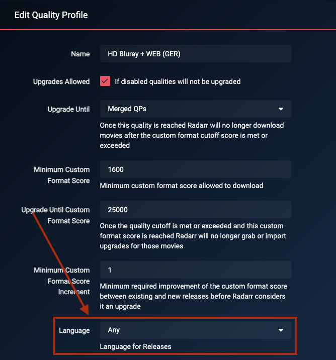

# How to setup Quality Profiles (German)

*aka How to setup Custom Formats to get German Audio if available*  

!!! note "This guide is created and maintained by [Lokilicious](https://github.com/Lokilicious) and [PCJones](https://github.com/PCJones)"

There isn't a *best* way to set up Custom Formats to get German (or German+English dual) audio. It depends on your setup (hardware devices) and personal preferences.

Some prefer high-quality audio (HD Audio), and others prefer high-quality video. Many prefer both.

In this Guide, we try to give a recommendation that suits most users.

---

## Basics

It is quite important that you follow and understand what is expected by TRaSH's guide:

- Adding Custom Formats, as explained in [How to import Custom Formats](/Radarr/Radarr-import-custom-formats/){:target="_blank" rel="noopener noreferrer"}.
- Setting up a quality Profile to make use of the Custom Formats, as explained in [How to setup Quality Profiles | Basics section](/Radarr/radarr-setup-quality-profiles/#basics){:target="_blank" rel="noopener noreferrer"}.

!!! warning "Please read those two sections before continuing the guide, as they contain important information. The rest of this guide will assume you did."

!!! tip
    TRaSH created a [flowchart](/Radarr/Radarr-setup-custom-formats/#which-quality-profile-should-you-choose){:target="\_blank" rel="noopener noreferrer"} to make your decision easier. Remember that this chart does not include any of the following Custom Formats, and you will still need to read this guide to get German-only/German Dual Language("German DL") releases.

---

## Using this Guide

There are two ways of using this Guide, with and without TRaSH original Guide's international/English-based group tiers.
(which can be found here: [Collection of Custom Formats](/Radarr/Radarr-collection-of-custom-formats/){:target="_blank" rel="noopener noreferrer"}).

In this Guide, we focus on combining both languages and thus include the Custom Formats from TRaSH's original Guide.

These Custom Formats are recommended if you prefer German Dual-Language releases but also want to download the original and/or English audio if no German Dual-Language is available (yet). This ensures the original English release will be of the best quality possible.

---

## Radarr specific settings

There are a couple of changes that are needed for German Custom Formats to work properly:

??? abstract "Set the language to `Any` in the quality profile - [Click to show/hide]"
    We choose `Any` for the language profile, as otherwise, English movies identified with German audio and vice-versa will not be grabbed.

    ??? success "Screenshot example - [Click to show/hide]"
        

??? abstract "Disable Propers and Repacks - [Click to show/hide]"
    Change the Propers and Repacks setting in `Media Management` => `File Management` to `Do Not Prefer` and use the [Repack/Proper](/Radarr/Radarr-collection-of-custom-formats/#repackproper) Custom Formats.

    This way, you can ensure that Custom Formats preferences are used and not ignored.

    You can still prefer Propers and Repacks through the provided Custom Formats.

    ??? success "Screenshot example - [Click to show/hide]"
        

??? abstract "Merge Qualities - [Click to show/hide]"

    To allow upgrades based on language without release qualities interfering, we need to [merge all desired qualities](/Radarr/Tips/Merge-quality/) into one group.

    You will find a recommendation on which qualities should be included/merged for the different profiles in the individual profiles sections.

    {! include-markdown "../../includes/starr/move-quality-to-top.md" !}

    !!! tip "Tip"
        You don't need to include some of these resolutions, such as 2160p or 720p, if you are not interested in them.

??? abstract "Adapt the Standard Movie Format and Movie Folder Format - [Click to show/hide]"
    Please have a look here: [Recommended naming scheme](/Radarr/Radarr-recommended-naming-scheme/){:target="_blank" rel="noopener noreferrer"}.

    !!! tip "Movie format/folder with the German movie name."
        Radarr supports the ISO-2 naming convention for naming movies, so replacing `{Movie CleanTitle}` with `{Movie CleanTitle:de}` will change the name to its German version.

??? abstract "Set the Maximum Custom Format Score - [Click to show/hide]"
    To allow upgradeability to the best possible quality, we set the `Upgrade Until Custom Format Score` to `25k`, which is more than the highest reachable score.

    !!! tip "Tip"
        If you want to stop upgrades at a specific score, feel free to adapt this setting based on your needs.

---

## Dealing with German Umlauts and German titles

Two facts can lead to Radarr being unable to match a German movie release.

- Indexers typically do not allow the use of German Umlauts in release names.
- Most movies have titles that are different in German from those in English.

To help with this, there is a handy service called [Umlautadaptarr](https://github.com/PCJones/UmlautAdaptarr). This service acts as a middle layer between Radarr and the Indexer to ensure that Umlauts and German titles are mapped correctly.

---

## Score logic

--8<-- "includes/cf/score-attention.md"

---

## Quality profiles

### German audio

Depending on what's released first and available, the following Workflow Logic will be used:

- When an `English` version is released, it will download the release in the best available quality based on the Custom Formats used.
- When a `German` or `German DL` version is released, it will upgrade to that version.
- The downloaded media will be upgraded to any of the added Custom Formats until the defined Score defined in the Quality Profile under `Upgrade Until Custom Format Score` is reached.

!!! tip "Download German audio ^^only^^"

    Set the `Minimum Custom Format Score` in your Quality Profile to `10k`
    Note: Most German releases come in dual languages, so you might still see an English audio track in addition to the German one.

!!! warning "Releases where German is the original language"

    Due to technical limitations, releases in which German is the movie's original language will be identified as `German DL` even though they might not contain another language.
    The only (cosmetic) impact of this is that the scores of those releases will be slightly higher than expected.

{! include-markdown "../../includes/german-guide/radarr-german-advanced-audio-information-en.md" !}

---

### Releases you should avoid

This is a must-have for every Quality Profile you use. All these Custom Formats make sure you don't get Low Quality Releases.

{! include-markdown "../../includes/german-guide/radarr-german-unwanted-en.md" !}

---

### HD Bluray + WEB

If you prefer High-Quality HD Encodes (720p/1080p)

!!! abstract "Recommended merging of qualities"

    We recommend to [merge the following qualities](/Radarr/Tips/Merge-quality/):

    - Bluray-1080p
    - WEBDL-1080p
    - WEBRip-1080p
    - Bluray-720p
    - WEBDL-720p
    - WEBRip-720p

{! include-markdown "../../includes/german-guide/radarr-german-audio-version-en.md" !}

{! include-markdown "../../includes/german-guide/radarr-cf-german-hd-bluray-web-scoring-en.md" !}

{! include-markdown "../../includes/cf/radarr-misc-required.md" !}

{! include-markdown "../../includes/german-guide/radarr-cf-german-resolution-scoring-hd-only-en.md" !}

{! include-markdown "../../includes/german-guide/radarr-german-unwanted-en.md" !}

{! include-markdown "../../includes/cf/radarr-streaming-services.md" !}

**The following Custom Formats are optional:**

{! include-markdown "../../includes/cf/radarr-misc-optional.md" !}

{! include-markdown "../../includes/cf/radarr-movie-versions-imaxe-noremux.md" !}

---

### UHD Bluray + WEB (2160p)

If you prefer High-Quality UHD Encodes (2160p)

!!! abstract "Recommended merging of qualities"

    We recommend to [merge the following qualities](/Radarr/Tips/Merge-quality/):

    - Bluray-2160p
    - WEBDL-2160p
    - WEBRip-2160p

    ??? tip "Alternative Quality Profile - [Click to show/hide]"

        You may add the following qualities to the merged quality group if you want to grab HD (720p/1080p) releases before a UHD release is available:

        - Bluray-1080p
        - WEBDL-1080p
        - WEBRip-1080p
        - Bluray-720p
        - WEBDL-720p
        - WEBRip-720p

{! include-markdown "../../includes/german-guide/radarr-german-audio-version-en.md" !}

{! include-markdown "../../includes/german-guide/radarr-cf-german-uhd-bluray-web-scoring-en.md" !}

{! include-markdown "../../includes/cf/radarr-all-hdr-formats.md" !}

{! include-markdown "../../includes/cf/radarr-misc-required.md" !}

{! include-markdown "../../includes/german-guide/radarr-cf-german-resolution-scoring-en.md" !}

{! include-markdown "../../includes/german-guide/radarr-german-unwanted-en.md" !}

{! include-markdown "../../includes/cf/radarr-streaming-services.md" !}

**The following Custom Formats are optional:**

{! include-markdown "../../includes/cf/radarr-audio.md" !}

{! include-markdown "../../includes/cf/radarr-misc-optional.md" !}

{! include-markdown "../../includes/cf/radarr-misc-uhd-optional.md" !}

{! include-markdown "../../includes/cf/radarr-movie-versions-imaxe-noremux.md" !}

---

### UHD Remux + WEB (2160p)

If you prefer 2160p Remuxes (Remux-2160p)

!!! abstract "Recommended merging of qualities"

    We recommend to [merge the following qualities](/Radarr/Tips/Merge-quality/):

    - Remux-2160p
    - WEBDL-2160p
    - WEBRip-2160p

    Note: The Bluray-2160p quality is not included as the main fallback for this profile is WEB. However, feel free to add it if needed.

{! include-markdown "../../includes/german-guide/radarr-german-audio-version-en.md" !}

{! include-markdown "../../includes/german-guide/radarr-cf-german-remux-web-scoring-en.md" !}

{! include-markdown "../../includes/cf/radarr-all-hdr-formats.md" !}

{! include-markdown "../../includes/cf/radarr-misc-required.md" !}

{! include-markdown "../../includes/german-guide/radarr-cf-german-resolution-scoring-en.md" !}

{! include-markdown "../../includes/german-guide/radarr-german-unwanted-en.md" !}

{! include-markdown "../../includes/cf/radarr-streaming-services.md" !}

**The following Custom Formats are optional:**

{! include-markdown "../../includes/cf/radarr-audio.md" !}

{! include-markdown "../../includes/cf/radarr-misc-optional.md" !}

{! include-markdown "../../includes/cf/radarr-misc-uhd-optional.md" !}

{! include-markdown "../../includes/cf/radarr-movie-versions-imaxe.md" !}

---

### Advanced Audio and HDR Formats

TRaSH provides great guides and explanations about them at the following links:

- [Advanced Audio](/Radarr/radarr-setup-quality-profiles/#advanced-audio){:target="_blank" rel="noopener noreferrer"}
- [HDR Formats](/Radarr/radarr-setup-quality-profiles/#hdr-formats){:target="_blank" rel="noopener noreferrer"}

---

## Acknowledgements

- A special thanks to the awesome community at the [UsenetDE Discord](https://discord.gg/NBrHshesU9) for their contribution during the guide creation.
- [TRaSH](https://trash-guides.info/), for granting us a small space on his guide for this, his knowledge, and his friendliness.
- [Someone Said "Nice"?](https://github.com/NiceTSY), for laying the foundation for the German guide through his work on the French guide.
- and to all the people who helped us to test those profiles and formats (and continue to do so).

--8<-- "includes/support.md"
