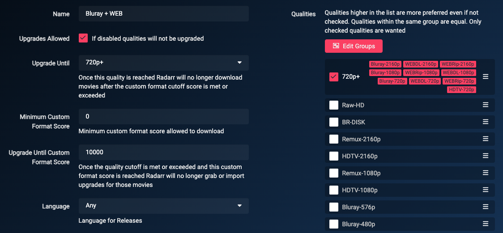

# How to setup Quality Profiles German

*aka How to setup Custom Formats (German)*  

!!! note "This guide is created and maintained by [Lokilicious](https://github.com/Lokilicious) and [PCJones](https://github.com/PCJones)"

So what is the best way to set up the Custom Formats and which one to use with which scores to get German (or German+English dual) audio?

Regarding quality there isn't a best setup, it depends on your setup (hardware devices) and your own personal preferences.

Some prefer high quality audio (HD Audio), others high quality video. Many prefer both.

TRaSH created a [flowchart](/Radarr/Radarr-setup-custom-formats/#which-quality-profile-should-you-choose){:target="_blank" rel="noopener noreferrer"} to make your decision/choices easier. Remember that this chart does not include any of the following Custom Formats and you will still need to read this guide to get German only/German Dual Language("German DL") releases.

------

## Basics

It is quite important that you follow and understand what is envisioned by Trash's guide:

- Adding Custom Formats, as explained in [How to import Custom Formats](/Radarr/Radarr-import-custom-formats/){:target="_blank" rel="noopener noreferrer"}.
- Setting up a quality Profile to make use of the Custom Formats, as explained in [How to setup Quality Profiles | Basics section](/Radarr/radarr-setup-quality-profiles/#basics){:target="_blank" rel="noopener noreferrer"}.

------

!!! warning "Mandatory"

    The only two changes that are needed and **mandatory** for German Custom Formats to work is to set the preferred language profile for your releases to `Any` and disable the preference of Propers and Repacks.

    ??? success "Screenshot example - [Click to show/hide]"
        

    !!! info
        We do choose `Any` for the language profile, as otherwise an English movie identified with German audio will not be grabbed and vice-versa.

    ??? tip "Proper and Repacks - [Click to show/hide]"

        We also highly recommend changing the Propers and Repacks settings in Radarr.

        `Media Management` => `File Management` to `Do Not Prefer` and use the [Repack/Proper](/Radarr/Radarr-collection-of-custom-formats/#repackproper) Custom Format.

        

        This way you make sure the Custom Formats preferences will be used and not ignored.

        You will still be able to prefer Propers and Repacks through Custom Formats that you can find at a later stage in this guide.

------

## Usages

There is two ways of using those German Custom Formats, with and without TRaSH Guide's original, international/english based group tiers (which can be found there: [Collection of Custom Formats](/Radarr/Radarr-collection-of-custom-formats/){:target="_blank" rel="noopener noreferrer"}).
To illustrate this, you will see an **"Original mix (optional)"** section in each of the examples below. if you are interested in German audio only you don't need this. This Custom Formats are only useful and recommended if you prefer German Dual Language releases but will also want download original/English audio if no German Dual Language is available (yet). This ensures that the original/English release will also be of the best quality possible.

------

## Examples of Quality Profile

### Merge Qualities

In order to allow upgrades based on language without release qualities interfering we need to [merge all desired qualities](Radarr/Tips/Merge-quality/) into one group.

??? abstract "Merge the following Qualities together - [Click to show/hide]"

    - Bluray-2160p
    - WEBDL-2160p
    - WEBRip-2160p
    - Bluray-1080p
    - WEBDL-1080p
    - WEBRip-1080p
    - Bluray-720p
    - WEBDL-720p
    - WEBRip-720p

    and name it: `Bluray|WEB`

    !!! warning "Make sure you don't check the BR-DISK."

    {! include-markdown "../../includes/starr/move-quality-to-top.md" !}

    !!! tip "Tip"
        If you are not interested in some of these resolutions, i.e. 2160p or 720p you don't need to include them.

------

### German Audio

There are multiple options on how to deal with german audio depending on your liking.

??? abstract "Explanation - [Click to show/hide]"

    !!! tip "Multi-Language definition per indexers"

        Some Indexers in **Radarr** will let you choose which audio is normally included inside a `Multi-Language` release as an option. You should choose only `Original` and `German` if you decide to use it.
        This option should only be used for German indexers where you are sure that `Multi-Language` does include both `Original` and `German` audio. Doing so in more "international" indexers can create to false positive with the German Audio CFs.

Those should be used together and are there to properly rename your release and prefer German audio over other Languages. Examples:

{! include-markdown "../../includes/german-guide/radarr-german-audio-version-en.md" !}

!!! tip "Download Original Audio but prefer/upgrade to German Audio ^^only^^ if available in similar or better quality"

    Set the Score of `{{ radarr['cf']['german-dl']['name'] }}` and `{{ radarr['cf']['german-dl-fallback']['name'] }}` to `300`

!!! tip "Download German Audio ^^only^^"

    Set the Score of `{{ radarr['cf']['original-language']['name'] }}` to `-10000`
    Note: Most German releases come as Dual Language so you might still see an English audio track beside the German one.

!!! warning "Releases where German is the original language"

    Due to technical limitations releases where German is the original language of the movie will be identified as `German DL` even though they might not contain another language.
    The only (cosmetical) impact of this is that the scores of those releases will be higher by `1000` than they are supposed to be.

------

### Releases you should avoid

This is a must-have for every Quality Profile you use. All these Custom Formats make sure you don't get Low Quality Releases.

{! include-markdown "../../includes/german-guide/radarr-german-unwanted-en.md" !}

------

### TRaSH recommendations

{! include-markdown "../../includes/cf/radarr-suggest-attention.md" !}

!!! tip "Getting the German movie name in the file and/or folder name"
    Following the recommended naming scheme for your library, whether it's Plex, Jellyfin, or Emby, you can add the ISO-2 language code at the end of the movie name tag to display the movie name in the desired language.
    The tag should look like the following: `{Movie CleanTitle:de}`. This works in both folder and file name.
    This can be done in Radarr under Settings>Media Management (with Advanced Settings enabled at the top)

------

### HD Bluray + WEB (1080p)

------

### UHD Bluray + WEB (2160p)

{! include-markdown "../../includes/german-guide/radarr-german-audio-version-en.md" !}

{! include-markdown "../../includes/cf/radarr-audio.md" !}

{! include-markdown "../../includes/cf/radarr-all-hdr-formats.md" !}

{! include-markdown "../../includes/cf/radarr-movie-versions-imaxe.md" !}

{! include-markdown "../../includes/german-guide/radarr-cf-german-bluray-web-scoring-en.md" !}

{! include-markdown "../../includes/cf/radarr-misc.md" !}

{! include-markdown "../../includes/german-guide/radarr-german-unwanted-en.md" !}

{! include-markdown "../../includes/german-guide/radarr-cf-german-resolution-scoring-en.md" !}

{! include-markdown "../../includes/german-guide/radarr-cf-german-source-scoring-en.md" !}

{! include-markdown "../../includes/cf/radarr-streaming-services.md" !}

Use the following main settings in your profile.

??? abstract "Workflow Logic - [Click to show/hide]"

    **Depending what's released first and available the following Workflow Logic will be used:**

    - When an `English` version is released it will download the release in the best available quality based on the used Custom Formats.
    - When a `German` or `German DL` version is released it will upgrade to that version.
    - The downloaded media will be upgraded to any of the added Custom Formats until a score of `10000`.

------

### Advanced Audio and HDR Formats

TRaSH provides great guides and explanations about them at the following links:

- [Advanced Audio](/Radarr/radarr-setup-quality-profiles/#advanced-audio){:target="_blank" rel="noopener noreferrer"}
- [HDR Formats](/Radarr/radarr-setup-quality-profiles/#hdr-formats){:target="_blank" rel="noopener noreferrer"}

------

## Acknowledgements

- A special thanks to [Jones](https://github.com/PCJones), Keewee, SceneNZBs and the awesome community over at the [UsenetDE Discord](https://discord.gg/NBrHshesU9) for their contribution during the creation of the guide.
- [TRaSH](https://trash-guides.info/), for granting us a small space on his guide for this, his knowledge, and his friendliness.
- and to all the people that helped us to test those profiles and formats (and continue to do so).

--8<-- "includes/support.md"
