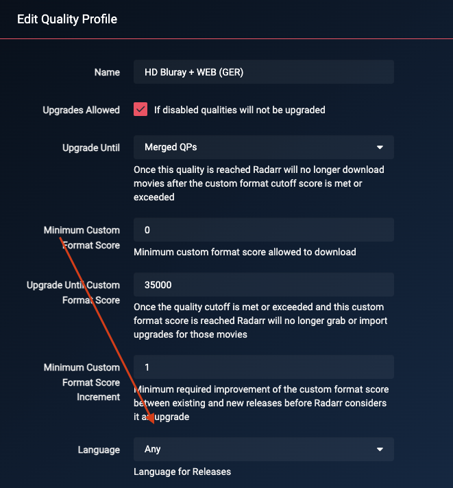

# How to setup Quality Profiles German

*aka How to setup Custom Formats to get German Audio if available*  

!!! note "This guide is created and maintained by [Lokilicious](https://github.com/Lokilicious) and [PCJones](https://github.com/PCJones)"

There isn't *the* best way to set up Custom Formats to get German (or German+English dual) audio, it depends on your setup (hardware devices) and your own personal preferences.

Some prefer high quality audio (HD Audio), others high quality video. Many prefer both.

In this Guide we try to give a recommendation which should suite most users.

---

## Basics

It is quite important that you follow and understand what is envisioned by TRaSH's guide:

- Adding Custom Formats, as explained in [How to import Custom Formats](/Radarr/Radarr-import-custom-formats/){:target="_blank" rel="noopener noreferrer"}.
- Setting up a quality Profile to make use of the Custom Formats, as explained in [How to setup Quality Profiles | Basics section](/Radarr/radarr-setup-quality-profiles/#basics){:target="_blank" rel="noopener noreferrer"}.

!!! warning "Please read those two sections before continuing the guide as they hold important information. The rest of this guide will assume you did."

!!! tip
    TRaSH created a [flowchart](/Radarr/Radarr-setup-custom-formats/#which-quality-profile-should-you-choose){:target="\_blank" rel="noopener noreferrer"} to make your decision easier. Remember that this chart does not include any of the following Custom Formats, and you will still need to read this guide to get German only/German Dual Language("German DL") releases.

---

## Using this Guide

There are two ways of using those German Custom Formats, with and without TRaSH Guide's original international/english based group tiers (which can be found there: [Collection of Custom Formats](/Radarr/Radarr-collection-of-custom-formats/){:target="_blank" rel="noopener noreferrer"}).

In this Guide we focus on the combining both languages and thus include the custom formats from TRaSHs original Guide.

These Custom Formats are recommended if you prefer German Dual Language releases but also want to download original/English audio if no German Dual Language is available (yet). This ensures that the original/English release will also be of the best quality possible.

---

## Radarr specific settings

There are a couple of changes that are needed for German Custom Formats to work properly:

??? abstract "Set the language to `Any` in the quality profile - [Click to show/hide]"
    We choose `Any` for the language profile, as otherwise an English movie identified with German audio will not be grabbed and vice-versa.

    ??? success "Screenshot example - [Click to show/hide]"
        

??? abstract "Disable Propers and Repacks - [Click to show/hide]"
    Change the Propers and Repacks settings in `Media Management` => `File Management` to `Do Not Prefer` and use the [Repack/Proper](/Radarr/Radarr-collection-of-custom-formats/#repackproper) Custom Format.

    This way you make sure the Custom Formats preferences will be used and not ignored.

    You will still be able to prefer Propers and Repacks through Custom Formats that you can find at a later stage in this guide.

    ??? success "Screenshot example - [Click to show/hide]"
        

??? abstract "Merge Qualities - [Click to show/hide]"

    In order to allow upgrades based on language without release qualities interfering we need to [merge all desired qualities](/Radarr/Tips/Merge-quality/) into one group.

    We want to merge the following Qualities together:

    - Remux-2160p
    - Bluray-2160p
    - WEBDL-2160p
    - WEBRip-2160p
    - Remux-1080p
    - Bluray-1080p
    - WEBDL-1080p
    - WEBRip-1080p
    - Bluray-720p
    - WEBDL-720p
    - WEBRip-720p

    and name it: `Bluray|WEB`

    !!! warning "Make sure you don't check the BR-DISK."

    {! include-markdown "../../includes/starr/move-quality-to-top.md" !}

    !!! tip "Tip"
        If you are not interested in some of these resolutions, i.e. 2160p or 720p you don't need to include them.

??? abstract "Adapt the Standard Movie Format and Movie Folder Format - [Click to show/hide]"
    Please have a look there: [Recommended naming scheme](/Radarr/Radarr-recommended-naming-scheme/){:target="_blank" rel="noopener noreferrer"}.

    !!! tip "Movie format/folder with French movie name"
        Radarr supports the ISO-2 naming convention for naming a movie, so replacing `{Movie CleanTitle}` with `{Movie CleanTitle:de}` will change the name to its German version.

??? abstract "Change the Indexers Multi Languages option - [Click to show/hide]"
    In Radarr, you can tell that MULTi in an indexer means that a release possesses at least certain audio. For the purpose of this guide, you will select `Original` and `German`.
    This option should only be used for German indexers. Doing so in more "international" indexers can create false positives with the German Audio CFs.

    If you do not see the option, it is because you need to activate the "Advanced Options" of Radarr.

    ??? success "Screenshot example - [Click to show/hide]"
        

---

## Score logic

--8<-- "includes/cf/score-attention.md"

---

## Quality Profiles

### German Audio

Depending what's released first and available the following Workflow Logic will be used:

- When an `English` version is released it will download the release in the best available quality based on the used Custom Formats.
- When a `German` or `German DL` version is released it will upgrade to that version.
- The downloaded media will be upgraded to any of the added Custom Formats until whats defined in the Quality Profile under `Upgrade Until Custom Format Score`.

!!! tip "Download German Audio ^^only^^"

    Set the Score of `{{ radarr['cf']['original-language']['name'] }}` to `-10000`
    Note: Most German releases come as Dual Language so you might still see an English audio track beside the German one.

!!! warning "Releases where German is the original language"

    Due to technical limitations releases where German is the original language of the movie it will be identified as `German DL` even though they might not contain another language.
    The only (cosmetic) impact of this is that the scores of those releases will be slightly higher than they are supposed to be.

---

### Releases you should avoid

This is a must-have for every Quality Profile you use. All these Custom Formats make sure you don't get Low Quality Releases.

{! include-markdown "../../includes/german-guide/radarr-german-unwanted-en.md" !}

---

### HD Bluray + WEB (1080p)

{! include-markdown "../../includes/german-guide/radarr-german-audio-version-en.md" !}

{! include-markdown "../../includes/german-guide/radarr-cf-german-hd-bluray-web-scoring-en.md" !}

{! include-markdown "../../includes/cf/radarr-misc-required.md" !}

{! include-markdown "../../includes/german-guide/radarr-cf-german-resolution-scoring-en.md" !}

{! include-markdown "../../includes/german-guide/radarr-german-unwanted-en.md" !}

{! include-markdown "../../includes/cf/radarr-streaming-services.md" !}

**The following Custom Formats are optional:**

{! include-markdown "../../includes/cf/radarr-misc-optional.md" !}

{! include-markdown "../../includes/cf/radarr-movie-versions-imaxe-noremux.md" !}

---

### UHD Bluray + WEB (2160p)

{! include-markdown "../../includes/german-guide/radarr-german-audio-version-en.md" !}

{! include-markdown "../../includes/german-guide/radarr-cf-german-uhd-bluray-web-scoring-en.md" !}

{! include-markdown "../../includes/cf/radarr-all-hdr-formats.md" !}

{! include-markdown "../../includes/cf/radarr-misc-required.md" !}

{! include-markdown "../../includes/german-guide/radarr-cf-german-resolution-scoring-en.md" !}

{! include-markdown "../../includes/german-guide/radarr-german-unwanted-en.md" !}

{! include-markdown "../../includes/cf/radarr-streaming-services.md" !}

**The following Custom Formats are optional:**

{! include-markdown "../../includes/cf/radarr-audio.md" !}

{! include-markdown "../../includes/cf/radarr-misc-optional.md" !}

{! include-markdown "../../includes/cf/radarr-misc-uhd-optional.md" !}

{! include-markdown "../../includes/cf/radarr-movie-versions-imaxe-noremux.md" !}

---

### UHD Remux (2160p)

{! include-markdown "../../includes/german-guide/radarr-german-audio-version-en.md" !}

{! include-markdown "../../includes/german-guide/radarr-cf-german-remux-web-scoring-en.md" !}

{! include-markdown "../../includes/cf/radarr-all-hdr-formats.md" !}

{! include-markdown "../../includes/cf/radarr-misc-required.md" !}

{! include-markdown "../../includes/german-guide/radarr-cf-german-resolution-scoring-en.md" !}

{! include-markdown "../../includes/german-guide/radarr-german-unwanted-en.md" !}

{! include-markdown "../../includes/cf/radarr-streaming-services.md" !}

**The following Custom Formats are optional:**

{! include-markdown "../../includes/cf/radarr-audio.md" !}

{! include-markdown "../../includes/cf/radarr-misc-optional.md" !}

{! include-markdown "../../includes/cf/radarr-misc-uhd-optional.md" !}

{! include-markdown "../../includes/cf/radarr-movie-versions-imaxe.md" !}

---

### Advanced Audio and HDR Formats

TRaSH provides great guides and explanations about them at the following links:

- [Advanced Audio](/Radarr/radarr-setup-quality-profiles/#advanced-audio){:target="_blank" rel="noopener noreferrer"}
- [HDR Formats](/Radarr/radarr-setup-quality-profiles/#hdr-formats){:target="_blank" rel="noopener noreferrer"}

---

## Acknowledgements

- A special thanks to the awesome community over at the [UsenetDE Discord](https://discord.gg/NBrHshesU9) for their contribution during the creation of the guide.
- [TRaSH](https://trash-guides.info/), for granting us a small space on his guide for this, his knowledge, and his friendliness.
- and to all the people that helped us to test those profiles and formats (and continue to do so).

--8<-- "includes/support.md"
