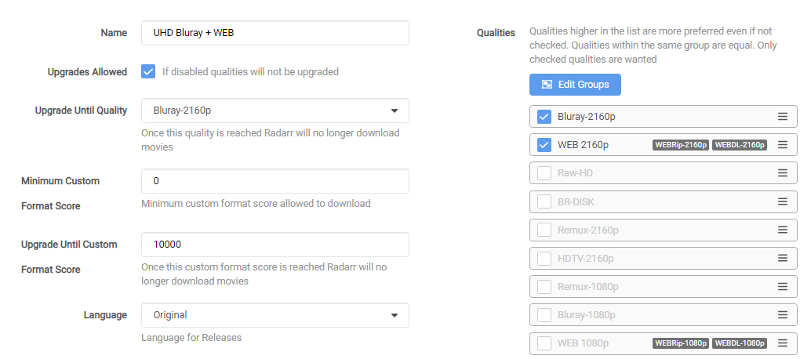

# How to set up Quality Profiles

*aka How to set up Custom Formats*  
So what's the best way to set up the Custom Formats and which ones to use with which scores to set up your quality profiles?

There isn't a "best" setup, it depends on your media setup (hardware devices) and your personal preferences.

Some prefer high-quality audio (HD Audio), others high-quality video. Many prefer both.

Here I will try to explain how to make the most use of Custom Formats to help you to set up your quality profiles for your personal needs.

I created a [flowchart](#which-quality-profile-should-you-choose) to make your decision/choices easier.

------

## Basics

After you've added the Custom Formats, as explained in [How to import Custom Formats](/Radarr/Radarr-import-custom-formats/){:target="_blank" rel="noopener noreferrer"}.
You will need to set it up in the quality Profile you want to use/prefer to make use of the Custom Formats.

`Settings` => `Profiles`

!!! info "Radarr Custom Formats can be set per profile and isn't global"
Select the profile that you want to use/prefer.

1. Profile name.
1. Allow upgrades. Radarr will stop upgrading quality once (3) is met.
1. Upgrade until the selected quality.
1. The `Minimum Custom Format Score` that is allowed to download. [More Info](#minimum-custom-format-score)
1. Keep upgrading Custom Format until this score is reached. (setting this to `0` means no upgrades will happen based on Custom Formats)
1. Your preferred language profile for your releases. (Original is recommended)

At the bottom, in your chosen profile, you will see the added Custom Formats where you can start setting up the scores.

??? success "Screenshot example - [Click to show/hide]"
    

    !!! warning
        These screenshots are just examples to show you how it should look and where you need to place the data that you need to add, they aren't always a 100% reflection of the actual data and not always 100% up to date with the actual data you need to add.

        - Always follow the data described in the guide.
        - If you have any questions or aren't sure just click the chat badge to join the Discord Channel where you can ask your questions directly.

!!! info "Keep in mind Custom Formats are made to fine-tune your Quality Profile. Generally, quality trumps all"

    Custom formats are controlled by Quality Profiles.

    - The Upgrade Until score prevents upgrading once a release with this desired score has been downloaded.
    - A score of 0 results in the custom format being informational only.
    - The Minimum score requires releases to reach this threshold otherwise they will be rejected.
    - Custom formats that match with undesirable attributes should be given a negative score to lower their appeal.
    - Outright rejections should be given a negative score low enough that even if all of the other formats with positive scores were added, the score would still fall below the minimum.

------

{! include-markdown "../../includes/merge-quality/radarr-current-logic.md" !}

------

## Which Quality Profile should you choose

??? abstract "Which Quality Profile should you choose - [Click to show/hide]"

    
*Click on the image below to see how to make use of the flowchart.*

    
{ width="10%" height="10%" }

    

    If you're unsure or have questions do not hesitate to ask for help on Discord

    [{ .off-glb }](https://trash-guides.info/discord){:target="_blank" rel="noopener noreferrer"}

------

## TRaSH Quality Profiles

The following Quality Profiles can be combined into a single Quality Profile if you, for example, want to be able to upgrade from 1080p to 4K/2160p.

### HD Bluray + WEB

If you prefer High-Quality HD Encodes (Bluray-720p/1080p)

- *Size: 6-15 GB for a Bluray-1080p depending on the running time.*

{! include-markdown "../../includes/cf/radarr-suggest-attention.md" !}

{! include-markdown "../../includes/cf/radarr-movie-versions-imaxe-noremux.md" !}

{! include-markdown "../../includes/cf/radarr-cf-hd-bluray-web-scoring.md" !}

{! include-markdown "../../includes/cf/radarr-misc.md" !}

{! include-markdown "../../includes/cf/radarr-unwanted.md" !}

{! include-markdown "../../includes/cf/radarr-optional.md" !}

{! include-markdown "../../includes/cf/radarr-streaming-services.md" !}

I decided not to add `Audio Advanced` Custom Formats to the encodes profile. You will hardly find HD audio with HD Bluray Encodes. When downloading HD Bluray Encodes, I suggest going for quality. If you want HD audio formats, I would suggest going with a Remux or UHD Encode.

Use the following main settings in your profile.

!!! warning "Make sure you don't check the BR-DISK."

The reason why I didn't select the WEB-DL 720p is that you will hardly find any releases that aren't done as 1080p WEB-DL.

{! include-markdown "../../includes/starr/move-quality-to-top.md" !}

??? abstract "Workflow Logic - [Click to show/hide]"

    - When the WEB-1080p is released it will download the WEB-1080p. (streaming services)
    - When the Bluray-1080p is released it will upgrade to the Bluray-1080p.
    - The downloaded media will be upgraded to any of the added Custom Formats until a score of `10000`.

    So why such a ridiculously high `Upgrade Until Custom` and not a score of `100`?

    Because I'm too lazy to calculate the maximum for every Quality Profile I use, and I want it to upgrade to the highest possible score anyway.

------

### UHD Bluray + WEB

If you prefer High-Quality UHD Encodes (Bluray-2160p)

- *Size: 20-60 GB for a Bluray-2160p depending on the running time.*

{! include-markdown "../../includes/cf/radarr-suggest-attention.md" !}

{! include-markdown "../../includes/cf/radarr-audio.md" !}

{! include-markdown "../../includes/cf/radarr-all-hdr-formats.md" !}

{! include-markdown "../../includes/cf/radarr-movie-versions-imaxe-noremux.md" !}

{! include-markdown "../../includes/cf/radarr-cf-uhd-bluray-web-scoring.md" !}

{! include-markdown "../../includes/cf/radarr-misc.md" !}

{! include-markdown "../../includes/cf/radarr-unwanted-uhd.md" !}

{! include-markdown "../../includes/cf/radarr-optional.md" !}

{! include-markdown "../../includes/cf/radarr-optional-uhd.md" !}

{! include-markdown "../../includes/cf/radarr-streaming-services.md" !}

Use the following main settings in your profile.

!!! warning "Make sure you don't check the BR-DISK."

{! include-markdown "../../includes/starr/move-quality-to-top.md" !}

??? abstract "Workflow Logic - [Click to show/hide]"

    **Depending on what's released first and available the following Workflow Logic will be used:**

    - When the WEB-2160p is released it will download the WEB-2160p. (streaming services)
    - When the Bluray-2160p is released it will upgrade to the Bluray-2160p.
    - The downloaded media will be upgraded to any of the added Custom Formats until a score of `10000`.

    So why such a ridiculously high `Upgrade Until Custom` and not a score of `100`?

    Because I'm too lazy to calculate the maximum for every Quality Profile I use, and I want it to upgrade to the highest possible score anyway.

------

### Remux + WEB 1080p

If you prefer 1080p Remuxes (Remux-1080p)

- *Size: 20-40 GB for a Remux-1080p depending on the running time.*

{! include-markdown "../../includes/cf/radarr-suggest-attention.md" !}

{! include-markdown "../../includes/cf/radarr-audio.md" !}

{! include-markdown "../../includes/cf/radarr-movie-versions-imaxe.md" !}

{! include-markdown "../../includes/cf/radarr-cf-remux-web-scoring.md" !}

{! include-markdown "../../includes/cf/radarr-misc.md" !}

{! include-markdown "../../includes/cf/radarr-unwanted.md" !}

{! include-markdown "../../includes/cf/radarr-optional.md" !}

{! include-markdown "../../includes/cf/radarr-streaming-services.md" !}

Use the following main settings in your profile.

!!! warning "Make sure you don't check the BR-DISK."

The reason why I didn't select the WEB-DL 720p is that you will hardly find any releases that aren't done as 1080p WEB-DL.

{! include-markdown "../../includes/starr/move-quality-to-top.md" !}

??? abstract "Workflow Logic - [Click to show/hide]"

    - When the WEB-1080p is released it will download the WEB-1080p. (streaming services)
    - When the REMUX-1080p is released it will upgrade to the REMUX-1080p.
    - The downloaded media will be upgraded to any of the added Custom Formats until a score of `10000`.

    So why such a ridiculously high `Upgrade Until Custom` and not a score of `500`?

    Because I'm too lazy to calculate the maximum for every Quality Profile I use, and I want it to upgrade to the highest possible score anyway.

------

### Remux + WEB 2160p

If you prefer 2160p Remuxes (Remux-2160p)

- *Size: 40-100 GB for a Remux-2160p depending on the running time.*

{! include-markdown "../../includes/cf/radarr-suggest-attention.md" !}

{! include-markdown "../../includes/cf/radarr-audio.md" !}

{! include-markdown "../../includes/cf/radarr-all-hdr-formats.md" !}

{! include-markdown "../../includes/cf/radarr-movie-versions-imaxe.md" !}

{! include-markdown "../../includes/cf/radarr-cf-remux-web-scoring.md" !}

{! include-markdown "../../includes/cf/radarr-misc.md" !}

{! include-markdown "../../includes/cf/radarr-unwanted-uhd.md" !}

{! include-markdown "../../includes/cf/radarr-optional.md" !}

{! include-markdown "../../includes/cf/radarr-optional-uhd.md" !}

{! include-markdown "../../includes/cf/radarr-streaming-services.md" !}

Use the following main settings in your profile.

!!! warning "Make sure you don't check the BR-DISK."

{! include-markdown "../../includes/starr/move-quality-to-top.md" !}

??? abstract "Workflow Logic - [Click to show/hide]"

    - When the WEB-2160p is released it will download the WEB-2160p. (streaming services)
    - When the REMUX-2160p is released it will upgrade to the REMUX-2160p.
    - The downloaded media will be upgraded to any of the added Custom Formats until a score of `10000`.

    So why such a ridiculously high `Upgrade Until Custom` and not a score of `500`?

    Because I'm too lazy to calculate the maximum for every Quality Profile I use, and I want it to be upgraded to the highest possible score anyway.

------

## Custom Format Groups

The following custom format groups should be combined with the Quality Profiles above. Users will need to choose which options and custom formats they prefer.

### Advanced Audio

- You have an audio setup that supports all HD Audio (TrueHD, DTS-X, DTS-HD, etc).
- You have a media player (hardware devices) that can passthrough HD audio.
- You don't have an AppleTV (Being it can't passthrough untouched HD audio).

*The reason that I score lossy Atmos higher than lossless DTS-HD MA is that I prefer having the object metadata (Atmos) over lossless audio.*

{! include-markdown "../../includes/cf/radarr-audio.md" !}

------

### HDR Formats

- You have a 4K TV and a hardware media player device (such as Roku, AppleTV, Shield, SmartTV App, etc.) that supports several HDR formats (such as Dolby Vision, HDR10, HDR10+, etc.).

{! include-markdown "../../includes/cf/radarr-all-hdr-formats.md" !}

------

## FAQ & INFO

### Proper and Repacks

??? tip "Proper and Repacks - [Click to show/hide]"

    I also suggest that you change the Propers and Repacks settings in Radarr

    `Media Management` => `File Management` to `Do Not Prefer` and use the [Repack/Proper](/Radarr/Radarr-collection-of-custom-formats/#repackproper) Custom Format.

    

    This way you make sure the Custom Format preferences will be used instead.

### Custom Formats to avoid certain releases

??? question "How to use a Custom Format to avoid certain releases? - [Click to show/hide]"

    For Custom Formats you really want to avoid, set it to something really low like `-10000` and not something like `-10`.
    When you add your preferred Custom Format and set it to something like `+10`, it's possible that, for example, the `BR-DISK` will be downloaded - (-10)+(+10)=0 - if your `Minimum Custom Format Score` is set at `0`.

### Releases you should avoid

This is a must-have for every Quality Profile you use in my opinion. All these Custom Formats make sure you don't get Low Quality Releases.

{! include-markdown "../../includes/cf/radarr-unwanted.md" !}

### Custom Formats with a score of 0

??? question "What do Custom Formats with a score of 0 do? - [Click to show/hide]"

    All Custom Formats with a score of 0 are purely informational and don't do anything.

### Minimum Custom Format Score

??? info "Minimum Custom Format Score - [Click to show/hide]"

    Some people suggest not to use negative scores for your Custom Formats and set this option to a higher score than 0.

    The reason why I don't prefer/use this is because you could limit yourself when some new groups or whatever will be released.

    Also, it makes it much more clear what you prefer and what you want to avoid.

### Audio Channels

??? info "Audio Channels - [Click to show/hide]"

    Elsewhere in the guide, you will find a separate group of custom formats called `Audio Channels`. These will match the number of audio channels in a release, for example, 2.0 (stereo) or 5.1/7.1 (surround sound). Personally, I wouldn't add the audio channels Custom Formats as you could limit yourself in the amount of releases you're able to get. Only use them if you have a specific need for them.

    Using this with any kind of Remux Quality Profile is useless, in my opinion, being that 99% of all Remuxes are multi-audio anyway. You can get better scores just by using the `Audio Advanced` Custom Formats.

### Avoid using the x264/x265 Custom Format

??? tip "Avoid using the x264/x265 Custom Format - [Click to show/hide]"

    Avoid using the x264/x265 Custom Format with a score if possible, it's smarter to use the [{{ radarr['cf']['x265-hd']['name'] }}](/Radarr/Radarr-collection-of-custom-formats/#x265-hd){:target="_blank" rel="noopener noreferrer"} Custom Format.

    Something like 95% of video files are x264 and have much better direct play support. If you have more than a of couple users, you will notice much more transcoding.

    Use x265 only for 4k releases and the [{{ radarr['cf']['x265-hd']['name'] }}](/Radarr/Radarr-collection-of-custom-formats/#x265-hd){:target="_blank" rel="noopener noreferrer"} makes sure you still get the x265 releases.

### Why am I getting purple or green colors

{! include-markdown "../../includes/cf/dv-info-green-purple.md" !}

### Dolby Vision Profiles

{! include-markdown "../../includes/cf/dv-info-profiles.md" !}

## Thanks

Special thanks to everyone who helped with the testing and creation of these Custom Formats.

--8<-- "includes/support.md"
