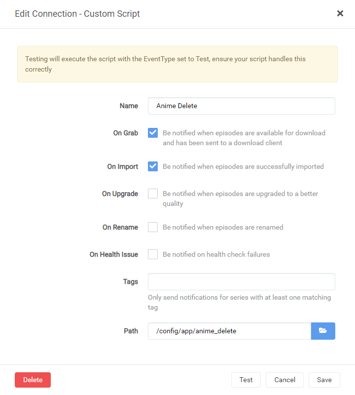
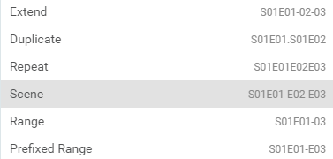
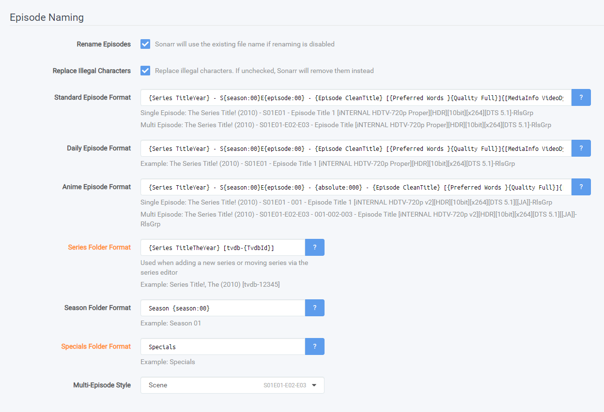
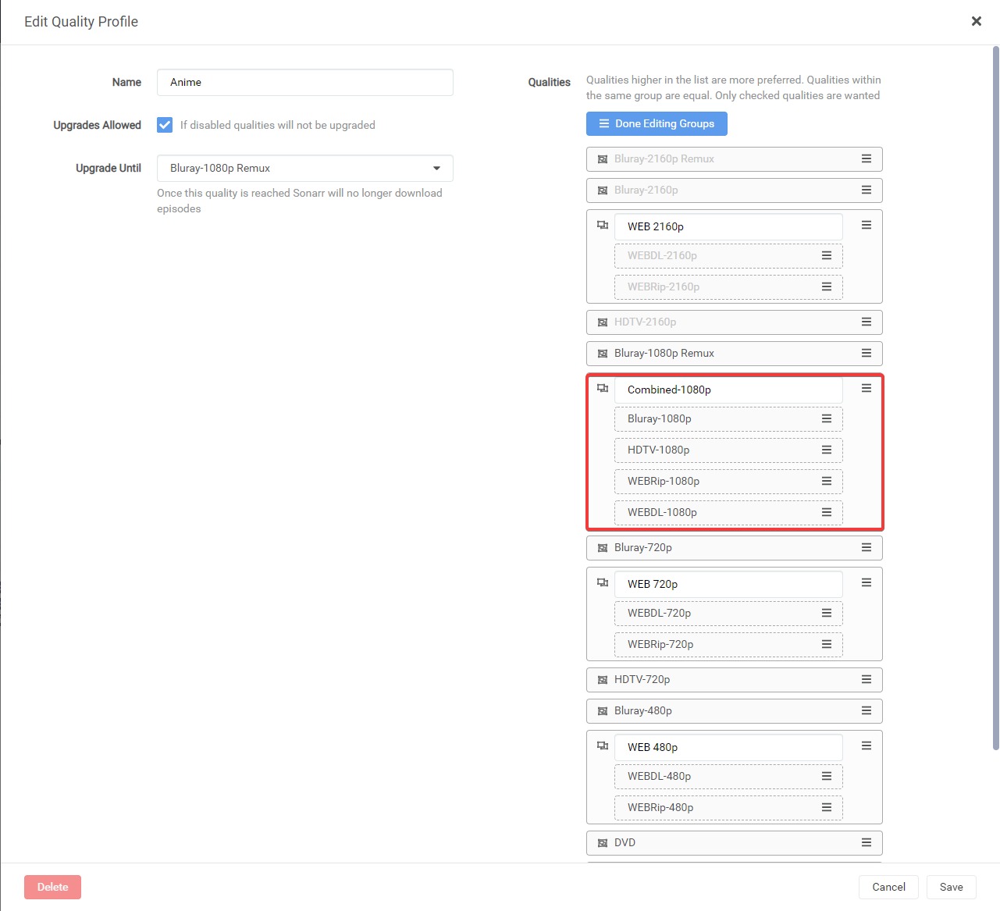
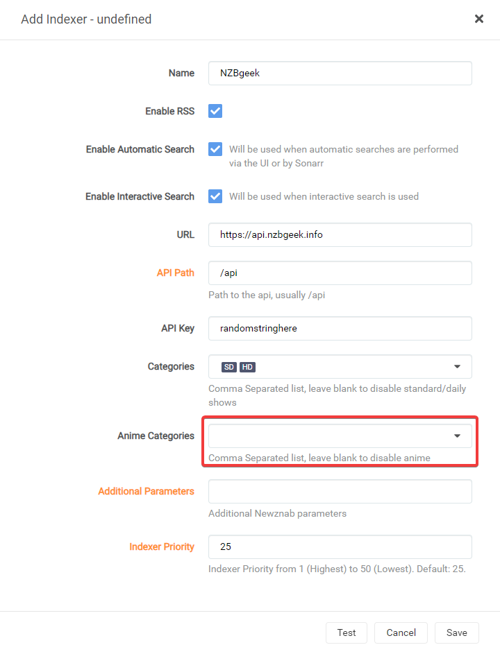
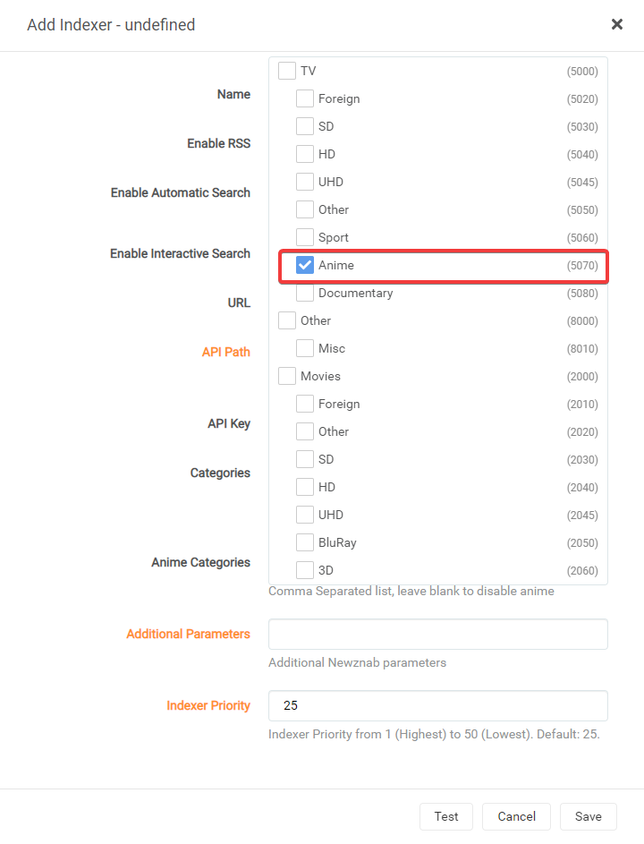
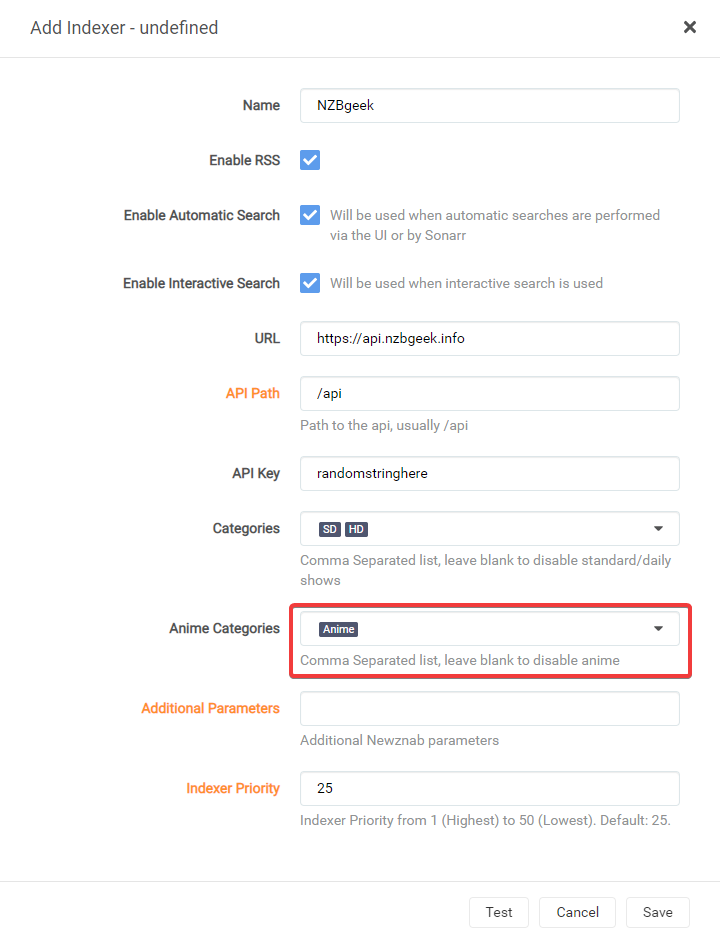
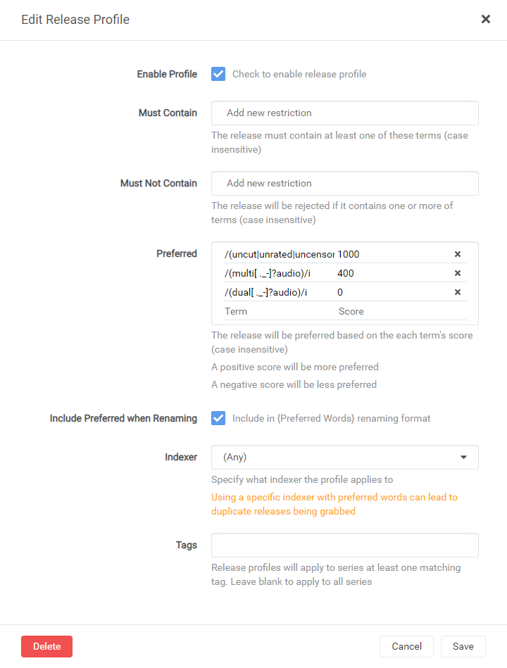
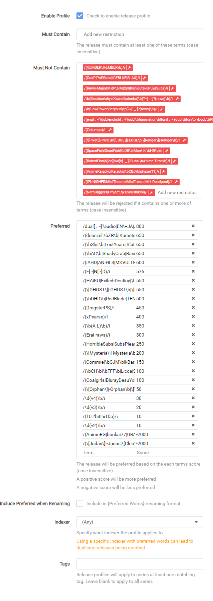
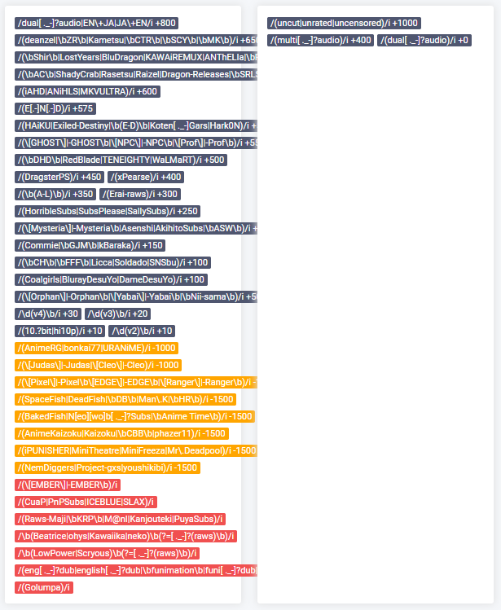

{! include-markdown "../../includes/sonarrv3-eol.md" !}

# Release Profile RegEx (Anime)

!!! note
    This guide is created and maintained by [Visorask/Visorak](https://github.com/Visorask)

    It's recommended to run two Sonarr instances. One for Anime and one for normal tv shows, or you can make use of tags.

    Being that release profiles are global without the use of a tag.

## Dual-Audio Regex

Having tested most of these settings, they work pretty well, but Anime is a fickle beast to toy with so be warned.

---

## Anime Delete

??? tip "If you have issues with extra files being downloaded like NCED or NCOP"

    If you have issues with Sonarr picking up a bunch of:

    - NCED
    - NCOP
    - Music Videos
    - OP's

    Then this script (linux based only) will delete these files and get rid of them and you don't have to worry about them cluttering up your Auto or Manual import process.

    ```bash
    #!/usr/bin/env bash

    # Set the following location to your completed download location for Anime.
    # Usually one of the following paths:
    # Dockers => /data/{usenet|torrents}/anime
    # Cloudbox => /mnt/local/downloads/nzbs/nzbget/completed/sonarranime
    location="/your/download/path/here"

    find $location -type f \( -iname "*op[0-9]*" -o -iname "*nced*" -o -iname "*ncop*" -o -iname "*music video*" \) -exec rm -rf {} \;
    ```

    This script will be called through a custom connection in Sonarr.

    1. Copy the contents of the script into whatever filepath Sonarr has access to (`/config/app/` or `/appdata/sonarr/scripts`)
    1. Edit the `location="/your/download/path/here"` and make sure it's in quotes.
    1. Then save it and chmod +x the script.
    1. In Sonarr go to `Settings` => `Connect` => Click on the `+` Symbol => and select `Custom Script`
    1. Change Name to whatever you like.
    1. Select `On Grab` and `On Import`.
    1. Click the Folder icon or type in the path to the script you chose earlier.

    

    Now when you download or import any files the script will run and clear out those files that you most likely won't use and if you want them well this script isn't for you.

---

## Media Management

!!! note

    There are a few settings which make life a lot easier when tracking down and keeping certain information for your Anime and with tweaks to make it work better with [HamaAgent](https://github.com/ZeroQI/Hama.bundle){:target="_blank" rel="noopener noreferrer"} for Plex.

### Suggested naming scheme

For this I used the [Sonarr Recommended naming scheme](/Sonarr/Sonarr-recommended-naming-scheme/#anime-episode-format){:target="_blank" rel="noopener noreferrer"} with only a small change for a formatting error to be fixed and the `Series Folder Format` for easier matching.

#### Anime Episode Format

Has all necessary information and a little extra if you needed to rebuild.

```bash
{Series TitleYear} - S{season:00}E{episode:00} - {absolute:000} - {Episode CleanTitle} [{Preferred Words }{Quality Full}]{[MediaInfo VideoDynamicRange]}[{MediaInfo VideoBitDepth}bit]{[MediaInfo VideoCodec]}[{Mediainfo AudioCodec} { Mediainfo AudioChannels}]{MediaInfo AudioLanguages}{-Release Group}
```

??? abstract "RESULTS:"

    Single Episode:

    `The Series Title! (2010) - S01E01 - 001 - Episode Title 1 [AMZN WEBDL-1080p v2][HDR][10bit][x264][DTS 5.1][FLAC][JA]-RlsGrp`

    Multi Episode:

    `The Series Title! (2010) - S01E01-E02-E03 - 001-002-003 - Episode Title [AMZN WEBDL-1080p v2][HDR][10bit][x264][DTS 5.1][FLAC][JA]-RlsGrp`

#### Series Folder Format

Adding year back in with tvdb id allows matching to be correct. Thanks salty.

```bash
{Series TitleYear} [tvdb-{TvdbId}]
```

RESULT:

`The Series Title! (2010) [tvdb-12345]`

#### Season Folder Format

The only one real option to use in my opinion.

```bash
Season {season:00}
```

RESULT:

`Season 01`

#### Multi-Episode Style

```bash
Prefixed Range
```

RESULTS:



??? success "Example"

    

---

## Quality Profile

We need to add `HDTV-1080p` and `Bluray-1080p` into the same group as `WEBDL-1080p` and `WEBRip-1080p` so that it will download correctly and not upgrade past HDTV-1080P if Preferred Words does not allow it.



---

## Indexers

We need to add the Anime Categories to our indexers otherwise this all won't work very well.

??? success "Example"

    1. We need to open `Settings -> Indexers`
    1. Select the Indexer(s) you would like to use for `Anime`
    1. Select the dropdown for `Anime Categories`.
    
    1. Select the `Anime` category.
    
    1. Click outside the pop-up modal but inside the `Add Indexer` modal.
    

---

!!! note

    Check mark `Include Preferred when Renaming` where applicable and add `{Preferred Words}` to your renaming scheme else you could get a download loop issues!!!

## Release Profiles

!!! note
    We're going to make use of **2** separate release profiles.

### First Release Profile

<!-- [trash_id: 31f4dd7b08bc8a43099eed604fd8acf6] -->
!!! tip
    **DO** Check mark `Include Preferred when Renaming` on this release profile.
    

#### Multi-Audio

Add this to your Preferred with a score of **[500]**

```bash
/(multi[ ._-]?audio)/i
```

#### Dual-Audio

Add this to your Preferred with a score of **[0]**. This is for renames only and that's why it is at **0**. It is also added in the second profile. This one is to ensure that the preferred words get added.

```bash
/(dual[ ._-]?audio)/i
```

#### Optional (uncut|unrated|uncensored)

Add this to your Preferred with a score of **[100]/[-10000]**

If you would like it to be priority then set to **100**. If you do not want uncensored set it to **-10000**. If you don't care either way just leave it out. The reasoning behind only **100** is so that it doesn't trump other release further up in the chain, this way it will trump maybe a couple releases, but not more. And **-10000** to hopefully put it at the bottom of any tier list if you don't want it.

```bash
/(uncut|unrated|uncensored|\b(AT[-_. ]?X)\b)/i
```

!!! note

    When done it should look something like this:
    

---

### Second Release Profile

<!-- [trash_id: c3a45e86f61f3a801428d1538918e41f] -->
!!! warning
    **DO NOT** Check mark `Include Preferred when Renaming`
    

#### Must Not Contain

The reason most of these are added is due to their shitty quality or just in general are not as good as other stuff that is out there. This can be tweaked as needed. Let me know if you run into any issues here. You should be able to just copy paste these in one go. If there is a reason something shouldn't be here let me know and your logic and I will be open to adjusting.

!!! tip

    If you would like `dub` releases then remove the last 2 lines and do not add them.

```bash
/(\[EMBER\]|-EMBER\b|DaddySubs)/i,
/(BDMV|M2TS|\bSSA\b|\bVOSTFR\b|\bAbemaTV\b)/i,
/(CuaP|PnPSubs|ICEBLUE|SLAX|U3-Web)/i,
/(Raws-Maji|\bKRP\b|M@nI|Kanjouteki|PuyaSubs)/i,
/\b(Beatrice|ohys|Kawaiika|neko|daddy)[ ._-]?(raws)\b/i,
/\b(LowPower|Scryous)[ ._-]?(raws)\b/i,
/\b(NS|AREY|BDMV|BDVD|BJX|DKB|DP|TnF)\b/i,
/(Amb3r|DsunS|ExREN|\$tore-Chill)/i,
/(\[Hatsuyuki\]|-Hatsuyuki\b|\[Hitoku\]|-Hitoki\b)/i,
/(\[Foxtrot\]|-Foxtrot\b|HollowRoxas|\bMGD\b)/i,
/(JacobSwaggedUp|KEKMASTERS|\[Mites\]|-Mites\b)/i,
/(neoHEVC|Pantsu|\[Pao\]|-Pao\b|Plex Friendly)/i,
/(Rando235|RandomRemux|Reaktor|RightShiftBy2)/i,
/(\bSHFS\b|StrayGods|\bUQW\b|Yabai_Desu_Ne)/i,
/(YakuboEncodes|\b(WtF[ ._-]?Anime)\b)/i,
/((funi|eng(lish)?)_?dub|\bdub(bed)?\b)/i,
/(Golumpa|torenter69|KamiFS|KaiDubs)/i
```

#### Preferred

!!! note

    Two lines in one grouping is just there for readability purposes but achieves the same result and score.

---

Add this to your Preferred with a score of **[501]**

!!! note
    This is set to **501** so that it may jump one tier if need be, but not more.

```bash
/dual[ ._-]?audio|EN\+JA|JA\+EN/i
```

---

!!! tip
    These next few are optional, but they are here to move releases up over lower tiers of `1080/720p` or `WEB-DL/Blu-Ray`. Will add another note like this to end the optional section.

---

Add this to your Preferred with a score of **[100]**

!!! note
    We are adding this as **100** so that any unknown `Blu-Ray` can jump tiers inside the Subs categories but not interfere with any tiers above.

```bash
/\b(?:(Blu-?Ray|BDMux|BD(?!$))|(B[DR]Rip))(?:\b|$|[ .])/ix
```

---

Add this to your Preferred with a score of **[15]**

```bash
/\b(WEB[-_. ]?DL|WebHD|[. ]WEB[. ](?:[xh]26[45]|DDP?5[. ]1)|[. ](?-i:WEB)$|\d+0p(?:WEB-DLMux|\b\s\/\sWEB\s\/\s\b))/ix
```

---

Add this to your Preferred with a score of **[10]**

```bash
/(Web-?Rip|WEBMux)/ix
```

---

Add this to your Preferred with a score of **[5]**

```bash
/\b(?:(1080p|1920x1080|1440p|FHD|1080i|4kto1080p))\b/i
```

!!! tip
    This is the end of the optional section.

Add this to your Preferred with a score of **[4000]**

BluRay-Remux / Dual-Audio / 1st Tier

```bash
/(deanzel|\bZR\b|\bCTR\b|\bSCY\b|\bMK\b|TTGA)/i
```

```bash
/(\bShir\b|LostYears|BluDragon|KAWAiREMUX)/i
```

```bash
/(\[AC\]|-AC$|ShadyCrab|Rasetsu|Raizel|Dragon-Releases)/i
```

```bash
/(\[Spark\]|-Spark\b|\bREVO\b|\bSRLS\b|ANThELIa)/i
```

```bash
/(\[Vanilla\]|-Vanilla\b|\bAP\b)/i
```

---

Add this to your Preferred with a score of **[3750]**

BluRay / Dual-Audio / Special (Releases they have are in between below releases and remuxes above.)

```bash
/(E[.-]N[.-]D)/i
```

---

Add this to your Preferred with a score of **[3500]**

BluRay / Dual-Audio / 1st Tier

```bash
/(\bHAiKU\b|Exiled-Destiny|\b(E-D)\b|Koten[ ._-]Gars)/i
```

```bash
/(\[GHOST\]|-GHOST\b|\[NPC\]|-NPC\b|\bCBM\b)/i
```

```bash
/(\bKH\b|\bCBT\b|\[naiyas\]|-naiyas\b|ShowY|Kametsu|\bPn8\b|Hark0N)/i
```

---

Add this to your Preferred with a score of **[3000]**

BluRay / Dual-Audio / Scene|P2P Groups

```bash
/(\bDHD\b|RedBlade|TENEIGHTY|WaLMaRT)/i
```

```bash
/(\bBMF\b|\[STRiFE\]|-STRiFE\b)/i
```

```bash
/(MKVULTRA|iAHD|ANiHLS)/i
```

---

Add this to your Preferred with a score of **[2500]**

BluRay / Dual-Audio / 2ndd Tier

```bash
/(\[YURASUKA\]|-YURASUKA\b|karios|Arukoru)/i
```

```bash
/(\bRH\b|\[Prof\]|-Prof\b)/i
```

---

Add this to your Preferred with a score of **[2000]**

WebSource / Dual|Multi-Audio

```bash
/(DragsterPS)/i
```

---

Add this to your Preferred with a score of **[1500]**

WebSource / Dual-Audio

```bash
/(xPearse|\bMCR\b|\bKS\b|KiyoshiStar)/i
```

---

Add this to your Preferred with a score of **[1000]**

DVD / Dual-Audio

```bash
/(\b(A-L)\b)/i
```

---

Add this to your Preferred with a score of **[300]**

Subs with multi such as German, French , Spanish, Italian, Russian, Arabic, Portuguese and English

```bash
/(Erai-raws|KAN3D2M)/i
```

---

Add this to your Preferred with a score of **[250]**

Subs

```bash
/(HorribleSubs|SubsPlease|SallySubs)/i
```

---

Add this to your Preferred with a score of **[200]**

Subs 2nd Tier

```bash
/(\[Mysteria\]|-Mysteria\b|Asenshi)/i
```

```bash
/(\[meta\]|-meta\b|BlueLobster)/i
```

---

Add this to your Preferred with a score of **[150]**

Subs 3rd Tier

```bash
/(\bGJM\b|kBaraka)/i
```

---

Add this to your Preferred with a score of **[100]**

FanSubs 1st Tier

```bash
/(\bCH\b|\bFFF\b|Licca|Soldado|SNSbu)/i
```

```bash
/(Coalgirls|BlurayDesuYo|DameDesuYo|\bPAS\b)/i
```

---

Add this to your Preferred with a score of **[50]**

FanSubs 2nd Tier

```bash
/(\[Orphan\]|-Orphan\b|\[Yabai\]|-Yabai\b|\bNii-sama\b)/i
```

```bash
/(\[Doki\]|-Doki\b|\[Chihiro\]|-Chihiro\b|Final8)/i
```

```bash
/(\[tenshi\]|-tenshi\b|SHiN-gx)/i
```

---

Add this to your Preferred with a score of **[25]**

FanSubs 3rd Tier

```bash
/(AkihitoSubs|\bASW\b|Commie)/i
```

---

!!! note

    These are extra parameters that can help and are not needed but are nice to have. They are set low mainly to supercede themselves and not interfere with other releases.

Add this to your Preferred with a score of **[1]**

Adds Hi10|Hi10p into a match. Prefers this over some erroneous matches.

```bash
/(10.?bit|hi10p)/i
```

---

Add this to your Preferred with a score of **[1]**

Adds version due to anime groups sometimes fixing issues with their releases.

```bash
/\b(v2)\b/i
```

---

Add this to your Preferred with a score of **[2]**

```bash
/\b(v3)\b/i
```

---

Add this to your Preferred with a score of **[3]**

```bash
/\b(v4)\b/i
```

---

!!! note

    This section can be controversial but most of these releases are micro/mini encodes or crappy quality. I personally add them into the do not want section but I will leave them here with negative values so you can still grab them if all else fails.

Add this to your Preferred with a score of **[-10000]**

Sub-Par Releases 1st Tier (Re-encoded to crap or really small filesizes) (Little less worse than the rest)

```bash
/(\[Judas\]|-Judas|\[Cleo\]|-Cleo)/i
```

```bash
/(AnimeRG|bonkai77|URANiME)/i
```

---

Add this to your Preferred with a score of **[-15000]**

Sub-Par Releases 2nd Tier (Re-encoded to crap or really small filesizes) (Seperated onto separate lines for readability)

```bash
/(\[Pixel\]|-Pixel\b\[EDGE\]|-EDGE\b|\[Ranger\]|-Ranger\b)/i
```

```bash
/(SpaceFish|DeadFish|\bDB\b|Man\.K|\bHR\b)/i
```

```bash
/(BakedFish|N[eo][wo]b[ ._-]?Subs|\bAnime[ .]Time\b)/i
```

```bash
/(AnimeKaizoku|\[Kaizoku\]|-Kaizoku\b|\bCBB\b|phazer11)/i
```

```bash
/(iPUNISHER|MiniTheatre|MiniFreeza|Mr\.Deadpool)/i
```

```bash
/(NemDiggers|Project-gxs|youshikibi)/i
```

```bash
/(\bMD\b|Pog42|mdcx)/i
```

```bash
/(A-Destiny|TOPKEK|\bUwU\b|DARKFLiX)/i
```

```bash
/(\[Maximus\]|-Maximus\b|\[224\]|-224\b)/i
```

```bash
/(\[Harunatsu\]|-Harunatsu\b)/i
```

```bash
/(\[Davinci\]|-Davinci\b)/i
```

??? tip "If you would like the above to be in DO NOT WANT in an easy format here it is."

    ```bash
    /(\[Pixel\]|-Pixel\b\[EDGE\]|-EDGE\b|\[Ranger\]|-Ranger\b)/i,
    /(SpaceFish|DeadFish|\bDB\b|Man\.K|\bHR\b)/i,
    /(BakedFish|N[eo][wo]b[ ._-]?Subs|\bAnime Time\b)/i,
    /(AnimeKaizoku|Kaizoku|\bCBB\b|phazer11)/i,
    /(iPUNISHER|MiniTheatre|MiniFreeza|Mr\.Deadpool)/i,
    /(NemDiggers|Project-gxs|youshikibi)/i,
    /(\bMD\b|Pog42|mdcx)/i,
    /(A-Destiny|TOPKEK|\bUwU\b|DARKFLiX)/i,
    /(\[Maximus\]|-Maximus\b|\[224\]|-224\b)/i,
    /(\[Harunatsu\]|-Harunatsu\b)/i,
    /(\[Davinci\]|-Davinci\b)/i
    ```

!!! note

    When done it should look something like this:
    

---

### Completed

When completed your Release Profiles should look like this:



### Acknowledgements

Most of my information and knowledge came from:

- Kaiser (Guidance on anime groups)

- rg9400 (Guidance on regex fixes, anime groups and general knowledge share.)

- Drazzilb (Guidance on regex fixes, anime groups and general knowledge share.)

- [TRaSH](https://trash-guides.info/) (For allowing me to utilize his website for my guide and general knowledge share.)

Thanks a bunch!!

{! include-markdown "../../includes/support.md" !}
<!-- --8<-- "includes/support.md" -->
