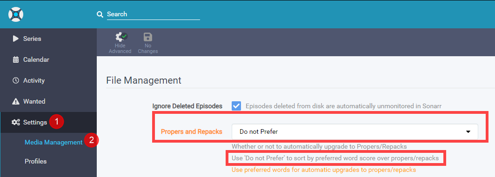
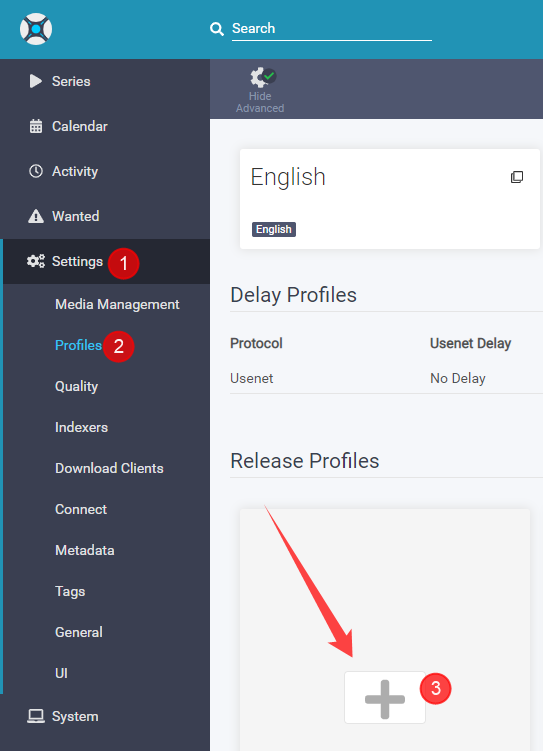
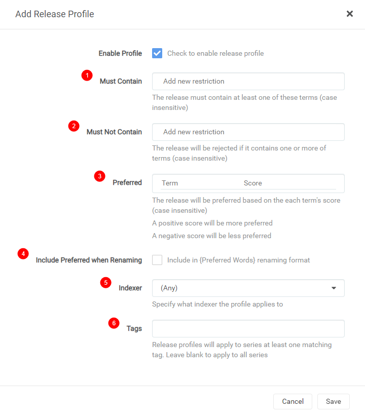
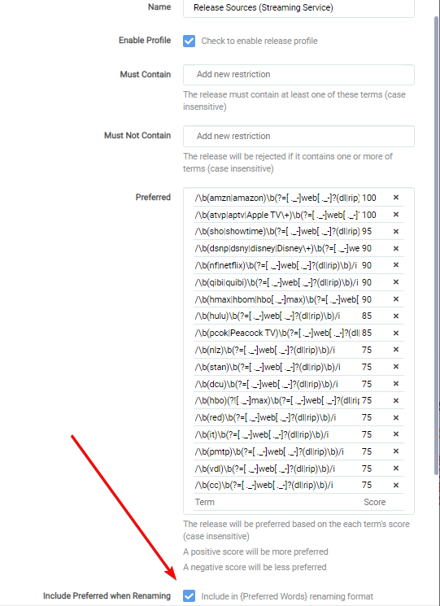
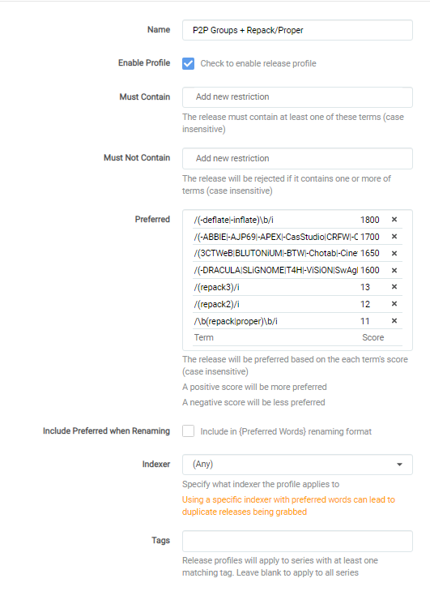
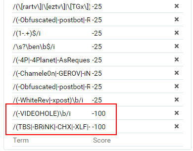
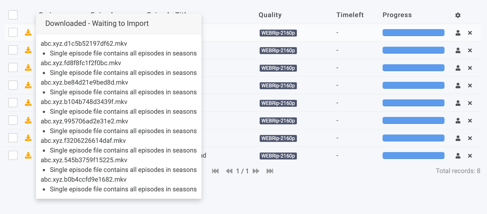
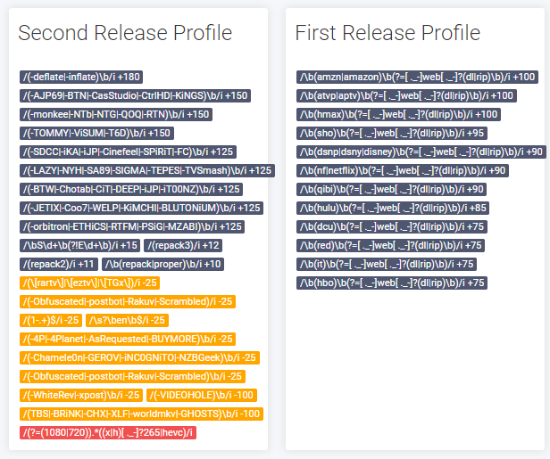

# Release Profile RegEx (WEB-DL)

Sonarr V3 has a great feature called Release Profile.
With this option you can fine tune your preference.

The Release profile that we're going to use for this example is mainly to prefer P2P releases over Scene releases. (Scene releases are still being downloaded, but replaced once an upgrade is found.)

!!! error ""
    **If you don't care about quality then stop reading and see if the other tutorials are helpful for you.**

??? question "FAQ - [CLICK TO EXPAND]"

    ## FAQ

    **Q: Why do you only have a release profile for WEB-DL?**

    A: I only do WEB-DL my self for TV shows because in my opinion WEB-DL is the sweet spot between quality and size and you often don't see big differences anyway for TV shows. (Except for shows like GOT, Vikings, etc)

    **Q: Why do you prefer P2P groups over scene groups?**

    A: Scene groups always release in a rush to bring it out as fast as possible.

    So I noticed often that I got Repacks/Proper releases from them or from different groups and quality.
    P2P releases are a bit smarter and work sort of together by not doing the same release.
    Also, I noticed that with some scene releases the 5.1 audio was stripped out or converted to AAC audio.

    In my opinion the P2P releases are of better quality.
    There's one scene group that does bring out quality releases `-deflate/-inflate`.

    **Q: Why do I see so many repacks/propers of Amazon WEB-DLs lately?**

    A: A large portion of Amazon WEB-DLs in the last week have only had 192Kbps DD+5.1, because that's all Amazon made available initially.
    The proper 640Kbps DD+5.1 audio might appear a few hours later or a few months, but when they get updated, the episodes will be REPACKED.

    **Q: Why did you remove all the scene groups?**

    A: I decided to redo the Release Profile to make it easier for me and the end user to update/manage the Release Profile. I decided not to add the scene groups anymore (and also removing the current ones). Why? Lately I noticed a lot of popup scene releases meaning we need to update often.

    With this it also means all scene and (yet) unknown groups will be getting a score of `0` and not `-50`.

    I will still keep a eye on them and add the Low Quality Groups to the `-100` score and when I find a new P2P group I will add them, resulting in less updates and a more accurate upgrade.

------

## Propers and Repacks

First we're need to make sure a P2P release isn't being replaced by a Scene Repack/Proper release!



Go to `Settings` => `Media Management`
We´re going to set it to `Do not Prefer`.

Then we navigate to `Settings` => `Profiles` and click the plus sign.



You will get a popup screen that will look like this:



1. `Must Contain` => add words that the release name **MUST HAVE!**

1. `Must Not Contain` => add words that the release name **MUST NOT HAVE OR IT WILL BE REJECTED!**

1. `Preferred` => add words you prefer with a certain score. The release will be preferred based on each term's score.

1. `Include Preferred when Renaming` => When you add `{Preferred Words}` to your renaming scheme it will add this info.

1. `Indexers` => Specify what indexer the profile applies to.

1. `Tags` => create a tag so this is only used by shows that you give this tag to or else it's global.

------

!!! summary

    The Number between the **[**brackets**]** in the following release profiles are the scores the release name will get during an automatic and manual search and with the use of the scores some releases will be preferred over others and even upgraded.

    The Number between **(**brackets**)** in the following release profiles are referring to the location where you should add this regex in the release profile corresponding the screenshot above.

!!! important
    We're going to make use of four separate release profiles.

------

## Release Sources (Streaming Service) - Release Profile

<sub>Profile 1</sub>

<!-- [trash_id: a0e7774a471e041d4f1111e0690244d0] -->

!!! note

    Check mark `Include Preferred when Renaming` and add `{Preferred Words}` to your renaming scheme or else you could get download loop issues!!!

    What it does:

    When enabled, the block with the [Release Source (Streaming Service)](#release-source-streaming-service) in it are then added to the file name which fixes any loops due to Sonarr seeing a new NF rip when an AMZN rip is found.
    Probably doesn’t happen if cutoff is met, but for anything that is unmet or any forced searches it results in a loop because NF is not in Sonarr’s copy so it upgrades, and loops.

    Enabling the include in preferred words for AMZN and adding that to the file name fixes that.

    Example of a naming scheme for series:

    Can be found [HERE](/Sonarr/Sonarr-recommended-naming-scheme/){:target="_blank" rel="noopener noreferrer"}

Add this to your `Preferred (3)` with a score of [100]

```bash
/\b(amzn|amazon)\b(?=[ ._-]web[ ._-]?(dl|rip)\b)/i
```

```bash
/\b(atvp|aptv|Apple TV\+)\b(?=[ ._-]web[ ._-]?(dl|rip)\b)/i
```

Add this to your `Preferred (3)` with a score of [95]

```bash
/\b(sho|showtime)\b(?=[ ._-]web[ ._-]?(dl|rip)\b)/i
```

Add this to your `Preferred (3)` with a score of [90]

```bash
/\b(dsnp|dsny|disney|Disney\+)\b(?=[ ._-]web[ ._-]?(dl|rip)\b)/i
```

```bash
/\b(nf|netflix)\b(?=[ ._-]web[ ._-]?(dl|rip)\b)/i
```

```bash
/\b(qibi|quibi)\b(?=[ ._-]web[ ._-]?(dl|rip)\b)/i
```

```bash
/\b(hmax|hbom|hbo max)\b(?=[ ._-]web[ ._-]?(dl|rip)\b)/i
```

Add this to your `Preferred (3)` with a score of [85]

```bash
/\b(hulu)\b(?=[ ._-]web[ ._-]?(dl|rip)\b)/i
```

```bash
/\b(pcok|Peacock TV)\b(?=[ ._-]web[ ._-]?(dl|rip)\b)/i
```

Add this to your `Preferred (3)` with a score of [75]

```bash
/\b(dcu)\b(?=[ ._-]web[ ._-]?(dl|rip)\b)/i
```

```bash
/\b(hbo)\b(?=[ ._-]web[ ._-]?(dl|rip)\b)/i
```

```bash
/\b(red)\b(?=[ ._-]web[ ._-]?(dl|rip)\b)/i
```

```bash
/\b(it)\b(?=[ ._-]web[ ._-]?(dl|rip)\b)/i
```

```bash
/\b(pmtp)\b(?=[ ._-]web[ ._-]?(dl|rip)\b)/i
```

!!! danger "Caution"
    Don't forget to click on `SAVE` after you've added everything you want to the release profile :bangbang:

??? success "example - [CLICK TO EXPAND]"

    !!! attention
        These screenshots are just examples to show you how it should look and where you need to place the data that you need to add, they aren't a 100% reflection of the actual data and not always 100% up to date with the actual data you need to add.

        - Always follow the data described in the guide (with the copy paste/option at the end).
        - If you got any questions or aren't sure just click the chat badge to join the Discord Channel where you can ask your questions directly.

        [](https://trash-guides.info/discord){:target="_blank" rel="noopener noreferrer"}

    

------

## P2P Groups + Repack/Proper - Release Profile

<sub>Profile 2</sub>

<!-- [trash_id: 37cf8cdd57c8fb4a8b68f36e00e40de2] -->

!!! warning
    DO NOT Check mark `Include Preferred when Renaming` :bangbang:

Add this to your `Preferred (3)` with a score of [180] [^1]

```bash
/(-deflate|-inflate)\b/i
```

Add this to your `Preferred (3)` with a score of [150]

```bash
/(-AJP69|-BTN|-CasStudio|-CtrlHD|-KiNGS|-monkee|-NTb|-NTG|-QOQ|-RTN|-TOMMY|-ViSUM|-T6D|-FLUX|NOSiViD)\b/i
```

Add this to your `Preferred (3)` with a score of [125]

```bash
/(-BTW|-Chotab|-CiT|-DEEP|-iJP|-iT00NZ|-LAZY|-NYH|-SA89|-SIGMA|-TEPES|-TVSmash|-SDCC|-iKA|-iJP|-Cinefeel|-SPiRiT|-FC|-JETIX|-Coo7|-WELP|-KiMCHI|-BLUTONiUM|-orbitron|-ETHiCS|-RTFM|-PSiG|-MZABI|-ROCCaT|3cTWeB|playWEB|-KHN|NPMS|-END|-SiC|-GNOME|-ABBIE)\b/i
```

Add this to your `Preferred (3)` with a score of [100]

```bash
/(-ViSiON)\b/i
```

Add this to your `Preferred (3)` with a score of [12]

```bash
/(repack3)/i
```

Add this to your `Preferred (3)` with a score of [11]

```bash
/(repack2)/i
```

Add this to your `Preferred (3)` with a score of [10]

```bash
/\b(repack|proper)\b/i
```

!!! danger "Caution"
    Don't forget to click on `SAVE` after you've added everything you want to the release profile :bangbang:

??? success "example - [CLICK TO EXPAND]"

    !!! attention
        These screenshots are just examples to show you how it should look and where you need to place the data that you need to add, they aren't a 100% reflection of the actual data and not always 100% up to date with the actual data you need to add.

        - Always follow the data described in the guide (with the copy paste/option at the end).
        - If you got any questions or aren't sure just click the chat badge to join the Discord Channel where you can ask your questions directly.

        [](https://trash-guides.info/discord){:target="_blank" rel="noopener noreferrer"}

    

------

## Low Quality Groups - Release Profile

<sub>Profile 3</sub>

<!-- [trash_id: EBC725268D687D588A20CBC5F97E538B] -->

!!! warning
    DO NOT Check mark `Include Preferred when Renaming` :bangbang:

Add this to your `Preferred (3)` with a score of [-100]

```bash
/(TBS|-BRiNK|-CHX|-XLF|-worldmkv|-GHOSTS|-VIDEOHOLE|nhanc3|Pahe\.ph|Pahe\.in|-NERO)\b/i
```

!!! danger "Caution"
    Don't forget to click on `SAVE` after you've added everything you want to the release profile :bangbang:

??? success "example - [CLICK TO EXPAND]"

    !!! attention
        These screenshots are just examples to show you how it should look and where you need to place the data that you need to add, they aren't a 100% reflection of the actual data and not always 100% up to date with the actual data you need to add.

        - Always follow the data described in the guide (with the copy paste/option at the end).
        - If you got any questions or aren't sure just click the chat badge to join the Discord Channel where you can ask your questions directly.

        [](https://trash-guides.info/discord){:target="_blank" rel="noopener noreferrer"}

    

------

## Optionals - Release Profile

<sub>Profile 4</sub>

!!! warning
    DO NOT Check mark `Include Preferred when Renaming` :bangbang:

!!! danger "Caution"
    These optionals are optional because they should only be added/used if you got a certain use case for it, if you don't understand what the optional is for then you probably don't need it :bangbang:

    :bangbang: **Except the `Golden Rule` this one is actually a must even that it's added in the optional section** :bangbang:

    If you see certain optional with a positive score and you actually don't want them just add them with a negative score !!!

### Golden rule

!!! attention ""
    :bangbang: This one is actually a must even that it's added in the optional section :bangbang:

??? question "Why the Must Not Contain entry - [CLICK TO EXPAND]"

    This one blocks/ignores 720/1080p releases that are (re-)encoded in x265.

    So why did I put `/^(?=.*(1080|720))(?=.*((x|h)[ ._-]?265|hevc)).*/i` as `Must Not Contain` and what does it do ?

    Why ?

    !!! quote
        x265 is good for for 4k stuff or 1080p if they used the the remuxes as source.
        If the media isn't source quality/remux, then there will be a loss of quality every time.
        Also, once you go x265, typically that file is done.
        It can't be changed to something else without a huge loss of quality.

        Something like 95% of video files are x264 and have much better direct play support.
        If you have more than a couple users,
        you will notice much more transcoding.
        Just depends on your priorities.

        So basically if you are storage poor and just need to save space, use x265.
        The catch is if you want best quality x265, you need source quality files, so you still have huge file sizes.
        If you want maximum compatibility and the option to change your files to something else later,
        then x264.
        It's all really dependent on specific situations for different people

    It's a shame that most x265 groups microsize the releases or use the x264 as source what results in low quality releases. And the few groups that do use the correct source suffer from it.

    That's why  I created my own golden rule.

    - 720/1080p => x264
    - 2160p/4k => x265

Add this to your `Must not contain (2)`

```bash
/^(?=.*(1080|720))(?=.*((x|h)[ ._-]?265|hevc)).*/i
```

??? success "example - [CLICK TO EXPAND]"

    

------

#### Optional - Prefer HDR

Add this to your `Preferred (3)` with a score of [10]

```bash
/\bHDR(\b|\d)/i
```

------

#### Optional - Prefer Dolby Vision

Add this to your `Preferred (3)` with a score of [100]

```bash
/\b(dv|dovi|dolby[ .]?vision)\b/i
```

------

#### Optional - Dislike retags

??? question "Explanation - [CLICK TO EXPAND]"
    Use this only if you dislike renamed and retagged releases, some indexers/trackers are known to rename or add their own tags to the release name which could mess up your results or naming.

Add this to your `Preferred (3)` with a score of [-25]

```bash
/(\[rartv\]|\[rarbg\]|\[eztv\]|\[TGx\])/i
```

#### Optional - Dislike Obfuscated

??? question "Explanation - [CLICK TO EXPAND]"
    Use this only if you dislike Obfuscated releases, some indexers are known to rename or add their own tags/obfuscated name to the release name which could mess up your results or naming.

Add this to your `Preferred (3)` with a score of [-25]

```bash
/(-4P|-4Planet|-AsRequested|-BUYMORE|-Chamele0n|-GEROV|-iNC0GNiTO|-NZBGeek|-Obfuscated|-postbot|-Rakuv|-Scrambled|-WhiteRev|-xpost|-WRTEAM|-CAPTCHA)\b/i
```

------

#### Optional - Dislike release ending: en

Add this to your `Preferred (3)` with a score of [-25]

??? question "Explanation - [CLICK TO EXPAND]"
    Some indexers are known to add extra useless info to the release name which could mess up your results or naming.

```bash
/\s?\ben\b$/i
```

------

#### Optional - Dislike release containing: 1-

??? question "Explanation - [CLICK TO EXPAND]"
    Some indexers are known to add extra useless info to the release name which could mess up your results or naming.

    Matches any release that contains '1-' as prefix for Release Groups

Add this to your `Preferred (3)` with a score of [-25]

```bash
/(?<!\d\.)(1-.+)$/i
```

------

#### Optional - Prefer Season Packs

??? question "Explanation - [CLICK TO EXPAND]"
    Use this if you prefer Season packs

!!! warning ""

    - This will upgrade also your already downloaded single episodes
    - `/\bS\d+\b(?!E\d+\b)/i` season packs are preferred: however, given the folder name is ignored the error/warning/issue occurs as the file names would not be a season pack of course.
    - keep in mind this is the only way to prefer season packs if you have preferred words due to the long standing bug => Preferred Words overrule season pack preference [Sonarr/Sonarr#3562](https://github.com/Sonarr/Sonarr/issues/3562){:target="_blank" rel="noopener noreferrer"}

Add this to your `Preferred (3)` with a score of [15]

```bash
/\bS\d+\b(?!E\d+\b)/i
```

------

##### .su season pack issue

??? bug ".su season pack issue - [CLICK TO EXPAND]"

    When you see a error in Sonarr that looks somehow like the follow screenshot

    

    Then there is only one way real way that always solves this issue.
    create a new release profile specific for .su that uses the [Season regex](#optional-matches-season-packs-use-this-if-you-prefer-season-packs) as `Must not contain (2)`

    

    !!! note
        There is a [script](/NZBGet/scripts/#wtfnzb-renamer){:target="_blank" rel="noopener noreferrer"} for NZBGet that sometimes could help but it seems it doesn't always work. It also seems there is a work around for SABnzbd but i can't confirm being i'm not using Sab.

------

#### Optional - Ignore Dolby Vision without HDR10 fallback

??? question "Explanation - [CLICK TO EXPAND]"

    This is a RegEx that ignores DV that don't have the fallback to HDR10, What can results in playback issues like weird colors if you want to play it on a not Dolby Vision compatible setup.

Add this to your `Must not contain (2)`

```bash
/^(?!.*(HDR|HULU|REMUX))(?=.*\b(DV|Dovi|Dolby[- .]?Vision)\b).*/i
```

------

#### Optional - Ignore The Group -SCENE

??? question "Explanation - [CLICK TO EXPAND]"

    Seems plex ignores `-scene` because it thinks they are extra's. [SOURCE](https://github.com/squaresmile/Plex-Plug-Ins/blob/61eda8a775e198971dcf5088c4daf264a844736f/Scanners.bundle/Contents/Resources/Common/VideoFiles.py#L11){:target="_blank" rel="noopener noreferrer"}

Add this to your `Must not contain (2)`

```bash
/\b(-scene)\b/i
```

------

#### Optional - Ignore scene releases

??? question "WHY ? - [CLICK TO EXPAND]"

    If you don't want to download so called scene releases.

Add this to your `Must not contain (2)`

```bash
/^(?!.*(web[ ]dl|-deflate|-inflate))(?=.*([_. ]WEB[_. ]|-CAKES\b|-GGEZ\b|-GGWP\b|-GLHF\b|-GOSSIP\b|-KOGI\b|-PECULATE\b)).*/i

```

#### Optional - Ignore Bad Dual Audio Groups

??? question "WHY ? - [CLICK TO EXPAND]"

    These groups take the original release, then they add their own preferred language (ex. Portuguese) as the main audio track (AAC 2.0), What results after renaming and FFprobe that the media file will be recognized as Portuguese AAC audio. It's a common rule that you add the best audio as first.
    Also they often even rename the release name in to Portuguese.

Add this to your `Must not contain (2)`

```bash
/\b(-alfaHD|-BAT|-BNd|-C\.A\.A|-Cory|-FF|-FOXX|-G4RiS|-GUEIRA|-N3G4N|-PD|-RiPER|-RK|-SiGLA|-Tars|-WTV|-Yatogam1|-YusukeFLA)\b/i
```

------

### A little explanation of the scores and why

- Scores [75]-[100] Release Source.
- Scores [125]-[150] P2P Groups.
- Scores [10] Give a repack/proper a higher score but don't trump P2P groups for a Scene fix.
- Scores [-25] Retagged/Renames/Obfuscated  releases.

    !!! danger ""
        If you're getting often a error message like `Has the same filesize as existing file`, you might need to consider to remove the [-25]

- Scores [-100] Groups that mess with the audio or add another preferred language.

Optional => We've tested it and it worked for what we've tested it on, if it will work in your situation we don't know.

If you notice something wrong just contact me and we will try to fix it or remove it.

## Final Results

When you've done it correctly it will look something like this.

??? success "example - [CLICK TO EXPAND]"

    !!! attention
        These screenshots are just examples to show you how it should look and where you need to place the data that you need to add, they aren't a 100% reflection of the actual data and not always 100% up to date with the actual data you need to add.

        - Always follow the data described in the guide (with the copy paste/option at the end).
        - If you got any questions or aren't sure just click the chat badge to join the Discord Channel where you can ask your questions directly.

        [](https://trash-guides.info/discord){:target="_blank" rel="noopener noreferrer"}

    

------

This list is made by collecting information from Sonarr Discord Channel, and personal testing and a few others that helped.

So I want to thank everyone who helped to make this list possible, for privacy reasons I decided not to add the names/nick of the persons.

If you want to be mentioned please message me on discord, including a link for proof to what part you want to be credited.

!!! info

    Keep in mind this list will be a constant work in progress because I will be updating it when it's needed.

    So best to set a notification for updates for this page.

    Or use one of the 3rd Party Sync options that you can find [HERE](/Misc/trash-sync){:target="_blank" rel="noopener noreferrer"}.

------

{! include-markdown "../../includes/support.md" !}
<!-- --8<-- "includes/support.md" -->

[^1]:

    The reason why this one get's such a high score is because it's the only quality scene group that exist (till now) and scene groups don't add the [Release Sources (Streaming Service)](#release-sources-streaming-service) to their release name so they don't get the extra point of the release source regex.
