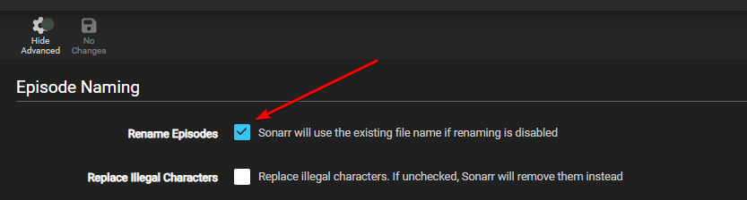

# Recommended naming scheme

--8<-- "includes/starr/renaming-description-faq.md"

---

## Preparation

Go to `Settings` => `Media Management` and make sure that `Show Advanced` at the top is enabled.


Once you clicked on the button it should look like this and you should see all the advanced options.


Finally, enable `Rename Episodes` to reveal the episode renaming options.



---

## Episode Format

=== "Standard"

    ```bash
    {{ sonarr['naming']['sonarr-naming']['episodes']['standard']['default'] }}
    ```

    <sub><sup>**Single Episode**: `The Series Title! (2010) - S01E01 - Episode Title 1 [AMZN WEBDL-1080p Proper][DV HDR10][DTS 5.1][x264]-RlsGrp`</sup></sub>

    <sub><sup>**Multi Episode**: `The Series Title! (2010) - S01E01-E03 - Episode Title [AMZN WEBDL-1080p Proper][DV HDR10][DTS 5.1][x264]-RlsGrp`</sup></sub>

=== "Daily"

    ```bash
    {{ sonarr['naming']['sonarr-naming']['episodes']['daily']['default'] }}
    ```

    <sub><sup>**Example**: `The Series Title! (2010) - 2013-10-30 - Episode Title 1 [AMZN WEBDL-1080p Proper][DV HDR10][DTS 5.1][x264]-RlsGrp`</sup></sub>

=== "Anime"

    ```bash
    {{ sonarr['naming']['sonarr-naming']['episodes']['anime']['default'] }}
    ```

    <sub><sup>**Single Episode**: `The Series Title! (2010) - S01E01 - 001 - Episode Title 1 [iNTERNAL HDTV-720p v2][HDR10][10bit][x264][DTS 5.1][JA]-RlsGrp`</sup></sub>

    <sub><sup>**Multi Episode**: `The Series Title! (2010) - S01E01-E03 - 001-003 - Episode Title [iNTERNAL HDTV-720p v2][HDR10][10bit][x264][DTS 5.1][JA]-RlsGrp`</sup></sub>

---

## Series Folder Format

--8<-- "includes/sonarr/imdb-vs-tvdb.md"

=== "Standard Folder"

    ```bash
    {{ sonarr['naming']['sonarr-naming']['series']['default'] }}
    ```

    <sub><sup>**Example**: `The Series Title! (2010)`</sup></sub>

=== "Optional Plex"

    This naming scheme is made to be used with the [New Plex TV Series Scanner](https://forums.plex.tv/t/beta-new-plex-tv-series-scanner/696242){:target="\_blank" rel="noopener noreferrer"}

    === "Plex Folder IMDb"

        --8<-- "includes/sonarr/tvdb-imdb-info.md"

        ```bash
        {{ sonarr['naming']['sonarr-naming']['series']['plex-imdb'] }}
        ```

        <sub><sup>**Example**: `The Series Title! (2010) {imdb-tt1520211}`</sup></sub>

    === "Plex Folder TVDb"

        ```bash
        {{ sonarr['naming']['sonarr-naming']['series']['plex-tvdb'] }}
        ```

        <sub><sup>**Example**: `The Series Title! (2010) {tvdb-1520211}`</sup></sub>

=== "Optional Emby"

    Source: [Emby Wiki/Docs](https://emby.media/support/articles/TV-Naming.html#id-tags-in-folder--file-names){:target="\_blank" rel="noopener noreferrer"}

    === "Emby Folder IMDb"

        --8<-- "includes/sonarr/tvdb-imdb-info.md"

        ```bash
        {{ sonarr['naming']['sonarr-naming']['series']['emby-imdb'] }}
        ```

        <sub><sup>**Example**: `The Series Title! (2010) [imdb-tt1520211]`</sup></sub>

    === "Emby Folder TVDb"

        ```bash
        {{ sonarr['naming']['sonarr-naming']['series']['emby-tvdb'] }}
        ```

        <sub><sup>**Example**: `The Series Title! (2010) [tvdb-1520211]`</sup></sub>

=== "Optional Jellyfin"

    Source: [Jellyfin Wiki/Docs](https://jellyfin.org/docs/general/server/media/shows/){:target="\_blank" rel="noopener noreferrer"}

    !!! warning "Jellyfin doesn't support IMDb IDs for shows"

    === "Jellyfin Folder TVDb"

        ```bash
        {{ sonarr['naming']['sonarr-naming']['series']['jellyfin-tvdb'] }}
        ```

        <sub><sup>**Example**: `The Series Title! (2010) [tvdbid-1520211]`</sup></sub>

---

## Season Folder Format

For this, there's only one real option to use in our opinion.

```bash
Season {season:00}
```

<sub><sup>**Example**: `Season 01`</sup></sub>

---

## Multi-Episode Style

```bash
Prefixed Range
```

<sub><sup>**Example**:</sup></sub>


---

## Original Title vs Original Filename

### Original Title

Another option is to use `{Original Title}` rather than the recommended naming scheme outlined above. `{Original Title}` will use the title of the release which will contain all of the information included in the release itself. The benefit of this naming scheme is to prevent download loops which can occur on import when there is a discrepancy in the release title compared to the contents of the file itself (for example, if the release title says DTS-ES but the contents are actually DTS). The downside is less flexibility with how the files are named.

If using this alternate naming scheme we suggest using `{Original Title}` over `{Original Filename}`

Why?

The filename can be Obscured where the Release naming isn't, especially when you use Usenet.

`{Original Title}` => `The.Series.Title.S01E01.Episode.Title.1080p.AMZN.WEB-DL.DDP5.1.H.264-RlsGrp`

`{Original Filename}` => `show episode 1-1080p` or `lchd-tkk1080p` or `t1i0p3s7i8yuti`

---

--8<-- "includes/support.md"
