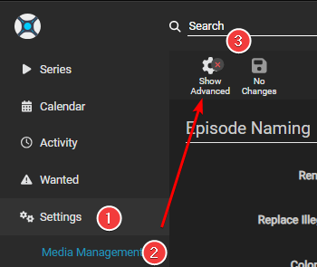
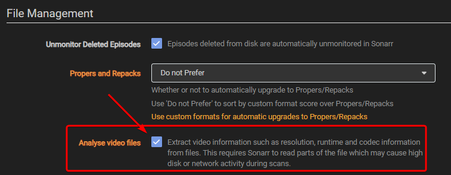

# Recommended naming scheme

--8<-- "includes/starr/renaming-description-faq.md"

---

## Getting Started

First, you need to set up Sonarr to show all the naming options:

1. Go to **Settings** → **Media Management**
2. Enable **Show Advanced** at the top of the page

    

    After you click this button, you'll see all the advanced options like this:

    

3. Enable **Rename Episodes** to see the episode naming options

    

4. Also make sure **Analyze video files** is enabled under **File Management**

    

---

## Episode Format

=== "Standard"

    ```bash
    {{ sonarr['naming']['sonarr-naming']['episodes']['standard']['default'] }}
    ```

    <sub><sup>**Single Episode**: `The Series Title! (2010) - S01E01 - Episode Title 1 [AMZN WEBDL-1080p Proper][DV HDR10][DTS 5.1][x264]-RlsGrp`</sup></sub>

    <sub><sup>**Multi Episode**: `The Series Title! (2010) - S01E01-E03 - Episode Title [AMZN WEBDL-1080p Proper][DV HDR10][DTS 5.1][x264]-RlsGrp`</sup></sub>

=== "Daily"

    ```bash
    {{ sonarr['naming']['sonarr-naming']['episodes']['daily']['default'] }}
    ```

    <sub><sup>**Example**: `The Series Title! (2010) - 2013-10-30 - Episode Title 1 [AMZN WEBDL-1080p Proper][DV HDR10][DTS 5.1][x264]-RlsGrp`</sup></sub>

=== "Anime"

    ```bash
    {{ sonarr['naming']['sonarr-naming']['episodes']['anime']['default'] }}
    ```

    <sub><sup>**Single Episode**: `The Series Title! (2010) - S01E01 - 001 - Episode Title 1 [iNTERNAL HDTV-720p v2][HDR10][10bit][x264][DTS 5.1][JA]-RlsGrp`</sup></sub>

    <sub><sup>**Multi Episode**: `The Series Title! (2010) - S01E01-E03 - 001-003 - Episode Title [iNTERNAL HDTV-720p v2][HDR10][10bit][x264][DTS 5.1][JA]-RlsGrp`</sup></sub>

---

## Series Folder Format

--8<-- "includes/sonarr/imdb-vs-tvdb.md"

=== "Standard Folder"

    ```bash
    {{ sonarr['naming']['sonarr-naming']['series']['default'] }}
    ```

    <sub><sup>**Example**: `The Series Title! (2010)`</sup></sub>

=== "Optional Plex"

    This naming scheme is made to be used with the [New Plex TV Series Scanner](https://forums.plex.tv/t/beta-new-plex-tv-series-scanner/696242){:target="\_blank" rel="noopener noreferrer"}

    === "Plex Folder IMDb"

        --8<-- "includes/sonarr/tvdb-imdb-info.md"

        ```bash
        {{ sonarr['naming']['sonarr-naming']['series']['plex-imdb'] }}
        ```

        <sub><sup>**Example**: `The Series Title! (2010) {imdb-tt1520211}`</sup></sub>

    === "Plex Folder TVDb"

        ```bash
        {{ sonarr['naming']['sonarr-naming']['series']['plex-tvdb'] }}
        ```

        <sub><sup>**Example**: `The Series Title! (2010) {tvdb-1520211}`</sup></sub>

=== "Optional Emby"

    Source: [Emby Wiki/Docs](https://emby.media/support/articles/TV-Naming.html#id-tags-in-folder--file-names){:target="\_blank" rel="noopener noreferrer"}

    === "Emby Folder IMDb"

        --8<-- "includes/sonarr/tvdb-imdb-info.md"

        ```bash
        {{ sonarr['naming']['sonarr-naming']['series']['emby-imdb'] }}
        ```

        <sub><sup>**Example**: `The Series Title! (2010) [imdb-tt1520211]`</sup></sub>

    === "Emby Folder TVDb"

        ```bash
        {{ sonarr['naming']['sonarr-naming']['series']['emby-tvdb'] }}
        ```

        <sub><sup>**Example**: `The Series Title! (2010) [tvdb-1520211]`</sup></sub>

=== "Optional Jellyfin"

    Source: [Jellyfin Wiki/Docs](https://jellyfin.org/docs/general/server/media/shows/){:target="\_blank" rel="noopener noreferrer"}

    !!! warning "Jellyfin doesn't support IMDb IDs for shows"

    === "Jellyfin Folder TVDb"

        ```bash
        {{ sonarr['naming']['sonarr-naming']['series']['jellyfin-tvdb'] }}
        ```

        <sub><sup>**Example**: `The Series Title! (2010) [tvdbid-1520211]`</sup></sub>

---

## Season Folder Format

For this, there's only one real option to use in our opinion.

```bash
Season {season:00}
```

<sub><sup>**Example**: `Season 01`</sup></sub>

---

## Multi-Episode Style

```bash
Prefixed Range
```

<sub><sup>**Example**:</sup></sub>


---

## Alternative Episode Naming Options

These are other standard episode format naming schemes that work well. Use these if you don't like the brackets used in the main recommendations.

### Original Title

Another option is to use `{Original Title}` instead of the recommended naming scheme above. `{Original Title}` uses the title of the release, which includes all the information from the release itself. The benefit of this naming scheme is that it prevents download loops that can happen during import when there's a mismatch between the release title and the file contents (for example, if the release title says DTS-ES but the contents are actually DTS). The downside is that you have less control over how the files are named.

If you use this alternate naming scheme, we suggest using `{Original Title}` instead of `{Original Filename}`.

Why?

The filename can be obscured or unclear, whereas the release naming is clear, especially when you use Usenet.

`{Original Title}` => `The.Series.Title.S01E01.Episode.Title.1080p.AMZN.WEB-DL.DDP5.1.H.264-RlsGrp`

`{Original Filename}` => `show episode 1-1080p` or `lchd-tkk1080p` or `t1i0p3s7i8yuti`

---

### P2P/Scene Naming

Use P2P/Scene naming if you don't like spaces and brackets in the filename. It's the closest to the P2P/scene naming scheme, except it uses the exact audio and HDR formats from the media file, where the original release or filename might be unclear.

```bash
{{ sonarr['naming']['sonarr-naming']['episodes']['standard']['p2p-scene'] }}
```

<sub><sup>**Single Episode**: `The.Series.Title's!.2010.S01E01.Episode.Title.1.ATVP.WEBDL-2160p.EAC3.Atmos.5.1.DV.HDR10Plus.h265-RlsGrp`</sup></sub>

<sub><sup>**Multi Episode**: `The.Series.Title's!.2010.S01E01-E03.Episode.ATVP.WEBDL-2160p.EAC3.Atmos.5.1.DV.HDR10Plus.h265-RlsGrp`</sup></sub>

--8<-- "includes/support.md"
