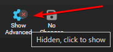

# Recommended naming scheme

On the [Sonarr Discord](https://discord.gg/M6BvZn5){:target="_blank" rel="noopener noreferrer"} people often ask, "What's the recommended/best way to
name your files?" First off, it's personal preference, but it's often recommended to add non-recoverable info.

Why?

If, for what ever reason, you ever need to do a re-install or re-import in
the Starr Apps or Plex/Emby/Jellyfin it's nice to have all that info in the filename so
it gets imported correctly and isn't incorrectly matched as HDTV or WEB-DL etc.

!!! info "The Tokens not available in the release won't be used/shown."

------

## Preparation

Go to `Settings` => `Media Management` and make sure that `Show Advanced` at the top is enabled.


Once you clicked on the button it should look like this and you should see all the advanced options.



## Standard Episode Format

```bash
{{ sonarr['naming']['sonarr-naming']['episodes']['standard']['default:4'] }}
```

??? abstract "RESULTS: - [Click to show/hide]"

    Single Episode:

    `The Series Title! (2010) - S01E01 - Episode Title 1 [AMZN WEBDL-1080p Proper][DV HDR10][DTS 5.1][x264]-RlsGrp`

    Multi Episode:

    `The Series Title! (2010) - S01E01-E03 - Episode Title [AMZN WEBDL-1080p Proper][DV HDR10][DTS 5.1][x264]-RlsGrp`

------

## Daily Episode Format

```bash
{{ sonarr['naming']['sonarr-naming']['episodes']['daily']['default:4'] }}
```

??? abstract "RESULTS: - [Click to show/hide]"

    `The Series Title! (2010) - 2013-10-30 - Episode Title 1 [AMZN WEBDL-1080p Proper][DV HDR10][DTS 5.1][x264]-RlsGrp`

------

## Anime Episode Format

```bash
{{ sonarr['naming']['sonarr-naming']['episodes']['anime']['default:4'] }}
```

??? abstract "RESULTS: - [Click to show/hide]"

    Single Episode:

    `The Series Title! (2010) - S01E01 - 001 - Episode Title 1 [iNTERNAL HDTV-720p v2][HDR10][10bit][x264][DTS 5.1][JA]-RlsGrp`

    Multi Episode:

    `The Series Title! (2010) - S01E01-E03 - 001-003 - Episode Title [iNTERNAL HDTV-720p v2][HDR10][10bit][x264][DTS 5.1][JA]-RlsGrp`

------

### Series Folder Format

```bash
{{ sonarr['naming']['sonarr-naming']['series']['default'] }}
```

<small>RESULT:</small> `The Series Title! (2010)`

#### Optional Series Folder Format

This naming scheme is made to be compatible with the new [Plex TV Series Scanner](https://forums.plex.tv/t/beta-new-plex-tv-series-scanner/696242){:target="_blank" rel="noopener noreferrer"} that now support IMDB and TVDB IDs in file names.

##### Optional Plex

```bash
{{ sonarr['naming']['sonarr-naming']['series']['plex'] }}
```

<small>RESULT:</small> `The Series Title! (2010) {imdb-tt1520211}`

##### Optional Emby

```bash
{{ sonarr['naming']['sonarr-naming']['series']['emby'] }}
```

<small>RESULT:</small> `The Series Title! (2010)`

##### Optional Jellyfin

```bash
{{ sonarr['naming']['sonarr-naming']['series']['jellyfin'] }}
```

<small>RESULT:</small> `The Series Title! (2010) [tvdbid-tt1520211]`

!!! tip
    IMDb IDs are going to be very accurate and rarely change, TVDB/TMDB IDs, on the other hand, do change or are removed more frequently.

------

### Season Folder Format

For this there's only one real option to use in my opinion.

```bash
Season {season:00}
```

RESULT: `Season 01`

------

### Multi-Episode Style

```bash
Prefixed Range
```

RESULTS:


------

## Original Title vs  Original Filename

### Original Title

Another option is to use `{Original Title}` rather than the recommended naming scheme outlined above. `{Original Title}` will use the title of the release which will contain all of the information included in the release itself. The benefit of this naming scheme is to prevent download loops which can occur on import when there is a discrepancy in the release title compared to the contents of the file itself (for example, if the release title says DTS-ES but the contents are actually DTS). The downside is less flexibility with how the files are named.

If using this alternate naming scheme I suggest using `{Original Title}` over `{Original Filename}`

Why?

The filename can be Obscured where the Release naming isn't, especially when you use Usenet.

`{Original Title}` => `The.Series.Title.S01E01.Episode.Title.1080p.AMZN.WEB-DL.DDP5.1.H.264-RlsGrp`

`{Original Filename}` => `show episode 1-1080p` or `lchd-tkk1080p` or `t1i0p3s7i8yuti`

------

Thanks:

A big Thanks to [fryfrog](https://github.com/fryfrog), [rg9400](https://github.com/rg9400) and [bakerboy448](https://github.com/bakerboy448) for the suggestions.

--8<-- "includes/support.md"
