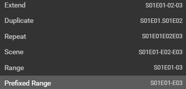
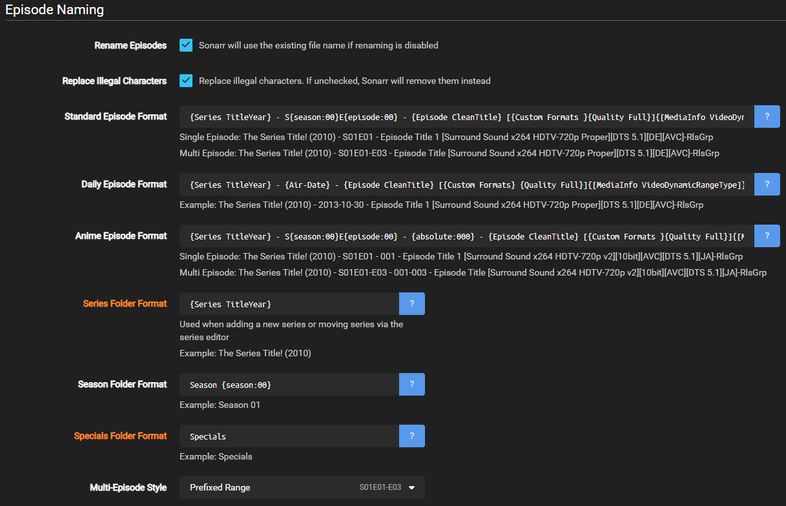

# How to setup Custom Formats (Anime)

!!! note
    This guide is created and maintained by "Update Later"

    It's recommended to run two Sonarr instances. One for Anime and one for normal tv shows, or you can make use of Quality Profiles and score different CFs as required

## Media Management

!!! note

    There are a few settings which make life a lot easier when tracking down and keeping certain information for your Anime

### Suggested naming scheme

#### Anime Episode Format

Has all necessary information and a little extra if you needed to rebuild.

```bash
{Series TitleYear} - S{season:00}E{episode:00} - {absolute:000} - {Episode CleanTitle} [{Preferred Words }{Quality Full}]{[MediaInfo VideoDynamicRange]}[{MediaInfo VideoBitDepth}bit]{[MediaInfo VideoCodec]}[{Mediainfo AudioCodec} { Mediainfo AudioChannels}]{MediaInfo AudioLanguages}{-Release Group}
```

??? summary "RESULTS:"

    Single Episode:

    `The Series Title! (2010) - S01E01 - 001 - Episode Title 1 [AMZN WEBDL-1080p v2][HDR][10bit][x264][DTS 5.1][FLAC][JA]-RlsGrp`

    Multi Episode:

    `The Series Title! (2010) - S01E01-E02-E03 - 001-002-003 - Episode Title [AMZN WEBDL-1080p v2][HDR][10bit][x264][DTS 5.1][FLAC][JA]-RlsGrp`

#### Series Folder Format

```bash
{Series TitleYear}
```

RESULT:

`The Series Title! (2010)`

#### Season Folder Format

```bash
Season {season:00}
```

RESULT:

`Season 01`

#### Multi-Episode Style

```bash
Prefixed Range
```

RESULT:



??? success "Example"

    

---

## Quality Profile

We to create a new profile called `Remux-1080p - Anime` due to the way anime can be named we will need to merge a few qualities together. We need to add `Bluray-1080p Remux` and `Bluray-1080p` into a group together, and `HDTV-1080p` into the same group as `WEBDL-1080p` and `WEBRip-1080p` so that scoring will work correctly.


We then need to select and organise qualities as below


Make sure Upgrades Allowed is ticked then set the Upgrade Until section to `Bluray-1080p` and the Upgrade Until Custom Format Score to `10000`

After this has been done your profile should look like below


---

## Custom Formats

!!! note
    We're going to make use of the below custom formats.

{! include-markdown "../../includes/cf/anime.md" !}
<!-- --8<-- "includes/cf/anime.md" -->

### Acknowledgements

Most of my information and knowledge came from:

- Kaiser (Guidance on anime groups)

- rg9400 (Guidance on regex fixes, anime groups and general knowledge share.)

- Drazzilb (Guidance on regex fixes, anime groups and general knowledge share.)

- [TRaSH](https://trash-guides.info/) (For allowing me to utilize his website for my guide and general knowledge share.)

Thanks a bunch!!

{! include-markdown "../../includes/support.md" !}
<!-- --8<-- "includes/support.md" -->
