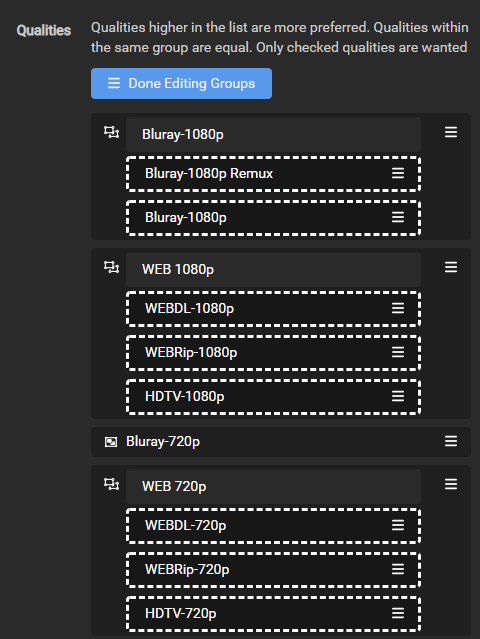
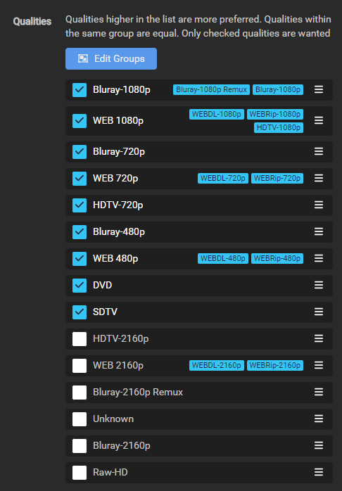
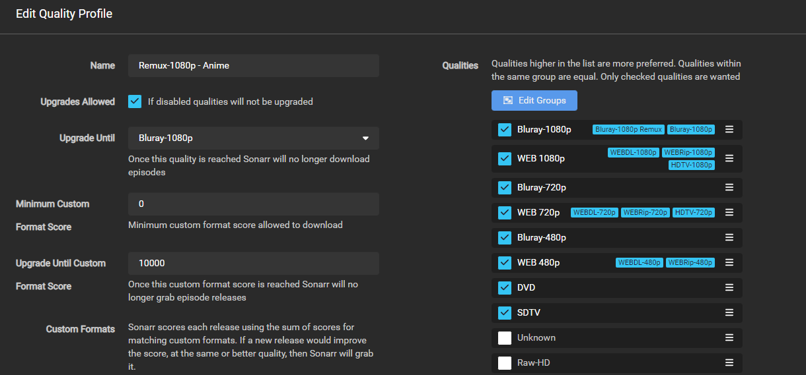
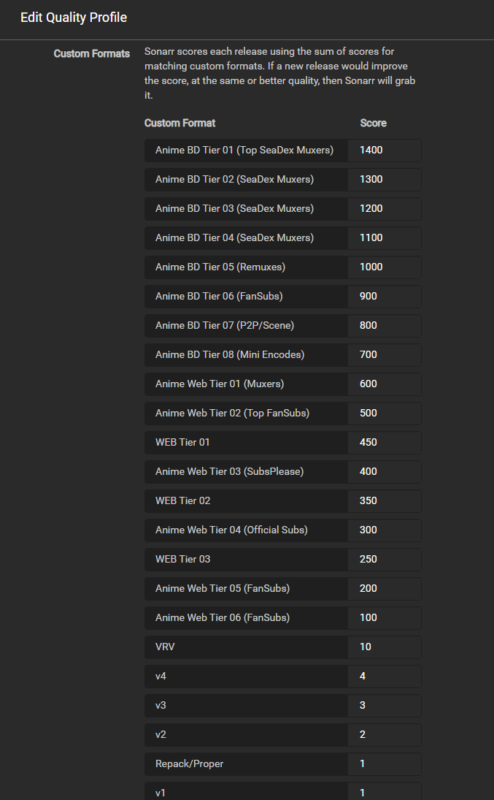

# How to setup Custom Formats (Anime)

!!! attention
    You must be running Sonarr V4 to be able to use this setup

!!! note
    This guide is created and maintained by [FonduemangVI](https://github.com/FonduemangVI) and [rg9400](https://github.com/rg9400)

    It's recommended to run two Sonarr instances. One for Anime and one for normal tv shows, or you can make use of Quality Profiles and score different CFs as required

## Media Management

### Recommended naming scheme

For the Recommended naming scheme please go [HERE](/sonarr/sonarr-recommended-naming-scheme/#anime-episode-format){:target="_blank" rel="noopener noreferrer"}

---

## Quality Settings

For quality settings please refer to [Sonarr Quality Definitions - Anime](/sonarr/sonarr-quality-settings-file-size/#sonarr-quality-definitions-anime-work-in-progress){:target="_blank" rel="noopener noreferrer"}

---

## Quality Profile

We need to create a new profile called `Remux-1080p - Anime` due to the way anime can be named we will need to merge a few qualities together. We need to add `Bluray-1080p Remux` and `Bluray-1080p` into a group together, and `HDTV-1080p` into the same group as `WEBDL-1080p` and `WEBRip-1080p` so that scoring will work correctly.

Go to `Settings` => `Profiles`

??? check "example - [CLICK TO EXPAND]"
    

We then need to select and organise qualities as below

Make sure Upgrades Allowed is ticked then set the Upgrade Until section to `Bluray-1080p` and the Upgrade Until Custom Format Score to `10000`

After this has been done your profile should look like below

---

## Custom Formats

!!! note
    We're going to make use of the below custom formats. See [How to import Custom Formats](/Radarr/Radarr-import-custom-formats/){:target="_blank" rel="noopener noreferrer"} for how to import the custom formats

{! include-markdown "../../includes/cf/sonarr-anime.md" !}
<!-- --8<-- "includes/cf/sonarr-anime.md" -->

The scoring that has been set is the recommended scoring however some of the CFs are optional depending on what you prefer.
`Anime Dual Audio`, `Uncensored` and `10bit` can be given scores if you want to prefer content with these attributes

Once the custom formats have been imported you can set the scores as above. To do this go to `Settings` => `Profiles` and select the Remux-1080p - Anime profile that was setup before

??? check "example - [CLICK TO EXPAND]"
    

In the profile enter the scores as per the above table in this section.

After you are done it should look like the image above

### Acknowledgements

Most of my information and knowledge came from:

- rg9400 (Guidance on regex fixes, anime groups and general knowledge share.)

- [TRaSH](https://trash-guides.info/) (For allowing me to utilize his website for our guide and general knowledge share.)

Thanks a bunch!!

{! include-markdown "../../includes/support.md" !}
<!-- --8<-- "includes/support.md" -->
