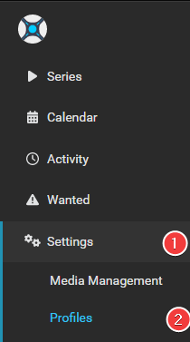
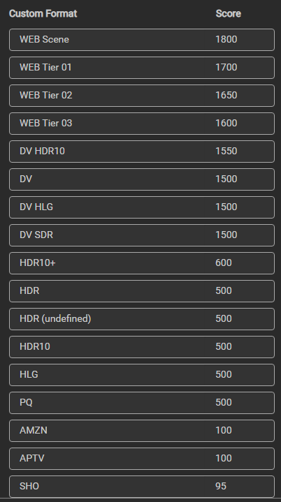

# How to setup Custom Formats

So what's the best way to setup the Custom Profiles and which one to use with which scores?

There isn't a best setup, being that everyone has their own personal preferences. Some prefer high quality audio, others high quality video. Many prefer both.

Here I will try to explain with some personal used examples how to make the most use of Custom Formats that you can use to get an idea how to setup yours.

------

## Basics

Here we're going to explain where to setup the Custom Formats after you've added them, as explained in [How to import Custom Formats](/Radarr/Radarr-import-custom-formats/){:target="_blank" rel="noopener noreferrer"}.
You will also see a short description of what each setting means.

`Settings` => `Profiles`

??? check "example - [CLICK TO EXPAND]"
    

Select the profile that you use/prefer.

!!! info "Sonarr Custom Formats can be set per profile and isn't global"

1. Profile name.
1. Allow upgrades. Sonarr will stop upgrading quality once (3) is met.
1. Upgrade until the selected quality.
1. The `Minimum Custom Format Score` allowed to download. [More Info](#minimum-custom-format-score)
1. Keep upgrading Custom Format until this score is reached. (setting this to `0` means no upgrades will happen based on Custom Formats)

At the bottom in your chosen profile you will see the added Custom Formats where you can start setting up the scores.

??? check "example - [CLICK TO EXPAND]"
    

    !!! attention
        These screenshots are just examples to show you how it should look and where you need to place the data that you need to add, they aren't always a 100% reflection of the actual data and not always 100% up to date with the actual data you need to add.

        - Always follow the data described in the guide.
        - If you got any questions or aren't sure just click the chat badge to join the Discord Channel where you can ask your questions directly.

------

!!! attention
    Keep in mind Custom Formats are made to fine tune your Quality Profile

    Generally, quality trumps all

{! include-markdown "../../includes/merge-quality/sonarr-current-logic.md" !}

My suggestion is to create tiers of scores based on what things matter to you.

Personally, I would only add the Custom Formats that do what you actually prefer. Especially in the beginning, including the [Releases you should avoid](#releases-you-should-avoid)

!!! info

    Custom formats are controlled by Quality Profiles.

    - The Upgrade Until score prevents upgrading once a release with this desired score has been downloaded.
    - A score of 0 results in the custom format being informational only.
    - The Minimum score requires releases to reach this threshold otherwise they will be rejected.
    - Custom formats that match with undesirable attributes should be given a negative score to lower their appeal.
    - Outright rejections should be given a negative score low enough that even if all of the other formats with positive scores were added, the score would still fall below the minimum.

------

## Examples

Here I will explain how to make the most use of Custom Formats and show you some personal examples that I'm using. You can use these to get an idea on how to setup your own.

All these examples make use of the [Collection of Custom Formats](/Sonarr/Sonarr-collection-of-custom-formats/){:target="_blank" rel="noopener noreferrer"}.

All the used scores and combination of Custom Formats in this Guide are tested to get the desired results and prevent download loops as much as possible.

------

### Releases you should avoid

This is a must have for every Quality Profile you use in my opinion. All these Custom Formats make sure you don't get Low Quality Releases.

{! include-markdown "../../includes/cf/sonarr-unwanted.md" !}

------

#### Prefer HDR Metadata

Lets say you prefer HDR metadata

Then we would use the following order:

{! include-markdown "../../includes/cf/sonarr-hdr-metadata.md" !}

------

!!! important

    I also suggest to change the Propers and Repacks settings in Radarr!!!

    Instructions can be found [HERE](#proper-and-repacks)

------

#### WEBDL-1080p

If you prefer 720p/1080p WEBDL (WEB-1080p)

I suggest to first follow the [Quality Settings (File Size)](/Sonarr/Sonarr-Quality-Settings-File-Size/){:target="_blank" rel="noopener noreferrer"}
If you think the sizes are too big to your preference then stop reading and see if the other tutorials are helpful to you. :bangbang:

For this Quality Profile we're going to make use of the following Custom Formats

{! include-markdown "../../includes/cf/sonarr-unwanted.md" !}

{! include-markdown "../../includes/cf/sonarr-misc.md" !}

{! include-markdown "../../includes/cf/sonarr-streaming-services.md" !}

{! include-markdown "../../includes/cf/sonarr-hq-source-group.md" !}

Use the following main settings in your profile.

!!! info ""

    For some older shows you might want to enable the `WEB 720p` or even the `HDTV 1080p`.

!!! example "The following workflow will be applied:"

    - It will download WEB-DL 1080p. (If you also enabled `WEB 720p` and/or `HDTV 1080p` it will upgrade till `Upgrade Until`)
    - The downloaded media will be upgraded to any of the added Custom Formats until a score of 10000.

    So why such a ridiculously high `Upgrade Until Custom` and not a score of `500`?

    Because I'm too lazy to calculate the maximum for every Quality Profile I use, and I want it to upgrade to the highest possible score anyway.

------

#### WEBDL-2160p

If you prefer 2160p WEBDL (WEB-2160p)

I suggest to first follow the [Quality Settings (File Size)](/Sonarr/Sonarr-Quality-Settings-File-Size/){:target="_blank" rel="noopener noreferrer"}
If you think the sizes are too big to your preference then stop reading and see if the other tutorials are helpful to you. :bangbang:

For this Quality Profile we're going to make use of the following Custom Formats

{! include-markdown "../../includes/cf/sonarr-hdr-metadata.md" !}

{! include-markdown "../../includes/cf/sonarr-unwanted.md" !}

{! include-markdown "../../includes/cf/sonarr-misc.md" !}

{! include-markdown "../../includes/cf/sonarr-streaming-services.md" !}

{! include-markdown "../../includes/cf/sonarr-hq-source-group.md" !}

Use the following main settings in your profile.

!!! info ""

    The reason why I have WEB 1080p merged with the 2160p is because some NF releases won't be released as 4k, but I still want to have DV/HDR releases.
    If you want to do the same make sure you replace [x265 (HD)](/Sonarr/Sonarr-collection-of-custom-formats/#x265-hd){:target="_blank" rel="noopener noreferrer"} with [x265 (no HDR/DV)](/Sonarr/Sonarr-collection-of-custom-formats/#x265-no-hdrdv){:target="_blank" rel="noopener noreferrer"}.

!!! example "The following workflow will be applied:"

    - It will download WEB-1080p with HDR/DV.
    - It will upgrade to WEB-2160p when available.
    - The downloaded media will be upgraded to any of the added Custom Formats until a score of 10000.

    So why such a ridiculously high `Upgrade Until Custom` and not a score of `500`?

    Because I'm too lazy to calculate the maximum for every Quality Profile I use, and I want it to upgrade to the highest possible score anyway.

------

## FAQ & INFO

### Proper and Repacks

??? tip "Proper and Repacks - [CLICK TO EXPAND]"

    I also suggest to change the Propers and Repacks settings in Radarr

    `Media Management` => `File Management` to `Do Not Prefer` and use the [Repack/Proper](/Sonarr/Sonarr-collection-of-custom-formats/#repack-proper) Custom Format.

    

    This way you make sure the Custom Format preferences will be used instead.

### Custom Formats to avoid certain releases

??? FAQ "How to use a Custom Format to avoid certain releases? - [CLICK TO EXPAND]"

    For Custom Formats you really want to avoid, set it to something really low like `-10000` and not something like `-10`.
    Being when you add a Custom Format what you prefer and you set it to something like `+10` it could happen that for example the `BR-DISK` will be downloaded (-10)+(+10)=0 and if your `Minimum Custom Format Score` is set at `0`.

### Custom Formats with a score of 0

??? FAQ "What do Custom Formats with a score of 0 do? - [CLICK TO EXPAND]"

    All Custom Formats with a score of 0 are pure informational and don't do anything.

### Minimum Custom Format Score

??? info "Minimum Custom Format Score - [CLICK TO EXPAND]"

    Some people suggest not to use negative scores for your Custom Formats and set this option to a higher score then 0.

    The reason why I don't prefer/use this is because you could limit yourself when some new groups or whatever will be released.

    Also it makes it much more clear what you prefer and what you want to avoid.

### Audio Channels

??? info "Audio Channels - [CLICK TO EXPAND]"

    Personally I wouldn't add the audio channels Custom Formats being you could limit yourself in the amount of releases you're able to get. Only use this if you got specific reasons that you need them.

    Using it with any kind of Remuxes Quality Profile is useless in my opinion being that 99% of all remuxes are multi audio anyway. You can get better scores using the `Audio Advanced` Custom Formats.

### Avoid using the x264/x265 Custom Format

??? tip "Avoid using the x264/x265 Custom Format - [CLICK TO EXPAND]"

    Avoid using the x264/x265 Custom Format with a score if possible, it's smarter to use the [720/1080p no x265](/Radarr/Radarr-collection-of-custom-formats/#x265-7201080p){:target="_blank" rel="noopener noreferrer"} Custom Format.

    Something like 95% of video files are x264 and have much better direct play support. If you have more than a of couple users, you will notice much more transcoding.

    Use x265 only for 4k releases and the [x265 HD](/Sonarr/Sonarr-collection-of-custom-formats/#x265-hd){:target="_blank" rel="noopener noreferrer"} makes sure you still get the x265 releases.

## Thanks

Special thanks to everyone that helped testing and creating these Custom Formats.

{! include-markdown "../../includes/support.md" !}
<!-- --8<-- "includes/support.md" -->
