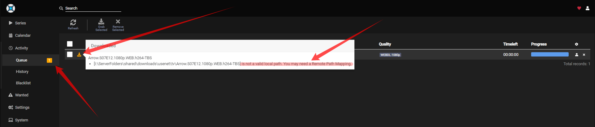
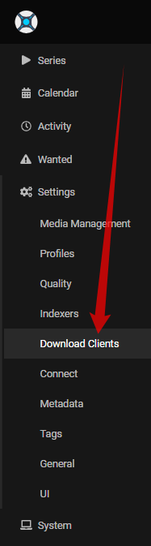
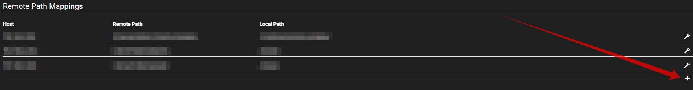
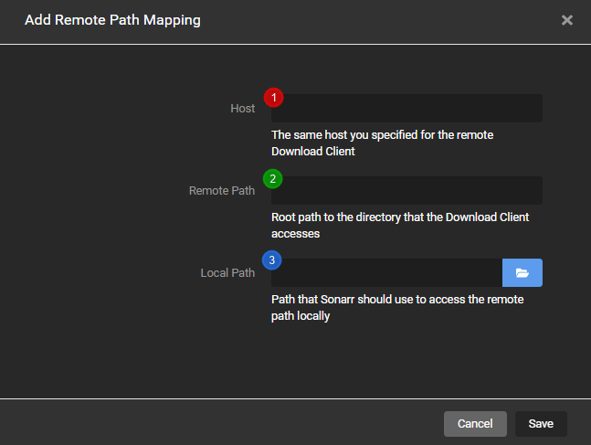
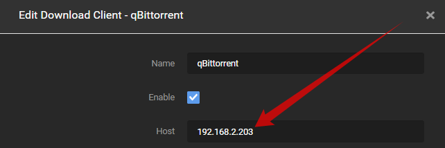
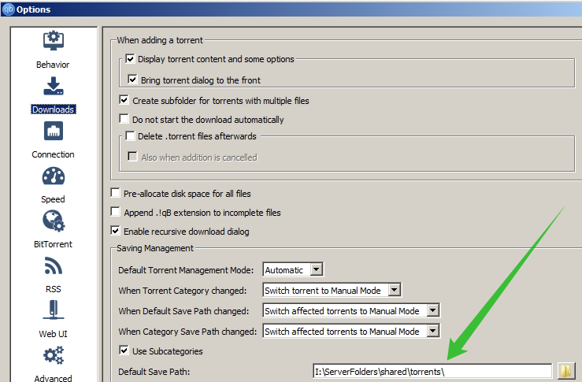
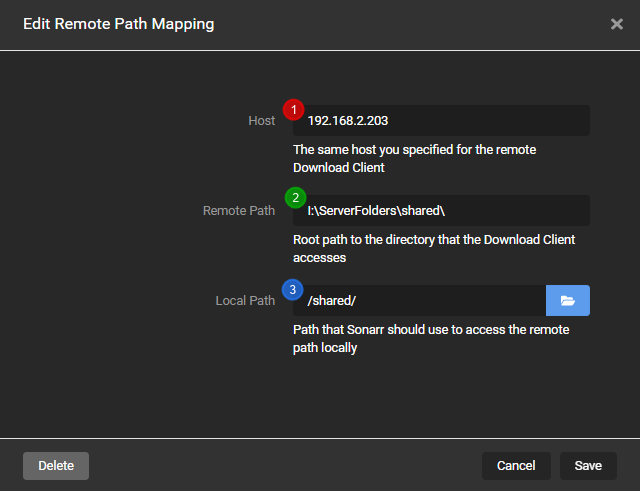

# Remote Path Mappings

It seems that a lot of people don't understand how remote path mapping works for Sonarr. we will try to explain it with some screenshots and a short description.

Remote Path Mapping acts as a dumb find `Remote Path` and replaces it with the `Local Path`

## When do I need remote path mappings

- If Sonarr and your download client are not on the same server/system.
- If you use either merged local/remote setups using mergerfs or similar.
- You run dockers and **DON'T** have consistent and well-planned paths.

!!! note

    If you run dockers it would be smarter to fix the problem at the source of what's causing the actual issue.

    - [Sonarr Wiki Servarr - Docker Guide](https://wiki.servarr.com/docker-guide#consistent-and-well-planned-paths){:target="_blank" rel="noopener noreferrer"}

    - [TRaSH Guides](/File-and-Folder-Structure/Hardlinks-and-Instant-Moves/){:target="_blank" rel="noopener noreferrer"}

---

## How do I recognize that I need remote path mappings

If your download client is on another system than Sonarr then you probably need to make use of Remote Path Mappings.

You will get an error that looks a little bit like the following screenshot.

So looking at this screenshot it seems we need to make use of Remote Path Mappings

---

## How

First, we navigate in Sonarr to the `Settings` => `Download Clients` tab.

At the bottom, you choose `Add new mapping`

A screen will pop up with the following options:

1. `Host` => This is the hostname or IP you set in your download client settings.
1. `Remote Path` => The download path that you've set in your download client.
1. `Local Path` => The path Sonarr needs to access the same path.

---

??? example "Examples"

    === "QBittorrent"

        ## Host

        To find what you need to put in your host you navigate in Sonarr to the Settings => Download Clients Tab.
        There you open up the download client for this example we will be using QBittorrent

        

        This is what you put in your Host in Remote Path Mapping.

        ## Remote Path

        To find what you need to put in your remote path you need to open up your download client and look what you've used there as download location.

        In QBittorrent navigate to Tools => Options (or ALT+O) and navigate to the Download settings.

        

        This is what you add in your Remote Path in Remote Path Mapping.

        ## Local Path

        To find out what you need to put in in your local path you need to know how Sonarr can access the files that your download client downloaded. This can be done in different ways. Mounting/Network shares, whatever, but Sonarr needs to have local access to it, so you need to figure out the best way for Sonarr to access the download client's downloaded files yourself.

        The final result will look something like this.

        

--8<-- "includes/support.md"
