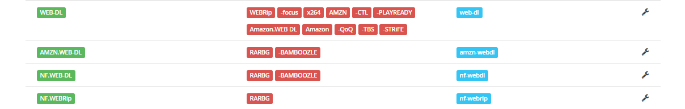
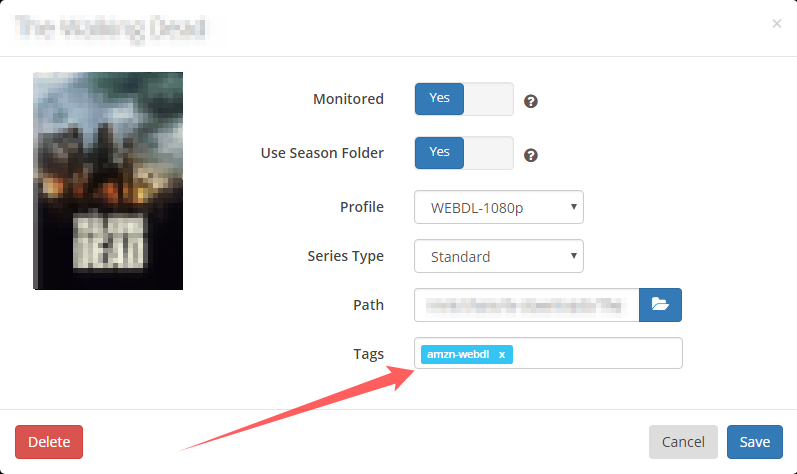
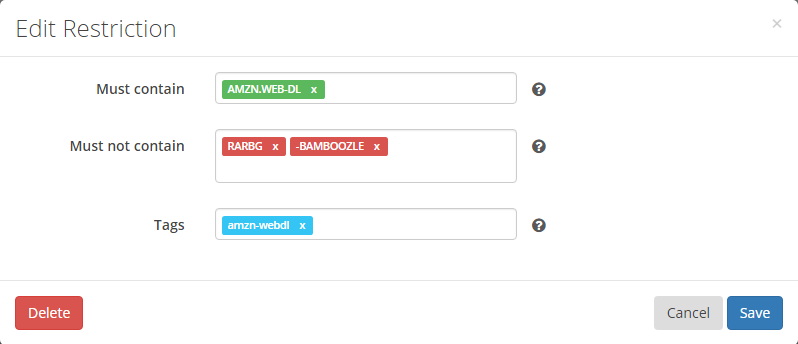
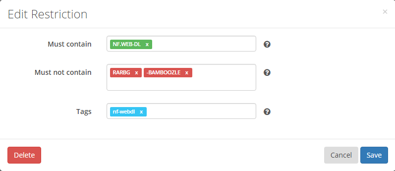
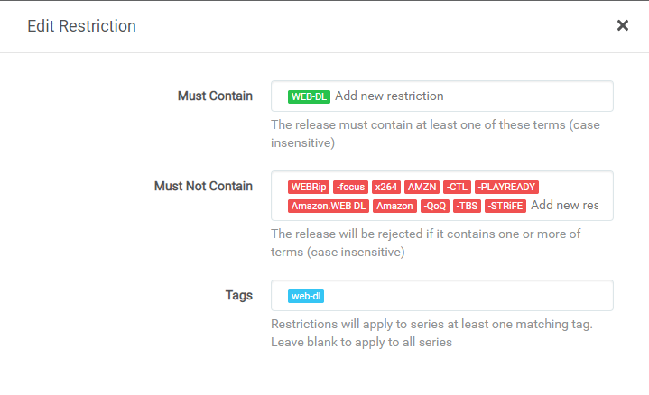

# How To Seperate Different WEB-DL Releases

Sonarr How To Seperate Different WEB-DL Releases (iTunes.WEB-DL, AMZN.WEB-DL, NF.WEB-DL)

This will show you How To Seperate Different WEB-DL Releases (iTunes.WEB-DL, AMZN.WEB-DL, NF.WEB-DL) in Sonarr.

------

## How To

Add the following to your Settings => Indexers => "Add new restriction".

Keep a eye on the tags you're using because you need to add them also to your shows when you want them as a certain release.

!!! note
    The reason why  i've added "RARBG" as "Must not contain" is because I dislike retagged releases,

### AMZN.WEB-DL

* Must contain: AMZN.WEB-DL
* Must not contain: RARBG, -BAMBOOZLE
* Tags: amzn-webdl

### NF.WEB-DL

* Must contain: NF.WEB-DL
* Must not contain: RARBG, -BAMBOOZLE
* Tags: nf-webdl

### WEB-DL

* Must contain: WEB-DL
* Must not contain: WEBRip, -focus, x264, AMZN, -CTL, -PLAYREADY, Amazon.WEB DL, Amazon, -QoQ, -TBS, -STRiFE
* Tags: web-dl

!!! note
    The "Must not contain" names/groups are there because they don't release iTunes WEB-DL or the ones you find are mislabeld or stripped/re-encoded like the `-TBS` releases.
