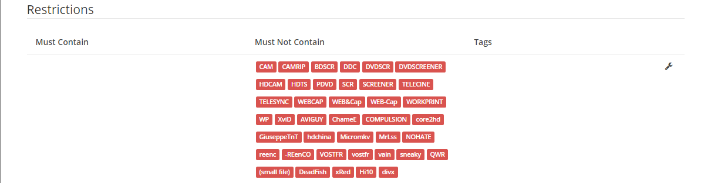

# Restrictions For Better Quality Releases

Sonarr Restrictions For Better Quality Releases (Bad Quality (Video or Audio wise), Wrongly Tagged or Re-Tagged)

This is a list of groups and words you can add to Sonarr Restrictions For Better Quality Releases (Bad Quality (Video or Audio wise), Wrongly Tagged or Re-Tagged).
The info has been collected from different major sites/trackers (mostly banned on them also)

------

## Must Not Contain

Add the following to your Settings => Indexers => "Must Not Contain"

### General

- (small file),
- AVIGUY,
- BDSCR,
- BRrip,
- CAM,
- CAMRIP,
- ChameE,
- COMPULSION,
- core2hd,
- DDC,
- divx,
- DVDSCR,
- DVDSCREENER,
- GiuseppeTnT,
- HD2DVD,
- HDCAM,
- -HDChina,
- HDTS,
- Micromkv,
- MrLss,
- -NOHATE,
- PDVD,
- QWR,
- reenc,
- REenCO,
- SCR,
- SCREENER,
- sneaky,
- TELECINE,
- TELESYNC,
- vain,
- VOSTFR,
- WEB&Cap,
- WEBCAP,
- WEB-Cap,
- WORKPRINT,
- WP,
- XviD,

### Xvid Re-encodes

- -[Oj],
- -3LTON,
- -AFG,
- -ELiTE,
- -FUM,
- -iFT,
- -LOAD,
- -playXD,
- -ViSiON,
- -ZKBL,
- -ZmN,

### Mislabeled, YouTube sourced, altered, or re-encoded

- -4yEo,
- -eSc,
- -FGT,
- -JIVE,
- -NhaNc3,
- -RAPiDCOWS,
- -TM,
- -XS,

### Same resolution re-encodes

- -AnimeRG,
- -DeadFish,
- Hi10,
- -xRed,

### x264 re-encodes if a scene release exists in any resolution

- -FUM,
- -mSD,
- -REsuRRecTioN,
- -RMTeam,
- -SPASM,

### (Bad Quality (Video or Audio wise), Wrongly Tagged, Re-Tagged)

- [G2G],
- [rartv],
- [TRP],
- -aXXo,
- -CrEwSaDe,
- -FLEET,
- -IMMERSE,
- -LiGaS,
- -LOL,
- m2TV,
- -maximersk,
- -mHD,
- NhaNc3,
- nHD,
- nSD,
- PRODJi,
- SANTi,
- -tbs,
- -TOPTEK,
- -ViSiON,
- -W4F,
- -WARENiK,
- -YFN,
- -ZKBL,
- -ZmN,

### Don't Want Dubs or often HardSubs

- danish,
- dksubs,
- dubbed,
- FRENCH,
- GERMAN,
- ITALIAN,
- korean,
- korsub,
- SPANISH,
- swedish,
- swesub,
- truefrench,
- turkish,
- HebSubs,

### Unwanted Codecs or Containers

- .mp4,
- h.265,
- HEVC,
- x265,
