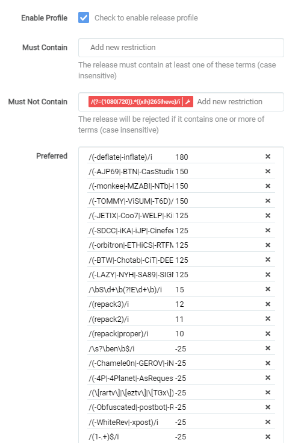
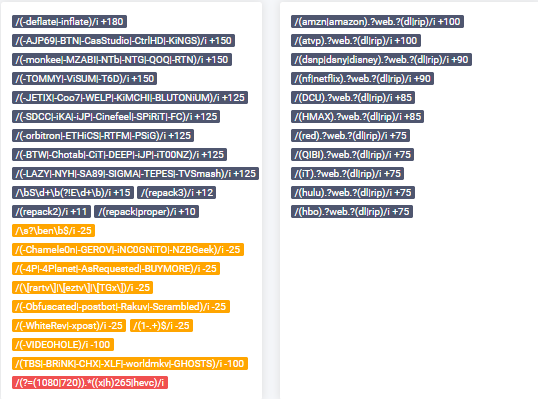

# Release Profile RegEx (WEB-DL)

!!! danger "Advanced feature"
    The regex isn't mentioned anywhere, it's a hidden advanced feature

Sonarr V3 has a great feature called Release Profile.
With this option you can fine tune your preference.

The Release profile that we're going to use for this example is mainly to prefer P2P releases over Scene releases, (Scene releases are still being downloaded but upgraded).

!!! question ""
    **If you don't care about quality then stop reading and see if the other tutorials are helpful for you.**

## Why

Scene release always release in a rush to bring it out as fast as possible

So I noticed  often that I got Repacks/Proper releases from them or from different groups and quality.
P2P releases are a bit smarter and work sort of together by not doing the same release.
Also I noticed that with some Scene releases the 5.1 audio was stripped out or converted to AAC audio.
And in my opinion the P2P are of better quality.
Theirs 1 Scene releaser that do bring out quality releases `-deflate/-inflate`.

!!! info

    Keep in mind this list will be a constant work in progress because I will be updating it when it's needed.

    So best to set a notification for updates for this page.

??? tip "Updates"

    A large portion of Amazon WEB-DLs in the last week have only had 192Kbps DD+5.1, because that's all Amazon made available initially.
    The proper 640Kbps DD+5.1 audio might appear a few hours later or a few months, but when they get updated the episodes will be REPACKED.

    I decided to redo the Release Profile to make it easier for me and the end user to update/manage the Release Profile, I decided not to add the scene groups anymore (and also removing the current ones). Why ? Lately I noticed a lot of popup scene releases meaning we need to update often.

    With this it also means all scene and (yet) unknown groups will be getting a score of `0` and not `-50`.

    I will still keep a eye on them and add the Low Quality Groups to the `-100` score and when I find a new P2P group I will add them, resulting in less updates and a more accurate upgrade.

------

## Propers and Repacks

First we're need to make sure a P2P release isn't being replaced by a Scene Repack/Proper release !


Settings => `Media Management`
Where we going to set it to `Do not Prefer`

Then we navigate in Sonarr to the Settings =>  `Profiles`


Then you will get a popup screen that will look like this:


`Must Contain` => add words that the release name **MUST HAVE!**

`Must Not Contain` => add words that the release name **MUST NOT HAVE AND SO TO BE IGNORE!**

`Preferred` => add words you prefer with a certain score what you prefer more or upgrade.

`Include Preferred when Renaming` => When you add `{Preferred Words}` to your renaming scheme it will add this info.

`Indexers` => Specify what indexer the profile applies to.

`Tags` => create a tag so this is only used by shows that you give this tag or else it's global.

The Number between the **[**brackets**]** are the scores the release name will get during a automatic and manual search and with the use of the scores some releases will be preferred over others and even upgraded.

## Scores

### Release Source (Streaming Service)

!!! tip

    It's recommended to add the Release Sources separate from the other release profiles.

```bash
# Preferred (3)
[100]   /(amzn|amazon)(?=.?web.?(dl|rip))/i
[100]   /(atvp)(?=.?web.?(dl|rip))/i
[100]   /(hmax)(?=.?web.?(dl|rip))/i
[95]   /(sho)(?=.?web.?(dl|rip))/i
[90]   /(dsnp|dsny|disney)(?=.?web.?(dl|rip))/i
[90]   /(nf|netflix)(?=.?web.?(dl|rip))/i
[90]   /(qibi)(?=.?web.?(dl|rip))/i
[85]   /(hulu)(?=.?web.?(dl|rip))/i
[75]   /(dcu)(?=.?web.?(dl|rip))/i
[75]   /(hbo)(?=.?web.?(dl|rip))/i
[75]   /(red)(?=.?web.?(dl|rip))/i
[75]   /(it)(?=.?web.?(dl|rip))/i
```

!!! note

    Also check mark `Include Preferred when Renaming` and add `{Preferred Words}` to your renaming scheme when you get download loop issues!!!

    What it does:

    When enabled the block with the [Release Source (Streaming Service)](#release-source-streaming-service) in it are then added to the file name which fixes any loops due to Sonarr seeing a new NF rip when an AMZN rip is found.
    Probably doesn’t happen if cutoff is met, but for anything that is unmet or any forced searches it results in a loop because NF is not in Sonarr’s copy so it upgrades, and loops.

    Enabling the include in preferred words for AMZN and adding that to the file name fixes that.

    Example of a naming scheme for series:

    ```bash
    {Series TitleYear} - S{season:00}E{episode:00} - {Episode CleanTitle} {[Quality Full]}{[MediaInfo Simple]}{[Preferred Words]}{-Release Group}
    ```

    More renaming suggestions can be found [HERE](https://trash-guides.info/Sonarr/V3/Sonarr-recommended-naming-scheme/){:target="_blank"}

### P2P + Low Quality Scene Groups

```bash
# Must Not Contain (2)
/(?=(1080|720)).*((x|h).?265|hevc)/i

# Preferred (3)
[180]   /(-deflate|-inflate)/i
[150]   /(-AJP69|-BTN|-CasStudio|-CtrlHD|-KiNGS)/i
[150]   /(-monkee|-NTb|-NTG|-QOQ|-RTN)/i
[150]   /(-TOMMY|-ViSUM|-T6D)/i
[125]   /(-BTW|-Chotab|-CiT|-DEEP|-iJP|-iT00NZ)/i
[125]   /(-LAZY|-NYH|-SA89|-SIGMA|-TEPES|-TVSmash)/i
[125]   /(-SDCC|-iKA|-iJP|-Cinefeel|-SPiRiT|-FC)/i
[125]   /(-JETIX|-Coo7|-WELP|-KiMCHI|-BLUTONiUM)/i
[125]   /(-orbitron|-ETHiCS|-RTFM|-PSiG|-MZABI)/i
[12]   /(repack3)/i
[11]   /(repack2)/i
[10]   /(repack|proper)/i

[-100]  /(TBS|-BRiNK|-CHX|-XLF|-worldmkv|-GHOSTS)/i
[-100]  /(-VIDEOHOLE)/i
```

??? info "Why the Must Not Contain entry"

    So why did I put `/(?=(1080|720)).*((x|h).?265|hevc)/i` as `Must Not Contain` and what does it do ?

    It blocks/ignores 720/1080p releases that are encoded in x265, why ?

    !!! quote
        x265 is good for for 4k stuff or 1080p if they used the the remuxes as source.
        If the media isn't source quality/remux, then there will be a loss of quality every time.
        Also, once you go x265, typically that file is done.
        It can't be changed to something else without a huge loss of quality.

        Something like 95% of video files are x264 and have much better direct play support.
        If you have more than a couple users,
        you will notice much more transcoding.
        Just depends on your priorities.

        So basically if you are storage poor and just need to save space, use x265.
        The catch is if you want best quality x265, you need source quality files, so you still have huge file sizes.
        If you want maximum compatibility and the option to change your files to something else later,
        then x264.
        It's all really dependent on specific situations for different people

    It's a shame that most x265 groups microsize the releases or use the x264 as source what results in low quality releases. And the few groups that do use the correct source suffer from it.

    So I created my own golden rule.

    - 720/1080p => x264
    - 2160p/4k => x265

### Optional preferred preferences

```bash
# Optional (use these only if you dislike renamed and retagged releases)
[-25]  /(\[rartv\]|\[eztv\]|\[TGx\])/i
[-25]  /(-4P|-4Planet|-AsRequested|-BUYMORE)/i
[-25]  /(-Chamele0n|-GEROV|-iNC0GNiTO|-NZBGeek)/i
[-25]  /(-Obfuscated|-postbot|-Rakuv|-Scrambled)/i
[-25]  /(-WhiteRev|-xpost)/i
# Optional (matches releases that ends with EN)
[-25]  /\s?\ben\b$/i
# Optional Matches any release that contains '1-' as prefix for Release Groups
[-25]  /(1-.+)$/i
# Optional Matches Season Packs (use this if you prefer Season packs)
[15]   /\bS\d+\b(?!E\d+\b)/i
```

### A little explanation of the scores and why

- Scores [75]-[100] Release Source.
- Scores [125]-[150] P2P Groups.
- Scores [10] Give a repack/proper a higher score but don't trump P2P groups for a Scene fix.
- Scores [-25] Retagged/Renames/Obfuscated  releases.

!!! danger "Watch out"
    If you're getting often a error message like `Has the same filesize as existing file`, you might need to consider to remove the [-25]

- Scores [-100] Groups that mess with the audio or add another preferred language.

Optional => We've tested it and it worked for what we've tested it on, if it will work in your situation we don't know if you notice something wrong just contact me and we will try to fix it or remove it.

The reason why I got multiple entry's with the same score is because the line will go out of the box and I don't like how that looks.

## Final Results

When you've done it correctly it will look something like this.



And after you clicked on `Save` it will look something like this:



------

This list is made by collecting information from Sonarr Discord Channel, and personal testing and a few others that helped.

So I want to thnx everyone who helped to make this list possible, for privacy reasons I decided not to add the names/nick of the persons.

If you want to be mentioned please message me on discord, including a link for proof to what part you want to be credited.

------
