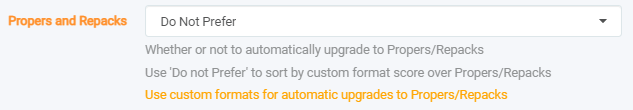

# Collection of Custom Formats for Sonarr

<!--@include: ../../includes/starr/cf-not-compatible.md-->

Below is a collection of what we've come to regard as the most needed and commonly used Custom Formats.
These CFs have been collected from discussions on Discord or created with help from others.

Special thanks to everyone who has helped in the creation and testing of these Custom Formats, my team at TRaSH guides, and the community.

- [How to import Custom Formats](/Sonarr/sonarr-import-custom-formats) - Explains how to import the Custom Formats.
- [How to upgrade Custom Formats](/Sonarr/sonarr-how-to-update-custom-formats) - Explains how to upgrade your existing Custom Formats.
- [How to set up Quality Profiles](/Sonarr/sonarr-setup-quality-profiles) - Explains how to make the most use of Custom Formats and shows some specifics of my configuration. You can use these examples to get an idea of how to set up your preferences.

::: tip

It also is recommended to change the Propers and Repacks settings in Sonarr's `Settings`.

`Media Management` => `File Management` to `Do Not Prefer` and use the [Repack/Proper](#repackproper) Custom Format.



This way you make sure the Custom Format scoring and preferences will be fully utilized.

:::

<!--@include: ../../includes/support.md-->

---

## INDEX

---

| Audio Formats                         | Audio Channels               | HDR Formats                      | HDR Formats (Optional)                       |
|---------------------------------------|------------------------------|----------------------------------|----------------------------------------------|
| [TrueHD ATMOS](#truehd-atmos)         | [1.0 Mono](#10-mono)         | [HDR](#hdr)                      | [DV (Disk)](#dv-disk)                        |
| [DTS X](#dts-x)                       | [2.0 Stereo](#20-stereo)     | [DV Boost](#dv-boost)            | [DV (w/o HDR fallback)](#dv-wo-hdr-fallback) |
| [ATMOS (undefined)](#atmos-undefined) | [3.0 Sound](#30-sound)       | [HDR10+ Boost](#hdr10plus-boost) | [SDR](#sdr)                                  |
| [DD+ ATMOS](#ddplus-atmos)            | [4.0 Sound](#40-sound)       |                                  | [SDR (no WEBDL)](#sdr-no-webdl)              |
| [TrueHD](#truehd)                     | [5.1 Surround](#51-surround) |                                  |                                              |
| [DTS-HD MA](#dts-hd-ma)               | [6.1 Surround](#61-surround) |                                  |                                              |
| [DD+](#ddplus)                        | [7.1 Surround](#71-surround) |                                  |                                              |
| [DTS-ES](#dts-es)                     |                              |                                  |                                              |
| [DTS](#dts)                           |                              |                                  |                                              |
| [FLAC](#flac)                         |                              |                                  |                                              |
| [PCM](#pcm)                           |                              |                                  |                                              |
| [DTS-HD HRA](#dts-hd-hra)             |                              |                                  |                                              |
| [AAC](#aac)                           |                              |                                  |                                              |
| [DD](#dd)                             |                              |                                  |                                              |
| [MP3](#mp3)                           |                              |                                  |                                              |
| [Opus](#opus)                         |                              |                                  |                                              |

---

| Streaming Services General | Streaming Services Asian  | Streaming Services Dutch |
|----------------------------|---------------------------|--------------------------|
| [Amazon](#amzn)            | [Coupang Play](#cpng)     | [NLZiet](#nlz)           |
| [Apple TV](#atv)           | [Disney+ Hotstar](#htsr)  | [Videoland](#vdl)        |
| [Apple TV+](#atvp)         | [DMM-TV](#dmm-tv)         |                          |
| [Comedy Central](#cc)      | [friDay Video](#friday)   |                          |
| [DC Universe](#dcu)        | [Fuji-TV On Demand](#fod) |                          |
| [Disney+](#dsnp)           | [Hami Video](#hami)       |                          |
| [Google Play](#play)       | [iQIYI](#iqiy)            |                          |
| [HBO](#hbo)                | [KKTV](#kktv)             |                          |
| [HBO Max](#hmax)           | [KOCOWA](#kcw)            |                          |
| [Hulu](#hulu)              | [LINE TV](#linetv)        |                          |
| [iTunes](#it)              | [myTV SUPER](#mytvsuper)  |                          |
| [Max](#max)                | [TVING](#tving)           |                          |
| [Netflix](#nf)             | [TVer](#tver)             |                          |
| [Paramount+](#pmtp)        | [U-NEXT](#u-next)         |                          |
| [Peacock TV](#pcok)        | [Viki](#viki)             |                          |
| [ROKU](#roku)              | [VIU](#viu)               |                          |
| [SHOWTIME](#sho)           | [Wavve](#wavve)           |                          |
| [Stan](#stan)              | [WeTV](#wetv)             |                          |
| [Syfy](#syfy)              | [Youku](#youku)           |                          |

| Streaming Services Misc | Streaming Services UK | Streaming Services Optional                 |
|-------------------------|-----------------------|---------------------------------------------|
| [AUBC](#aubc)           | [4OD](#4od)           | [HD Streaming Boost](#hd-streaming-boost)   |
| [Canal+](#cnlp)         | [ALL4](#all4)         | [UHD Streaming Boost](#uhd-streaming-boost) |
| [CBC](#cbc)             | [BBC iPlayer](#ip)    |                                             |
| [Crave](#crav)          | [ITVX](#itvx)         |                                             |
| [Discovery+](#dscp)     | [MY5](#my5)           |                                             |
| [Fandango](#fah)        | [NOW](#now)           |                                             |
| [OViD](#ovid)           |                       |                                             |
| [Quibi](#qibi)          |                       |                                             |
| [Star+](#strp)          |                       |                                             |
| [YouTube Red](#red)     |                       |                                             |

| Streaming Services French | Streaming Services Anime |
|---------------------------|--------------------------|
| [AUViO](#auvio)           | [ABEMA](#abema)          |
| [MyCANAL](#mycanal)       | [ADN](#adn)              |
| [SALTO](#salto)           | [B-Global](#b-global)    |
|                           | [Bilibili](#bilibili)    |
|                           | [Crunchyroll](#cr)       |
|                           | [Funimation](#funi)      |
|                           | [HIDIVE](#hidive)        |
|                           | [VRV](#vrv)              |
|                           | [WKN](#wkn)              |

---

| Series Versions       | Unwanted                                | HQ Release Groups                       |
|-----------------------|-----------------------------------------|-----------------------------------------|
| [Hybrid](#hybrid)     | [AV1](#av1)                             | [Remux Tier 01](#remux-tier-01)         |
| [Remaster](#remaster) | [Bad Dual Groups](#bad-dual-groups)     | [Remux Tier 02](#remux-tier-02)         |
|                       | [BR-DISK](#br-disk)                     | [HD Bluray Tier 01](#hd-bluray-tier-01) |
|                       | [BR-DISK (BTN)](#br-disk-btn)           | [HD Bluray Tier 02](#hd-bluray-tier-02) |
|                       | [Black & White](#bw)                    | [WEB Tier 01](#web-tier-01)             |
|                       | [Extras](#extras)                       | [WEB Tier 02](#web-tier-02)             |
|                       | [LQ](#lq)                               | [WEB Tier 03](#web-tier-03)             |
|                       | [LQ (Release Title)](#lq-release-title) | [WEB Scene](#web-scene)                 |
|                       | [No-RlsGroup](#no-rlsgroup)             |                                         |
|                       | [Obfuscated](#obfuscated)               |                                         |
|                       | [Retags](#retags)                       |                                         |
|                       | [Scene](#scene)                         |                                         |
|                       | [Upscaled](#upscaled)                   |                                         |

---

| Repacks/Proper (Required)      | Golden Rule (Optional)             | Miscellaneous (Optional)      |
|--------------------------------|------------------------------------|-------------------------------|
| [Repack/Proper](#repackproper) | [x265 (no HDR/DV)](#x265-no-hdrdv) | [FreeLeech](#freeleech)       |
| [Repack2](#repack2)            | [x265 (HD)](#x265-hd)              | [HFR](#hfr)                   |
| [Repack3](#repack3)            |                                    | [Internal](#internal)         |
|                                |                                    | [MPEG2](#mpeg2)               |
|                                |                                    | [Multi](#multi)               |
|                                |                                    | [P2P Internal](#p2p-internal) |
|                                |                                    | [VC-1](#vc-1)                 |
|                                |                                    | [VP9](#vp9)                   |
|                                |                                    | [x264](#x264)                 |
|                                |                                    | [x265](#x265)                 |
|                                |                                    | [x266](#x266)                 |

---

| Resolution (Optional) | Release Type (Optional)           |
|-----------------------|-----------------------------------|
| [720p](#720p)         | [Multi-Episode](#multi-episode)   |
| [1080p](#1080p)       | [Season Packs](#season-pack)      |
| [2160p](#2160p)       | [Single Episode](#single-episode) |

---

| Language profiles (Optional)                                                                       | Accessibility (Optional) |
|----------------------------------------------------------------------------------------------------|--------------------------|
| [German](#german)                                                                                  | [WiTH AD](#with-ad)      |
| [German DL](#german-dl)                                                                            | [WiTH ASL](#with-asl)    |
| [German DL (undefined)](#german-dl-undefined)                                                      | [WiTH BASL](#with-basl)  |
| [Language: Not English (English Only)](#language-not-english)                                      | [WiTH BSL](#with-bsl)    |
| [Language: Not French (French Only)](#language-not-french)                                         |                          |
| [Language: Not Original (Original Only)](#language-not-original)                                   |                          |
| [Language: Original + French](#language-original-plus-french)                                      |                          |
| [Not German or English](#not-german-or-english)                                                    |                          |
| [Not German, Japanese or English](#not-german-japanese-or-english)                                 |                          |
| [Not German, Japanese, Korean, Chinese or English](#not-german-japanese-korean-chinese-or-english) |                          |
| [Wrong Language](#wrong-language)                                                                  |                          |

---

| Anime Release Groups                  | Anime Release Groups                    | Anime Versions | Anime Optional                        |
|---------------------------------------|-----------------------------------------|----------------|---------------------------------------|
| [Anime BD Tier 01](#anime-bd-tier-01) | [Anime Web Tier 01](#anime-web-tier-01) | [v0](#v0)      | [10bit](#10bit)                       |
| [Anime BD Tier 02](#anime-bd-tier-02) | [Anime Web Tier 02](#anime-web-tier-02) | [v1](#v1)      | [Anime Dual Audio](#anime-dual-audio) |
| [Anime BD Tier 03](#anime-bd-tier-03) | [Anime Web Tier 03](#anime-web-tier-03) | [v2](#v2)      | [Dubs Only](#dubs-only)               |
| [Anime BD Tier 04](#anime-bd-tier-04) | [Anime Web Tier 04](#anime-web-tier-04) | [v3](#v3)      | [Uncensored](#uncensored)             |
| [Anime BD Tier 05](#anime-bd-tier-05) | [Anime Web Tier 05](#anime-web-tier-05) | [v4](#v4)      |                                       |
| [Anime BD Tier 06](#anime-bd-tier-06) | [Anime Web Tier 06](#anime-web-tier-06) |                |                                       |
| [Anime BD Tier 07](#anime-bd-tier-07) | [Anime Raws](#anime-raws)               |                |                                       |
| [Anime BD Tier 08](#anime-bd-tier-08) | [Anime LQ Groups](#anime-lq-groups)     |                |                                       |

---

| German Release Groups                           | German Anime Release Groups                                 | German Miscellaneous                                  |
|-------------------------------------------------|-------------------------------------------------------------|-------------------------------------------------------|
| [German Remux Tier 01](#german-remux-tier-01)   | [German Anime Bluray Tier 01](#german-anime-bluray-tier-01) | [German 1080p Booster](#german-1080p-booster)         |
| [German Remux Tier 02](#german-remux-tier-02)   | [German Anime Bluray Tier 02](#german-anime-bluray-tier-02) | [German 2160p Booster](#german-2160p-booster)         |
| [German Bluray Tier 01](#german-bluray-tier-01) | [German Anime Bluray Tier 03](#german-anime-bluray-tier-03) | [German LQ](#german-lq)                               |
| [German Bluray Tier 02](#german-bluray-tier-02) | [German Anime Web Tier 01](#german-anime-web-tier-01)       | [German LQ (Release Title)](#german-lq-release-title) |
| [German Bluray Tier 03](#german-bluray-tier-03) | [German Anime Web Tier 02](#german-anime-web-tier-02)       | [German Microsized](#german-microsized)               |
| [German Web Tier 01](#german-web-tier-01)       | [German Anime Web Tier 03](#german-anime-web-tier-03)       | [German Subbed](#german-subbed)                       |
| [German Web Tier 02](#german-web-tier-02)       | [German Anime Scene](#german-anime-scene)                   |                                                       |
| [German Web Tier 03](#german-web-tier-03)       |                                                             |                                                       |
| [German Scene](#german-scene)                   |                                                             |                                                       |

---

| French Release Groups                         | French Anime Release Groups           | French Audio Version |
|-----------------------------------------------|---------------------------------------|----------------------|
| [FR Remux Tier 01](#fr-remux-tier-01)         | [FR Anime Tier 01](#fr-anime-tier-01) | [VFF](#vff)          |
| [FR HD Bluray Tier 01](#fr-hd-bluray-tier-01) | [FR Anime Tier 02](#fr-anime-tier-02) | [VOF](#vof)          |
| [FR WEB Tier 01](#fr-web-tier-01)             | [FR Anime Tier 03](#fr-anime-tier-03) | [VFI](#vfi)          |
| [FR WEB Tier 02](#fr-web-tier-02)             | [FR Anime FanSub](#fr-anime-fansub)   | [VF2](#vf2)          |
| [FR WEB Tier 03](#fr-web-tier-03)             |                                       | [VFQ](#vfq)          |
| [FR Scene Groups](#fr-scene-groups)           |                                       | [VOQ](#voq)          |
| [FR LQ](#fr-lq)                               |                                       | [VQ](#vq)            |
|                                               |                                       | [VFB](#vfb)          |
|                                               |                                       | [VOSTFR](#vostfr)    |
|                                               |                                       | [FanSUB](#fansub)    |
|                                               |                                       | [FastSUB](#fastsub)  |

---

<!-- START OF THE COLLECTION LIST -->

---

## Audio Formats

---

### TrueHD ATMOS

::: details Description - [Click to show/hide]

<!--@include: ../../includes/cf-descriptions/truehd-atmos.md-->

:::

::: details JSON - [Click to show/hide]

```json
<!--@include: @/json/sonarr/cf/truehd-atmos.json-->
```

:::

<sub><sup>[TOP](#index)</sup></sub>

---

### DTS X

::: details Description - [Click to show/hide]

<!--@include: ../../includes/cf-descriptions/dts-x.md-->

:::

::: details JSON - [Click to show/hide]

```json
<!--@include: @/json/sonarr/cf/dts-x.json-->
```

:::

<sub><sup>[TOP](#index)</sup></sub>

---

### ATMOS (undefined)

::: details Description - [Click to show/hide]

<!--@include: ../../includes/cf-descriptions/atmos-undefined.md-->

:::

::: details JSON - [Click to show/hide]

```json
<!--@include: @/json/sonarr/cf/atmos-undefined.json-->
```

:::

<sub><sup>[TOP](#index)</sup></sub>

---

### DDPlus ATMOS

<sub>DDPlus = DD+</sub>

::: details Description - [Click to show/hide]

<!--@include: ../../includes/cf-descriptions/ddplus-atmos.md-->

:::

::: details JSON - [Click to show/hide]

```json
<!--@include: @/json/sonarr/cf/ddplus-atmos.json-->
```

:::

<sub><sup>[TOP](#index)</sup></sub>

---

### TrueHD

::: details Description - [Click to show/hide]

<!--@include: ../../includes/cf-descriptions/truehd.md-->

:::

::: details JSON - [Click to show/hide]

```json
<!--@include: @/json/sonarr/cf/truehd.json-->
```

:::

<sub><sup>[TOP](#index)</sup></sub>

---

### DTS-HD MA

::: details Description - [Click to show/hide]

<!--@include: ../../includes/cf-descriptions/dts-hd-ma.md-->

:::

::: details JSON - [Click to show/hide]

```json
<!--@include: @/json/sonarr/cf/dts-hd-ma.json-->
```

:::

<sub><sup>[TOP](#index)</sup></sub>

---

### FLAC

::: details Description - [Click to show/hide]

<!--@include: ../../includes/cf-descriptions/flac.md-->

:::

::: details JSON - [Click to show/hide]

```json
<!--@include: @/json/sonarr/cf/flac.json-->
```

:::

<sub><sup>[TOP](#index)</sup></sub>

---

### PCM

::: details Description - [Click to show/hide]

<!--@include: ../../includes/cf-descriptions/pcm.md-->

:::

::: details JSON - [Click to show/hide]

```json
<!--@include: @/json/sonarr/cf/pcm.json-->
```

:::

<sub><sup>[TOP](#index)</sup></sub>

---

### DTS-HD HRA

::: details Description - [Click to show/hide]

<!--@include: ../../includes/cf-descriptions/dts-hd-hra.md-->

:::

::: details JSON - [Click to show/hide]

```json
<!--@include: @/json/sonarr/cf/dts-hd-hra.json-->
```

:::

<sub><sup>[TOP](#index)</sup></sub>

---

### DDPlus

<sub>Dolby Digital Plus = DD+ = DDPlus</sub>

::: details Description - [Click to show/hide]

<!--@include: ../../includes/cf-descriptions/ddplus.md-->

:::

::: details JSON - [Click to show/hide]

```json
<!--@include: @/json/sonarr/cf/ddplus.json-->
```

:::

<sub><sup>[TOP](#index)</sup></sub>

---

### DTS-ES

::: details Description - [Click to show/hide]

<!--@include: ../../includes/cf-descriptions/dts-es.md-->

:::

::: details JSON - [Click to show/hide]

```json
<!--@include: @/json/sonarr/cf/dts-es.json-->
```

:::

<sub><sup>[TOP](#index)</sup></sub>

---

### DTS

<sub>DTS = Basic DTS</sub>

::: details Description - [Click to show/hide]

<!--@include: ../../includes/cf-descriptions/dts.md-->

:::

::: details JSON - [Click to show/hide]

```json
<!--@include: @/json/sonarr/cf/dts.json-->
```

:::

<sub><sup>[TOP](#index)</sup></sub>

---

### AAC

::: details Description - [Click to show/hide]

<!--@include: ../../includes/cf-descriptions/aac.md-->

:::

::: details JSON - [Click to show/hide]

```json
<!--@include: @/json/sonarr/cf/aac.json-->
```

:::

<sub><sup>[TOP](#index)</sup></sub>

---

### DD

<sub>(Basic) Dolby Digital = DD</sub>

::: details Description - [Click to show/hide]

<!--@include: ../../includes/cf-descriptions/dd.md-->

:::

::: details JSON - [Click to show/hide]

```json
<!--@include: @/json/sonarr/cf/dd.json-->
```

:::

<sub><sup>[TOP](#index)</sup></sub>

---

### MP3

::: details Description - [Click to show/hide]

<!--@include: ../../includes/cf-descriptions/mp3.md-->

:::

::: details JSON - [Click to show/hide]

```json
<!--@include: @/json/sonarr/cf/mp3.json-->
```

:::

<sub><sup>[TOP](#index)</sup></sub>

---

### Opus

::: details Description - [Click to show/hide]

<!--@include: ../../includes/cf-descriptions/opus.md-->

:::

::: details JSON - [Click to show/hide]

```json
<!--@include: @/json/sonarr/cf/opus.json-->
```

:::

<sub><sup>[TOP](#index)</sup></sub>

---

## Audio Channels

---

### 1.0 Mono

::: details JSON - [Click to show/hide]

```json
<!--@include: @/json/sonarr/cf/10-mono.json-->
```

:::

<sub><sup>[TOP](#index)</sup></sub>

---

### 2.0 Stereo

::: details JSON - [Click to show/hide]

```json
<!--@include: @/json/sonarr/cf/20-stereo.json-->
```

:::

<sub><sup>[TOP](#index)</sup></sub>

---

### 3.0 Sound

::: details JSON - [Click to show/hide]

```json
<!--@include: @/json/sonarr/cf/30-sound.json-->
```

:::

<sub><sup>[TOP](#index)</sup></sub>

---

### 4.0 Sound

::: details JSON - [Click to show/hide]

```json
<!--@include: @/json/sonarr/cf/40-sound.json-->
```

:::

<sub><sup>[TOP](#index)</sup></sub>

---

### 5.1 Surround

::: details JSON - [Click to show/hide]

```json
<!--@include: @/json/sonarr/cf/51-surround.json-->
```

:::

<sub><sup>[TOP](#index)</sup></sub>

---

### 6.1 Surround

::: details JSON - [Click to show/hide]

```json
<!--@include: @/json/sonarr/cf/61-surround.json-->
```

:::

<sub><sup>[TOP](#index)</sup></sub>

---

### 7.1 Surround

::: details JSON - [Click to show/hide]

```json
<!--@include: @/json/sonarr/cf/71-surround.json-->
```

:::

<sub><sup>[TOP](#index)</sup></sub>

---

## HDR Formats

---

### HDR

<sub>HDR</sub>

::: details Description - [Click to show/hide]

<!--@include: ../../includes/cf-descriptions/hdr.md-->

:::

::: details JSON - [Click to show/hide]

```json
<!--@include: @/json/sonarr/cf/hdr.json-->
```

:::

<sub><sup>[TOP](#index)</sup></sub>

---

### DV Boost

<sub>DV = DoVi = Dolby Vision</sub>

::: details Description - [Click to show/hide]

<!--@include: ../../includes/cf-descriptions/dv-boost.md-->

:::

<!-- the reason why we didn't use here `include-markdown` is because all the headers when using `include-markdown` will be looking in `/includes` and not the current markdown file, in this case, the pointer to `#dv-wo-hdr-fallback` in `includes/dv.md`-->

::: details JSON - [Click to show/hide]

```json
<!--@include: @/json/sonarr/cf/dv-boost.json-->
```

:::

<sub><sup>[TOP](#index)</sup></sub>

---

### HDR10Plus Boost

::: details Description - [Click to show/hide]

<!--@include: ../../includes/cf-descriptions/hdr10plus-boost.md-->

:::

::: details JSON - [Click to show/hide]

```json
<!--@include: @/json/sonarr/cf/hdr10plus-boost.json-->
```

:::

<sub><sup>[TOP](#index)</sup></sub>

---

## HDR Optional

---

### DV (Disk)

::: details Description - [Click to show/hide]

<!--@include: ../../includes/cf-descriptions/dv-disk.md-->

:::

::: details JSON - [Click to show/hide]

```json
<!--@include: @/json/sonarr/cf/dv-disk.json-->
```

:::

<sub><sup>[TOP](#index)</sup></sub>

---

### DV (w/o HDR fallback)

<sub>DV = DoVi = Dolby Vision</sub>

::: details Description - [Click to show/hide]

<!--@include: ../../includes/cf-descriptions/dv-wo-hdr-fallback.md-->

:::

::: details JSON - [Click to show/hide]

```json
<!--@include: @/json/sonarr/cf/dv-wo-hdr-fallback.json-->
```

:::

<sub><sup>[TOP](#index)</sup></sub>

---

### SDR

::: details Description - [Click to show/hide]

<!--@include: ../../includes/cf-descriptions/sdr.md-->

:::

::: details JSON - [Click to show/hide]

```json
<!--@include: @/json/sonarr/cf/sdr.json-->
```

:::

<sub><sup>[TOP](#index)</sup></sub>

---

### SDR (no WEBDL)

::: details Description - [Click to show/hide]

<!--@include: ../../includes/cf-descriptions/sdr-no-webdl-sonarr.md-->

:::

::: details JSON - [Click to show/hide]

```json
<!--@include: @/json/sonarr/cf/sdr-no-webdl.json-->
```

:::

<sub><sup>[TOP](#index)</sup></sub>

---

### HLG

::: details Description - [Click to show/hide]

<!--@include: ../../includes/cf-descriptions/hlg.md-->

:::

::: details JSON - [Click to show/hide]

```json
<!--@include: @/json/sonarr/cf/hlg.json-->
```

:::

<sub><sup>[TOP](#index)</sup></sub>

---

## Streaming Services

---

### Streaming Services General

---

#### AMZN

<sub>Amazon Prime Video</sub>

::: details Description - [Click to show/hide]

<!--@include: ../../includes/cf-descriptions/amzn.md-->

:::

::: details JSON - [Click to show/hide]

```json
<!--@include: @/json/sonarr/cf/amzn.json-->
```

:::

<sub><sup>[TOP](#index)</sup></sub>

---

#### ATV

<sub>Apple TV</sub>

::: details Description - [Click to show/hide]

<!--@include: ../../includes/cf-descriptions/atv.md-->

:::

::: details JSON - [Click to show/hide]

```json
<!--@include: @/json/sonarr/cf/atv.json-->
```

:::

<sub><sup>[TOP](#index)</sup></sub>

---

#### ATVP

<sub>Apple TV+</sub>

::: details Description - [Click to show/hide]

<!--@include: ../../includes/cf-descriptions/atvp.md-->

:::

::: details JSON - [Click to show/hide]

```json
<!--@include: @/json/sonarr/cf/atvp.json-->
```

:::

<sub><sup>[TOP](#index)</sup></sub>

---

#### CC

<sub>CC = Comedy Central</sub>

::: details Description - [Click to show/hide]

<!--@include: ../../includes/cf-descriptions/cc.md-->

:::

::: details JSON - [Click to show/hide]

```json
<!--@include: @/json/sonarr/cf/cc.json-->
```

:::

<sub><sup>[TOP](#index)</sup></sub>

---

#### DCU

<sub>DC Universe (streaming service)</sub>

::: details Description - [Click to show/hide]

<!--@include: ../../includes/cf-descriptions/dcu.md-->

:::

::: details JSON - [Click to show/hide]

```json
<!--@include: @/json/sonarr/cf/dcu.json-->
```

:::

<sub><sup>[TOP](#index)</sup></sub>

---

#### DSNP

<sub>Disney+</sub>

::: details Description - [Click to show/hide]

<!--@include: ../../includes/cf-descriptions/dsnp.md-->

:::

::: details JSON - [Click to show/hide]

```json
<!--@include: @/json/sonarr/cf/dsnp.json-->
```

:::

<sub><sup>[TOP](#index)</sup></sub>

---

#### PLAY

<sub>Google Play</sub>

::: details Description - [Click to show/hide]

<!--@include: ../../includes/cf-descriptions/play.md-->

:::

::: details JSON - [Click to show/hide]

```json
<!--@include: @/json/sonarr/cf/play.json-->
```

:::

<sub><sup>[TOP](#index)</sup></sub>

---

#### HBO

<sub>HBO</sub>

::: details Description - [Click to show/hide]

<!--@include: ../../includes/cf-descriptions/hbo.md-->

:::

::: details JSON - [Click to show/hide]

```json
<!--@include: @/json/sonarr/cf/hbo.json-->
```

:::

<sub><sup>[TOP](#index)</sup></sub>

---

#### HMAX

<sub>HBO Max</sub>

::: details Description - [Click to show/hide]

<!--@include: ../../includes/cf-descriptions/hmax.md-->

:::

::: details JSON - [Click to show/hide]

```json
<!--@include: @/json/sonarr/cf/hmax.json-->
```

:::

<sub><sup>[TOP](#index)</sup></sub>

---

#### Hulu

<sub>Hulu</sub>

::: details Description - [Click to show/hide]

<!--@include: ../../includes/cf-descriptions/hulu.md-->

:::

::: details JSON - [Click to show/hide]

```json
<!--@include: @/json/sonarr/cf/hulu.json-->
```

:::

<sub><sup>[TOP](#index)</sup></sub>

---

#### IT

<sub>iT = iTunes</sub>

::: details Description - [Click to show/hide]

<!--@include: ../../includes/cf-descriptions/it.md-->

:::

::: details JSON - [Click to show/hide]

```json
<!--@include: @/json/sonarr/cf/it.json-->
```

:::

<sub><sup>[TOP](#index)</sup></sub>

---

#### Max

<sub>Max (streaming service)</sub>

::: details Description - [Click to show/hide]

<!--@include: ../../includes/cf-descriptions/hmax.md-->

:::

::: details JSON - [Click to show/hide]

```json
<!--@include: @/json/sonarr/cf/max.json-->
```

:::

<sub><sup>[TOP](#index)</sup></sub>

---

#### NF

<sub>Netflix</sub>

::: details Description - [Click to show/hide]

<!--@include: ../../includes/cf-descriptions/nf.md-->

:::

::: details JSON - [Click to show/hide]

```json
<!--@include: @/json/sonarr/cf/nf.json-->
```

:::

<sub><sup>[TOP](#index)</sup></sub>

---

#### PMTP

<sub>Paramount+</sub>

::: details Description - [Click to show/hide]

<!--@include: ../../includes/cf-descriptions/pmtp.md-->

:::

::: details JSON - [Click to show/hide]

```json
<!--@include: @/json/sonarr/cf/pmtp.json-->
```

:::

<sub><sup>[TOP](#index)</sup></sub>

---

#### PCOK

<sub>Peacock TV</sub>

::: details Description - [Click to show/hide]

<!--@include: ../../includes/cf-descriptions/pcok.md-->

:::

::: details JSON - [Click to show/hide]

```json
<!--@include: @/json/sonarr/cf/pcok.json-->
```

:::

<sub><sup>[TOP](#index)</sup></sub>

---

#### ROKU

<sub>ROKU</sub>

::: details Description - [Click to show/hide]

<!--@include: ../../includes/cf-descriptions/roku.md-->

:::

::: details JSON - [Click to show/hide]

```json
<!--@include: @/json/sonarr/cf/roku.json-->
```

:::

<sub><sup>[TOP](#index)</sup></sub>

---

#### SHO

<sub>SHOWTIME</sub>

::: details Description - [Click to show/hide]

<!--@include: ../../includes/cf-descriptions/sho.md-->

:::

::: details JSON - [Click to show/hide]

```json
<!--@include: @/json/sonarr/cf/sho.json-->
```

:::

<sub><sup>[TOP](#index)</sup></sub>

---

#### STAN

<sub>Stan</sub>

::: details Description - [Click to show/hide]

<!--@include: ../../includes/cf-descriptions/stan.md-->

:::

::: details JSON - [Click to show/hide]

```json
<!--@include: @/json/sonarr/cf/stan.json-->
```

:::

<sub><sup>[TOP](#index)</sup></sub>

---

#### SYFY

<sub>Syfy</sub>

::: details Description - [Click to show/hide]

<!--@include: ../../includes/cf-descriptions/syfy.md-->

:::

::: details JSON - [Click to show/hide]

```json
<!--@include: @/json/sonarr/cf/syfy.json-->
```

:::

<sub><sup>[TOP](#index)</sup></sub>

---

### Streaming Services Asian

---

#### CPNG

<sub>Coupang Play</sub>

::: details Description - [Click to show/hide]

<!--@include: ../../includes/cf-descriptions/cpng.md-->

:::

::: details JSON - [Click to show/hide]

```json
<!--@include: @/json/sonarr/cf/cpng.json-->
```

:::

<sub><sup>[TOP](#index)</sup></sub>

---

#### HTSR

<sub>Disney+ Hotstar</sub>

::: details Description - [Click to show/hide]

<!--@include: ../../includes/cf-descriptions/htsr.md-->

:::

::: details JSON - [Click to show/hide]

```json
<!--@include: @/json/sonarr/cf/htsr.json-->
```

:::

<sub><sup>[TOP](#index)</sup></sub>

---

#### DMM-TV

<sub>DMM TV</sub>

::: details Description - [Click to show/hide]

<!--@include: ../../includes/cf-descriptions/dmm-tv.md-->

:::

::: details JSON - [Click to show/hide]

```json
<!--@include: @/json/sonarr/cf/dmm-tv.json-->
```

:::

<sub><sup>[TOP](#index)</sup></sub>

---

#### friDay

<sub>friDay Video</sub>

::: details Description - [Click to show/hide]

<!--@include: ../../includes/cf-descriptions/friday.md-->

:::

::: details JSON - [Click to show/hide]

```json
<!--@include: @/json/sonarr/cf/friday.json-->
```

:::

<sub><sup>[TOP](#index)</sup></sub>

---

#### FOD

<sub>Fuji Television On Demand aka Fuji TV On Demand</sub>

::: details Description - [Click to show/hide]

<!--@include: ../../includes/cf-descriptions/fod.md-->

:::

::: details JSON - [Click to show/hide]

```json
<!--@include: @/json/sonarr/cf/fod.json-->
```

:::

<sub><sup>[TOP](#index)</sup></sub>

---

#### Hami

<sub>Hami Video</sub>

::: details Description - [Click to show/hide]

<!--@include: ../../includes/cf-descriptions/hami.md-->

:::

::: details JSON - [Click to show/hide]

```json
<!--@include: @/json/sonarr/cf/hami.json-->
```

:::

<sub><sup>[TOP](#index)</sup></sub>

---

#### iQIY

<sub>iQIYI</sub>

::: details Description - [Click to show/hide]

<!--@include: ../../includes/cf-descriptions/iqiy.md-->

:::

::: details JSON - [Click to show/hide]

```json
<!--@include: @/json/sonarr/cf/iqiy.json-->
```

:::

<sub><sup>[TOP](#index)</sup></sub>

---

#### KKTV

<sub>KKTV</sub>

::: details Description - [Click to show/hide]

<!--@include: ../../includes/cf-descriptions/kktv.md-->

:::

::: details JSON - [Click to show/hide]

```json
<!--@include: @/json/sonarr/cf/kktv.json-->
```

:::

<sub><sup>[TOP](#index)</sup></sub>

---

#### KCW

<sub>KOCOWA</sub>

::: details Description - [Click to show/hide]

<!--@include: ../../includes/cf-descriptions/kcw.md-->

:::

::: details JSON - [Click to show/hide]

```json
<!--@include: @/json/sonarr/cf/kcw.json-->
```

:::

<sub><sup>[TOP](#index)</sup></sub>

---

#### LINETV

<sub>LINE TV</sub>

::: details Description - [Click to show/hide]

<!--@include: ../../includes/cf-descriptions/linetv.md-->

:::

::: details JSON - [Click to show/hide]

```json
<!--@include: @/json/sonarr/cf/linetv.json-->
```

:::

<sub><sup>[TOP](#index)</sup></sub>

---

#### myTVSUPER

<sub>myTV SUPER</sub>

::: details Description - [Click to show/hide]

<!--@include: ../../includes/cf-descriptions/mytvsuper.md-->

:::

::: details JSON - [Click to show/hide]

```json
<!--@include: @/json/sonarr/cf/mytvsuper.json-->
```

:::

<sub><sup>[TOP](#index)</sup></sub>

---

#### TVING

<sub>TVING</sub>

::: details Description - [Click to show/hide]

<!--@include: ../../includes/cf-descriptions/tving.md-->

:::

::: details JSON - [Click to show/hide]

```json
<!--@include: @/json/sonarr/cf/tving.json-->
```

:::

<sub><sup>[TOP](#index)</sup></sub>

---

#### TVer

<sub>TVer</sub>

::: details Description - [Click to show/hide]

<!--@include: ../../includes/cf-descriptions/tver.md-->

:::

::: details JSON - [Click to show/hide]

```json
<!--@include: @/json/sonarr/cf/tver.json-->
```

:::

<sub><sup>[TOP](#index)</sup></sub>

---

#### U-NEXT

<sub>U-NEXT</sub>

::: details Description - [Click to show/hide]

<!--@include: ../../includes/cf-descriptions/u-next.md-->

:::

::: details JSON - [Click to show/hide]

```json
<!--@include: @/json/sonarr/cf/u-next.json-->
```

:::

<sub><sup>[TOP](#index)</sup></sub>

---

#### Viki

<sub>Rakuten Viki</sub>

::: details Description - [Click to show/hide]

<!--@include: ../../includes/cf-descriptions/viki.md-->

:::

::: details JSON - [Click to show/hide]

```json
<!--@include: @/json/sonarr/cf/viki.json-->
```

:::

<sub><sup>[TOP](#index)</sup></sub>

---

#### VIU

<sub>VIU</sub>

::: details Description - [Click to show/hide]

<!--@include: ../../includes/cf-descriptions/viu.md-->

:::

::: details JSON - [Click to show/hide]

```json
<!--@include: @/json/sonarr/cf/viu.json-->
```

:::

<sub><sup>[TOP](#index)</sup></sub>

---

#### Wavve

<sub>Wavve</sub>

::: details Description - [Click to show/hide]

<!--@include: ../../includes/cf-descriptions/wavve.md-->

:::

::: details JSON - [Click to show/hide]

```json
<!--@include: @/json/sonarr/cf/wavve.json-->
```

:::

<sub><sup>[TOP](#index)</sup></sub>

---

#### WeTV

<sub>WeTV</sub>

::: details Description - [Click to show/hide]

<!--@include: ../../includes/cf-descriptions/wetv.md-->

:::

::: details JSON - [Click to show/hide]

```json
<!--@include: @/json/sonarr/cf/wetv.json-->
```

:::

<sub><sup>[TOP](#index)</sup></sub>

---

#### Youku

<sub>Youku</sub>

::: details Description - [Click to show/hide]

<!--@include: ../../includes/cf-descriptions/youku.md-->

:::

::: details JSON - [Click to show/hide]

```json
<!--@include: @/json/sonarr/cf/youku.json-->
```

:::

<sub><sup>[TOP](#index)</sup></sub>

---

### Streaming Services Dutch

---

#### NLZ

<sub>NLZiet</sub>

::: details Description - [Click to show/hide]

<!--@include: ../../includes/cf-descriptions/nlz.md-->

:::

::: details JSON - [Click to show/hide]

```json
<!--@include: @/json/sonarr/cf/nlz.json-->
```

:::

<sub><sup>[TOP](#index)</sup></sub>

---

#### VDL

<sub>Videoland</sub>

::: details Description - [Click to show/hide]

<!--@include: ../../includes/cf-descriptions/vdl.md-->

:::

::: details JSON - [Click to show/hide]

```json
<!--@include: @/json/sonarr/cf/vdl.json-->
```

:::

<sub><sup>[TOP](#index)</sup></sub>

---

### Streaming Services Misc

---

#### AUBC

<sub>Australian Broadcasting Corporation</sub>

::: details Description - [Click to show/hide]

<!--@include: ../../includes/cf-descriptions/aubc.md-->

:::

::: details JSON - [Click to show/hide]

```json
<!--@include: @/json/sonarr/cf/aubc.json-->
```

:::

<sub><sup>[TOP](#index)</sup></sub>

---

#### CNLP

<sub>Canal+</sub>

::: details Description - [Click to show/hide]

<!--@include: ../../includes/cf-descriptions/cnlp.md-->

:::

::: details JSON - [Click to show/hide]

```json
<!--@include: @/json/sonarr/cf/cnlp.json-->
```

:::

<sub><sup>[TOP](#index)</sup></sub>

---

#### CBC

<sub>CBC</sub>

::: details Description - [Click to show/hide]

<!--@include: ../../includes/cf-descriptions/cbc.md-->

:::

::: details JSON - [Click to show/hide]

```json
<!--@include: @/json/sonarr/cf/cbc.json-->
```

:::

<sub><sup>[TOP](#index)</sup></sub>

---

#### Crav

<sub>Crave</sub>

::: details Description - [Click to show/hide]

<!--@include: ../../includes/cf-descriptions/crav.md-->

:::

::: details JSON - [Click to show/hide]

```json
<!--@include: @/json/sonarr/cf/crav.json-->
```

:::

<sub><sup>[TOP](#index)</sup></sub>

---

#### DSCP

<sub>Discovery+</sub>

::: details Description - [Click to show/hide]

<!--@include: ../../includes/cf-descriptions/dscp.md-->

:::

::: details JSON - [Click to show/hide]

```json
<!--@include: @/json/sonarr/cf/dscp.json-->
```

:::

<sub><sup>[TOP](#index)</sup></sub>

---

#### FAH

<sub>Fandango</sub>

::: details Description - [Click to show/hide]

<!--@include: ../../includes/cf-descriptions/fah.md-->

:::

::: details JSON - [Click to show/hide]

```json
<!--@include: @/json/sonarr/cf/fah.json-->
```

:::

<sub><sup>[TOP](#index)</sup></sub>

---

#### OViD

<sub>OViD</sub>

::: details Description - [Click to show/hide]

<!--@include: ../../includes/cf-descriptions/ovid.md-->

:::

::: details JSON - [Click to show/hide]

```json
<!--@include: @/json/sonarr/cf/ovid.json-->
```

:::

<sub><sup>[TOP](#index)</sup></sub>

---

#### Qibi

<sub>Quibi</sub>

::: details Description - [Click to show/hide]

<!--@include: ../../includes/cf-descriptions/qibi.md-->

:::

::: details JSON - [Click to show/hide]

```json
<!--@include: @/json/sonarr/cf/qibi.json-->
```

:::

<sub><sup>[TOP](#index)</sup></sub>

---

#### STRP

<sub>Star+</sub>

::: details Description - [Click to show/hide]

<!--@include: ../../includes/cf-descriptions/strp.md-->

:::

::: details JSON - [Click to show/hide]

```json
<!--@include: @/json/sonarr/cf/strp.json-->
```

:::

<sub><sup>[TOP](#index)</sup></sub>

---

#### RED

<sub>RED = Youtube Red = Youtube Premium</sub>

::: details Description - [Click to show/hide]

<!--@include: ../../includes/cf-descriptions/red.md-->

:::

::: details JSON - [Click to show/hide]

```json
<!--@include: @/json/sonarr/cf/red.json-->
```

:::

<sub><sup>[TOP](#index)</sup></sub>

---

### Streaming Services UK

---

#### 4OD

<sub>4OD</sub>

::: details Description - [Click to show/hide]

<!--@include: ../../includes/cf-descriptions/all4.md-->

:::

::: details JSON - [Click to show/hide]

```json
<!--@include: @/json/sonarr/cf/4od.json-->
```

:::

<sub><sup>[TOP](#index)</sup></sub>

---

#### ALL4

<sub>ALL4</sub>

::: details Description - [Click to show/hide]

<!--@include: ../../includes/cf-descriptions/all4.md-->

:::

::: details JSON - [Click to show/hide]

```json
<!--@include: @/json/sonarr/cf/all4.json-->
```

:::

<sub><sup>[TOP](#index)</sup></sub>

---

#### iP

<sub>BBC iPlayer aka iP</sub>

::: details Description - [Click to show/hide]

<!--@include: ../../includes/cf-descriptions/ip.md-->

:::

::: details JSON - [Click to show/hide]

```json
<!--@include: @/json/sonarr/cf/ip.json-->
```

:::

<sub><sup>[TOP](#index)</sup></sub>

---

#### ITVX

<sub>ITVX aka ITV</sub>

::: details Description - [Click to show/hide]

<!--@include: ../../includes/cf-descriptions/itvx.md-->

:::

::: details JSON - [Click to show/hide]

```json
<!--@include: @/json/sonarr/cf/itvx.json-->
```

:::

<sub><sup>[TOP](#index)</sup></sub>

---

#### MY5

<sub>MY5 aka Channel 5</sub>

::: details Description - [Click to show/hide]

<!--@include: ../../includes/cf-descriptions/my5.md-->

:::

::: details JSON - [Click to show/hide]

```json
<!--@include: @/json/sonarr/cf/my5.json-->
```

:::

<sub><sup>[TOP](#index)</sup></sub>

---

#### NOW

<sub>NOW</sub>

::: details Description - [Click to show/hide]

<!--@include: ../../includes/cf-descriptions/now.md-->

:::

::: details JSON - [Click to show/hide]

```json
<!--@include: @/json/sonarr/cf/now.json-->
```

:::

<sub><sup>[TOP](#index)</sup></sub>

---

### Streaming Services HD/UHD Boost (Optional)

---

#### HD Streaming Boost

::: details Description - [Click to show/hide]

<!--@include: ../../includes/cf-descriptions/hd-streaming-boost.md-->

:::

::: details JSON - [Click to show/hide]

```json
<!--@include: @/json/sonarr/cf/hd-streaming-boost.json-->
```

:::

<sub><sup>[TOP](#index)</sup></sub>

---

#### UHD Streaming Boost

::: details Description - [Click to show/hide]

<!--@include: ../../includes/cf-descriptions/uhd-streaming-boost.md-->

:::

::: details JSON - [Click to show/hide]

```json
<!--@include: @/json/sonarr/cf/uhd-streaming-boost.json-->
```

:::

<sub><sup>[TOP](#index)</sup></sub>

---

### Streaming Services French

---

#### AUViO

<sub>AUViO/RTBF</sub>

::: details Description - [Click to show/hide]

<!--@include: ../../includes/cf-descriptions/french-auvio.md-->

:::

::: details JSON - [Click to show/hide]

```json
<!--@include: @/json/sonarr/cf/french-auvio.json-->
```

:::

<sub><sup>[TOP](#index)</sup></sub>

---

#### MyCANAL

<sub>MyCANAL = CANAL+/MyCANAL</sub>

::: details Description - [Click to show/hide]

<!--@include: ../../includes/cf-descriptions/french-mycanal.md-->

:::

::: details JSON - [Click to show/hide]

```json
<!--@include: @/json/sonarr/cf/french-mycanal.json-->
```

:::

<sub><sup>[TOP](#index)</sup></sub>

---

#### SALTO

<sub>SALTO = SⱯLTO</sub>

::: details Description - [Click to show/hide]

<!--@include: ../../includes/cf-descriptions/french-salto.md-->

:::

::: details JSON - [Click to show/hide]

```json
<!--@include: @/json/sonarr/cf/french-salto.json-->
```

:::

<sub><sup>[TOP](#index)</sup></sub>

---

### Streaming Services Anime

---

#### ABEMA

::: details Description - [Click to show/hide]

<!--@include: ../../includes/cf-descriptions/abema.md-->

:::

::: details JSON - [Click to show/hide]

```json
<!--@include: @/json/sonarr/cf/abema.json-->
```

:::

<sub><sup>[TOP](#index)</sup></sub>

---

#### ADN

<sub>ADN = Animation Digital Network</sub>

::: details Description - [Click to show/hide]

<!--@include: ../../includes/cf-descriptions/french-adn.md-->

:::

::: details JSON - [Click to show/hide]

```json
<!--@include: @/json/sonarr/cf/french-adn.json-->
```

:::

<sub><sup>[TOP](#index)</sup></sub>

---

#### B-Global

::: details Description - [Click to show/hide]

<!--@include: ../../includes/cf-descriptions/bglobal.md-->

:::

::: details JSON - [Click to show/hide]

```json
<!--@include: @/json/sonarr/cf/bglobal.json-->
```

:::

<sub><sup>[TOP](#index)</sup></sub>

---

#### Bilibili

::: details Description - [Click to show/hide]

<!--@include: ../../includes/cf-descriptions/bilibili.md-->

:::

::: details JSON - [Click to show/hide]

```json
<!--@include: @/json/sonarr/cf/bilibili.json-->
```

:::

<sub><sup>[TOP](#index)</sup></sub>

---

#### CR

<sub>Crunchyroll</sub>

::: details Description - [Click to show/hide]

<!--@include: ../../includes/cf-descriptions/cr.md-->

:::

::: details JSON - [Click to show/hide]

```json
<!--@include: @/json/sonarr/cf/cr.json-->
```

:::

<sub><sup>[TOP](#index)</sup></sub>

---

#### FUNI

<sub>Funimation</sub>

::: details Description - [Click to show/hide]

<!--@include: ../../includes/cf-descriptions/funi.md-->

:::

::: details JSON - [Click to show/hide]

```json
<!--@include: @/json/sonarr/cf/funi.json-->
```

:::

<sub><sup>[TOP](#index)</sup></sub>

---

#### HIDIVE

::: details Description - [Click to show/hide]

<!--@include: ../../includes/cf-descriptions/hidive.md-->

:::

::: details JSON - [Click to show/hide]

```json
<!--@include: @/json/sonarr/cf/hidive.json-->
```

:::

<sub><sup>[TOP](#index)</sup></sub>

---

#### VRV

::: details Description - [Click to show/hide]

<!--@include: ../../includes/cf-descriptions/vrv.md-->

:::

::: details JSON - [Click to show/hide]

```json
<!--@include: @/json/sonarr/cf/vrv.json-->
```

:::

<sub><sup>[TOP](#index)</sup></sub>

---

#### WKN

<sub>Wakanim</sub>

::: details Description - [Click to show/hide]

<!--@include: ../../includes/cf-descriptions/french-wkn.md-->

:::

::: details JSON - [Click to show/hide]

```json
<!--@include: @/json/sonarr/cf/french-wkn.json-->
```

:::

<sub><sup>[TOP](#index)</sup></sub>

---

## Series Versions

---

### Hybrid

::: details Description - [Click to show/hide]

<!--@include: ../../includes/cf-descriptions/hybrid.md-->

:::

::: details JSON - [Click to show/hide]

```json
<!--@include: @/json/sonarr/cf/hybrid.json-->
```

:::

<sub><sup>[TOP](#index)</sup></sub>

---

### Remaster

::: details Description - [Click to show/hide]

<!--@include: ../../includes/cf-descriptions/remaster.md-->

:::

::: details JSON - [Click to show/hide]

```json
<!--@include: @/json/sonarr/cf/remaster.json-->
```

:::

<sub><sup>[TOP](#index)</sup></sub>

---

## Unwanted Formats

---

### AV1

::: details Description - [Click to show/hide]

<!--@include: ../../includes/cf-descriptions/av1.md-->

:::

::: details JSON - [Click to show/hide]

```json
<!--@include: @/json/sonarr/cf/av1.json-->
```

:::

<sub><sup>[TOP](#index)</sup></sub>

---

### Bad Dual Groups

::: details Description - [Click to show/hide]

<!--@include: ../../includes/cf-descriptions/bad-dual-groups.md-->

:::

::: details JSON - [Click to show/hide]

```json
<!--@include: @/json/sonarr/cf/bad-dual-groups.json-->
```

:::

<sub><sup>[TOP](#index)</sup></sub>

---

### BR-DISK

::: details Description - [Click to show/hide]

<!--@include: ../../includes/cf-descriptions/br-disk.md-->

:::

::: details JSON - [Click to show/hide]

```json
<!--@include: @/json/sonarr/cf/br-disk.json-->
```

:::

<sub><sup>[TOP](#index)</sup></sub>

---

### BR-DISK (BTN)

::: details Description - [Click to show/hide]

<!--@include: ../../includes/cf-descriptions/br-disk-btn.md-->

:::

::: details JSON - [Click to show/hide]

```json
<!--@include: @/json/sonarr/cf/br-disk-btn.json-->
```

:::

<sub><sup>[TOP](#index)</sup></sub>

---

### BW

<sub>Black & White</sub>

::: details Description - [Click to show/hide]

<!--@include: ../../includes/cf-descriptions/bw.md-->

:::

::: details JSON - [Click to show/hide]

```json
<!--@include: @/json/sonarr/cf/bw.json-->
```

:::

<sub><sup>[TOP](#index)</sup></sub>

---

### Extras

::: details Description - [Click to show/hide]

<!--@include: ../../includes/cf-descriptions/extras.md-->

:::

::: details JSON - [Click to show/hide]

```json
<!--@include: @/json/sonarr/cf/extras.json-->
```

:::

<sub><sup>[TOP](#index)</sup></sub>

---

### LQ

<sub>Low-Quality Releases = LQ</sub>

::: details Description - [Click to show/hide]

<!--@include: ../../includes/cf-descriptions/lq.md-->

:::

::: details JSON - [Click to show/hide]

```json
<!--@include: @/json/sonarr/cf/lq.json-->
```

:::

<sub><sup>[TOP](#index)</sup></sub>

---

### LQ (Release Title)

<sub>Low-Quality Releases = LQ</sub>

::: details LQ (Release Title)- [Click to show/hide]

<!--@include: ../../includes/cf-descriptions/lq-release-title.md-->

:::

::: details JSON - [Click to show/hide]

```json
<!--@include: @/json/sonarr/cf/lq-release-title.json-->
```

:::

<sub><sup>[TOP](#index)</sup></sub>

---

### No-RlsGroup

::: details Description - [Click to show/hide]

<!--@include: ../../includes/cf-descriptions/no-rlsgroup.md-->

:::

::: details JSON - [Click to show/hide]

```json
<!--@include: @/json/sonarr/cf/no-rlsgroup.json-->
```

:::

<sub><sup>[TOP](#index)</sup></sub>

---

### Obfuscated

::: details Description - [Click to show/hide]

<!--@include: ../../includes/cf-descriptions/obfuscated.md-->

:::

::: details JSON - [Click to show/hide]

```json
<!--@include: @/json/sonarr/cf/obfuscated.json-->
```

:::

<sub><sup>[TOP](#index)</sup></sub>

---

### Retags

::: details Description - [Click to show/hide]

<!--@include: ../../includes/cf-descriptions/retags.md-->

:::

::: details JSON - [Click to show/hide]

```json
<!--@include: @/json/sonarr/cf/retags.json-->
```

:::

<sub><sup>[TOP](#index)</sup></sub>

---

### Scene

::: details Description - [Click to show/hide]

<!--@include: ../../includes/cf-descriptions/scene.md-->

:::

::: details JSON - [Click to show/hide]

```json
<!--@include: @/json/sonarr/cf/scene.json-->
```

:::

<sub><sup>[TOP](#index)</sup></sub>

---

### Upscaled

::: details Description - [Click to show/hide]

<!--@include: ../../includes/cf-descriptions/upscaled.md-->

:::

::: details JSON - [Click to show/hide]

```json
<!--@include: @/json/sonarr/cf/upscaled.json-->
```

:::

<sub><sup>[TOP](#index)</sup></sub>

---

## HQ Release Groups

---

### Remux Tier 01

::: details Description - [Click to show/hide]

<!--@include: ../../includes/cf-descriptions/remux-tier-01.md-->

:::

::: details JSON - [Click to show/hide]

```json
<!--@include: @/json/sonarr/cf/remux-tier-01.json-->
```

:::

<sub><sup>[TOP](#index)</sup></sub>

---

### Remux Tier 02

::: details Description - [Click to show/hide]

<!--@include: ../../includes/cf-descriptions/remux-tier-02-sonarr.md-->

:::

::: details JSON - [Click to show/hide]

```json
<!--@include: @/json/sonarr/cf/remux-tier-02.json-->
```

:::

<sub><sup>[TOP](#index)</sup></sub>

### HD Bluray Tier 01

::: details Description - [Click to show/hide]

<!--@include: ../../includes/cf-descriptions/hd-bluray-tier-01.md-->

:::

::: details JSON - [Click to show/hide]

```json
<!--@include: @/json/sonarr/cf/hd-bluray-tier-01.json-->
```

:::

<sub><sup>[TOP](#index)</sup></sub>

---

### HD Bluray Tier 02

::: details Description - [Click to show/hide]

<!--@include: ../../includes/cf-descriptions/hd-bluray-tier-02.md-->

:::

::: details JSON - [Click to show/hide]

```json
<!--@include: @/json/sonarr/cf/hd-bluray-tier-02.json-->
```

:::

<sub><sup>[TOP](#index)</sup></sub>

### WEB Tier 01

::: details Description - [Click to show/hide]

<!--@include: ../../includes/cf-descriptions/web-tier-01.md-->

:::

::: details JSON - [Click to show/hide]

```json
<!--@include: @/json/sonarr/cf/web-tier-01.json-->
```

:::

<sub><sup>[TOP](#index)</sup></sub>

---

### WEB Tier 02

::: details Description - [Click to show/hide]

<!--@include: ../../includes/cf-descriptions/web-tier-02.md-->

:::

::: details JSON - [Click to show/hide]

```json
<!--@include: @/json/sonarr/cf/web-tier-02.json-->
```

:::

<sub><sup>[TOP](#index)</sup></sub>

---

### WEB Tier 03

::: details Description - [Click to show/hide]

<!--@include: ../../includes/cf-descriptions/web-tier-03.md-->

:::

::: details JSON - [Click to show/hide]

```json
<!--@include: @/json/sonarr/cf/web-tier-03.json-->
```

:::

<sub><sup>[TOP](#index)</sup></sub>

---

### WEB Scene

::: details Description - [Click to show/hide]

<!--@include: ../../includes/cf-descriptions/web-scene.md-->

:::

::: details JSON - [Click to show/hide]

```json
<!--@include: @/json/sonarr/cf/web-scene.json-->
```

:::

<sub><sup>[TOP](#index)</sup></sub>

---

## Repacks/Proper (Required)

---

---

### Repack/Proper

::: details Description - [Click to show/hide]

<!--@include: ../../includes/cf-descriptions/repack-proper.md-->

:::

::: details JSON - [Click to show/hide]

```json
<!--@include: @/json/sonarr/cf/repack-proper.json-->
```

:::

<sub><sup>[TOP](#index)</sup></sub>

---

### Repack2

::: details Description - [Click to show/hide]

<!--@include: ../../includes/cf-descriptions/repack2.md-->

:::

::: details JSON - [Click to show/hide]

```json
<!--@include: @/json/sonarr/cf/repack2.json-->
```

:::

<sub><sup>[TOP](#index)</sup></sub>

---

### Repack3

::: details Description - [Click to show/hide]

<!--@include: ../../includes/cf-descriptions/repack3.md-->

:::

::: details JSON - [Click to show/hide]

```json
<!--@include: @/json/sonarr/cf/repack3.json-->
```

:::

<sub><sup>[TOP](#index)</sup></sub>

---

## Golden Rule (Optional)

::: details Why block 720/1080p encodes in x265? - [Click to show/hide]

<!--@include: ../../includes/docker/x265.md-->

---

### x265 (no HDR/DV)

::: details Description - [Click to show/hide]

<!--@include: ../../includes/cf-descriptions/x265-no-hdrdv-sonarr.md-->

:::

::: details JSON - [Click to show/hide]

```json
<!--@include: @/json/sonarr/cf/x265-no-hdrdv.json-->
```

:::

<sub><sup>[TOP](#index)</sup></sub>

---

### x265 (HD)

<sub>720/1080p no x265 = x265 (720/1080p) = x265 (HD)</sub>

::: details Description - [Click to show/hide]

<!--@include: ../../includes/cf-descriptions/x265-hd-sonarr.md-->

:::

::: details JSON - [Click to show/hide]

```json
<!--@include: @/json/sonarr/cf/x265-hd.json-->
```

:::

<sub><sup>[TOP](#index)</sup></sub>

---

## Miscellaneous (Optional)

---

### FreeLeech

::: details Description - [Click to show/hide]

<!--@include: ../../includes/cf-descriptions/freeleech.md-->

:::

::: details JSON - [Click to show/hide]

```json
<!--@include: @/json/sonarr/cf/freeleech.json-->
```

:::

<sub><sup>[TOP](#index)</sup></sub>

---

### HFR

::: details Description - [Click to show/hide]

<!--@include: ../../includes/cf-descriptions/hfr.md-->

:::

::: details JSON - [Click to show/hide]

```json
<!--@include: @/json/sonarr/cf/hfr.json-->
```

:::

<sub><sup>[TOP](#index)</sup></sub>

---

### Internal

::: details Description - [Click to show/hide]

<!--@include: ../../includes/cf-descriptions/internal.md-->

:::

::: details JSON - [Click to show/hide]

```json
<!--@include: @/json/sonarr/cf/internal.json-->
```

:::

<sub><sup>[TOP](#index)</sup></sub>

---

### MPEG2

::: details Description - [Click to show/hide]

<!--@include: ../../includes/cf-descriptions/mpeg2.md-->

:::

::: details JSON - [Click to show/hide]

```json
<!--@include: @/json/sonarr/cf/mpeg2.json-->
```

:::

<sub><sup>[TOP](#index)</sup></sub>

---

### Multi

::: details Description - [Click to show/hide]

<!--@include: ../../includes/cf-descriptions/multi.md-->

:::

::: details JSON - [Click to show/hide]

```json
<!--@include: @/json/sonarr/cf/multi.json-->
```

:::

<sub><sup>[TOP](#index)</sup></sub>

---

### P2P Internal

::: details Description - [Click to show/hide]

<!--@include: ../../includes/cf-descriptions/p2p-internal.md-->

:::

::: details JSON - [Click to show/hide]

```json
<!--@include: @/json/sonarr/cf/p2p-internal.json-->
```

:::

<sub><sup>[TOP](#index)</sup></sub>

---

### VC-1

::: details Description - [Click to show/hide]

<!--@include: ../../includes/cf-descriptions/vc-1.md-->

:::

::: details JSON - [Click to show/hide]

```json
<!--@include: @/json/sonarr/cf/vc-1.json-->
```

:::

<sub><sup>[TOP](#index)</sup></sub>

---

### VP9

::: details Description - [Click to show/hide]

<!--@include: ../../includes/cf-descriptions/vp9.md-->

:::

::: details JSON - [Click to show/hide]

```json
<!--@include: @/json/sonarr/cf/vp9.json-->
```

:::

<sub><sup>[TOP](#index)</sup></sub>

---

### x264

::: details Description - [Click to show/hide]

<!--@include: ../../includes/cf-descriptions/x264.md-->

:::

::: details JSON - [Click to show/hide]

```json
<!--@include: @/json/sonarr/cf/x264.json-->
```

:::

<sub><sup>[TOP](#index)</sup></sub>

---

### x265

::: details Description - [Click to show/hide]

<!--@include: ../../includes/cf-descriptions/x265.md-->

:::

::: details JSON - [Click to show/hide]

```json
<!--@include: @/json/sonarr/cf/x265.json-->
```

:::

<sub><sup>[TOP](#index)</sup></sub>

---

### x266

::: details Description - [Click to show/hide]

<!--@include: ../../includes/cf-descriptions/x266.md-->

:::

::: details JSON - [Click to show/hide]

```json
<!--@include: @/json/sonarr/cf/x266.json-->
```

:::

<sub><sup>[TOP](#index)</sup></sub>

---

## Resolution (Optional)

---

### 720p

::: details Description - [Click to show/hide]

<!--@include: ../../includes/cf-descriptions/720p.md-->

:::

::: details JSON - [Click to show/hide]

```json
<!--@include: @/json/sonarr/cf/720p.json-->
```

:::

<sub><sup>[TOP](#index)</sup></sub>

---

### 1080p

::: details Description - [Click to show/hide]

<!--@include: ../../includes/cf-descriptions/1080p.md-->

:::

::: details JSON - [Click to show/hide]

```json
<!--@include: @/json/sonarr/cf/1080p.json-->
```

:::

<sub><sup>[TOP](#index)</sup></sub>

---

### 2160p

::: details Description - [Click to show/hide]

<!--@include: ../../includes/cf-descriptions/2160p.md-->

:::

::: details JSON - [Click to show/hide]

```json
<!--@include: @/json/sonarr/cf/2160p.json-->
```

:::

<sub><sup>[TOP](#index)</sup></sub>

---

## Release Type (Optional)

---

### Multi-Episode

::: details Description - [Click to show/hide]

<!--@include: ../../includes/cf-descriptions/multi-episode.md-->

:::

::: details JSON - [Click to show/hide]

```json
<!--@include: @/json/sonarr/cf/multi-episode.json-->
```

:::

<sub><sup>[TOP](#index)</sup></sub>

---

### Season Pack

::: details Description - [Click to show/hide]

<!--@include: ../../includes/cf-descriptions/season-pack.md-->

:::

::: details JSON - [Click to show/hide]

```json
<!--@include: @/json/sonarr/cf/season-pack.json-->
```

:::

<sub><sup>[TOP](#index)</sup></sub>

---

### Single Episode

::: details Description - [Click to show/hide]

<!--@include: ../../includes/cf-descriptions/single-episode.md-->

:::

::: details JSON - [Click to show/hide]

```json
<!--@include: @/json/sonarr/cf/single-episode.json-->
```

:::

<sub><sup>[TOP](#index)</sup></sub>

---

## Language Profiles

---

### German

::: details Description - [Click to show/hide]

<!--@include: ../../includes/cf-descriptions/german.md-->

:::

::: details JSON - [Click to show/hide]

```json
<!--@include: @/json/sonarr/cf/german.json-->
```

:::

<sub><sup>[TOP](#index)</sup></sub>

---

### German DL

<sub>Language: German + Original</sub>

::: details Description - [Click to show/hide]

<!--@include: ../../includes/cf-descriptions/german-dl.md-->

:::

::: details JSON - [Click to show/hide]

```json
<!--@include: @/json/sonarr/cf/german-dl.json-->
```

:::

<sub><sup>[TOP](#index)</sup></sub>

---

### German DL (undefined)

::: details Description - [Click to show/hide]

<!--@include: ../../includes/cf-descriptions/german-dl-undefined.md-->

:::

::: details JSON - [Click to show/hide]

```json
<!--@include: @/json/sonarr/cf/german-dl-undefined.json-->
```

:::

<sub><sup>[TOP](#index)</sup></sub>

---

### Language: Not English

<sub>Language: English Only</sub>

::: details Description - [Click to show/hide]

<!--@include: ../../includes/cf-descriptions/language-not-english.md-->

:::

::: details JSON - [Click to show/hide]

```json
<!--@include: @/json/sonarr/cf/language-not-english.json-->
```

:::

<sub><sup>[TOP](#index)</sup></sub>

---

### Language: Not French

<sub>Language: French Only</sub>

::: details Description - [Click to show/hide]

<!--@include: ../../includes/cf-descriptions/language-not-french.md-->

:::

::: details JSON - [Click to show/hide]

```json
<!--@include: @/json/sonarr/cf/language-not-french.json-->
```

:::

<sub><sup>[TOP](#index)</sup></sub>

---

### Language: Not Original

<sub>Language: Original Only</sub>

::: details Description - [Click to show/hide]

<!--@include: ../../includes/cf-descriptions/language-not-original.md-->

:::

::: details JSON - [Click to show/hide]

```json
<!--@include: @/json/sonarr/cf/language-not-original.json-->
```

:::

<sub><sup>[TOP](#index)</sup></sub>

---

### Language: Original Plus French

<sub>Language: Original + French</sub>

::: details Description - [Click to show/hide]

<!--@include: ../../includes/cf-descriptions/language-original-plus-french.md-->

:::

::: details JSON - [Click to show/hide]

```json
<!--@include: @/json/sonarr/cf/language-original-plus-french.json-->
```

:::

<sub><sup>[TOP](#index)</sup></sub>

---

### Not German or English

::: details Description - [Click to show/hide]

<!--@include: ../../includes/cf-descriptions/not-german-or-english.md-->

:::

::: details JSON - [Click to show/hide]

```json
<!--@include: @/json/sonarr/cf/not-german-or-english.json-->
```

:::

<sub><sup>[TOP](#index)</sup></sub>

---

### Not German, Japanese or English

::: details Description - [Click to show/hide]

<!--@include: ../../includes/cf-descriptions/not-german-japanese-or-english.md-->

:::

::: details JSON - [Click to show/hide]

```json
<!--@include: @/json/sonarr/cf/not-german-japanese-or-english.json-->
```

:::

<sub><sup>[TOP](#index)</sup></sub>

---

### Not German, Japanese, Korean, Chinese or English

::: details Description - [Click to show/hide]

<!--@include: ../../includes/cf-descriptions/not-german-japanese-korean-chinese-or-english.md-->

:::

::: details JSON - [Click to show/hide]

```json
<!--@include: @/json/sonarr/cf/not-german-japanese-korean-chinese-or-english.json-->
```

:::

<sub><sup>[TOP](#index)</sup></sub>

---

### Wrong Language

::: details Description - [Click to show/hide]

<!--@include: ../../includes/cf-descriptions/wrong-language.md-->

:::

::: details JSON - [Click to show/hide]

```json
<!--@include: @/json/sonarr/cf/wrong-language.json-->
```

:::

<sub><sup>[TOP](#index)</sup></sub>

---

## Accessibility (Optional)

---

### WiTH AD

<sub>Audio Description</sub>

::: details Description - [Click to show/hide]

<!--@include: ../../includes/cf-descriptions/with-ad.md-->

:::

::: details JSON - [Click to show/hide]

```json
<!--@include: @/json/sonarr/cf/with-ad.json-->
```

:::

<sub><sup>[TOP](#index)</sup></sub>

---

### WiTH ASL

<sub>American Sign Language</sub>

::: details Description - [Click to show/hide]

<!--@include: ../../includes/cf-descriptions/with-asl.md-->

:::

::: details JSON - [Click to show/hide]

```json
<!--@include: @/json/sonarr/cf/with-asl.json-->
```

:::

<sub><sup>[TOP](#index)</sup></sub>

---

### WiTH BASL

<sub>Black American Sign Language</sub>

::: details Description - [Click to show/hide]

<!--@include: ../../includes/cf-descriptions/with-basl.md-->

:::

::: details JSON - [Click to show/hide]

```json
<!--@include: @/json/sonarr/cf/with-basl.json-->
```

:::

<sub><sup>[TOP](#index)</sup></sub>

---

### WiTH BSL

<sub>British Sign Language</sub>

::: details Description - [Click to show/hide]

<!--@include: ../../includes/cf-descriptions/with-bsl.md-->

:::

::: details JSON - [Click to show/hide]

```json
<!--@include: @/json/sonarr/cf/with-bsl.json-->
```

:::

<sub><sup>[TOP](#index)</sup></sub>

---

## Anime Release Groups

---

### Anime BD Tier 01

::: details Description - [Click to show/hide]

<!--@include: ../../includes/cf-descriptions/anime-bd-tier-01.md-->

:::

::: details JSON - [Click to show/hide]

```json
<!--@include: @/json/sonarr/cf/anime-bd-tier-01.json-->
```

:::

<sub><sup>[TOP](#index)</sup></sub>

---

### Anime BD Tier 02

::: details Description - [Click to show/hide]

<!--@include: ../../includes/cf-descriptions/anime-bd-tier-02.md-->

:::

::: details JSON - [Click to show/hide]

```json
<!--@include: @/json/sonarr/cf/anime-bd-tier-02.json-->
```

:::

<sub><sup>[TOP](#index)</sup></sub>

---

### Anime BD Tier 03

::: details Description - [Click to show/hide]

<!--@include: ../../includes/cf-descriptions/anime-bd-tier-03.md-->

:::

::: details JSON - [Click to show/hide]

```json
<!--@include: @/json/sonarr/cf/anime-bd-tier-03.json-->
```

:::

<sub><sup>[TOP](#index)</sup></sub>

---

### Anime BD Tier 04

::: details Description - [Click to show/hide]

<!--@include: ../../includes/cf-descriptions/anime-bd-tier-04.md-->

:::

::: details JSON - [Click to show/hide]

```json
<!--@include: @/json/sonarr/cf/anime-bd-tier-04.json-->
```

:::

<sub><sup>[TOP](#index)</sup></sub>

---

### Anime BD Tier 05

::: details Description - [Click to show/hide]

<!--@include: ../../includes/cf-descriptions/anime-bd-tier-05.md-->

:::

::: details JSON - [Click to show/hide]

```json
<!--@include: @/json/sonarr/cf/anime-bd-tier-05.json-->
```

:::

<sub><sup>[TOP](#index)</sup></sub>

---

### Anime BD Tier 06

::: details Description - [Click to show/hide]

<!--@include: ../../includes/cf-descriptions/anime-bd-tier-06.md-->

:::

::: details JSON - [Click to show/hide]

```json
<!--@include: @/json/sonarr/cf/anime-bd-tier-06.json-->
```

:::

<sub><sup>[TOP](#index)</sup></sub>

---

### Anime BD Tier 07

::: details Description - [Click to show/hide]

<!--@include: ../../includes/cf-descriptions/anime-bd-tier-07.md-->

:::

::: details JSON - [Click to show/hide]

```json
<!--@include: @/json/sonarr/cf/anime-bd-tier-07.json-->
```

:::

<sub><sup>[TOP](#index)</sup></sub>

---

### Anime BD Tier 08

::: details Description - [Click to show/hide]

<!--@include: ../../includes/cf-descriptions/anime-bd-tier-08.md-->

:::

::: details JSON - [Click to show/hide]

```json
<!--@include: @/json/sonarr/cf/anime-bd-tier-08.json-->
```

:::

<sub><sup>[TOP](#index)</sup></sub>

---

### Anime Web Tier 01

::: details Description - [Click to show/hide]

<!--@include: ../../includes/cf-descriptions/anime-web-tier-01.md-->

:::

::: details JSON - [Click to show/hide]

```json
<!--@include: @/json/sonarr/cf/anime-web-tier-01.json-->
```

:::

<sub><sup>[TOP](#index)</sup></sub>

---

### Anime Web Tier 02

::: details Description - [Click to show/hide]

<!--@include: ../../includes/cf-descriptions/anime-web-tier-02.md-->

:::

::: details JSON - [Click to show/hide]

```json
<!--@include: @/json/sonarr/cf/anime-web-tier-02.json-->
```

:::

<sub><sup>[TOP](#index)</sup></sub>

---

### Anime Web Tier 03

::: details Description - [Click to show/hide]

<!--@include: ../../includes/cf-descriptions/anime-web-tier-03.md-->

:::

::: details JSON - [Click to show/hide]

```json
<!--@include: @/json/sonarr/cf/anime-web-tier-03.json-->
```

:::

<sub><sup>[TOP](#index)</sup></sub>

---

### Anime Web Tier 04

::: details Description - [Click to show/hide]

<!--@include: ../../includes/cf-descriptions/anime-web-tier-04.md-->

:::

::: details JSON - [Click to show/hide]

```json
<!--@include: @/json/sonarr/cf/anime-web-tier-04.json-->
```

:::

<sub><sup>[TOP](#index)</sup></sub>

---

### Anime Web Tier 05

::: details Description - [Click to show/hide]

<!--@include: ../../includes/cf-descriptions/anime-web-tier-05.md-->

:::

::: details JSON - [Click to show/hide]

```json
<!--@include: @/json/sonarr/cf/anime-web-tier-05.json-->
```

:::

<sub><sup>[TOP](#index)</sup></sub>

---

### Anime Web Tier 06

::: details Description - [Click to show/hide]

<!--@include: ../../includes/cf-descriptions/anime-web-tier-06.md-->

:::

::: details JSON - [Click to show/hide]

```json
<!--@include: @/json/sonarr/cf/anime-web-tier-06.json-->
```

:::

<sub><sup>[TOP](#index)</sup></sub>

---

### Anime Raws

::: details Description - [Click to show/hide]

<!--@include: ../../includes/cf-descriptions/anime-raws.md-->

:::

::: details JSON - [Click to show/hide]

```json
<!--@include: @/json/sonarr/cf/anime-raws.json-->
```

:::

<sub><sup>[TOP](#index)</sup></sub>

---

### Anime LQ Groups

::: details Description - [Click to show/hide]

<!--@include: ../../includes/cf-descriptions/anime-lq-groups.md-->

:::

::: details JSON - [Click to show/hide]

```json
<!--@include: @/json/sonarr/cf/anime-lq-groups.json-->
```

:::

<sub><sup>[TOP](#index)</sup></sub>

---

## Anime Versions

---

### v0

::: details Description - [Click to show/hide]

<!--@include: ../../includes/cf-descriptions/v0.md-->

:::

::: details JSON - [Click to show/hide]

```json
<!--@include: @/json/sonarr/cf/v0.json-->
```

:::

<sub><sup>[TOP](#index)</sup></sub>

---

### v1

::: details Description - [Click to show/hide]

<!--@include: ../../includes/cf-descriptions/v1.md-->

:::

::: details JSON - [Click to show/hide]

```json
<!--@include: @/json/sonarr/cf/v1.json-->
```

:::

<sub><sup>[TOP](#index)</sup></sub>

---

### v2

::: details Description - [Click to show/hide]

<!--@include: ../../includes/cf-descriptions/v2.md-->

:::

::: details JSON - [Click to show/hide]

```json
<!--@include: @/json/sonarr/cf/v2.json-->
```

:::

<sub><sup>[TOP](#index)</sup></sub>

---

### v3

::: details Description - [Click to show/hide]

<!--@include: ../../includes/cf-descriptions/v3.md-->

:::

::: details JSON - [Click to show/hide]

```json
<!--@include: @/json/sonarr/cf/v3.json-->
```

:::

<sub><sup>[TOP](#index)</sup></sub>

---

### v4

::: details Description - [Click to show/hide]

<!--@include: ../../includes/cf-descriptions/v4.md-->

:::

::: details JSON - [Click to show/hide]

```json
<!--@include: @/json/sonarr/cf/v4.json-->
```

:::

<sub><sup>[TOP](#index)</sup></sub>

---

## Anime Optional

---

### 10bit

::: details Description - [Click to show/hide]

<!--@include: ../../includes/cf-descriptions/10bit.md-->

:::

::: details JSON - [Click to show/hide]

```json
<!--@include: @/json/sonarr/cf/10bit.json-->
```

:::

<sub><sup>[TOP](#index)</sup></sub>

---

### Anime Dual Audio

::: details Description - [Click to show/hide]

<!--@include: ../../includes/cf-descriptions/anime-dual-audio.md-->

:::

::: details JSON - [Click to show/hide]

```json
<!--@include: @/json/sonarr/cf/anime-dual-audio.json-->
```

:::

<sub><sup>[TOP](#index)</sup></sub>

---

### Dubs Only

::: details Description - [Click to show/hide]

<!--@include: ../../includes/cf-descriptions/dubs-only.md-->

:::

::: details JSON - [Click to show/hide]

```json
<!--@include: @/json/sonarr/cf/dubs-only.json-->
```

:::

<sub><sup>[TOP](#index)</sup></sub>

---

### Uncensored

::: details Description - [Click to show/hide]

<!--@include: ../../includes/cf-descriptions/uncensored.md-->

:::

::: details JSON - [Click to show/hide]

```json
<!--@include: @/json/sonarr/cf/uncensored.json-->
```

:::

<sub><sup>[TOP](#index)</sup></sub>

---

## German Release Groups

---

### German Remux Tier 01

::: details Description - [Click to show/hide]

<!--@include: ../../includes/cf-descriptions/german-remux-tier-01.md-->

:::

::: details JSON - [Click to show/hide]

```json
<!--@include: @/json/sonarr/cf/german-remux-tier-01.json-->
```

:::

<sub><sup>[TOP](#index)</sup></sub>

---

### German Remux Tier 02

::: details Description - [Click to show/hide]

<!--@include: ../../includes/cf-descriptions/german-remux-tier-02.md-->

:::

::: details JSON - [Click to show/hide]

```json
<!--@include: @/json/sonarr/cf/german-remux-tier-02.json-->
```

:::

<sub><sup>[TOP](#index)</sup></sub>

---

### German Bluray Tier 01

::: details Description - [Click to show/hide]

<!--@include: ../../includes/cf-descriptions/german-bluray-tier-01.md-->

:::

::: details JSON - [Click to show/hide]

```json
<!--@include: @/json/sonarr/cf/german-bluray-tier-01.json-->
```

:::

<sub><sup>[TOP](#index)</sup></sub>

---

### German Bluray Tier 02

::: details Description - [Click to show/hide]

<!--@include: ../../includes/cf-descriptions/german-bluray-tier-02.md-->

:::

::: details JSON - [Click to show/hide]

```json
<!--@include: @/json/sonarr/cf/german-bluray-tier-02.json-->
```

:::

<sub><sup>[TOP](#index)</sup></sub>

---

### German Bluray Tier 03

::: details Description - [Click to show/hide]

<!--@include: ../../includes/cf-descriptions/german-bluray-tier-03.md-->

:::

::: details JSON - [Click to show/hide]

```json
<!--@include: @/json/sonarr/cf/german-bluray-tier-03.json-->
```

:::

<sub><sup>[TOP](#index)</sup></sub>

---

### German Web Tier 01

::: details Description - [Click to show/hide]

<!--@include: ../../includes/cf-descriptions/german-web-tier-01.md-->

:::

::: details JSON - [Click to show/hide]

```json
<!--@include: @/json/sonarr/cf/german-web-tier-01.json-->
```

:::

<sub><sup>[TOP](#index)</sup></sub>

---

### German Web Tier 02

::: details Description - [Click to show/hide]

<!--@include: ../../includes/cf-descriptions/german-web-tier-02.md-->

:::

::: details JSON - [Click to show/hide]

```json
<!--@include: @/json/sonarr/cf/german-web-tier-02.json-->
```

:::

<sub><sup>[TOP](#index)</sup></sub>

---

### German Web Tier 03

::: details Description - [Click to show/hide]

<!--@include: ../../includes/cf-descriptions/german-web-tier-03.md-->

:::

::: details JSON - [Click to show/hide]

```json
<!--@include: @/json/sonarr/cf/german-web-tier-03.json-->
```

:::

<sub><sup>[TOP](#index)</sup></sub>

---

### German Scene

::: details Description - [Click to show/hide]

<!--@include: ../../includes/cf-descriptions/german-scene.md-->

:::

::: details JSON - [Click to show/hide]

```json
<!--@include: @/json/sonarr/cf/german-scene.json-->
```

:::

<sub><sup>[TOP](#index)</sup></sub>

---

## German Anime Release Groups

---

### German Anime Bluray Tier 01

::: details Description - [Click to show/hide]

<!--@include: ../../includes/cf-descriptions/german-anime-bluray-tier-01.md-->

:::

::: details JSON - [Click to show/hide]

```json
<!--@include: @/json/sonarr/cf/german-anime-bluray-tier-01.json-->
```

:::

<sub><sup>[TOP](#index)</sup></sub>

---

### German Anime Bluray Tier 02

::: details Description - [Click to show/hide]

<!--@include: ../../includes/cf-descriptions/german-anime-bluray-tier-02.md-->

:::

::: details JSON - [Click to show/hide]

```json
<!--@include: @/json/sonarr/cf/german-anime-bluray-tier-02.json-->
```

:::

<sub><sup>[TOP](#index)</sup></sub>

---

### German Anime Bluray Tier 03

::: details Description - [Click to show/hide]

<!--@include: ../../includes/cf-descriptions/german-anime-bluray-tier-03.md-->

:::

::: details JSON - [Click to show/hide]

```json
<!--@include: @/json/sonarr/cf/german-anime-bluray-tier-03.json-->
```

:::

<sub><sup>[TOP](#index)</sup></sub>

---

### German Anime Web Tier 01

::: details Description - [Click to show/hide]

<!--@include: ../../includes/cf-descriptions/german-anime-web-tier-01.md-->

:::

::: details JSON - [Click to show/hide]

```json
<!--@include: @/json/sonarr/cf/german-anime-web-tier-01.json-->
```

:::

<sub><sup>[TOP](#index)</sup></sub>

---

### German Anime Web Tier 02

::: details Description - [Click to show/hide]

<!--@include: ../../includes/cf-descriptions/german-anime-web-tier-02.md-->

:::

::: details JSON - [Click to show/hide]

```json
<!--@include: @/json/sonarr/cf/german-anime-web-tier-02.json-->
```

:::

<sub><sup>[TOP](#index)</sup></sub>

---

### German Anime Web Tier 03

::: details Description - [Click to show/hide]

<!--@include: ../../includes/cf-descriptions/german-anime-web-tier-03.md-->

:::

::: details JSON - [Click to show/hide]

```json
<!--@include: @/json/sonarr/cf/german-anime-web-tier-03.json-->
```

:::

<sub><sup>[TOP](#index)</sup></sub>

---

### German Anime Scene

::: details Description - [Click to show/hide]

<!--@include: ../../includes/cf-descriptions/german-anime-scene.md-->

:::

::: details JSON - [Click to show/hide]

```json
<!--@include: @/json/sonarr/cf/german-anime-scene.json-->
```

:::

<sub><sup>[TOP](#index)</sup></sub>

---

## German Miscellaneous

---

### German 1080p Booster

::: details Description - [Click to show/hide]

<!--@include: ../../includes/cf-descriptions/german-1080p-booster.md-->

:::

::: details JSON - [Click to show/hide]

```json
<!--@include: @/json/sonarr/cf/german-1080p-booster.json-->
```

:::

<sub><sup>[TOP](#index)</sup></sub>

---

### German 2160p Booster

::: details Description - [Click to show/hide]

<!--@include: ../../includes/cf-descriptions/german-2160p-booster.md-->

:::

::: details JSON - [Click to show/hide]

```json
<!--@include: @/json/sonarr/cf/german-2160p-booster.json-->
```

:::

<sub><sup>[TOP](#index)</sup></sub>

---

### German LQ

<sub>German Low-Quality Releases = German LQ</sub>

::: details Description - [Click to show/hide]

<!--@include: ../../includes/cf-descriptions/german-lq.md-->

:::

::: details JSON - [Click to show/hide]

```json
<!--@include: @/json/sonarr/cf/german-lq.json-->
```

:::

<sub><sup>[TOP](#index)</sup></sub>

---

### German LQ (Release Title)

<sub>Low-Quality Releases = LQ</sub>

::: details German LQ (Release Title)- [Click to show/hide]

<!--@include: ../../includes/cf-descriptions/german-lq-release-title.md-->

:::

::: details JSON - [Click to show/hide]

```json
<!--@include: @/json/sonarr/cf/german-lq-release-title.json-->
```

:::

<sub><sup>[TOP](#index)</sup></sub>

---

### German Microsized

<sub>German Microsized Releases = German Microsized</sub>

::: details Description - [Click to show/hide]

<!--@include: ../../includes/cf-descriptions/german-microsized.md-->

:::

::: details JSON - [Click to show/hide]

```json
<!--@include: @/json/sonarr/cf/german-microsized.json-->
```

:::

<sub><sup>[TOP](#index)</sup></sub>

---

### German Subbed

::: details Description - [Click to show/hide]

<!--@include: ../../includes/cf-descriptions/german-subbed.md-->

:::

::: details JSON - [Click to show/hide]

```json
<!--@include: @/json/sonarr/cf/german-subbed.json-->
```

:::

<sub><sup>[TOP](#index)</sup></sub>

---

## French Release Groups

---

### FR Remux Tier 01

::: details Description - [Click to show/hide]

<!--@include: ../../includes/cf-descriptions/french-remux-tier-01.md-->

:::

::: details JSON - [Click to show/hide]

```json
<!--@include: @/json/sonarr/cf/french-remux-tier-01.json-->
```

:::

<sub><sup>[TOP](#index)</sup></sub>

---

### FR HD Bluray Tier 01

::: details Description - [Click to show/hide]

<!--@include: ../../includes/cf-descriptions/french-hd-bluray-tier-01.md-->

:::

::: details JSON - [Click to show/hide]

```json
<!--@include: @/json/sonarr/cf/french-hd-bluray-tier-01.json-->
```

:::

<sub><sup>[TOP](#index)</sup></sub>

---

### FR WEB Tier 01

::: details Description - [Click to show/hide]

<!--@include: ../../includes/cf-descriptions/french-web-tier-01.md-->

:::

::: details JSON - [Click to show/hide]

```json
<!--@include: @/json/sonarr/cf/french-web-tier-01.json-->
```

:::

<sub><sup>[TOP](#index)</sup></sub>

---

### FR WEB Tier 02

::: details Description - [Click to show/hide]

<!--@include: ../../includes/cf-descriptions/french-web-tier-02.md-->

:::

::: details JSON - [Click to show/hide]

```json
<!--@include: @/json/sonarr/cf/french-web-tier-02.json-->
```

:::

<sub><sup>[TOP](#index)</sup></sub>

---

### FR WEB Tier 03

::: details Description - [Click to show/hide]

<!--@include: ../../includes/cf-descriptions/french-web-tier-03.md-->

:::

::: details JSON - [Click to show/hide]

```json
<!--@include: @/json/sonarr/cf/french-web-tier-03.json-->
```

:::

<sub><sup>[TOP](#index)</sup></sub>

---

### FR Scene Groups

::: details Description - [Click to show/hide]

<!--@include: ../../includes/cf-descriptions/french-scene.md-->

:::

::: details JSON - [Click to show/hide]

```json
<!--@include: @/json/sonarr/cf/french-scene.json-->
```

:::

<sub><sup>[TOP](#index)</sup></sub>

---

### FR LQ

<sub>French Low-Quality Releases = FR LQ</sub>

::: details Description - [Click to show/hide]

<!--@include: ../../includes/cf-descriptions/french-lq.md-->

:::

::: details JSON - [Click to show/hide]

```json
<!--@include: @/json/sonarr/cf/french-lq.json-->
```

:::

<sub><sup>[TOP](#index)</sup></sub>

---

## French Anime Release Groups

---

### FR Anime Tier 01

::: details Description - [Click to show/hide]

<!--@include: ../../includes/cf-descriptions/french-anime-tier-01.md-->

:::

::: details JSON - [Click to show/hide]

```json
<!--@include: @/json/sonarr/cf/french-anime-tier-01.json-->
```

:::

<sub><sup>[TOP](#index)</sup></sub>

---

### FR Anime Tier 02

::: details Description - [Click to show/hide]

<!--@include: ../../includes/cf-descriptions/french-anime-tier-02.md-->

:::

::: details JSON - [Click to show/hide]

```json
<!--@include: @/json/sonarr/cf/french-anime-tier-02.json-->
```

:::

<sub><sup>[TOP](#index)</sup></sub>

---

### FR Anime Tier 03

::: details Description - [Click to show/hide]

<!--@include: ../../includes/cf-descriptions/french-anime-tier-03.md-->

:::

::: details JSON - [Click to show/hide]

```json
<!--@include: @/json/sonarr/cf/french-anime-tier-03.json-->
```

:::

<sub><sup>[TOP](#index)</sup></sub>

---

### FR Anime FanSub

::: details Description - [Click to show/hide]

<!--@include: ../../includes/cf-descriptions/french-anime-fansub.md-->

:::

::: details JSON - [Click to show/hide]

```json
<!--@include: @/json/sonarr/cf/french-anime-fansub.json-->
```

:::

<sub><sup>[TOP](#index)</sup></sub>

---

## French Audio Version

---

### VFF

::: details Description - [Click to show/hide]

<!--@include: ../../includes/cf-descriptions/french-vff.md-->

:::

::: details JSON - [Click to show/hide]

```json
<!--@include: @/json/sonarr/cf/french-vff.json-->
```

:::

<sub><sup>[TOP](#index)</sup></sub>

---

### VOF

::: details Description - [Click to show/hide]

<!--@include: ../../includes/cf-descriptions/french-vof.md-->

:::

::: details JSON - [Click to show/hide]

```json
<!--@include: @/json/sonarr/cf/french-vof.json-->
```

:::

<sub><sup>[TOP](#index)</sup></sub>

---

### VFI

::: details Description - [Click to show/hide]

<!--@include: ../../includes/cf-descriptions/french-vfi.md-->

:::

::: details JSON - [Click to show/hide]

```json
<!--@include: @/json/sonarr/cf/french-vfi.json-->
```

:::

<sub><sup>[TOP](#index)</sup></sub>

---

### VF2

::: details Description - [Click to show/hide]

<!--@include: ../../includes/cf-descriptions/french-vf2.md-->

:::

::: details JSON - [Click to show/hide]

```json
<!--@include: @/json/sonarr/cf/french-vf2.json-->
```

:::

<sub><sup>[TOP](#index)</sup></sub>

---

### VFQ

::: details Description - [Click to show/hide]

<!--@include: ../../includes/cf-descriptions/french-vfq.md-->

:::

::: details JSON - [Click to show/hide]

```json
<!--@include: @/json/sonarr/cf/french-vfq.json-->
```

:::

<sub><sup>[TOP](#index)</sup></sub>

---

### VOQ

::: details Description - [Click to show/hide]

<!--@include: ../../includes/cf-descriptions/french-voq.md-->

:::

::: details JSON - [Click to show/hide]

```json
<!--@include: @/json/sonarr/cf/french-voq.json-->
```

:::

<sub><sup>[TOP](#index)</sup></sub>

---

### VQ

::: details Description - [Click to show/hide]

<!--@include: ../../includes/cf-descriptions/french-vq.md-->

:::

::: details JSON - [Click to show/hide]

```json
<!--@include: @/json/sonarr/cf/french-vq.json-->
```

:::

<sub><sup>[TOP](#index)</sup></sub>

---

### VFB

::: details Description - [Click to show/hide]

<!--@include: ../../includes/cf-descriptions/french-vfb.md-->

:::

::: details JSON - [Click to show/hide]

```json
<!--@include: @/json/sonarr/cf/french-vfb.json-->
```

:::

<sub><sup>[TOP](#index)</sup></sub>

---

### VOSTFR

::: details Description - [Click to show/hide]

<!--@include: ../../includes/cf-descriptions/french-vostfr.md-->

:::

::: details JSON - [Click to show/hide]

```json
<!--@include: @/json/sonarr/cf/french-vostfr.json-->
```

:::

<sub><sup>[TOP](#index)</sup></sub>

---

### FanSUB

::: details Description - [Click to show/hide]

<!--@include: ../../includes/cf-descriptions/fansub.md-->

:::

::: details JSON - [Click to show/hide]

```json
<!--@include: @/json/sonarr/cf/fansub.json-->
```

:::

<sub><sup>[TOP](#index)</sup></sub>

---

### FastSUB

::: details Description - [Click to show/hide]

<!--@include: ../../includes/cf-descriptions/fastsub.md-->

:::

::: details JSON - [Click to show/hide]

```json
<!--@include: @/json/sonarr/cf/fastsub.json-->
```

:::

<sub><sup>[TOP](#index)</sup></sub>

---

## Asian Release Groups
<!-- markdownlint-disable MD052-->
{{ sonarr['cf-groups']['release-groups-asian']['trash_description'] }}
<!-- markdownlint-enable MD052-->
---

### Asian Tier 01

::: details JSON - [Click to show/hide]

```json
<!--@include: @/json/sonarr/cf/asian-tier-01.json-->
```

:::

<sub><sup>[TOP](#index)</sup></sub>

---

### Asian Tier 02

::: details JSON - [Click to show/hide]

```json
<!--@include: @/json/sonarr/cf/asian-tier-02.json-->
```

:::

<sub><sup>[TOP](#index)</sup></sub>

---

### Asian Tier 03

::: details JSON - [Click to show/hide]

```json
<!--@include: @/json/sonarr/cf/asian-tier-03.json-->
```

:::

<sub><sup>[TOP](#index)</sup></sub>

---

### Asian LQ

<sub>Asian Low-Quality Releases = Asian LQ</sub>

::: details Description - [Click to show/hide]

<!--@include: ../../includes/cf-descriptions/asian-lq.md-->

:::

::: details JSON - [Click to show/hide]

```json
<!--@include: @/json/sonarr/cf/asian-lq.json-->
```

:::

<sub><sup>[TOP](#index)</sup></sub>

---

<!-- END OF THE COLLECTION LIST -->
